<!-- vscode-markdown-toc -->
* 1. [Немного о курсе](#1)
	* 1.1. [По поводу практик..](#1.1)
* 2. [Программирование](#2)
* 3. [Язык программирования](#3)
* 4. [Классификация ЯП](#4)
		* 4.1. [Немного истории](#4.1)
		* 4.2. [Парадигмы ЯП](#4.2)
* 5. [Машинный код и Исходный код](5)
* 6. [Трансляция](#6)
* 7. [Язык Си и компиляция](#7)
* 8. [Первая программа на языке Си](#8)
		* 8.1. [#include <stdio.h>](#8.1)
		* 8.2. [int main() {}](#8.2)
		* 8.3. [printf("hello, world!\n");](#8.3)
		* 8.4. [return 0;](#8.4)
		* 8.5. [Соберем программу и запустим](#8.5)
* 9. [Ошибки компилятора](#9)
	* 9.1. [print вместо printf](#9.1)
	* 9.2. [include вместо #include](#9.2)
* 10. [Переменные, константы и типы данных](#10)
	* 10.1. [Переменные и типы данных](#10.1)
	* 10.2. [Объявление переменной](#10.2)
	* 10.3. [Константы](#10.3)
	* 10.4. [Используем printf для вывода переменных](#10.4)
	* 10.5. [Переполнение целых](#10.5)
	* 10.6. [Отрицательные числа](#10.6)
	* 10.7. [Символы и таблица ASCII](#10.7)
	* 10.8. [Вещественные числа и IEEE-754](#10.8)
* 11. [Операторы](#11)
		* 11.1. [Операторы присвоения](#11.1)
* 12. [Этапы компиляции программы](#12)
* 13. [Список литературы](#13)

<!-- vscode-markdown-toc-config
	numbering=true
	autoSave=true
	/vscode-markdown-toc-config -->
<!-- /vscode-markdown-toc -->

# Hello, world!

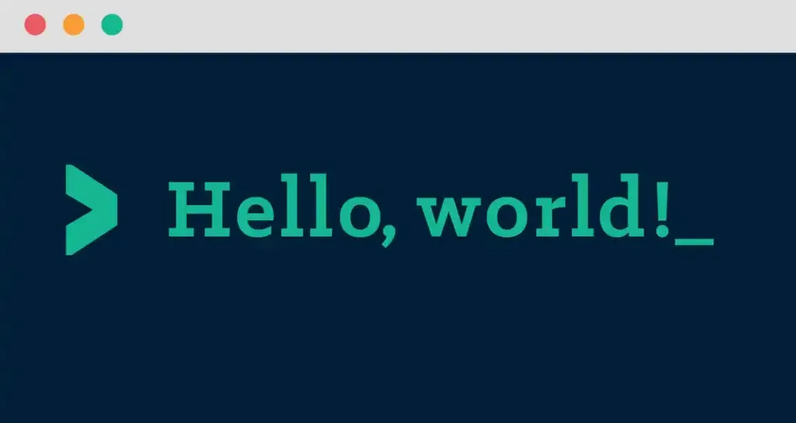             
<br>
Привет, меня зовут Вейлер Андрей Игоревич и я тут буду оставлять свои лекции и примеры для 1 курса по Программированию       

##  1. <a name='1'></a>Немного о курсе

Изучать мы будем всякое, где-то чуть глубже, а где-то по основам пробежимся. Первым делом нам нужен **Язык Программирования**.
Изучать будем с самого нуля, т.е. те кто впервые вообще слышит о программировании – **не страшно**.    
    
- Язык Си – самая классика, во многих вузах мира с него начинают путь и не просто так:
  - Довольно прост
  - На нем написано множество других языков программирования (в т.ч. ваш любимый Python), следовательно поняв Си, будет попроще перепрыгнуть на другие
  - Поможет вам пройти универ на хорошую концовку
  - Хоть с каждым годом популярность ниже, но без него никуда, он везде.. Операционные Системы, драйвера, embedded и прочее системное ПО
  - Позволяет чуть лучше понять работу компьютера (Системное программирование - fast and small)
  - Even Beethoven wrote his Symphony in [C](https://www.youtube.com/watch?v=cdX8r3ZSzN4&list=RDcdX8r3ZSzN4)    
     
**Что еще?**
- Подтянем технический Английский и Русский язык 
- Узнаем как работать в консольке linux
- Система контроля версий (Git)
- Системы сборки кода
- Архитектура ПК и ПО
- Отладка программ (всякая разная)
- Базовые алгоритмы и чуть про их сложность (подробнее узнаете на САОДе)
- Жизненный цикл ПО и основы тестирования
- Основы многопоточных программ
- Насколько успеем основы C++
- Обсудим ИИ вместе с ИИ
- Что-нибудь еще, что я щас не вспомню    

###  1.1. <a name='1.1'></a>По поводу практик..

На практики ходим по подгруппам    

В эиосе можете найти полезные ссылки:
- Ваша успеваемость. Там будет самая актуальная инфа о ваших лабах. Раз в пару недель будет общий рейтинг 
- Лекции. Презентации и ссылки
- Лабы, которые нужно сдать за семестр
- Список литературы        

**Важно: Посещаешь занятия = к тебе меньше вопросов**

##  2. <a name='2'></a>Программирование

               

Итак, начнем издалека..       
Думаю и так все понимают, что такое **программа** и **программирование**, но на всякий повторим.                       
**Программа** - это просто набор инструкций, которые кто-то (или что-то) выполняет для получения некоторого результата. Классический пример - рецепт, пусть будет рецепт мильфея (хрустящий десерт с малиной) записанный на бумаге. Сам рецепт написан на бумаге на **языке программирования**, который понимает исполнитель. Исполнителем в этом хаосе пусть будет некий Повар, который следует четко по инструкции для приготовления мильфея. И вот сам процесс написания рецепта для повара и есть **программирование**.  

Если вернуться в реальный мир, то найдем программы повсюду:
- Включили телефон или комп - включили одну большую (операционная система) и сотни маленьких программ (приложения и сервисы)
- Дома умный чайник - тоже программа
- Летите в самолете или едете на машине - опять же куча-куча встроенных программ одновременно работает вокруг
- Мессенджеры, браузеры, сайты в них, ИИ для генерации видео и т.д...

##  3. <a name='3'></a>Язык программирования

**Язык** — это заданный набор символов и правил, устанавливающих способы комбинации этих символов между собой для записи осмысленных текстов.        

**Язык программирования (ЯП)** — это формальный, человеко-машинный язык для записи компьютерных программ, который состоит из **набора правил** (**лексических, синтаксических и семантических**) для создания инструкций, понятных компьютеру.     

Эти определния можно найти в вики или у ИИ, но важно понять, что ЯП это язык и у него есть свои **правила** как и у любого ествественного языка на котором мы говорим (русский например).    

Все языки программирования объединяют следующие три правила:           
- **Лексика (Lexicon)** - относится к набору допустимых символов и токенов в языке программирования.       
    **Отвечает на вопрос: Какие слова и символы можно использовать в предложении?..**       
    Ключевые слова типа "for", "if", "else", "while"..        
    Идентификаторы - допустимые имена переменных.            
    Операторы - +, -, &&, |, ~ и т.д.     
    Разделители - символы, разделяющие токены, пример " ", ";" ","...      

- **Семантика (Semantics)** - относится к значению и смыслу программных конструкций.      
    **Отвечает на вопрос: Является ли написанное предложение корректным? Если да, то что оно делает?..**     
    Как корректно интерпретировать выражения, например что "x++" это прибавить к значению "x" единицу и записать результат в "x"     

- **Синтаксис (Syntax)** - относится к правилам и структуре языка программирования.      
    **Отвечает на вопрос: Как построить правильное предложение?..**     
    Структура предложения: Как правильно написать цикл "while" или условие "if-else", куда ставить круглые скобки, а куда точку с запятой     

##  4. <a name='4'></a>Классификация ЯП
####  4.1. <a name='4.1'></a>Немного истории    
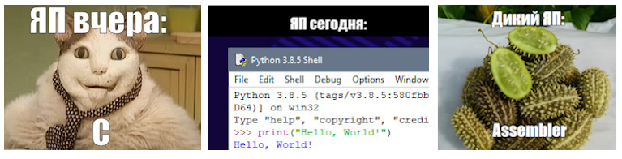     


В прошлом веке программы писали используя машинный код, по сути состоящий из **0 и 1**, т.к. вычислительные устройства других команд **не воспринимают**. Довольно быстро стало понятно, что это все **сложно** и не удобно по многим причинам.     

Где-то в 1950 году придумали специальные **мнемоники** для упрощения и назвали это **ассемблером**. Мнемоники это замена команд на слова, например: **add вместо 05**, где "05" - команда сложения в шестнадцатеричном виде (0x05 = 0b00000101), а add - и есть та самая мнемоника на ассемблере.      

Ассемблер был популярен и крут, но было видно, что многие конструкции (циклы, условия и т.д.) **повторяются** и такие вещи можно было бы вынести в ЯП еще более понятные человеку. И вот, спустя некоторое кол-во лет появляются первые языки высокого уровня (Fortran, LISP и т.д.)            

Язык Си появляется лишь в 70-х годах, разработан сотрудником Bell Labs **Деннисом Ритчи**. Его книгу по Си еще посоветую в конце.              

Ассемблер сейчас в универах не изучают, т.к. ассемблер это ЯП низкого уровня и он ориентирован на конкретный тип процессора (архитектуру). 
Можно сказать: Кол-во архитектур = кол-ву машинных языков (ассемблеров). Соответственно выучить ассемблер = выучить машинный язык конкретного процессора, а какой учить в универе? Сейчас в мире порядка 20 популярных архитектур, о некоторых из них вы могли даже слышать или видеть пользуясь ПК: **x86_64** (ПК, ноутбуки,..) и **ARM** (телефоны, Маки,..) (о них мы поговорим чуть позже)         

####  4.2. <a name='4.2'></a>Парадигмы ЯП

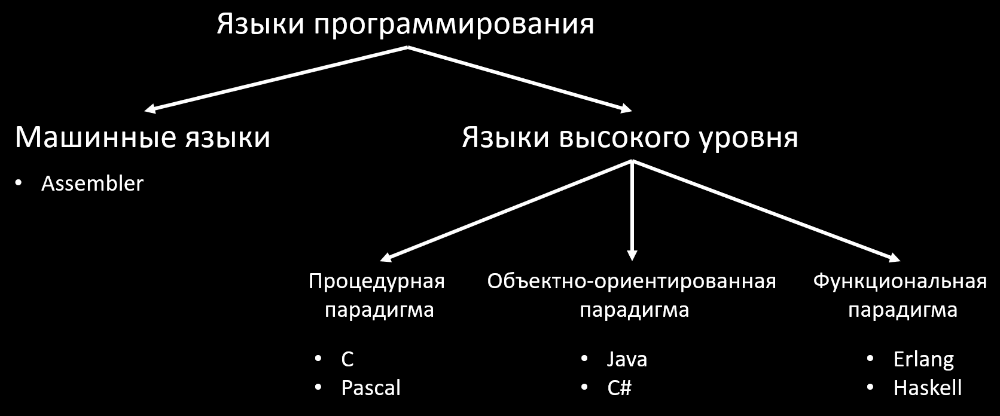          

Важный аспект программирования – **классификация**, программисты бывают очень разные и решают различные задачи, для решения задач как раз и создают языки и парадигмы, большинство парадигм, как и языков зародилось в 70-е годы и все это используется до сих пор.     

Языки высокого уровня бывают в следующих парадигмах:     
- **Процедурная (императивная)**: парадигма, где используются процедуры (функции) и все выполняется последовательно (открой холодильник, возьми пиво, закрой холодильник), например C;
- **Объектно-ориентированная (ООП)**: Описываются Объекты и интерфейсы их взаимодействия между собой, классический ООП - это Java;
- **Функциональная**: здесь все есть функция и избегают циклов, т.к. используют рекурсию (она здесь крайне эффективна);
- **Мультипарадигменные ЯП**: несколько парадигм сразу, например ООП и процедурная в C++;

На языке Си можно написать все что угодно, но стоит ли оно того? Нет, т.к. можно потратить сильно меньше времени, сил и строк кода используя правильно выбранный инструмент (ЯП).      
**ВАЖНО: Языков универсальных нет, каждый язык подходит под свои задачи!!!**       

Так как существует большое количество разных задач и языков для них существует множество разработчиков - Прикладные, Системные, Веб, Мобильные и т.д...      

Но, чтобы быть **хорошим разработчиком** в своей сфере важно уметь задавать вопросы по типу: А зачем мы используем именно это, а не то..? Какой инструмент выбрать?     

##  5. <a name='5'></a>Машинный код и Исходный код

В любом пк, телефоне, умном чайнике и т.д. всегда будут эти ребята: **Процессор (CPU), Оперативная память (RAM) и Постоянное Запоминающее Устройство** (жесткий диск, SSD, флешка, SD-карта и т.д.), которое энергонезависимо, т.е. данные на нем останутся даже если нет питания. ПЗУ хранит программу (набор инструкций), при запуске программы - она загружается в оперативку, а затем процессор читает инструкции из нее и выполняет их       

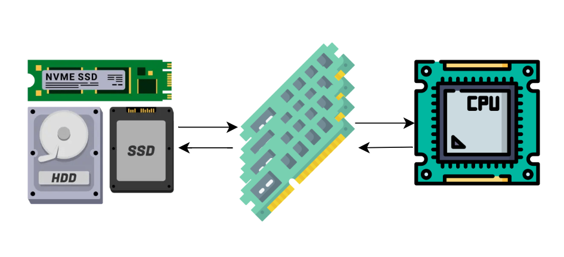          
        
И здесь важно понимать, что **процессоры не понимают инструкций на английском языке**, они воспринимают только команды на машинном языке из 0 и 1. Такие команды мы еще называем **машинный код** (Machine или Binary).
```
01001000 01100101 01101100 01101100 01101111 00101100 00100000 01110111 01101111 01110010 01101100 01100100
```

Код, который мы написали с использованием ЯП высокого уровня и английских слов мы обычно называем **Исходный код** (**Source code**), например код на языке некоторой программы на Си:
```c
#include <stdio.h>

int main(void)
{
    printf("hello, world!\n");

    return 0;
}
```

**Как из исходного кода получить машинный?** - Здесь поможет **трансляция** (перевод)   

##  6. <a name='6'></a>Трансляция

**Исходный код** должен быть **транслирован (или переведен)** в понятный процессору **машинный код** (0 и 1). Т.е. Мы берем специальный переводчик, суем туда наши английские слова и на выходе получаем уже машинные слова.       
Переводчики исходного кода в машинный чаще всего встречаются двух видов - **интерпретатор и компилятор**. А процесс перевода в таком случае называют интерпретацией или компиляцией. При этом сам переводчик - это тоже **программа**!               

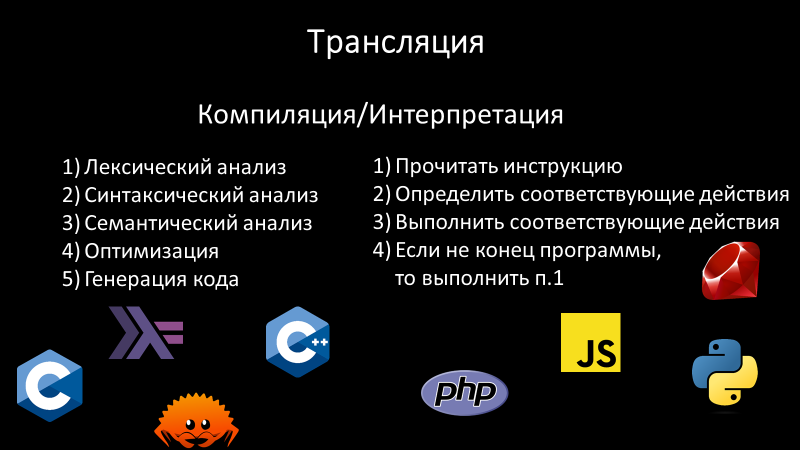    

**Как происходит перевод?**        

**При компиляции** (например C/C++):
**Подаем на вход Исходный файл с нашим кодом**
1. Анализируется код по всем правилам -> если ошибка, то стоп и сообщение об ошибке
2. Компиляторы оптимизирует код по возможности
3. Генерация машинного кода
На выходе получаем **Файл с машинным кодом**, который еще называют Исполняемый файл (**от англ. Executive, .exe**), в народе еще можно услышать такие версии как **Бинарник, Экзешник**

**При интерпретации** (Например Python):
**На вход подается Исходный файл**
1. Читаем инструкцию
2. Смотрим что надо, проверяем правила
3. Делаем что надо
4. Возвращаемся в п.1 для след. инструкции

Различия этих трансляторов:

- Многие ошибки при компиляции видим сразу, при интерпретации увидим лишь когда дойдем до строки с ошибкой
- Скомпилированная программа будет выполняться быстрее, т.к. это уже готовый к работе набор машинных команд, который нужно лишь скормить процессору, а интерпретируемая программа в процессор попадет только после перевода интерпретатором и проверкой что все с командой все ок
- Для переноса интерпретируемой программы с одного пк на другой (с разными ОС, архитектурами и т.д.) нам нужно лишь иметь интерпритатор на машине. Если попытаться запустить скомпилированную программу под какую-нибудь одну ОС или архитектуру CPU на вторую ОС или CPU, то с высокой вероятностью ничего не заработает

Также в современном мире есть такой подход как **JIT-компиляция (Just-In-Time)**, исходный код транслируется в промежуточный **байт-код**, затем уже этот байт-код когда надо **"на лету"** компилируется в машинный код и уходит на процессор.      

##  7. <a name='7'></a>Язык Си и компиляция

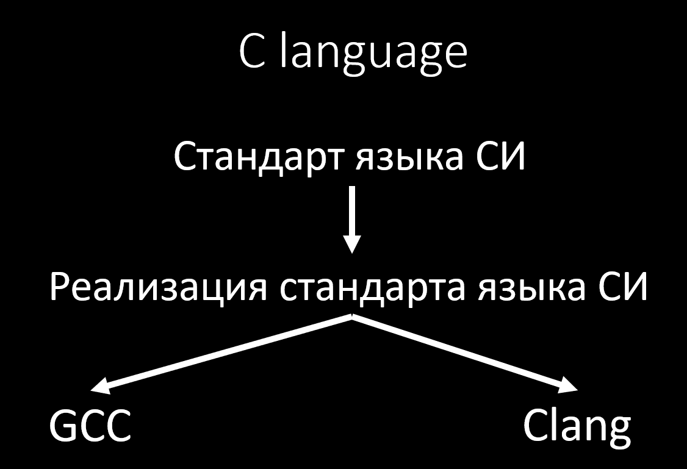     
<br>

Есть такая штука как **стандарты**, о которых в IT вы можете часто слышать. По сути это просто официально утвержденный документ, описывающий что и как должно работать. Для языка Си также есть документы описывающие его, например стандарты C99, C11, C17, C23, где цифра - год (плюс-минус) выпуска (release) стандарта. Можно найти и почитать их [тут](https://www.iso-9899.info/wiki/The_Standard).     
Сам стандарт затем реализуется некоторыми дяденьками и для языка Си реализация стандарта - **есть компиляторы (программы) и стандартные библиотеки**. Наиболее популярные компиляторы это **GCC и Clang**, они оба хороши, но я буду показывать на GCC, т.к. в большинстве дистрибутивов linux он по умолчанию. Вы можете использовать любой по желанию. Кстати, на макбуках у вас будет Clang по умолчанию     
<br>
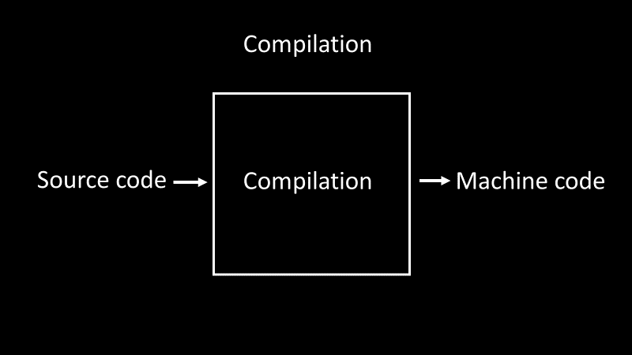     

Итого: **GCC/Clang** для нас - это некоторая программа-переводчик, которую мы будем называть **компилятор**, с помощью которого мы переведем наш **исходный** код в **машинный** код для запуска программы на процессоре.    

Сама компиляция состоит из **4 шагов**, но об этом я **обязательно** расскажу и покажу чуть позже..       


##  8. <a name='8'></a>Первая программа на языке Си

Обычно по традиции первая программа у программистов на любом языке это вывод на экран текста **"hello, world!"**. Не будем нарушать традиций и создадим файл hello.c:
```c
#include <stdio.h>

int main()
{
    printf("hello, world!\n");
    return 0;
}
```

Так выглядит исходный код программы на языке Си, которая **выводит на экран**, строку hello, world!        
Итак, пройдемся по коду по порядку. **ВНИМАНИЕ** будет все понятно совсем не сразу, это нормально. **На этом этапе достаточно уметь копировать копировать код у преподавателя**

####  8.1. <a name='8.1'></a>#include <stdio.h> 

Если перевести дословно слово **include**, то это значит **включать**. А если конкретно, то мы включаем в нашу программу **заголовочный файл** с именем **stdio.h**, где
- в скобках <> указывается имя файла, который включаем
- имя **stdio** расшифровывается как **Standart Input Output**, на русском что-то про стандартный **ввод/вывод**, а .h - расширение файла (сокращение от слова **header = заголовок**)
- Подключаем мы этот файл для использования printf()
- Про включение в файл подробнее в этапах компиляции ниже

Символ '#' перед include означает, что это **препроцессорная директива**. С ними мы разберемся попозже и пока не стоит этим забивать голову, просто запоминаем, что **перед include всегда ставим #, если не поставим, то компилятор будет ругаться**

####  8.2. <a name='8.2'></a>int main() {}

**main - переводится как главный**. Это **точка входа (entry point)** в нашу программу. Любая программа на Си всегда начинается и заканчивается в main()
- main() главная функция, вспоминаем что язык из процедурной парадигмы (процедура = функция). Функция - есть некоторый блок кода, что выполняет последовательно инструкции кода
- {} - Фигурные скобки обозначают блок функции, в которой живут инструкции, все что в фигурных скобках обычно называют **телом функции**.
- int перед main - тип данных, возвращаемый функцией. **Пока это не важно, просто запоминаем что надо ставить int перед main**

####  8.3. <a name='8.3'></a>printf("hello, world!\n");

**printf - расшифровывается как print format, или на русском: "выведи в формате"**.
- Это вызов функции вывода на экран (мы вызываем некоторый блок кода) и на вход мы кладем строку в двойных кавычках, которую хотим вывести на экран.
- Обязательно закрываем скобку и не забываем точку с запятой. Точка с запятой ';' => конец команды.         
- '\n' - Переход на следующую строку

####  8.4. <a name='8.4'></a>return 0;

**return - дословно "вернуть"**. Мы возвращаем 0 Операционной Системе в конце нашей функции говоря что программа завершилась успешно.
- Не забываем ';' - конец инструкции
- 0 - это часто код успеха, а все что не 0 - код какой-нибудь ошибки

####  8.5. <a name='8.5'></a>Соберем программу и запустим

Сохраним файл, скомпилируем командой gcc (с clang будет такой же синтаксис команды и такие же опции):
```bash
gcc hello.c -o hello
```
- gcc - команда вызова программы GCC в linux;
- hello.c - файл с **исходным кодом**;
- -o hello - '-o' - опция (сокращение от output), который мы говорим как мы хотим назвать **исполняемый файл** (файл с машинным кодом), в нашем случае 'hello';

Если программа написана без ошибок, то после компиляции мы ничего не увидим (пустой вывод = все гуд)      

Запускаем скомпилированный файл:    
```bash
./hello
```

Радуемся успеху:     
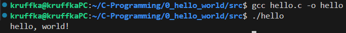        

**Самостоятельно**: попробуйте убрать '\n', что будет?

**ПОСЛЕ КАЖДОГО ИЗМЕНЕНИЯ ФАЙЛА НАДО ЕГО ПЕРЕКОМПИЛИРОВАТЬ, ПОТОМУ ЧТО ИСХОДНЫЙ ФАЙЛ И ИСПОЛНЯЕМЫЙ ФАЙЛ ЭТО ДВА РАЗНЫХ ФАЙЛА!!!**          

##  9. <a name='9'></a>Ошибки компилятора
###  9.1. <a name='9.1'></a>print вместо printf

Попробуем следующий код
```c
#include <stdio.h>

int main()
{
    print("hello, world!\n");

    return 0;
}
```

Компилятор ЯВНО говорит что мы попутали с именем функции и что скорее всего хотели написать printf, а не print

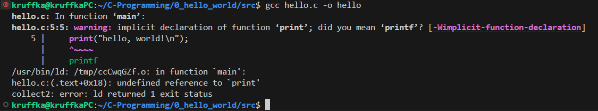

в конце еще сругнулся что не знает что такое print: **undefined reference to `print'**

###  9.2. <a name='9.2'></a>include вместо #include

Например, уберем решетку перед include, сохраним файл и перекомпилируем      

```c
include <stdio.h>

int main()
{
    printf("hello, world!\n");

    return 0;
}
```
Увидим следующую ошибку:        
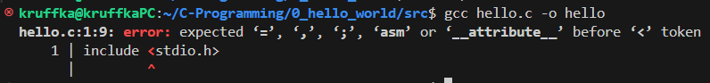       

Честно говоря даже с переводчиком не очевидно что не так, а это потому, что моя версия компилятора не настолька умна, чтобы уметь обрабатывать все-все пропущенные символы, однако компилятора в данном случае достаточно для того, чтобы показать на строку с ошибкой, глянув на которую вы уже должны понять что не так           

Для разработчика **важно понимать что ему говорит компилятор/интерпретатор**, чтобы найти и исправить ошибки, т.к. иначе программа просто не будет не скомпилируется

##  10. <a name='10'></a>Переменные, константы и типы данных

###  10.1. <a name='10.1'></a>Переменные и типы данных

Что такое **переменная (variable)**?   

Представим себе **коробку**, в которую можно класть яблоки. Возьмем маркер и напишем на коробке - "коробка яблок". Можно взять эту "коробка яблок" и накидать в нее яблок, а потом взять и посмотреть сколько там сейчас всего яблок. 
При этом коробка не бесконечная, в нее влазит определенное количество яблок. Можно создать коробку с гречкой, в нее яблоки складывать не будем, т.к. эти коробки предназначены для разных типов продуктов         

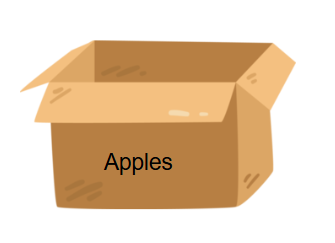          

С переменными в такая же тема: у них есть имя и они умеют в себе хранить информацию определенного типа. В языке Си мы имеем следующие типы данных для переменных:                 
| Тип | Формат | Размер (байт) | Диапазон знаковый (signed) | Диапазон беззнаковый (unsigned) |
|-----|--------|---------------|----------------------------|---------------------------------|
| `char` | %c, %hhd | 1 | -128 до 127 | 0 до 255 |
| `short int` `short` | %hd | 2 | -32 768 до 32 767 | 0 до 65 535 |
| `int` | %d | 4 | -2 147 483 648 до 2 147 483 647 | 0 до 4 294 967 295 |
| `long` | %ld | 8 | -9 223 372 036 854 775 808 до 9 223 372 036 854 775 807 | 0 до 18 446 744 073 709 551 615 |
| `long long` | %lld | 8 | -9 223 372 036 854 775 808 до 9 223 372 036 854 775 807 | 0 до 18 446 744 073 709 551 615 |
| `float` | %f | 4 | ±1.2×10⁻³⁸ до ±3.4×10³⁸ | - |
| `double` | %lf | 8 | ±2.3×10⁻³⁰⁸ до ±1.7×10³⁰⁸ | - |
| `long double` | %Lf | 16 | ±3.4×10⁻⁴⁹³² до ±1.1×10⁴⁹³² | - |

Диапазон значений зависит от размера переменной. Только для char размер **ГДЕ УГОДНО** будет 1 байт, это минимальный объем информации с которым мы можем работать.         
Все остальные типы данных могут иметь другой размер, зависит от архитектуры и компилятора. Так например long может быть 4 байта как int (32 битные системы)       

- **char** - сокращение от character (символ), используется для символов (в целых числах)
- **int** - сокращение от integer (целое), тип данных для хранения целых
- **float** - что-то плавающее с англ. (значение с плавающей точкой), вещественные числа
- **double** - как float, но с двойной точностью
Все типы данных, хранящие **ЦЕЛЫЕ** числа могут быть как знаковыми (**signed**) так и беззнаковыми (**unsigned**)           

Формат - подсказка какой **специальный символ** использовать для вывода через **printf**.         

###  10.2. <a name='10.2'></a>Объявление переменной

Для того чтобы создать свою переменную сначала нужно ее **объявить**.    
**Важно:** Объявление переменной (Variable Declaration) - создать **переменную** (коробку), указав ее **имя и тип данных**. Делается это единожды (для каждого имени переменной) и далее можно использовать переменную сколько угодно раз        

ЯП, в которых используются типы данных для переменных - называются **статически типизированным языком**. Где тип данных скрыт от пользователя - ЯП с **динамической типизацией**, например python, в котором мы не указываем тип данных явно, за нас это делает интерпретатор во время обращения к переменной.             

На питоне тип данных определяется из константы после знака '='
```python
a = 5
```

На Си **синтаксис** **объявления переменной** следующий:
```c
int a = 5;
```
- int - тип данных целые числа
- a - имя переменной
- = - оператор присвоения
- 5 - целая константа
- ; - конец инструкции

Читается обычно с имени переменной, потом тип данных и затем чему равно: **Объявляем переменную 'a' типа int равной 5**      
**Важно:** мы могли написать signed int, но обычно мы опускаем слово signed (программисты ленивые), а вот если мы намеренно захотим сделать беззнаковый int, то **обязательно** напишем **unsigned**!      

Кстати, в **статически типизированных** языках можно делать так:           
```c
int b;
b = -5;
```
Сначала объявили, а затем чему-то присвоили (-5).           

**Важно:** В языке Си при объявлении переменной без присваивания значения `int b;` - не дает гарантий, что b по умолчанию будет равна `0`. Значение может быть равно некоторому **мусору** - большому случайному числу.        

###  10.3. <a name='10.3'></a>Константы
Константа - значение, что нельзя изменить. Константы бывают разных типов данных и обычно их мы кладем в переменные.       
- 123 - int, просто целое число
- 123u - unsigned int, буковка 'u' или 'U' в конце
- 123L - long, буква 'l' или 'L'
- 123LU - unsigned long int, 'lu' или 'LU'
- 5.0 - double, стоит точка
- 42.1f - float, есть буква 'f' или 'F'
- 122.88L - long double, 'Lf' или точка и 'L'
- '#' - char, символ решетки, все символы заключаются в 'одинарные' кавычки

Пример переменных a, b, c, d, e
```c
int a = 5;
char b = 'A';
short c = -12;
float d = 5.132;
double e = 5.0;
```

###  10.4. <a name='10.4'></a>Используем printf для вывода переменных
```c
#include <stdio.h>

int main()
{
    int a = 5;

    printf("I have %d apples\n", a);

    return 0;
}
```
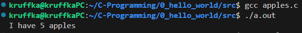                  

**Самостоятельно**: Что будет если поставить между `%` и `d` число?

В этом коде наглядно можно увидеть формат, который мы задаем. Вместо `%d` подставилось значение нашей переменной.
- `%d` - **d**ecimal, целое со знаком в десятичной системе счисления
- `%u` - **u**nsigned decimal, целое беззнаковое
- `%c` - **c**har, символьное
- `%hd` - s**h**ort **d**ecimal, короткое десятичное (hhd = short short dec, hhu = short short unsigned)
- `%f` - **f**loat, вещественное

Попробуем запустить [print_vars.c](https://github.com/kruffka/C-Programming/blob/2025-2026/0_hello_world/src/print_vars.c)
```c
#include <stdio.h>

int main()
{
    int a = 5, b = 0;
    float f = 5.0;
    char c = '#';
    printf("a = %d, b = %d, 555 + 555 = %d\n", a, b, 555 + 3);
    printf("f = %f, c = %c\n", f, c);

    return 0;
}
```
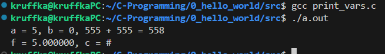                

Вместо волшебных `%d %f %c` подставились значения переменных.          

Пару слов про имена переменных:           
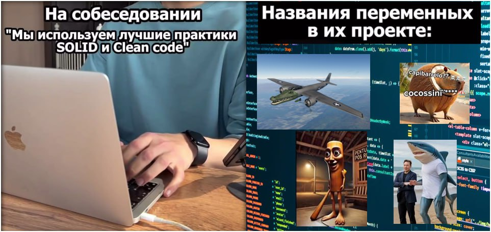      

Важнейший принцип именования переменных состоит в том, что имя должно полно и точно **описывать сущность, представляемую переменной**.  
Это улучшает читаемость вашего кода.              

Кринж:        
```c
int b = 420;
double c = 299792458;
```       

База:
```c
int toyPrice = 420;
double speed_of_light = 299792458;
```

Сильно длинные имена лучше не использовать              
      

###  10.5. <a name='10.5'></a>Переполнение целых

Допустим нам предлагают 2147483648$ или удвоить и отдать следующему, мы соглашаемся удвоить и передать следующему ()
```c
unsigned int money = 2147483648;
printf("You can get %u$ or double and pass it on to next person\n", money);
printf("double of money is %u$\n", money * 2);
```
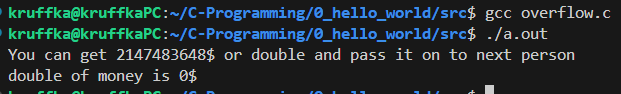           

Компилятор такое иногда может обнаружить и выдать предуреждение (warning), однако все равно скомпилирует программу.       

Выход за диапазон типа данных пемеренной называется **переполнением** (**overflow**).              

Эту проблему важно осознавать, так как она приводит к многочисленным ошибкам. И в реальной жизни были связанные с ней случаи.        
Также эта проблема скоро настигнет старые 32-битные компьютеры в 2038 году. Они начнут думать, что они вернулись в 1970 год, как это на них повлияет?       
https://ru.wikipedia.org/wiki/%D0%9F%D1%80%D0%BE%D0%B1%D0%BB%D0%B5%D0%BC%D0%B0_2038_%D0%B3%D0%BE%D0%B4%D0%B0                       

**Самостоятельно**: Что будет если money сделать signed, присвоить 2147483647 и прибавить единицу.               

###  10.6. <a name='10.6'></a>Отрицательные числа

Когда их впихивали в компьютер, то рассматривали разные варианты, вот например прямой код:       

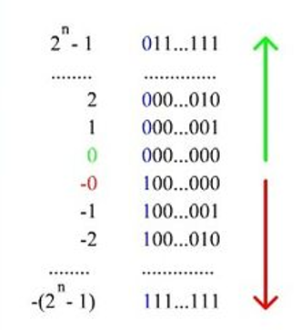

5  = 00000101
-5 = 10000101

+ Прост в вычислении
+ Количество «+» чисел равно количеству «-» чисел

- Два нуля (-0 и +0)
- Требует реализации операции вычитания


А теперь возьмем то, что засунули в компьютеры:
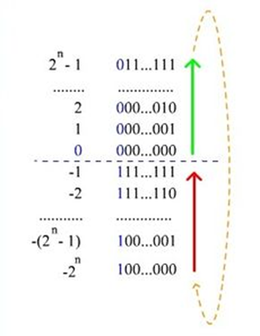
Это называется дополнительный код (дополнение до двух)
5 = 00000101
-5 ->
- 00000101 Прямой код       
- 11111010 Обратный код (инверсия)   
- 11111011 Прибавляем 1   
- 11111011 Единица в старший бит 

Здесь нет двух нулей, которые мешали бы математике, а также данный код не требует реализаии операций вычитания в процессоре, что позволяет сделать процессор еще меньше и впихать в него чего-то другого             
   
**Самостоятельно**: Почему не надо операции вычитания? Попробуйте -5 + 5 = 11111011 + 00000101 = ?

**Важно:** Самый старший бит в знаковой переменной отвечает за знак! '1' - число отрицательное, '0' - число положительное. Если переменная unsigned, то старший бит не используется для знака, отсюда допустимый диапазон больше на 1 бит.
Напрмер для char мы получаем не -128..127, а 0..255        

Посчитаем диапазон чисел например для знакового int:
Пусть размер int будет 4 байта (32 бита), значит минимальное число что можем положить будет равно
-2^31 - 1, а максимальное 2^31

###  10.7. <a name='10.7'></a>Символы и таблица ASCII

Повторюсь: Машины не умеют в английские слова и символы, только **0 и 1**.
Символы в компьютерах у нас **закодированы** в виде специальных таблиц.          

Рассмотрим самую базовую из Американского стандарта (**ASCII** - American Standard Code for Information Interchange)       

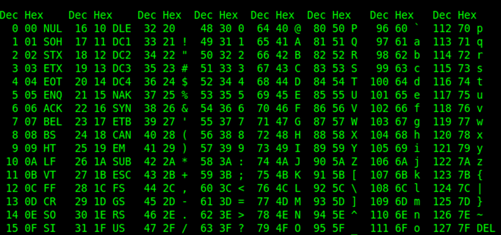            

Первый столбец код в десятичной системе, второй тоже самое в шестнадцатеричной и третий столбец значение (символ). Всего символов здесь 128 - что прекрасно влазит в char!                      
Первые символы до 31 - служебные символы, при попытке их вывести чаще всего будет ерунда в виде квадратиков или вопросиков. А вот далее можно обнаружить заглавные и не очень буквы всего английского алфавита.        
 
[Исходник ascii.c](https://github.com/kruffka/C-Programming/blob/2025-2026/0_hello_world/src/ascii.c)            
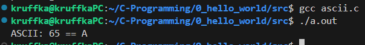      

Для использования других языков были добавлены другие таблицы с большим размером, сегодня это UTF стандарт (Unicode Transformation Format. UTF-8 и прочие).    
UTF первые 128 бит по таблице ASCII, а все остальное это разные emoji и все возможные алфавиты       

###  10.8. <a name='10.8'></a>Вещественные числа и IEEE-754

Как хранить не целые числа в 0 и 1? Ответ - стандарт IEEE-754.     

Например float из 32 бит:       
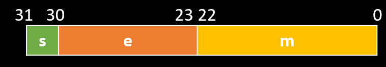          
    
Первый бит снова под знак, остальное мантисса и экспонента для формулы `(−1^s)∗m∗ b^e`, где
- s – знак (0 положительное число, 1 отрицательное)
- m – мантисса
- b – основание
- e – экспонента

Пример представим число 122.88 в 0 и 1: 122.88 = (−1^0)∗12288∗ 10^(−2)
- s = 0
- m = 12288
- b = 10
- e = -2

Правда b для компьютера будет = 2 (двоичная система), 10 здесь для простоты понимания          

Проблема с этим стандартом
https://0.30000000000000004.com/

**Самостоятельно:** Попросите нейронку написать программу на Си, которая в цикле бесконечно прибавляет к переменной типа float единицу и выводит на экран результат. Что произошло?          

**Лайфхак:** При создании своего банка - заводите отдельный счет, в который перечисляете остаток копеек (при операциях с округлением) от операций клиентов и за годы получаете миллионы пассивного дохода..      

##  11. <a name='11'></a>Операторы

В языке Си допустимы следующие операторы:          
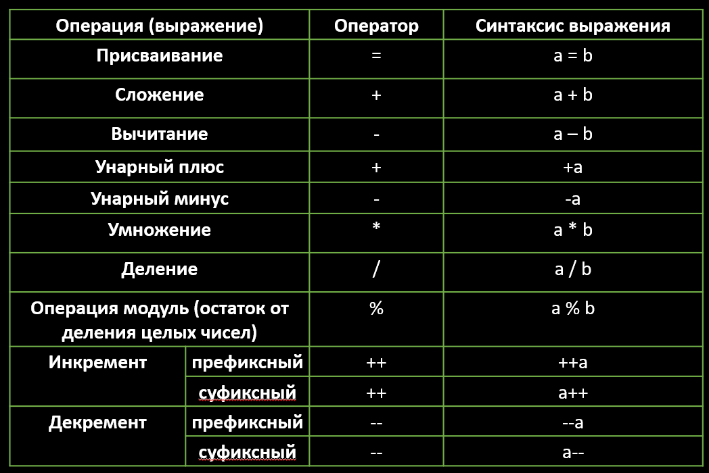       

**Самостоятельно:** В чем отличие a++ и ++a?

Присвоение = assignment      

**Важно** Порядок выполнения операций - также может быть причиной частых ошибок, его можно загуглить. Если не уверены, то ставьте круглые скобки (), чтобы выражение обрело нужный порядок выполнения

####  11.1. <a name='11.1'></a>Операторы присвоения

Для языка Си допустимы сокращенный синтаксис для присвоения       
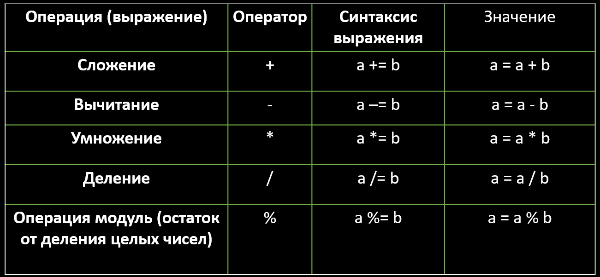


##  12. <a name='12'></a>Этапы компиляции программы

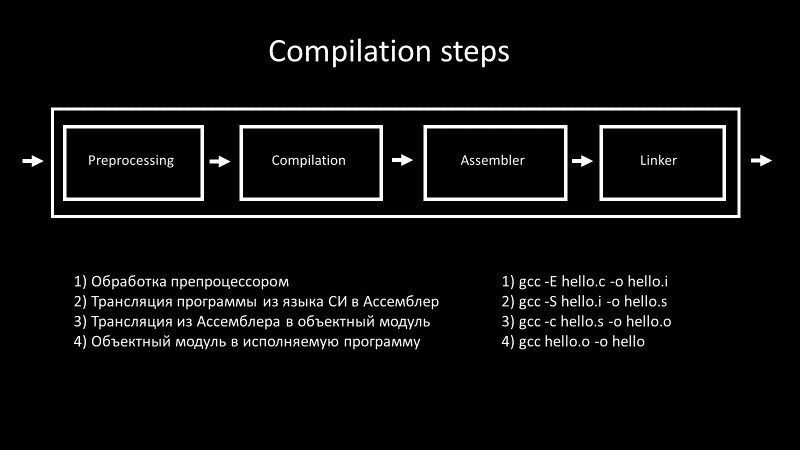      

```bash
# Compilation steps
# Input:  
# Source file: hello.c
$ gcc -E hello.c -o hello.i  
# Assembly (*.s)
-----------
$ gcc -S hello.i -o hello.s
# Machine Code (object file, *.o)
-----------
$ gcc -c hello.s -o hello.o
#### ELF Header  
$ readelf -h hello.o  
#### Machine code (disassemble)
$ objdump -s hello.o  
$ objdump -d hello.o  
# Binary executable
-----------
$ gcc hello.o -o hello
```


##  13. <a name='13'></a>Список литературы

- «Язык программирования Си» (англ. The C Programming Language, также известная как K&R) — книга Брайана Кернигана и Денниса Ритчи  
- [Стандарт языка Си](https://www.iso-9899.info/wiki/The_Standard)             
- Гарвардский курс CS50 (Computer Science) любого года абсолютно бесплатно в ютубе каждый год, есть даже на русском             