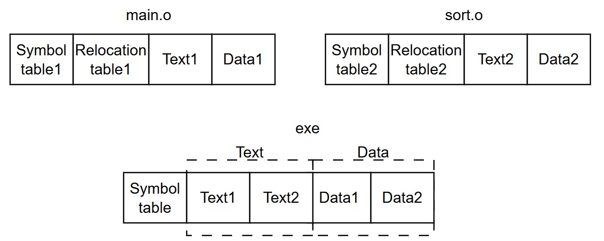
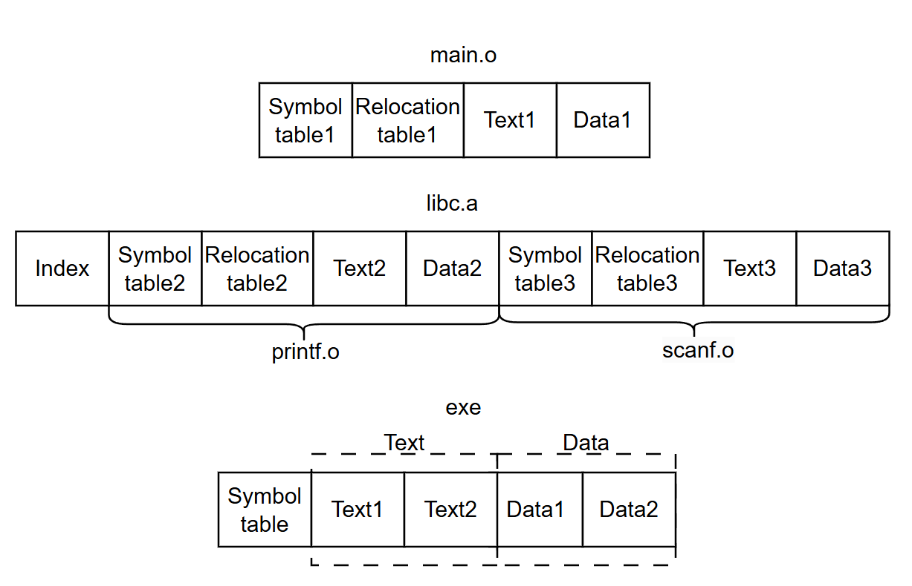

<!-- vscode-markdown-toc -->
* 1. [Многофайловый проект](#1)
	* 1.1. [Как разделять на файлы](#1.1)
	* 1.2. [Сборка многофайловых проектов](#1.2)
		* 1.2.1. [Этапы компиляции](#1.2.1)
		* 1.2.2. [Линковка](#1.2.2)
* 2. [Библиотеки](#2)
	* 2.1. [Статическая библиотека](#2.1)
	* 2.2. [Динамическая библиотека](#2.2)
		* 2.2.1. [Подключение на горячую (Plug-in)](#2.2.1)
		* 2.2.2. [Линковка динамической библиотеки](#2.2.2)
	* 2.3. [Сборка и линковка библиотек](#2.3)
		* 2.3.1. [Статическая](#2.3.1)
		* 2.3.2. [Динамическая](#2.3.2)
* 3. [Версии библиотек в Linux](#3)

<!-- vscode-markdown-toc-config
	numbering=true
	autoSave=true
	/vscode-markdown-toc-config -->
<!-- /vscode-markdown-toc -->


# Многофайловый проект. Статические и динамические библиотеки

##  1. <a name='1'></a>Многофайловый проект

**Многофайловый проект** — это подход к организации исходного кода, при котором программа разделяется на несколько отдельных файлов. С точки зрения структуры и процесса сборки, это позволяет логически изолировать компоненты, ускорить компиляцию и упростить совместную разработку.            

Т.е. вместо того чтобы писать тысячи строк кода в одном гигантском файле, мы разносим функции, структуры и переменные по разным модулям (файлам).                    

В одном файле тоже можно писать весь код и это будет собираться и работать, но если строчек кода очень много, то такой проект будет очень трудно читаемым как для самого разработчика так и для других кому он может достаться в наследство (легаси). Реальные проекты часто состоят из нескольких тысяч, а иногда и миллионов строк кода, например, ядро Linux - 
[wiki кол-во строк кода в Linux ядре](https://ru.wikipedia.org/wiki/%D0%9A%D0%BE%D0%BB%D0%B8%D1%87%D0%B5%D1%81%D1%82%D0%B2%D0%BE_%D1%81%D1%82%D1%80%D0%BE%D0%BA_%D0%BA%D0%BE%D0%B4%D0%B0#%D0%9F%D0%BE%D0%B4%D1%81%D1%87%D1%91%D1%82_%D0%BA%D0%BE%D0%BB%D0%B8%D1%87%D0%B5%D1%81%D1%82%D0%B2%D0%B0_%D1%81%D1%82%D1%80%D0%BE%D0%BA_%D0%BA%D0%BE%D0%B4%D0%B0) на 2017 год содержал около 18кк (18 373 471) строк кода                   

В интерпретируемых языках (например, Python) всё проще, так как нет этапа раздельной компиляции и линковки. Каждый файл `.py` автоматически является модулем. Чтобы использовать код из файла logic.py в файле main.py, мы пишем import logic. Интерпретатор находит файл, исполняет его и дает доступ к его объектам через пространство имен.     

В компилируемых языках (например, Си) многофайловость обычно реализуется через разделение на:
- Заголовочные файлы (.h) — "интерфейс" модуля. Здесь мы пишем прототипы функций и объявляем структуры, чтобы другие части программы знали, как с ними взаимодействовать.             
- Файлы с исходным кодом (реализации) (.c/cpp/cc) — "логика" модуля. Здесь пишется сам код функций.                        

**Что это даёт?**
- Один раз хорошо написанный модуль можно подключать к десяткам разных проектов
- При изменении одного файла компилятору не нужно пересобирать всю программу целиком — пересобирается только измененный модуль
- Проще ориентироваться в проекте, где все блоки разделены разложены по разным папкам и файлам по смыслу
- Если над проектом работает больше одного программиста, то в проекте с одним файлом у вас будут вечно возникать конфликты с версиями кода

Таким образом, при разработке достаточно больших программ бывает удобным разрабатывать программу не в виде одного файла, а в виде нескольких. В отдельном файле сохраняем функцию main(), подпрограммы — каждую в отдельном файле или группируем по назначению.  

[Простой пример из 3 файлов](https://gist.github.com/kruffka/c30707e2ca079d07dea43bc60a3c9c4b)                  

```
project/           
├── app/                    # Точка входа
│   └── main.c              # Главная функция тут
├── level1/                 # Модуль для решения Задач уровня 1
│   ├── src/                # Реализация
│   │   └── *.c 
│   └── include/            # Интерфейс
│       └── *.h
├── level2/                  # Модуль для решения задач уровня 2
│   ├── level2.1/
│   │   └── *.c, *.h        # Исходники и заголовки вместе
│   └── level2.2/
├── third-party/            # Сторонние библиотеки и зависимости
├── docs/                   # Техническая документация и схемы
├── tests/                  # Тесты и примеры (examples) использования
└── README.md               # Инструкция: как собрать и запустить
```

###  1.1. <a name='1.1'></a>Как разделять на файлы

Обычно следуют простым правилам и советам:
- Один модуль - одна задача, если файл работает с сетью (network.c), то ему не нужно отрисовывать какой-нибудь графический интерфейс
- По возможности стоит делать так, чтобы модули значи как можно меньше друг о друге, тогда сохранится минимальная зависимость и такие модули легко удалять/добавлять в проекты
- Соблюдать иерархию: модули высокоуровневые могут зависеть от низкоуровневых, но не наоборот. Например в core/log.c есть реализация логирования, что будет нижнем уровенем, а верхний уровень это тот кто использует логику core/*
- Нет смысла разделять проект на 100 файлов если всего в нем 200 строк кода, такая избыточность ни к чему хорошему не приведет
- DRY (Don't Repeat Yourself): Если копируете один и тот же код в разные файлы, то значит, что его пора вынести в отдельный модуль
           

Пример структуры проекта:
```
project/
├── build/              # Файлы сборки, не идут в Git
├── docs/               # Документация (Doxygen, Markdown)
├── include/            # Публичные заголовочные файлы (.h)
│   └── my_project/     # Подпапка для предотвращения конфликтов имен
│       ├── core.h
│       └── network.h
├── src/                # Исходный код реализации (.c, .cpp)
│   ├── core/           # Логическое разделение по подсистемам
│   │   ├── kernel.c
│   │   └── memory.c
│   ├── network/
│   │   ├── sockets.c
│   │   └── protocol.c
│   └── main.c          # Главный файл (оркестратор)
├── lib/                # Библиотеки
├── third-party         # Сторонние проекты/библиотеки   
├── tests/              # или examples: Какие-то тесты и примеры с функционалом из проекта
│   └── test_network.c
├── Makefile            # Скрипт сборки (или CMakeLists.txt)
└── README.md           # Описание проекта, например: что за проект и как собрать   
```

или кусочек от linux:
```
linux/
├── arch/            # Архитектурно-зависимый код (самый нижний уровень)
│   ├── x86/         # Код для процессоров Intel/AMD
│   └── arm/         # Код для arm процессоров
├── block/           # Работа с блочными устройствами (диски, флешки)
├── drivers/         # Драйверы устройств (видеокарты, USB, сеть)
│   ├── bluetooth/
│   └── usb/
├── fs/              # Файловые системы (ext4, ntfs, btrfs)
├── include/         # Заголовочные файлы (.h) — интерфейсы всего ядра
├── kernel/          # Ядро ОС (мозг): управление процессами, планировщик
├── mm/              # Memory Management (управление оперативной памятью)
├── net/             # Сетевой стек (TCP/IP, Wi-Fi и т.д.)
├── scripts/         # Вспомогательные скрипты для сборки ядра
└── Makefile         # Главный файл, управляющий сборкой этого гиганта
```

Структура проекта игры на питоне (AI-generated, но пойдет для примера)
```
SuperMegaGame/
├── assets/                 # Графика, звуки, конфиги (JSON/YAML)
│   ├── sprites/
│   ├── levels/
│   └── sounds/
├── src/                    # Исходный код
│   ├── main.py             # Точка входа: инициализация и запуск цикла
│   ├── engine/             # Ядро (базовые классы)
│   │   ├── camera.py
│   │   ├── display.py      # Настройка окна и событий
│   │   └── input.py        # Обработка клавиатуры/мыши
│   ├── entities/           # Игровые объекты
│   │   ├── base.py         # Базовый класс Entity
│   │   ├── player.py       # Класс игрока
│   │   └── enemy.py        # Логика врагов
│   ├── scenes/             # Уровни и состояния игры
│   │   ├── menu.py         # Код главного меню
│   │   └── level_1.py      # Логика первого уровня
│   └── utils/              # Вспомогательный код
│       ├── helpers.py      # Математика, загрузчики ресурсов
│       └── constants.py    # Настройки: FPS, цвета, пути к файлам
├── tests/                  # Тесты (pytest)
├── requirements.txt        # Список библиотек (pygame, numpy и т.д.)
└── README.md
```

Выделить модули или задачи в проекте - навык, что обычно приходит с практикой. Подумайте самостоятельно на примере разработки приложения мобильного банка. Можно взять за пример небольшой список снизу и развить мысль:
- **Модуль авторизации (Безопасность и вход)**
  - Логика обработки логина/пароля.
  - Шифрование: отдельные хэш-функции и криптографические алгоритмы.
- **Пользовательский интерфейс (UI)**
  - Экран переводов: кнопка «Отправить деньги другу».
      - Исходный код компонента кнопки (стили, анимация нажатия).
  - Экран баланса: логика получения и отображения данных о счетах.
- **Модуль взаимодействия с оборудованием**
    - Реализация считывания QR-кода (интеграция с API камеры телефона).
- **Сетевой модуль (API)**
  - Интерфейс связи с сервером банка: запрос/ответ на получение деняков

По теме разбиения на файлы полезно полистать книги по архитектуре ПО, например, "Современный подход к архитектуре ПО" (Можно найти в списке литературы в эиосе с архиве)

###  1.2. <a name='1.2'></a>Сборка многофайловых проектов

Чтобы собрать проект из нескольких файлов, достаточно передать их компилятору через пробел. Например, для
```
project/
├── app/main.c
└── src/
    └── network/
        ├── socket.c
        └── socket.h
```
из `project/` команда сборки проекта будет следующей
```bash
gcc ./app/main.c ./src/network/socket.c -I./src/network/ -o app
```
где
- Опция -I указывает путь к папке с заголовочными файлами (src/network).
Тогда вместо 
```c
#include "src/network/socket.h" 
```
мы будем подключать так:
```c
#include "socket.h"
```
- На выходе мы получим один готовый исполняемый файл с именем `app`

Однако компилятор под капотом выполняет несколько шагов прежде чем мы получим наш бинарь, вспомним этапы компиляции

####  1.2.1. <a name='1.2.1'></a>Этапы компиляции

          

Как мы знаем компиляция нашего кода состоит из 4 шагов:    
  1) Обработка препроцессором, include - копирование содержимого заголовочных файлов (.h) в исходники (.c/.cpp/.cc), define - и прочие макросы на этом этапе также раскрываются
  2) Компиляция, компилятор преобразует исходный код в код на ассемблере (здесь синтаксический и прочие анализы), а также оптимизирует исходный код (флаги -g и -O0, -O1 и т.д.)
  3) Код из ассемблера транслируется в машинный код - код, который понимает процессор
  4) На этом этапе собираются все объектные файлы (.o) в один исполяемый файл    

Подробнее про этапы компиляции было в одной из первых лекций. Но есть еще такая прикольная опция `-###` для просмотра всех шагов компиляции:
```bash
gcc main.c -o main -###
```

####  1.2.2. <a name='1.2.2'></a>Линковка

Получаются объектные файлы (.o) очень легко через опцию `-c`:
```bash
gcc -c main.c  
gcc -c func1.c  
gcc -c func2.c  
```

На выходе получим эти самые объектные файлы наших исходников main.o, func1.o и func2.o. Теперь их можно связать и получить бинарник:
```bash
gcc main.o func1.o func2.o    
```
Связывание этих файлов в один бинарный файл - называется линковкой (т.к. выполняет ее линковщик, от англ. linker). Соотвественно если какой-то их исходников поменялся, то достаточно лишь пересобрать и слинковать только его, такой подход сильно сокращает время сборки для огромных проектов. Рассмотрим чуть подробнее 4 этап:    
      

Объектный файл получается после трансляции кода из ассемблера в машинный код. В таком коде нет переменных или функций, все заменяется на адреса. Такой код уже понимает процессор, но для запуска на ОС необходим следующий этап, т.к. ОС не знает по каким адресам что грузит, да и некоторые функции могут быть еще не определены (undefined).    
Объектный файл состоит из:
- **таблицы символов** - таблица с именами всех глобальных переменных и функций
- **таблицы релокаций** - адреса (указатели) на заглушки в коде куда нужно подставить адрес вызова undefined ф-ии когда мы найдем такую в других таблицах символов
- **секции text** - код самих функций
- **секции data** - глобальные (и static) инициализированные переменные

Получив объектные файлы из двух исходных линковщик (компоновщик/редактор связей) сделает следующее:       
**Секции data** всех объектных файлов поставит просто друг за другом, тоже самое с **секциями text**.     
Пройдется по таблицам символов и заполнит все недостающие вызовы функций адресами этих функций. Например в app.o вызывается ф-ия sort(), но в app.o нет определения функции sort(), однако ее определение есть в sort.o, линковщик увидит в таблице символов sort.o эту функцию и отдаст ее адрес в app.o.    

Посмотреть таблицу символов можно через команду на Linux/Mac 'nm', пример: 
```bash
nm app.o
```
при выводе будут разные буковки: буква D - секция Data, U - undefined, T - секция text.         

##### Как разглядеть линковщик?
- Если функции нет в sort.c, тогда линковщик выдаст ошибку **undefined reference to** 'sort' и завершит свою работу, т.к. не смог найти код функции sort()    
- Если определение функции или две глобальных переменных с одним именем встречаются в нескольких объектных файлах, то линковщик также выдаст сообщение об ошибке: **multiple definition of** 'sort' и завершит работу с ошибкой   

Таблицы релокаций необходимы для запоминания мест где находятся заглушки для вызова функций - в коде на ассемблере для undefined ф-ий можно увидеть инструкцию call и нули (кол-во нулей зависит от разрядности системы). Когда символ нужной функции найдется, адрес этой функции встанет в код вместо нулей и будет инструкция call с адресом функции

##  2. <a name='2'></a>Библиотеки

             

**Библиотека (от англ. library)** - это сборник готового кода (функций, объектов), который мы подключаем к своей программе, чтобы не изобретать велосипед.     

Для **интерпретируемых языков** (python) библиотека — файл, содержащий либо код на исходном языке (.py), либо байт-код для виртуальной машины. Пример библиотеки для Python - Tkinter, используя его API можно в своей программе сделать графический интерфейс     

Пример библиотеки **компилируемых языков** (Си): стандартная Си библиотека с функцией printf(). Библиотеки содержат реализацию функций (логику), а в заголовочных файлах содержатся прототипы функций (заголовки/интерфейс)      

Таким образом, когда мы пишем `#include <stdio.h>`:
```c
#include <stdio.h>
//...
printf("hello, libraries\n");
```
то происходит препроцессорная магия: содержимое .h файла вставляется вместо `#include`, если открыть файл stdio.h, то можно найти прототип `printf()`
- Заголовки в Linux обычно живут в **/usr/include/**
- Бинарный код библиотек живет в **/usr/lib/**
- Исходники библиотек в своей системе не найдете, нужно качать из репо разработчиков

Из `stdio.h`:
```c
extern int printf (const char *__restrict __format, ...);
```
Ключевое слово `extern` здесь говорит компилятору: "Я обещаю, что код этой функции существует, мы найдем его позже". Это нужно, чтобы компилятор мог проверить, правильно ли передаются аргументы. Сама реализация функции подвяжется на последнем этапе компиляции - линковке (линковщик = компоновщик = редактор связей). По умолчанию компилятор gcc линкует нас с библиотекой libc           

С точки зрения ОС и разработки библиотеки делятся на два типа:
- Статические - вшиваются прямо в бинарь (.a/.lib)
- Динамические - лежат где-то в ОС в виде файлов (.so/.dll)

###  2.1. <a name='2.1'></a>Статическая библиотека

                           

**Статическая библиотека** - набор объектных файлов (архив), содержащий скомпилированный код функций. Стандартные библиотеки многих компилируемых языков программирования распространяются в виде объектных файлов          
  
Расширение у файла статической библиотеки на **Linux/macOS:** `.a` на **Windows:** `.lib`         

Линкуется такая библиотека очень просто - ее содержимое просто добавляется в наш исполняемый файл:     

       

Индекс содержит список объектных файлов внутри библиотеки. Это позволяет линковщику быстрее находить необходимые символы и функции без необходимости извлекать каждый объектный файл.     

Если main.o использует **только** printf, то весь объектный модуль **printf.o** линковщик положит в исполняемый файл, а **scanf.o** и прочие не положит. Если внутри **printf.o** есть множество функций, что наша программа не использует, то они по умолчанию также будут добавлены в исполняемый файл              

**Достоинства**:
- Все необходимые функции включаются в один исполняемый файл. Такую программу легко кому-то отдать и не нужно возиться с библиотеками и их путями

**Недостатки**:
- Исполняемый файл занимает больше места на диске и в памяти. Если запустим несколько таких программ, то у нас дублирование кода статической библиотеки
- При обнаружении ошибок в библиотеке требуется пересборка всей программы

###  2.2. <a name='2.2'></a>Динамическая библиотека

                                  

**Динамическая библиотека** - исполняемый файл, содержащий машинный код. Код функций из такой библиотеки не встраивается в наш код, а загружается в память загрузчиком программ ОС либо при запуске вашей программы, либо по запросу уже работающей программы

Если отдать бинарник слинкованный с такой библиотекой, то необходимо передать и файл этой библиотеки, чтобы она была загружена вместе с бинарником в память.     

Из-за этого и возникают все сложности при работе с динамическими библиотеками:         
Допустим бабуля вас попросит: **"Внучок, напиши мне программу"**. Вы ей напишите программу, скинете бинарник и библиотеки, а она получив много файлов начнет с этими библиотеками возиться и идти в определнные пути, думая куда и как их засунуть чтоб все заработало, т.е. не очень будет рада. А со статической библиотекой все просто - весь код включается в бинарник и вы бабуле отдаете один файлик и говорите: **"Бабуль, вот тебе файлик тыкни два раза и все заработает"**

        

Расширение у файла динамической библиотеки для **Unix** `.so (shared object)`, в **macOS** `.dylib (dynamic library)`, а в **Windows** `.dll (dynamic link library)`      

**Достоинства**:
- Экономия памяти за счёт использования одной библиотеки несколькими процессами, т.к. они разделяют библиотеку
- Возможность исправления ошибок (достаточно заменить файл библиотеки и перезапустить работающие программы) без изменения кода самиъ программ
- Подключение на горячую (плагины)

**Недостатки**:
- Возможность нарушения API — при внесении изменений в библиотеку существующие программы могут перестать работать (утратят совместимость по API);
- Конфликт версий динамических библиотек, — разные программы могут нуждаться в разных версиях библиотеки (опять API)
- Злоумышленник вместо вашей библиотеки может подсунуть вам свою библиотеку со своим кодом

**Таким образом, библиотеки имеют свои плюсы и минусы и нужно отталкиваться как и всегда от конкретных целей и задач**      

####  2.2.1. <a name='2.2.1'></a>Подключение на горячую (Plug-in)
         

При запуске фотошопа появляется квадратик с загрузкой, в котором можно увидеть загрузку множества `.dll` файликов.                             
Сам фотошоп имеет довольно скудный интерфейс, но благодаря **плагинам** интерфейс сильно расширяется. **Плагин — это динамическая библиотека**, созданная по некоторым правилам основной программы.               
Работает это так:        
- Разработчики фотошопа описывают правила по которым можно подключить библиотеку и вызывать из нее функии.
- Любой программист, не имея доступа к исходному коду фотошопа, пишет свою библиотеку (.dll или .so) с новой кистью или фильтром
- Человек кладет файл библиотеки в папку plugins. При запуске Photoshop сканирует эту папку и подтягивает новый код в себя.
Здесь и происходит магия: Пользователь фактически дописывает код программы, не перекомпилируя её. Не нужно быть сотрудником Adobe, чтобы добавить в Photoshop новую функцию - нужно просто подкинуть динамическую библиотеку в нужную директорию и перезапустить программу.

####  2.2.2. <a name='2.2.2'></a>Линковка динамической библиотеки

Динамическая линковка происходит не в момент создания файла программистом, а во время работы программы. Существует два сценария:
- На этапе компиляции к исполняемому файлу записываются ссылки на динамическую библиотеку (имя/путь). Когда вы запускаете программу, загрузчик ОС (динамический линкер) находит эти файлы в системе, загружает их в память и связывает с вашей программой
- Программа запускается и уже в процессе работы сама решает загрузить библиотеку (`dlopen()` (в Linux) или `LoadLibrary()` (в Windows)). Именно так работают плагины.

Пример функций для Linux:
```c
#include <dlfcn.h>

void *dlopen(const char *filename, int flags);   
int dlclose(void *handler);   
char *dlerror(void);    
void *dlsym(void *handle, const char *symbol);    
```
При компиляции нужно добавить -ldl - ключ для линковщика           

Кому интересно системное программирование и хочется изучить более детально как происходит линковка динамических библиотек - идем читать в интернет про **PIC (Position-independent code)** и таблицы **GOT, PLT** с **интересными примерами на ассемблере**      

###  2.3. <a name='2.3'></a>Сборка и линковка библиотек
####  2.3.1. <a name='2.3.1'></a>Статическая

```bash
gcc app.c -c
gcc log.c -c

ar rc libMY_LOG.a log.o

gcc app.o -o static_exe -L. -lMY_LOG
./static_exe
```
где
- **ar** - команда для архивации, 
- **libMY_LOG.a** - статическая библиотека, lib - префикс, MY_LOG - имя библиотеки, а .a расширение, 
у всех библиотек обязательно есть префикс lib и расширение         

Опции **`-L`. и `-lMY_LOG`** нужны для **линковщика**, т.к. наша библиотека появится там, где ее собрали '.' - текущий каталог, а не в стандартных путях ОС (где ищет линковщик), то нам необходимо прописать путь до нее, -L - путь до каталога с библиотекой, -l имя библиотеки.      

Флаг --static бывает нужен если в этой же папке динамическая библиотека с таким же именем. Компилятор по умолчанию выбирает динамическую библиотеку для линковки               

Посмотреть таблицу символов:     
```bash
nm app.o 
nm log.o

nm libMY_LOG.a
nm prog
```

####  2.3.2. <a name='2.3.2'></a>Динамическая

```bash
gcc app.c -c
gcc log.c -c -fPIC

gcc --shared app.o log.o -o libMY_LOG.so
```
Компиляцией динамической библиотеки занимается компилятор, здесь все в имени файла все как у статической кроме расширения:
- lib - префикс,
- .so - расширение, а 
- MY_LOG - имя библиотеки.       

##### Линковка и запуск

```bash
# -Wl - вызов линковщика, -rpath - путь где искать библиотеку, он вшит в исполняемый файл, '.' - искать в текущем каталоге
gcc app.o -o dynamic_exe -L. -lMY_LOG -Wl,-rpath,.
./dynamic_exe

# Прописать в переменную окружения LD_LIBRARY_PATH путь до нашей дин. библиотеки ('.' - текущий каталог)
gcc app.o -o dynamic_exe -L. -lMY_LOG
LD_LIBRARY_PATH=. ./dynamic_exe
```

Также есть переменная для линковщика позволяющая предзагрузить дин. библиотеку    
```bash
LD_PRELOAD=./libTESTLIB.so ./binary
```
Такой уловкой можно подменить слинкованную библиотеку на любую другую       

Посмотреть список слинкованных динамически библиотек - команда ldd, пример:
```bash
ldd *dynamic_exe*
```   

##  3. <a name='3'></a>Версии библиотек в Linux

Пробуем поискать библиотеки в системе и их версии:
Для Linux x86 архитектуры заглянем сюда:
```bash
ls /usr/lib/x86_64-linux-gnu/
```

Пример: в версии `4.2.3`:
- Major (Мажорная): 4.x.x — Критическое изменение API. Старый код не запустится с новой версией.
- Minor (Минорная): x.2.x — Добавление новых функций. Старый код будет работать.
- Patch (Патч): x.x.3 — Исправление багов внутри функций. API не меняется.
Такое версионирование еще называется семантическим SemVer (Semantic Versioning)
