<!-- vscode-markdown-toc -->
* 1. [Сложность алгоритмов (big O notation)](#1)
	* 1.1. [Немного про алгоритмы](#1.1)
	* 1.2. [Big O notation ](#1.2)
		* 1.2.1. [O(1) Константная сложность](#1.2.1)
		* 1.2.2. [O(n) Линейная сложность](#1.2.2)
		* 1.2.3. [O(log n) Логарифмическая сложность](#1.2.3)
		* 1.2.4. [O(n log n) - Линейно-логарифмическая сложность](#1.2.4)
		* 1.2.5. [O(n^2) Квадратичная сложность](#1.2.5)
		* 1.2.6. [O(n^3) Кубическая сложность](#1.2.6)
		* 1.2.7. [O(2^n) Экспоненциальная сложность](#1.2.7)
		* 1.2.8. [O(n!) Факториальная сложность](#1.2.8)
	* 1.3. [Нюансы Big O:](#1.3)
	* 1.4. [Пример: Пытаемся оценить сложность алгоритма](#1.4)
		* 1.4.1. [Пример 1:](#1.4.1)
		* 1.4.2. [Пример 2:](#1.4.2)
		* 1.4.3. [Пример 3:](#1.4.3)
		* 1.4.4. [Пример 4:](#1.4.4)
		* 1.4.5. [Сложности сортировок](#1.4.5)
* 2. [Связанные списки (Linked List)](#2)
	* 2.1. [Односвязный список на языке C](#2.1)
		* 2.1.1. [Функция по созданию нового узла](#2.1.1)
		* 2.1.2. [Свяжем эти три узла в один список](#2.1.2)
		* 2.1.3. [Функция вывода всего списка](#2.1.3)
		* 2.1.4. [Длина односвязного списка](#2.1.4)
		* 2.1.5. [Поиск в односвязном списке](#2.1.5)
		* 2.1.6. [Добавление элемента в начало списка](#2.1.6)
		* 2.1.7. [Удаление первого узла](#2.1.7)
		* 2.1.8. [Добавление элемента в конец](#2.1.8)
		* 2.1.9. [Удаление последнего узла](#2.1.9)
		* 2.1.10. [Вставка в середину и удаление из середины](#2.1.10)
	* 2.2. [Стек и Очередь](#2.2)
	* 2.3. [Примеры из реальной жизни](#2.3)
* 3. [Двусвязный список](#3)
* 4. [Циклический список](#4)
* 5. [Выводы по спискам](#5)

<!-- vscode-markdown-toc-config
	numbering=true
	autoSave=true
	/vscode-markdown-toc-config -->
<!-- /vscode-markdown-toc -->

# Big O. Связанные списки (Linked Lists). Односвязные, Многосвязные и Циклические.

##  1. <a name='1'></a>Сложность алгоритмов (big O notation)

###  1.1. <a name='1.1'></a>Немного про алгоритмы

**Алгоритм** — есть последовательность действий (или инструкций) для выполнения задачи и получения некоторого результата. Зная алгоритм его легко можно перенести в программу написанную на **любом** языке, т.к. алгоритм от языка к языку остается прежним        

- Алгоритмы повторяемы и выдают предсказуемые результаты каждый раз, когда они выполняются.
- Алгоритмы можно стандартизировать и совместно использовать скажем в разных устройствах. Пример: стандарт 4G на телефоне - по сути это программа, состоящая из набора алгоритмов, благодаря которым в какой стране вы бы не оказались вам не придется менять телефон, чтобы пользоваться мобильной связью
- Алгоритм не зависит от используемого языка. Он сообщает программисту логику, используемую для решения проблемы. Таким образом, алгоритм - это логическая пошаговая процедура, которая служит программистам своего рода планом.

**Типы алгоритмов** можно разбить, например так:
- **Алгоритмы сортировки** - алгоритмы для упорядочивания каких-либо данных в определенном порядке.  В интернет-магазине включаем фильтр по количеству отзывов. Пузырьковая сортировка, сортировка вставками, быстрая сортировка, сортировка подсчетом и много-много других..
- **Алгоритмы поиска** - алгоритмы поиска значения в наборе данных. Линейный поиск, бинарный и т.д.
- **Алгоритмы с графами** - поиск кратчайших путей. Алгоритм Дейкстра, BFS, DFS и т.д. 
Пример в 2gis ищем как пройти от какого-нибудь отеля до ТЦ. Социальные сети работают на алгоритмах с графами

Все и так это прекрасно понимают, но зачем нам **алгоритмы** и как оценить их **сложность**?              

Скажем нам нужно срочно за пару дней найти некоторую частицу из всех возможных во вселенной (~10^80). У нас есть пару вариантов поиска - **линейный** поиск и **бинарный**. Линейный поиск пишется за минуту и мы в нем уверены, ошибок не будет. Бинарный — чуть капризнее, т.к. требует еще и сортировки. Зачем усложнять? Допустим, обработка одного элемента занимает 1 мс. Сравним:
- Для 100 элементов: линейный поиск займет 100 мс (n = 100), а бинарный — всего 7 мс (log(n) = log(100) = 7). Разница всего в 14 раз. Вроде терпимо..
- Для 1 миллиона элементов: линейный поиск будет идти 11 дней, в то время как бинарный справится за 20 мс. Разница уже в **47 миллионов раз**.
Это и есть магия Big O.
**Итого:** линейный поиск за время жизни вселенной не пересчитает все, а бинарный найдет ответ за пару сотен итераций

| Кол-во элементов (N) | Линейный поиск (O(N)) | Бинарный поиск (O(log N)) | Разница (эффективность)          |
|----------------------|------------------------|---------------------------|-----------------------------------|
| 100                  | 100 мс                 | ~7 мс                     | в 14 раз быстрее                  |
| 10 000               | 10 секунд              | ~14 мс                    | в 700 раз быстрее                 |
| 1 000 000            | ~11.5 дней             | ~20 мс                    | в 50 000 000 раз быстрее          |
| 1 000 000 000        | ~31.7 год(а)           | ~30 мс                    | в 33 млрд раз быстрее             |
| (Атомы)              | > времени жизни Вселенной | ~265 мс                 | Мгновенно vs Никогда              |

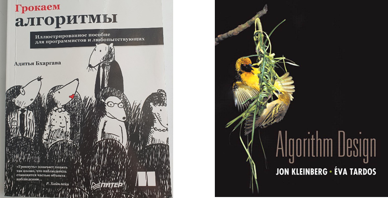                         

###  1.2. <a name='1.2'></a>Big O notation 

Сложность в алгоритмах относится к количеству ресурсов, необходимых для решения проблемы или выполнения задачи. К таким ресурсам относят время и память. (Time and Space complexity)
Память говорит сколько оперативной памяти занимает программа, переменные и т.д. Этот ресурс критично для устройств с небольшим количеством оперативной памяти - на принтере или калькуляторе, подключенному к картошке можно запустить игру дум, написанную на языке Си, но какую-нибудь современную игру уже вряд ли выйдет. 
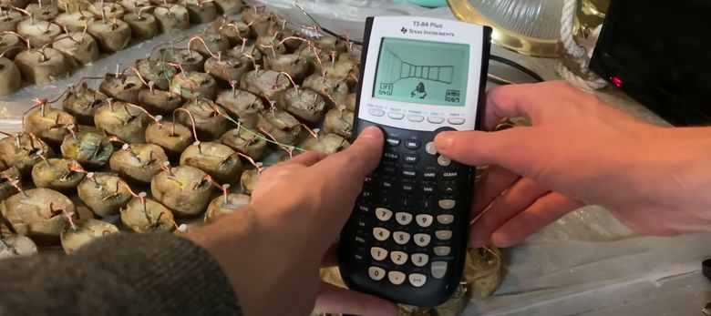

Более распространенная мера сложности - время, т.е. сколько времени нужно алгоритму на выполнение. Эта мера показывает зависимость между временем выполнения и кол-вом входных данных.
Если с памятью мы знаем конкретные цифры - размер программы в байтах и от устроства к устройству будет схожим, то время выполнения будет отличаться на двух устройствах. 
Возьмем ПК друга для "учебы" с RTX 5090 с соотвествутющем железом и любой простой офисный ПК/ноутбук, запустим на них одну и ту же программу с обработкой больших данных и замерив время выполнения - получим очевидно разное время выполнения в секундах. 
Отсюда должно быть понятно то, что время выполнения будет отличаться от того где запускается программа и сложность алгоритма так мерить не вариант. Для измерения сложности алгоритмов времени в программировании используют такое понятие как Большая O (Big O notation). Говоря о памяти также используются эта Большая О, в которой оценивается размер данных.

Если почитать Big O определение в Wiki, то увидим много математических определений и функций. Отсюда можем понять, что большая O пришла из математики, в которой позволяет сравнить функции роста.
Простыми словами - **Big O нотация используется для оценки наихудшего случая временной сложности алгоритма**, т.е. "О" покажет как поменяется производительность алгоритма.
Записывается обычно следующим образом: O(n) - читается как "O от n", где n - размер входных данных.

Чтобы понять, что такое нотация Big O, рассмотрим примеры.
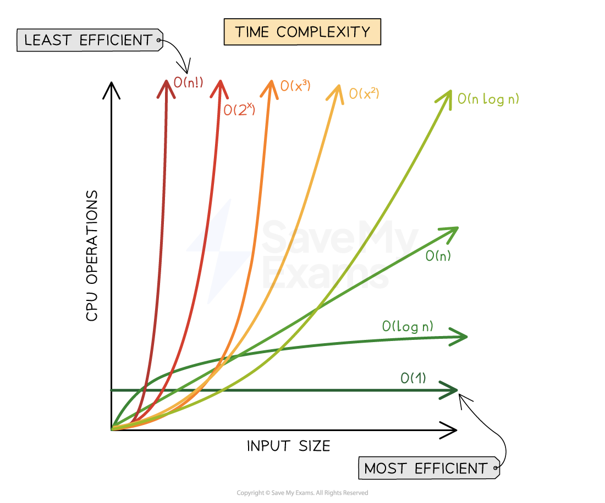

Сложность: 
- O(1) - Константная ~
- O(log n) - Логарифмическая ~
- O(n) - Линейная ~
- O(n log n) - Линейно-логарифмическая ~
- O(n^2) - Квадратичная ~
- O(n^3) - Кубическая ~
- O(2^n) - Экспоненциальная ~
- O(n!) - Факториальная ~

Для понимания посмотрим примеры алгоритмов с такими сложностями:

####  1.2.1. <a name='1.2.1'></a>O(1) Константная сложность

Такая сложность можно сказать является идеальной, т.к. производительность алгоритмов с такой сложностью не зависит от размера входных данных. Популярный пример такой сложности - получение элемента массива.

```c
int get_elem(int idx) {
    return some_int_array[idx];
}
```

####  1.2.2. <a name='1.2.2'></a>O(n) Линейная сложность


Возьмем в качестве примера книгу рецептов Гордона Рамзи, где рецепты отсортированы по алфавиту (добавим условность, что первая буква каждого рецепта повторяется единожды) и попробуем найти рецепт на букву "М" - скажем например мильфей с малиной (десерт из слоенного теста).
Простыми словами наша задача сводится к поиску буквы "М" в алфавите.
Чтобы найти определенную букву в алфавите - можно перебрать все элементы алфавита (буквы) попутно сравнивая с искомой пока не наткнемся на искомую.
Такой поиск будет считаться линейным. А почему O от n? Напоминаю Big O показывает наихудший случай. Наихудший случай в алфавите - последняя буква Я, чтобы до нее добраться нужно перебрать весь алфавит, т.е. сделать 33 операции. Поэтому за n можно смело принять 33.
А если мы начнем добавлять новые буквы в наш алфавит, то наихудший случай так и останется равным O от n не смотря на изменение самого значения n.

```c
for (int s = 0; s < n; s++) {
  if (recipes[s] == 'M'){
    // get recipe
  }
}
```
Итого: линейная сложность есть перебор всего набора данных в цикле

####  1.2.3. <a name='1.2.3'></a>O(log n) Логарифмическая сложность

Сюда относится большинство алгоритмов по типу разделяй и властвуй (Divide and Conquer) - бинарный поиск. 

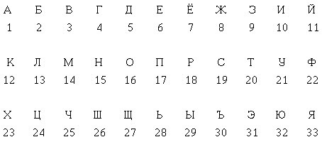

Попробуем применить бинарный поиск для нахождения нашего рецепта
1) Поделим алфавит на 2 части А-Я: А-О и П-Я -> буква М в первой половине алфавита, соответственно вторая половина нам не нужна
2) Делим первую половину еще на две половины А-О: А-Ж и З-О -> буква М во второй половине, первую отбрасываем А-Ж
3) З-О -> З-К и Л-О -> Л-О
4) Л-О -> Л-М и Н-О -> Л-М
5) Л и М -> М ответ

5 операций чтобы найти ответ, где n = 33, а log(33) ~ 5

Итого: Логарифмическая сложность получается из-за постоянного разделения на две части (логарифмы тоже со степенью 2 работают)

####  1.2.4. <a name='1.2.4'></a>O(n log n) - Линейно-логарифмическая сложность

Она схожа с предыдущей, но добавляется еще одна n - например мы ищем не в одной книге, а среди n книг рецептов Гордона Рамзи рецепт на какую-то букву.

Итого: есть цикл O(n), внутри которого используются алгоритмы "разделяй и властвуй" O(log n) -> O(n * log n)


####  1.2.5. <a name='1.2.5'></a>O(n^2) Квадратичная сложность

Сюда относятся все вложенные циклы, т.е. цикл в цикле. Самый простой пример - пузырьковая сортировка.

```c
for (int i = 0; i < n; i++) {
  for (int j = 0; j < n - 1; j++) {
    if (a[j] > a[j + 1]) {
      swap(&a[j], &a[j + 1]);
    }
  }
}
```

####  1.2.6. <a name='1.2.6'></a>O(n^3) Кубическая сложность

Если O(n) - один проход по набору данных (один цикл), O(n^2) - n*n проходом по данным (два цикла - цикл в цикле), то O(n^3) три цикла, пример:
```c
for (int i = 0; i < n; i++) {
  for (int j = 0; j < n; j++) {
    for (int k = 0; k < n; k++) {
      // do smth
    }
  }
}
```

####  1.2.7. <a name='1.2.7'></a>O(2^n) Экспоненциальная сложность

Такую сложность можно встретить в рекурсиях, например при расчете чисел Фибоначчи

```c
int fib(int n) {
  if (n <= 1) {
    return n;
  } else {
    return fib(n - 1) + fib(n - 2);
  }
}
```
В данном коде используется рекурсия - функция, вызывающая саму себя. Однако каждый раз, когда вызывается функция fib(), она порождает за собой два дополнительных вызова, что приводит к экспоненциальному увеличению количества вызовов функций с увеличением n.

```c
fib(4) -> fib(3) + fib(2) = 5
          |             |
  fib(2) + fib(1) + fib(1) + fib(0)
    |       |         |       |
  1 + 1  +  1     +   1    +  1 = 5
```

####  1.2.8. <a name='1.2.8'></a>O(n!) Факториальная сложность

Здесь время выполнения алгоритма растет пропорционально факториалу размера входных данных. 
Самый простой пример такой трудозатратной фукции:
```c
void f(int n) {
  for(int i = 0; i < n; i++) {
    f(n - 1);
  }
}
```
Вызов функции f() от n единожды порождает n функций, вызывающих n-1 функций, вызывающих n-2 функций..

###  1.3. <a name='1.3'></a>Нюансы Big O:
В программировании абсолютно нормальна практика с упрощением букв и цифр в big O по возможности, например:
- O(n) == O(2*n)
- O(n^2 + n) == O(n^2)

Еще пару примеров
```c
O(n^2) + O(log n) = O(n^2)  
O(3n) = O(n)  
O(10000 n^2) = O(n^2)  
O(2n * log n) = O(n * log n)  
O(n^2 + n) = O(n^2)  
O(n^3 + 100n * log n) = O(n^3)  
O(n! + 999) = O(n!)  
```

###  1.4. <a name='1.4'></a>Пример: Пытаемся оценить сложность алгоритма
Попробуйте самостоятельно оценить сложность алгоритмов

####  1.4.1. <a name='1.4.1'></a>Пример 1:
```c
int sumOfPairs(int arr[], int length) {
    int sum = 0;
    for (int i = 0; i < length; i++) {
        for (int j = 0; j < length; j++) {
            sum += arr[i] + arr[j];
        }
    }
    return sum;
}
```
<details>
  <summary>Ответ</summary>
O(n^2)
</details>

####  1.4.2. <a name='1.4.2'></a>Пример 2:
```c
int findMax(int arr[], int length) {
    int max = arr[0];
    for (int i = 1; i < length; i++) {
        if (arr[i] > max) {
            max = arr[i];
        }
    }
    return max;
}
```
<details>
  <summary>Ответ</summary>
O(n)
</details>

####  1.4.3. <a name='1.4.3'></a>Пример 3:
```c
int test(int arr[], int length) {
  int sum = 0;
  for (int i = 0; i < length; i++) {
    for (int j = 0; j < length; j++) {
        sum += arr[i] + arr[j];
    }
  }
  if (length < 3) return sum;
  int max = arr[0];
  for (int i = 1; i < 3; i++) {
      if (arr[i] > max) {
          max = arr[i];
      }
  } 
  return sum + max;
}

```
<details>
  <summary>Ответ</summary>
O(n^2) + O(1) = O(n^2)
</details>

####  1.4.4. <a name='1.4.4'></a>Пример 4:

```c
const int keys[] = {0x0, 0xDEADBEEF, 0xC0FFEE, 0xFFFF};

int get_key(int n) {
  return keys[n];
}
```
<details>
  <summary>Ответ</summary>
O(1)
</details>

####  1.4.5. <a name='1.4.5'></a>Сложности сортировок

**В интернете очень много видео с визуализациями и объяснениями всех сортировок.** Погуглите..

[Сортировки на wiki](https://ru.wikipedia.org/wiki/%D0%90%D0%BB%D0%B3%D0%BE%D1%80%D0%B8%D1%82%D0%BC_%D1%81%D0%BE%D1%80%D1%82%D0%B8%D1%80%D0%BE%D0%B2%D0%BA%D0%B8)                                         
Из забавного - **Bogo Sort**: Ее сложность оценивается что-то типа O(n*n!) и колоду карт (32 карты) она будет сортировать всего лишь `~2.7*10^19` лет, хотя может и с 1 раза.. шанс всегда есть                   
              

Таким образом, плохой алгоритм даже мощный суперкомпьютер превратит в калькулятор, а хороший посчитает все шустро хоть на стареньком ноуте

##  2. <a name='2'></a>Связанные списки (Linked List)

**Список** — это структура данных, которая хранит элементы в линейном порядке и позволяет вставлять и удалять элементы в любом месте последовательности. Списки могут быть односвязными, двусвязными или круговыми (циклическими).

У списков разные плюсы минусы как и у всех структур данных, но одно из главных преимществ списка - быстрая вставка/удаление элементов, да и вообще возможность добавить/удалить элемент. В статическом массиве вставка/удаление новых элементов невозможна, в динамическом возможна, но нужно будет двигать все оставшиеся элементы массива, чтобы освободить место для нового элемента.

##### Таблица временной сложности 
| Параметр | Массив (статический) | Массив (динамический) | Односвязный список | Двусвязный список  |
|------|---|---|---|---|
| Доступ                | O(1)  | O(1)   | O(n)  | O(n)  |
| Вставка/Удаление в начало | --- (размер фиксированный) | O(n) (нужно двигать элементы)  | O(1) | O(1) |
| Вставка/удаление в конец           | --- (размер фиксированный) | O(1) (если есть место в массиве), O(n) (если места нет - копирование); удаление O(1)  | O(n)  | O(1) |
| Вставка/удаление в середину        | --- (размер фиксированный) | O(n) (нужно двигать элементы) | O(1) (но добираться до середины O(n)) | O(1) (но добираться до середины O(n)) |
| Поиск        | O(n)  | O(n) | O(n)  | O(n)  |

Связанный список представляет собой последовательность узлов, где каждый узел состоит из двух компонентов:

1. Данные: любые значения, например, число, структуры и т.д.
2. Указатель: ссылка на следующий узел в списке.

###  2.1. <a name='2.1'></a>Односвязный список на языке C
Односвязный список состоит из узлов. В каждом узле хранится указатель на следующий узел и сами данные. Указатели последнего узла (хвост - tail) указывают на NULL, что указывает на конец связанного списка (т.е. дальше нет узлов) 

Пример структуры односвязного списка:
```c
struct node
{
    int data; // Пусть в качестве данных у нас будут числа
    struct node *next; // Указатель на следующий узел, если нет узла = NULL
};
```

Чтобы не писать каждый раз **struct node** определим **node_t** через typedef
```c
typedef struct node node_t;
```

**Пример односвязного списка:**   
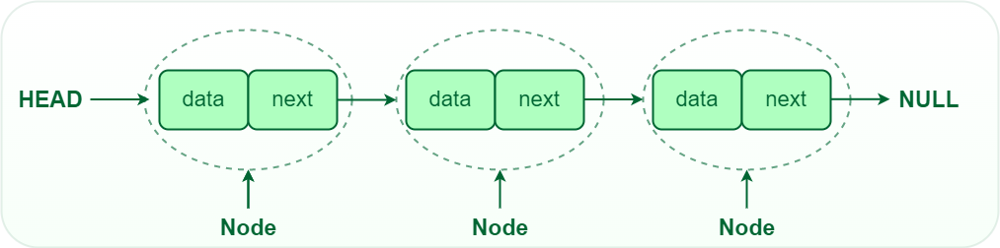             

Зачем использовать такую структуру данных как списки?
Одно из главных преимуществ списков - умение вставить/удалить любой элемент за O(1), т.к. для вставки или удаления элемента нам понадобится лишь немного поработать с указателями, перебрасывая стрелки указывающие на следующий элемент и выделить/освободить память под узел. Если взять динамические массивы, то вставить/удалить элемент новый мы сможем за O(n), т.к. придется копировать данные передвигая их (при удалении элемента, все элементы за ним сдвигаются влево на 1 и наоборот при вставке - все двигаются вправо на 1 элемент). В случае очень больших массивов когда очень часто нужно вставлять/удалять элементы - списки будут кажутся более эффективными.

В отличие от массивов, связанные списки не хранят элементы в смежных ячейках памяти. Каждый узел указывает на следующий, образуя цепочечную структуру. Чтобы получить доступ к любому элементу (узлу), необходимо последовательно пройтись по всем узлам перед ним.                 

Попробуем создать свой односвязный список и написать типичные функции для работы с ним.
Пусть данные в односвязном списке будут числа - создадим подобие целочисленного массива                

####  2.1.1. <a name='2.1.1'></a>Функция по созданию нового узла

```c
// Ф-ия выделяет память под новый элемент списка, 
// зануляет указатель на следующий (т.к. данный узел не имеет следующего) 
// и присваивает значение data из аргумента data
node_t *newNode(int data) {

    node_t *new_node = (node_t *)malloc(sizeof(node_t));
    new_node->data = data;
    new_node->next = NULL;

    return new_node;
}
```
При вызове такой функции у нас будет выделена память под один **ни с кем не связанный** узел, напишем код и визуализируем:

```c
// Создадим 3 узла с данными 1 2 3, данные могут быть любыми, 
// но чтоб было по красоте сделаем данные равным номеру узла.

node_t *node1 = newNode(1);
node_t *node2 = newNode(2);
node_t *node3 = newNode(3);

```
Визуализация кода выше будет примерно следующей

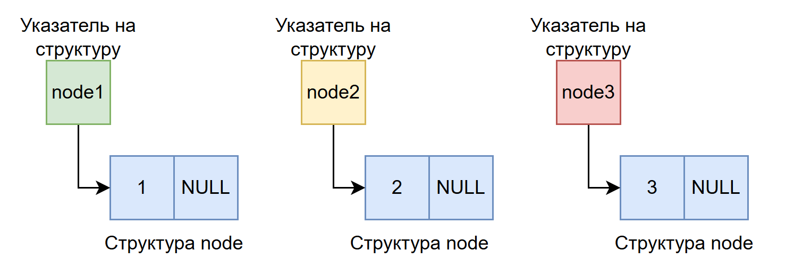             

Мы выделили память под три структуры node, заполнили их числами и адрес начала каждой структуры записали в указатели node1, node2 и node3 соответственно

Если представить более реалистично в нашей любимой памяти, то это будет выглядеть примерно так:
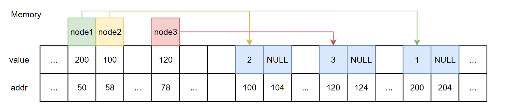             

Указатели node1, node2 и node3 находятся в стеке и вероятнее всего будут лежать рядом друг с другом и друг за другом, а вот сами структуры находятся в куче и могут лежать совсем не по порядку


####  2.1.2. <a name='2.1.2'></a>Свяжем эти три узла в один список

Для того чтобы связать два узла между, необходимо взять указатель на следующий узел у одного из узлов и бросить его на любой другой, наглядный пример:

```c
    node1->next = node2;
    node2->next = node3;
```
В этом примере мы свяжем узел1 и узел2, а также узел2 и узел3, третий же узел будет указывать на NULL, т.к. это конец нашего списка

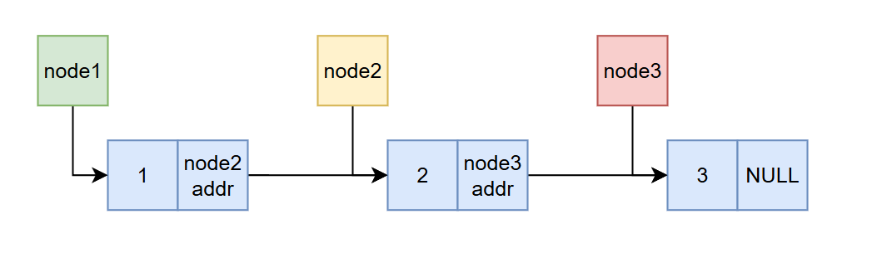             

В итоге у нас получился очень простой список из трех узлов = список из трех чисел (т.к. данные в списке у нас числа)

Если я захочу удалить узел2, то код будет состоять из следующих строк:

```c
    // удалим узел 2 из списка
    node1->next = node2->next; // связываем 1 и 3 узлы
    free(node2); // освободим структуру узла2
    node2 = NULL;
    // Получится список 1 -> 3 -> NULL
```
Картиночка:  
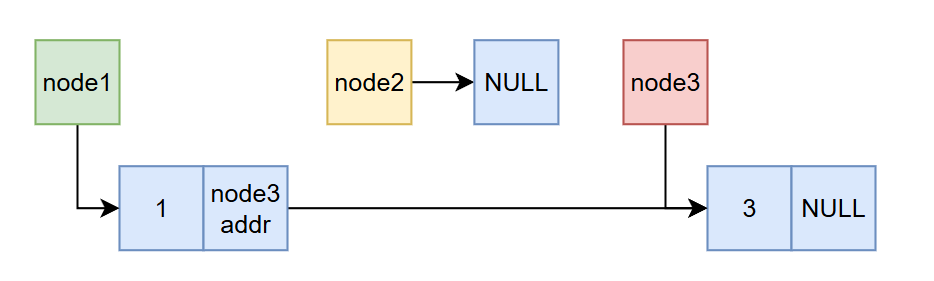             


В создании списка таким образом есть нюанс: под каждый узел мы создавали свою переменную-указатель со своим именем, а это не серъезно если мы захотим расширяться. В реальности пишут отдельные функции для добавления узла в список, например в конец, начало, между двумя любыми (в середину).

Перед написанием таких функций напишем функции попроще - вывод списка на экран и расчет длины списка

А также создадим указатель head (голова списка), который будет указывать на начало списка:
```c
    node_t* head = NULL; // Список пустой
    head = node1; // привяжемся к списку 1 -> 3
```

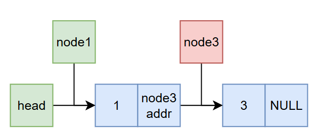             

####  2.1.3. <a name='2.1.3'></a>Функция вывода всего списка

Алгоритм:    
- Пока текущий узел не равен NULL:
  - Печатаем на экран данные
  - Приравниваем текущий указатель на следующий
- Список закончился
  
```c
// Вывод на экран списка
void printList(node_t *head) {

    node_t* cur = head;
    while (cur) {
        printf("%d -> ", cur->data);
        cur = cur->next;
    }
    printf("NULL\n");
}

//...
    printList(head); // выведет 1 -> 3 -> NULL
//...
```

Визуализация:
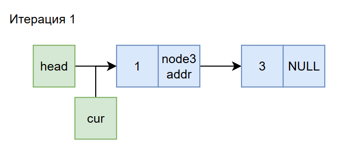               

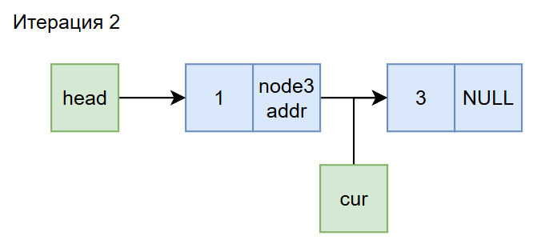               

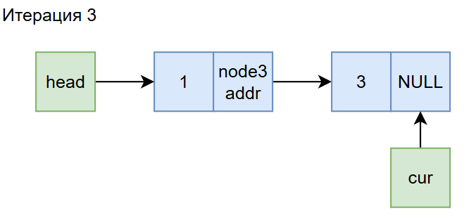               

####  2.1.4. <a name='2.1.4'></a>Длина односвязного списка

Алгоритм:    
- Длина списка = 0
- Пока текущий узел не равен NULL:
  - Длина списка + 1
  - Приравниваем текущий указатель на следующий

```c
// Функция поиска длины списка
int lengthList(node_t* head)
{
    int length = 0;

    node_t* cur = head;
    while (cur != NULL) {
        length++;
        cur = cur->next;
    }
    return length;
}
```

####  2.1.5. <a name='2.1.5'></a>Поиск в односвязном списке

Алгоритм:    
- Пока текущий узел не равен NULL:
  - Если data = искомой
    - Возвращаем true (искомый элемент есть в списке)
  - Приравниваем текущий указатель на следующий

```c
// Функция поиска, проходим по списку, если элемент в списке вернем true иначе false
bool searchList(node_t* head, int target)
{
    while (head != NULL) {
        if (head->data == target) {
            return true; // Нашли
        }
        head = head->next;
    }

    return false; // Не нашли
}
```

А теперь к более взрослым функциям - создание и связывание элементов в функции

В данных примерах будет возвращаться новый указатель на голову списка, однако бывает и 2 вариант, когда в самой функции меняем значение в head, для этого передаем &head и принимаем как **head, тогда можно голову списка менять прямо в функции и возвращать что-то еще

####  2.1.6. <a name='2.1.6'></a>Добавление элемента в начало списка

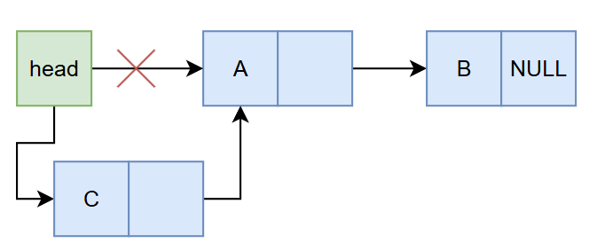             

Алгоритм:    
- Создать новый узел с заданным значением.
- Установить следующий указатель нового узла на текущий head.
- head должен указывать на новый узел.
- Вернуть новую голову списка.

```c
// Функция для вставки в начало списка
node_t* appendFront(node_t* head, int data)
{
    node_t* new_node = newNode(data);
    new_node->next = head;
    return new_node;
}
```

####  2.1.7. <a name='2.1.7'></a>Удаление первого узла

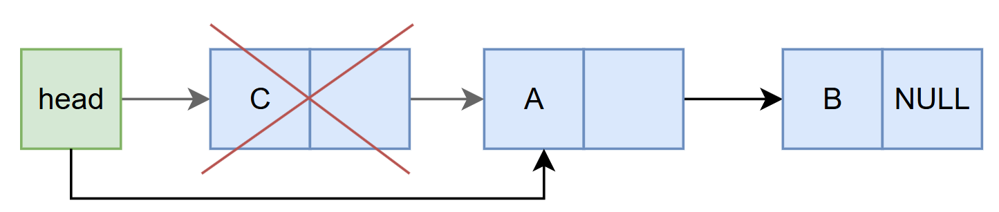             

Алгоритм:    
- Проверить, имеет ли голова значение NULL
   - Если да, то вернуть NULL (список пуст)
- Сохранить текущий head во временной переменной
- Переместить указатель головы на следующий узел
- Удалить временный узел
- Вернуть новый head связанного списка

```c

// Функция по удалению первого узла
node_t* removeFront(node_t* head)
{
    if (head == NULL) {
        return NULL;
    }

    node_t* temp = head;
    head = head->next;

    free(temp);

    return head;
}
```

####  2.1.8. <a name='2.1.8'></a>Добавление элемента в конец

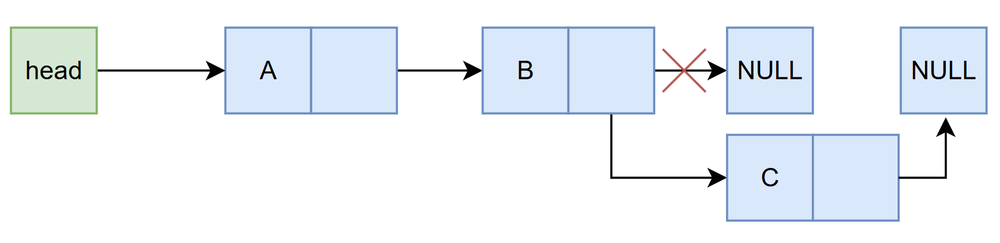             

Алгоритм:    
- Создать новый узел с заданным значением.
- Проверить пуст ли список:
   - Если да, сделать новый узел головой и вернуть
- Перемещаться по списку до тех пор, пока не будет достигнут последний узел
- Связать новый узел с текущим последним узлом, установив указатель следующего узла у последнего узла на новый узел
```c
// Функция для вставки нового элемента в конец списка
node_t* appendBack(node_t* head, int data)
{
    node_t* new_node = newNode(data);

    if (head == NULL) {
        return new_node;
    }

    node_t* cur = head;
    while (cur->next != NULL) {
        cur = cur->next;
    }

    cur->next = new_node;

    return head;
}
```

####  2.1.9. <a name='2.1.9'></a>Удаление последнего узла
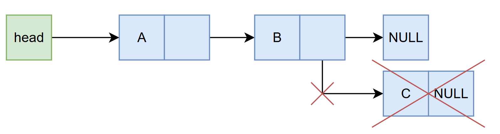               

Алгоритм:    
- Проверить пуст ли список (head = NULL)
   - Если да, вернуть NULL (список пуст)
- Проверить, равен ли следующий узел от головы NULL (только один узел в списке - голова)
   - Если да, удалить head и вернуть NULL
- Пройти по списку, чтобы найти предпоследний узел (второй с конца)
- Удалить последний узел (узел после предпоследнего)
- Установить следующий указатель предпоследнего узла в NULL
- Возвращаем head списка

```c
// Функция для удаления элемента из конца списка
node_t* removeBack(node_t* head)
{
    if (head == NULL) {
        return NULL;
    }

    if (head->next == NULL) {
        free(head);
        return NULL;
    }

    node_t *second_last = head; // предпоследний узел
    while(second_last->next->next != NULL) {
        second_last = second_last->next;
    }

    // Освобождаем последний узел
    free(second_last->next);

    // Предпоследний теперь становится последним
    second_last->next = NULL;

    return head;
}
```

####  2.1.10. <a name='2.1.10'></a>Вставка в середину и удаление из середины

Здесь я уже устал рисовать и расписывать - поэтому **самостоятельно**.   
**Что для этого нужно сделать?**   
Понять все примеры выше с поиском и вставкой/удалением, а также не забывать вначале проверку на пустой список, чтоб не схватить сегу (segfault)               

[Полный пример кода тут](https://github.com/kruffka/C-Programming/blob/2025-2026/14_linked_lists/src/singly_list.c)              

###  2.2. <a name='2.2'></a>Стек и Очередь

Стек (англ. stack - стопка) - еще одна из простейших структур данных. Для описания стека часто используется аббревиатура LIFO (Last In, First Out), подчёркивающая, что элемент, попавший в стек последним, первым будет из него извлечён. Классический стек поддерживает всего лишь три операции:
- Добавить элемент в стек push() (Сложность: O(1))
- Извлечь элемент из стека pop() (Сложность: O(1))
- Проверить, пуст ли стек isEmpty() (Сложность: O(1))

Очередь (англ. queue) поддерживает тот же набор операций, что и стек, но имеет противоположную семантику. Для описания очереди используется аббревиатура FIFO (First In, First Out), так как первым из очереди извлекается элемент, раньше всех в неё добавленный.

 

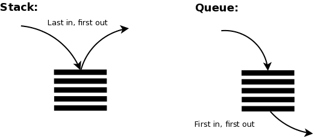   

###  2.3. <a name='2.3'></a>Примеры из реальной жизни
- Стеки используются для кнопок отмены в различных программах. Самые последние изменения помещаются в стек. Кнопка назад браузера или CTRL+Z в доках           

- Очереди используются в любой ситуации, когда вы хотите эффективно поддерживать порядок поступления в порядке очереди для некоторых объектов. Подобные ситуации возникают буквально при каждом типе разработки программного обеспечения.

Представьте, что у вас есть веб-сайт, который предоставляет файлы тысячам пользователей. Вы не можете обслуживать все запросы, вы можете обрабатывать только, скажем, 100 одновременно. Справедливой политикой будет подача в порядке очереди: обслуживайте 100 человек за раз в порядке их поступления. Очередь определенно будет наиболее подходящей структурой данных.

Аналогично в многозадачной операционной системе ЦП не может выполнять все задания одновременно, поэтому задания необходимо группировать в пакеты, а затем планировать в соответствии с некоторой политикой. Опять же, очередь может быть подходящим вариантом в этом случае


##  3. <a name='3'></a>Двусвязный список

Еще подредачу и запушу
```c
// Многосвязный список
node_t {
    node_t *prev; // указатель на предыдущий узел
    int data; // любые данные
    node_t *next; // указатель на следующий узел
};
```

##  4. <a name='4'></a>Циклический список
позже будет

##  5. <a name='5'></a>Выводы по спискам

выводы

**В заключение хочется напомнить, что необходимо учитывать плюсы и минусы структур данных при их выборе. Например, если вам нужно быстрое время доступа, массивы могут быть лучшим выбором, но если вам нужно часто вставлять или удалять элементы, списки могут быть лучшим выбором**