<!-- vscode-markdown-toc -->
* 1. [Keyboard input](#1)
* 2. [Comments (Комментарии)](#2)
* 3. [Type Casting](#3)
* 4. [Conditions (условия)](#4)
	* 4.1. [if, if-else и прочие](#4.1)
		* 4.1.1. [if (если)](#4.1.1)
		* 4.1.2. [if-else (если-иначе)](#4.1.2)
		* 4.1.3. [if-else-if (если-иначе-если)](#4.1.3)
		* 4.1.4. [Логические операторы](#4.1.4)
		* 4.1.5. [Operator precedence](#4.1.5)
		* 4.1.6. [Условия бывают разные](#4.1.6)
		* 4.1.7. [Logical errors](#4.1.7)
		* 4.1.8. [{} и if](#4.1.8)
	* 4.2. [Ternary operator](#4.2)
	* 4.3. [Switch-case](#4.3)
	* 4.4. [Branch Prediction (Предсказатель переходов)](#4.4)

<!-- vscode-markdown-toc-config
	numbering=true
	autoSave=true
	/vscode-markdown-toc-config -->
<!-- /vscode-markdown-toc -->


# Conditions

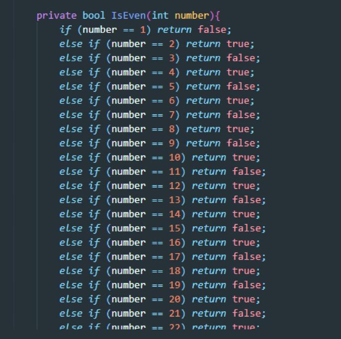              

В этой лекции:
- Как вводить числа с клавиатуры
- Комментарии в коде    
- Приведение типов (Type Casting)
- if-else и switch-case
- Как правильно оформлять условия и как делать не надо 

##  1. <a name='1'></a>Keyboard input

Начнем с ввода с клавиатуры           
Для начала мы познаем самый простой "академический вариант" - `scanf()`. Для него также как и для `printf()` необходимо подключать `<stdio.h>`. Академический, т.к. в реальном мире **он не безопасен для ввода строк** (вернемся к этому в теме массивов и строк)      

**scanf()** - ф-ия ввода с клавиатуры, состоит из двух слов `scan` и `f` (format), что дословно можно перевести как ввод (сканирование) с форматом. Работает по такому же принципу как и printf с форматом, но есть пару отличий:               
- Для записи в переменную значения введенного с клавиатуры в scanf - перед переменной необходимо ставить знак **амперсанда '&'**, где **&** в языке Си это **операция взятия адреса переменной**, т.е. буквально мы **берем адрес из оперативной памяти, где лежит наша коробка (переменная) и отдаем в scanf**, чтобы scanf смог залезть в этот адрес коробки и записать то, что мы введем с клавиатуры.                
- В формате scanf мы не пишем никакого текста (`\n`, `Введите число` и т.д.), только указываем конкретный %d или любой другой формат для нашего типа данных. Если все-таки написать что-то типа `Введите число: %d\n`, то scanf будет ждать, что мы (пользовать) введет весь текст, затем число и затем нажмет два раза enter (один раз для ввода '\n', а второй для ввода всей этой строки)                
 
Поэтому достаточно будет следующего ([scanf_int.c](https://github.com/kruffka/C-Programming/blob/2025-2026/1_conditions/src/scanf_int.c)):             
```c
int a;
printf("type a:");
scanf("%d", &a);
printf("a = %d\n", a);
```
- Объявляем перемнную a типа int
- Просим пользователя ввести число
- scanf() записывает введенное целое число в переменную a\
- Выводим на экран значение a

Пример ввода двух чисел с клавиатуры:        
```c
int x, y;
printf("Give me 2 numbers: ");
scanf("%d%d", &x, &y);
```
Здесь можно указать "**%d%d"** через пробел как **"%d %d"**, а можно не ставить. scanf найдет два целых числа и заберет их в x и y соответственно.       

**Важно**: **scanf()** - функция, на которой наша программа блокируется (зависает и ждет), а пользователи не любят когда программа зависает без всякого вывода, поэтому перед scanf добавляем user-friendly printf для понимания пользователем, что от него ждут некоторого ввода


##  2. <a name='2'></a>Comments (Комментарии)

В программировании есть возможность комментировать код - такой код **компилятор/интерпретатор полностью игнорирует**, т.е. комментарии используются разработчиками для разработчиков                

В языке Си комментарии можно на всю строку с помощью `// комментарий`
```c
// Вся эта строка будет игнорироваться компилятором
```

Многострочные комментарии: `/* комментарий */`
```c
/* Такой комментарий открывается через слеш звездочку
и будет комментировать все
пока не встретим звездочку слеш */
```

##  3. <a name='3'></a>Type Casting

**Type Casting (приведение типов)** - преобразование одного типа данных в другой (например double в int)                  
При приведении целых в вещественные мы получаем нули после плавающей запятой, при приведении double в int **сохраняется лишь целая часть**, например int -> double (5 -> 5.00) или double -> int (42.3 -> 42)               

Приведение типов в языке Си бывает двух типов - **явное и неявное**
- Явное (implicit) - приведение одного типа в другой, где мы явно в скобках указываем к какому типу привести 
- Неявное (explicit) - здесь мы явно не указываем в какой тип преобразовать, за нас решит компилятор

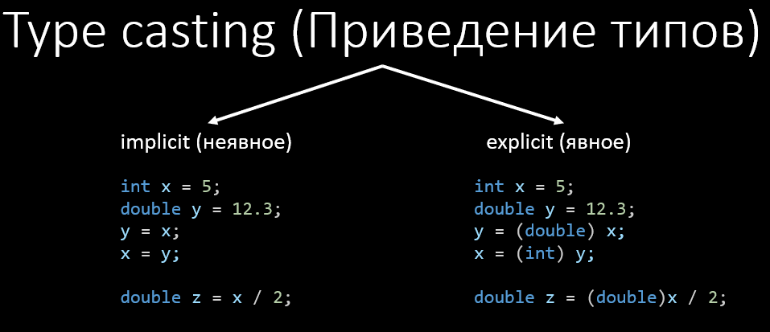                   

**Зачем это нужно?** Для примитивных типов данных иногда важно явно преобразовать тип из одного в другой, чтобы не потерять в точности, например:        
```c
int z = 5, a = 5;
double z = x / 2; // z = 2.0. Неявное преобразование - получаем целочисленное деление (x и 2 - целые числа) 

double c = (double)a / 2; // c = 2.5. Явное преобразовываем a в double - получаем вещественное деление
```

Исходный код с примером попробовать [type_cast.c](https://github.com/kruffka/C-Programming/blob/2025-2026/1_conditions/src/type_cast.c)


##  4. <a name='4'></a>Conditions (условия)

В программировании **условия** позволяют контролировать **ход выполнения программы на основе этих условий**, пример на языке блок-схем:      
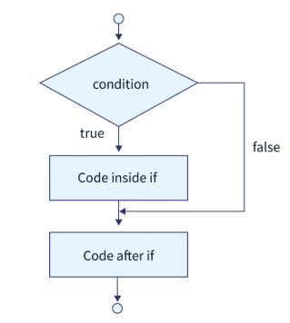                 

Условием мы отбираем в каких случаях выполнять некоторый код, если условие **истинно** - значит будет выполнять код внутри блока if.         

Чаще всего можно встретить следующие типы условий (в языке Си они все есть):
- if, if-else и прочие
- switch-case
- ternary operator

###  4.1. <a name='4.1'></a>if, if-else и прочие


####  4.1.1. <a name='4.1.1'></a>if (если)

```c
if (condition) {
    // code if condition is true
}
// code after
```

**condition** здесь - некоторое условие, например a > 5 ([пример if.c](https://github.com/kruffka/C-Programming/blob/2025-2026/1_conditions/src/if.c)):
```c
if (a > 5) {
    printf("a > 5!\n");
}
// code after
```
- Если условие **истинно** (a = 6), то выполнится весь код внутри фигурных скобок if (тело if), а затем код под if;
- Если условие **ложное** (a = 2), то код внутри if будет пропущен и исполнитель сразу пойдет выполнять код под if

**Таким образом мы можем контролировать ход событий в программировании**

####  4.1.2. <a name='4.1.2'></a>if-else (если-иначе)

В данном случае мы выполним либо одно либо другое и для обоих случаев затем пойдем выполнять код после if-else блока, схематично:

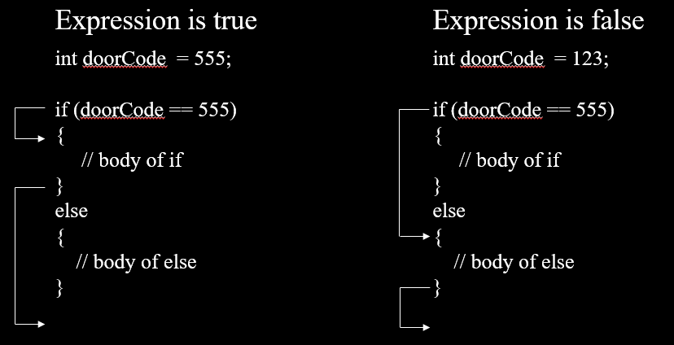                    

Пример ([if_else.c](https://github.com/kruffka/C-Programming/blob/2025-2026/1_conditions/src/if_else.c)):
```c
int doorCode = 555; // поменяй меня

if (doorCode == 555) {
    printf("Correct code\n");
} else {
    printf("Wrong code\n");
}
// code after
```

**==** - означает сравнение и если часть слева равна части справа, то условие **истинно** иначе **ложно**            

####  4.1.3. <a name='4.1.3'></a>if-else-if (если-иначе-если)

[Полный пример if_else_if.c](https://github.com/kruffka/C-Programming/blob/2025-2026/1_conditions/src/if_else_if.c)

В данном случае мы можем указать несколько условий прежде чем попадем в else, т.е. проверь сначала одно, если там ложь, то проверь второе и если и там ложь, то пойдем в else.         

```c
if (c == 'y') {
     // code for condition1 is true (c = 'y')
} else if (c == 'n') {
    // code for condition2 (c != 'y' and c = 'n')
} else {
    // code for else (c != 'y' and c != 'n')
}
// code after
```

else **опционален**, например:
```c
if (c == 'y') {
    // code
} else if (c == 'n') {
    // code
}
// code after
```

**ВАЖНО:** В программировании все что 0 - **Ложь** (**false**), все остальное **Истина** (**true**)!

**Самостоятельно:** Какая ветка if-else выполнится?               
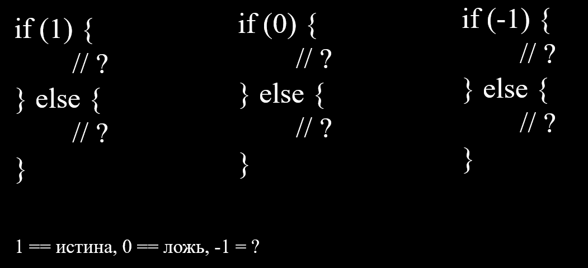                      

####  4.1.4. <a name='4.1.4'></a>Логические операторы

В языке Си мы имеем следущие виды логических операторов:         

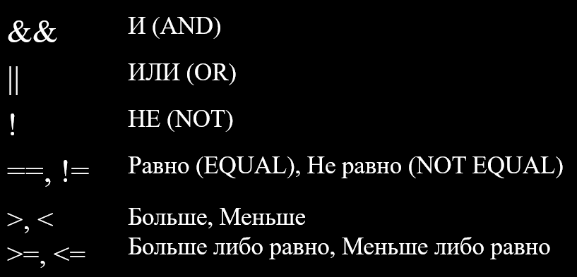                    

Операторы && (И) и || (ИЛИ) позволяют проверять несколько условий внутри одного блока, т.е. если мы хотим проверить равен ли символ a 'y' или 'Y', то вместо
```c
if (a == 'y') {

} else if (a == 'Y') {

}
```
Мы делаем так:
```c
if (a == 'y' || a == 'Y') {

}
```

**Важно:** ставить ровно две палки `||` или ровно два амперсанда `&&`, т.к. в Си одна палка `|` и один амперсанд `&` - это не **логические операторы**


####  4.1.5. <a name='4.1.5'></a>Operator precedence

Порядок операций - тоже важная вещь без понимания которой легко получить ошибку.            
            
По таблицам из [интернета](https://pvs-studio.com/en/blog/terms/0064/) вроде этой можно увидеть приоритет операций для C/C++                
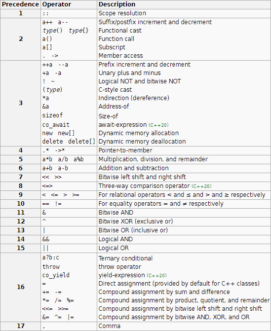          

**Важно:** Если не знаете (или не уверены) в каком порядке будут выполнены действия - используйте `()` для обозначения задуманного вами порядка действий. Лишняя пара скобок хуже не сделает             

####  4.1.6. <a name='4.1.6'></a>Четное нечетное
Проверка четное ли число:          
        
Хороший вариант:          
```c
int number = 5;

if (number % 2 == 0) {
  printf("%d is even.\n", number);
} else {
  printf("%d is odd.\n", number);
}
```
Символ **%** - арифметический оператор, дающий остаток от деления целых чисел (1 % 2 = 1, 2 % 2 = 0, 3 % 2 = 1, 4 % 2 = 0 и т.д..)            

Плохой вариант:       
      

####  4.1.7. <a name='4.1.7'></a>Logical errors

Часто допускаемые **логические ошибки**           

##### = вместо ==
```c
// bad
if (a = 6) {
    // Условие всегда истинно, т.к. сначала в a запишется 6, а потом проверится число 6 на истину (6 != 0 следовательно => истина)
}

// not bad
if (6 == a) {
    // Не всегда удобно, но это оберегает от ошибок, т.к. если забыли второе равно, то получится 6 = a, на что компилятор выдаст ошибку
}
```

##### != || !=
Для любых var всегда будет истина
```c
if (var != s1 || var != s2) {
    // ...
} else {
    // ...
}
```
Для проверки достаточно составить таблицу истинности:       
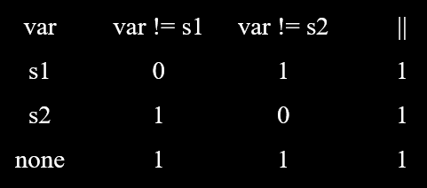

##### == && ==
Для любых var всегда будет ложь

```c
if (var == s1 && var == s2) {
    // ...
} else {
    // ...
}
```
Таблица истинности            
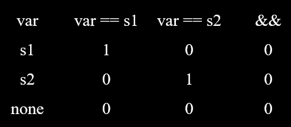

##### == || !=
Результат не зависит от var == s1

```c
if (var == s1 || var != s2) {
    // ...
} else {
    // ...
}
```
Таблица          
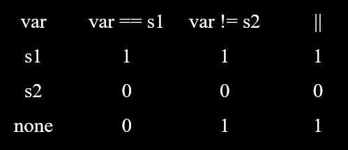

##### == && !=
Результат не зависит от var == s2

```c
if (var == s1 && var != s2) {
    // ...
} else {
    // ...
}
```
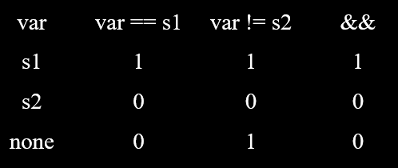

####  4.1.8. <a name='4.1.8'></a>{} и if
Фигурные скобки в условных выражениях на языке Си опциональны и если их не поставить, то это будет означать, что мы хотим выполнить самую первую ближайшую инструкцию под if (или else), например:         

```c
if (a == 5)
    printf("a == 5!\n"); // Выполниться если a равно 5

    printf("hello!\n"); // Выполнится в любом случае (табы/пробелы не важны)
```

Еще пример с ошибкой
```c
if (a == 5)
    printf("a == 5!\n"); // Ок
    printf("hello!\n"); // Ошибка! Больше одной инструкции без фигурных скобок
else
    printf("else here"); // Ок
```

###  4.2. <a name='4.2'></a>Ternary operator
Тернарный оператор (от латинского **тройной**). Есть во многих ЯП. Используется для сокращения строк кода с условием, но в некоторых случаях может ухудшить читаемость кода            

Означает следующее: Если **Q**, то **P1**, иначе **P2**            

Пример, запись в виде обычного условия:      
```c
int a = 3, b = 5;
int max;

if (a > b) {
   max = a;
} else {
   max = b;
}
```
Тоже самое с помощью тернарного оператора (символ `?`):     

```c
int a = 3, b = 5;
int max;
max = a > b ? a : b;
```
Дословно: a больше b? Если да, то в max кладем a, иначе b.              

###  4.3. <a name='4.3'></a>Switch-case

Если у вас получается большой блок if-else-if, то возможно вам стоит подумать о **switch-case**.              

- switch - переключатель
- case - сценарий (условие)
- break - дословно ломать, в нашем случае - остановится/выйти
- default - по умолчанию (все что иначе)

Рассмотрим пример:          
```c
if (a == 'a') {
    // ...
} else if (a == 'b') {
    // ...
} else if (a == 'c') {
    // ...
} else if (a == 'd') {
    // ...
} else {
    // ...
}
```
Можно заменить на:
```c
switch (a) {
    case 'a':
        // ...
        break;
    case 'b':
        // ...
        break;
    case 'c':
        // ...
        break;
    case 'd':
        // ...
        break;
    default:
        // ...
}
```
В switch на языке Си подается целочисленная либо символьная константа (в других ЯП иногда и другие типы разрешены), затем в case описываются возможные варианты, а после двоеточия и до `break;` описывается сам код, который будет выполняться для конкретного case (случая).                  

**Важно:** Если не поставить `break`, то после выполнения кода текущего case вы провалитесь в нижестоящий case так будем проваливаться все ниже и ниже по case (даже в default) до тех пор пока не наткнемся на `break`, т.е. break - говорит о том, что мы выходим из `switch-case`.          

[Пример с проваливанием вниз switch.c](https://github.com/kruffka/C-Programming/blob/2025-2026/1_conditions/src/switch.c)                    
```c
    switch (x) {
        case 1: { // brackets optional
            printf("one\n");
            break;
        }
        case 2:
            printf("two\n");
            break;
        case 3:
            printf("three\n");
        case 4:
            printf("four\n");
        default:
            printf("default\n");
    }
```
Здесь например если x будет = 3, то вы попадем в case 3, 4 и default.         

**Почему switch-case иногда эффективнее if-else-if?** Когда вам необходимо проверить является ли значение переменной равным одной из многочисленных констант (например каких-то состояний), то эффективнее будет switch-case из-за того как он устроен под капотом. А под капотом - он работает с помощью **хэш-таблиц** или **бинарного поиска**, с ними мы познакомимся чуть позже, сейчас можно понять то, что если нужн о сделать много проверок одной переменной, то эти алгоритмы в switch-case выполнять эту работу эффективно и такой код более приятен чем огромный if-else-if..                  

###  4.4. <a name='4.4'></a>Branch Prediction (Предсказатель переходов)

Современные процессоры загружают команды сразу по несколько подряд (принцип **конвейера**). Если взять инструкции с условиями, то в них без проверки условия мы никак не узнаем в какую ветку условия попадем, поэтому чтобы процессор не простаивал из-за подобных инструкций, загружается инструкции условия, а где-то за ними сразу инструкции ветки условия в которую наиболее вероятно попадем.          

Такой механизм в современных процессорах называется **предсказатель переходов** (**branch predictor**) и он позволяет оптимизировать работу с условиями. Работает он путем предсказания исхода условия еще до наступления условия. Т.е. процессор берет тот вариант, который считает наиболее вероятным и загружает к себе в очень быструю память (кэш). Далее проверяет условие и если заранее загруженная ветка правильно угадана - выполняем ее сразу же, а если нет, то немножко промахнулись и нужно загружать код заново, и некоторое количество тактов процессора мы теряем.                           

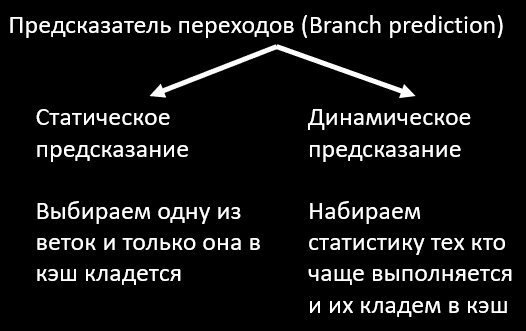     

Основные виды предсказателя переходов:
- Статическое предсказание
- Динамическое предсказание

Так, например когда стартует процессор он включает режим **статического предсказателя**, в котором он просто выбирает одну из веток и считает что она будет всегда выбираться. Так он может поработать какое-то время, набирая историю успешных и неуспешных предсказаний, а затем возьмет и переключится на **динамическое предсказание** - взависимости от вероятностей (мы набрали историю попаданий) загружаем определенную ветку.       

**Кстати:** Подобные промахи процессора в кэше называют **cache miss (промах кэша)**, когда процессор вынужден загрузить данные из более медленной памяти (например оперативной памяти), т.к. нужных данных не оказалось в кэше процессора.                   

Создавая вложенные условия типа этого:        
```c
if (e1) { 
    /*...*/
    if (e2) {
        /*...*/
    } else if (e2.2) {
        if (e3) { if (e4) {/*...*/} else {/*...*/} }
    } else if (e2.3) {
        /*...*/
    } else if (e2.4) /*...*/ else if (e2.5) /*...*/ else /*...*/
    /*...*/
} else {
    /*...*/
}
/*...*/
```

Процессор такому не обрадуется **(особенно если такое условие проверяется много раз)** и будет частенько простаивать из-за промахов, поэтому обычно **хорошим тоном** является не писать много **вложенных условий** (условия в условиях), а ограничиваться до 3-4, если выходит больше, то возможно мы делаем что-то не правильно                     