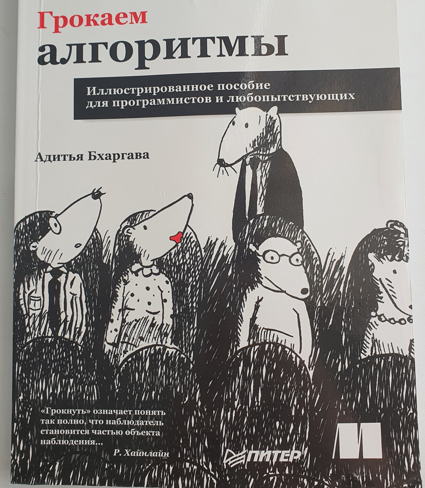
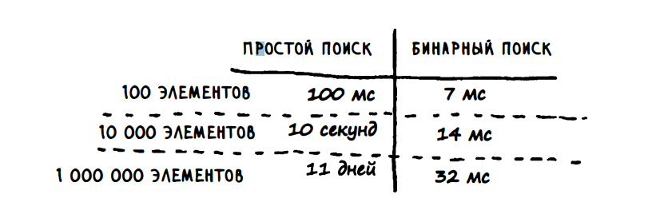
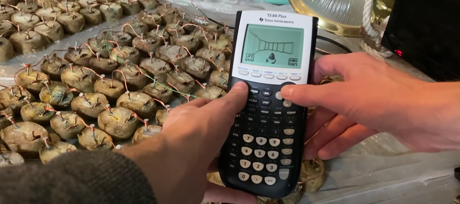
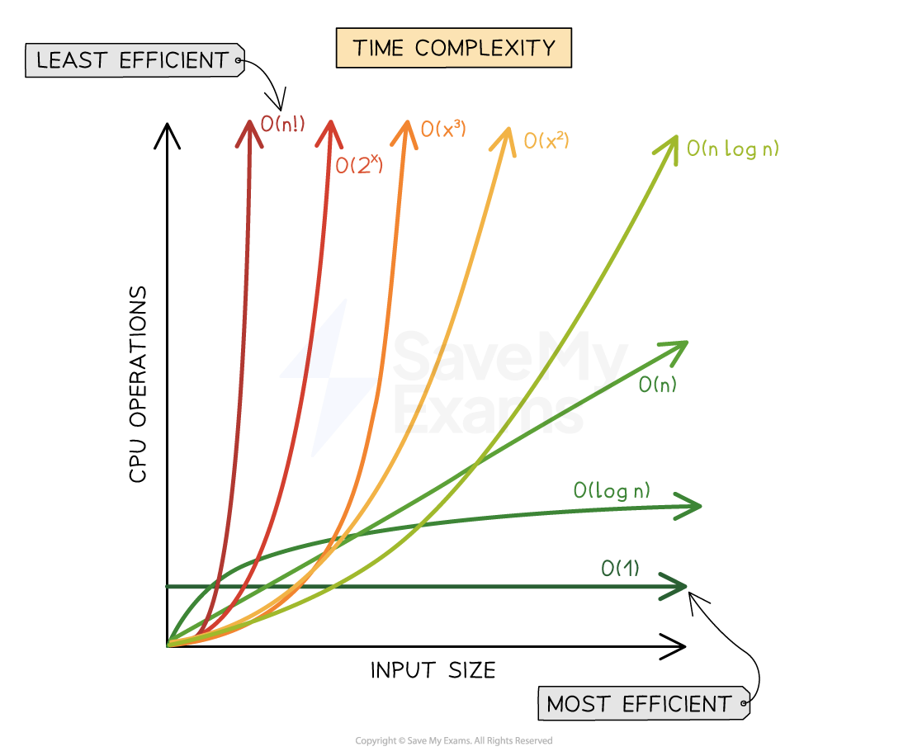
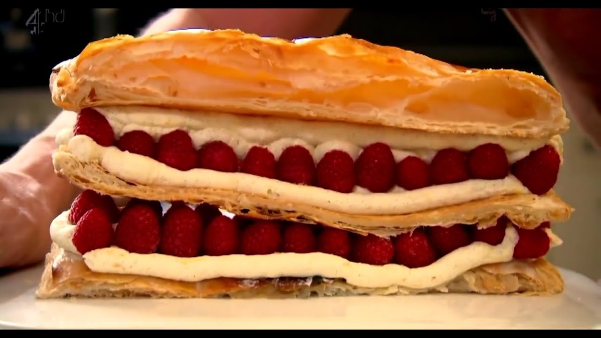
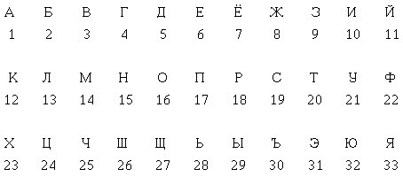
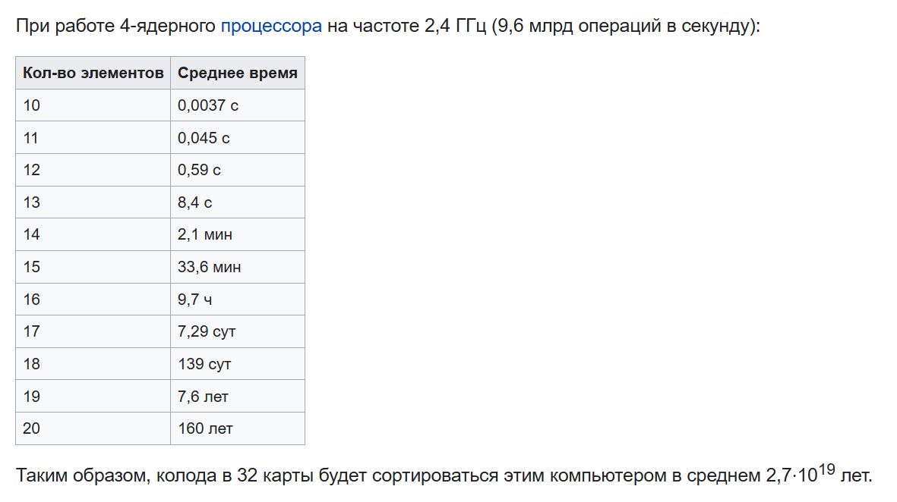
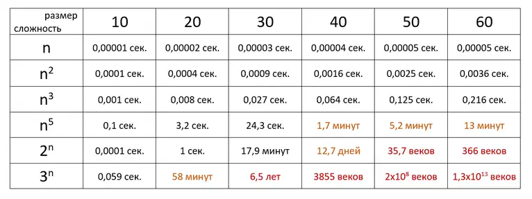

## Сложность алгоритмов (big O notation)

## Алгоритмы

Прежде чем оценить сложность алгоритмов подумаем или вспомним что такое вообще алгоритм:
**Алгоритм** — есть последовательность действий (или инструкций) для выполнения задачи и получения некоторого результата.
Алгоритмы можно представить как черную коробку, которой мы отдаем что-то на вход и получаем что-то ожидаемое на выходе, например какой-нибудь алгоритм сортировки, на вход набор чисел, а на выходе отсортированный набор чисел. Здесь черная коробка и есть алгоритм.  

Зная алгоритм его легко можно перенести в программу написанную на **любом** языке, тут понадобится лишь немного погуглить синтаксис языка, а алгоритм от языка к языку остается прежним  

По алгоритмам для подготовки к САОДу и просто для себя можно полистать "Грокаем алгоритмы":


Посложнее можно полистать: [Algorithm Design by Jon Kleinberg, Eva Tardos](https://github.com/xmcp/Shared-learning-materials/blob/master/Just%20some%20useful%20thing%20%E5%85%B6%E4%BB%96%E8%B5%84%E6%96%99/Algorithm%20Design%20by%20Jon%20Kleinberg%2C%20Eva%20Tardos.pdf)

#### Зачем алгоритмы?   

- Хорошо подобранные алгоритмы для задачи позволяют выполнять эту задачу быстро, скажем нам нужно срочно в ближайшие пару дней найти в массиве размером в 1 млрд какой-то один особенный элемент. У нас есть два варианта поиска - линейный поиск и бинарный, линейный поиск написать легко, ошибок не допустим, тут мы уверены, перепроверять не придется, все четко. А бинарный поиск сложный и непонятный. Допустим обрабатывать 1 элемент - на нашем пк нужно 1 мс, для простого поиска 100 элементов = 100 мс, а более сложный поиск - бинарный за 7 мс (log2(100) = 7), разница между ними в 15 раз (100/7). Если бинарный поиск справится с 1 млрд элементов за log2(1000000000) ~ 32 мс, то линейный за 32*15? Не совсем. Скорость роста у данных алгоритмов сильно отличается. Если пересчитать для 1000000 элементов линейный поиск, то получим 1млн мс~ 11 дням работы линейного поиска против 32 мс бинарного поиска. Т.е. это такое маленькое время, что мы даже не успеем сказать миллисекунда


Возьмем количество частиц во вселенной и начнем искать какую-нибудь одну конкретную одну из 10^80, если проходить по каждой и смотреть наша ли частица, то нам понадобится 10^80 итераций, а если будем применять тот же бинарный поиск, то справимся за пару сотен итераций (log2(10^80))

- Алгоритмы повторяемы и выдают предсказуемые результаты каждый раз, когда они выполняются.
- Алгоритмы можно стандартизировать и совместно использовать скажем в разных устройствах. Пример: стандарт 4G на телефоне - по сути это программа, состоящая из набора алгоритмов, благодаря которым в какой стране вы бы не оказались вам не придется менять телефон, чтобы пользоваться 4G.
- Алгоритм не зависит от используемого языка. Он сообщает программисту логику, используемую для решения проблемы. Таким образом, алгоритм - это логическая пошаговая процедура, которая служит программистам своего рода планом.

#### Типы алгоритмов

Вообще алгоритмы можно разбить примерно на три следующих типа:
- **Алгоритмы сортировки** - алгоритмы для упорядочивания каких-либо данных в определенном порядке.  В интернет-магазине включаем фильтр по количеству отзывов. Пузырьковая сортировка, сортировка вставками, быстрая сортировка, сортировка подсчетом и много-много других..
- **Алгоритмы поиска** - алгоритмы поиска значения в наборе данных. Линейный поиск, бинарный и т.д.
- **Алгоритмы с графами** - поиск кратчайших путей. Алгоритм Дейкстра, BFS, DFS и т.д. 
Пример в 2gis ищем как пройти от какого-нибудь отеля до ТЦ. Социальные сети работают на алгоритмах с графами

## Сложность алгоритмов

Сложность в алгоритмах относится к количеству ресурсов, необходимых для решения проблемы или выполнения задачи. К таким ресурсам относят время и память. (Time and Space complexity)
Память говорит сколько оперативной памяти занимает программа, переменные и т.д. Этот ресурс критично для устройств с небольшим количеством оперативной памяти - на принтере или калькуляторе, подключенному к картошке можно запустить игру дум, написанную на языке Си, но какую-нибудь современную игру уже вряд ли выйдет. 


Более распространенная мера сложности - время, т.е. сколько времени нужно алгоритму на выполнение. Эта мера показывает зависимость между временем выполнения и кол-вом входных данных.
Если с памятью мы знаем конкретные цифры - размер программы в байтах и от устроства к устройству будет схожим, то время выполнения будет отличаться на двух устройствах. 
Возьмем ПК друга для "учебы" с RTX 5090 с соотвествутющем железом и любой простой офисный ПК/ноутбук, запустим на них одну и ту же программу с обработкой больших данных и замерив время выполнения - получим очевидно разное время выполнения в секундах. 
Отсюда должно быть понятно то, что время выполнения будет отличаться от того где запускается программа и сложность алгоритма так мерить не вариант. Для измерения сложности алгоритмов времени в программировании используют такое понятие как Большая O (Big O notation). Говоря о памяти также используются эта Большая О, в которой оценивается размер данных.

## Big O notation 

Если почитать Big O определение в Wiki, то увидим много математических определений и функций. Отсюда можем понять, что большая O пришла из математики, в которой позволяет сравнить функции роста.
Простыми словами - **Big O нотация используется для оценки наихудшего случая временной сложности алгоритма**, т.е. "О" покажет как поменяется производительность алгоритма.
Записывается обычно следующим образом: O(n) - читается как "O от n", где n - размер входных данных.

Чтобы понять, что такое нотация Big O, рассмотрим примеры.


Сложность: 
- O(1) - Константная ~
- O(log n) - Логарифмическая ~
- O(n) - Линейная ~
- O(n log n) - Линейно-логарифмическая ~
- O(n^2) - Квадратичная ~
- O(n^3) - Кубическая ~
- O(2^n) - Экспоненциальная ~
- O(n!) - Факториальная ~

Для понимания посмотрим примеры алгоритмов с такими сложностями:

### O(1) Константная сложность

Такая сложность можно сказать является идеальной, т.к. производительность алгоритмов с такой сложностью не зависит от размера входных данных. Популярный пример такой сложности - получение элемента массива.

```c
int get_elem(int idx) {
    return some_int_array[idx];
}
```

### O(n) Линейная сложность
<p align="center"></p>

Возьмем в качестве примера книгу рецептов Гордона Рамзи, где рецепты отсортированы по алфавиту (добавим условность, что первая буква каждого рецепта повторяется единожды) и попробуем найти рецепт на букву "М" - скажем например мильфей с малиной (десерт из слоенного теста).
Простыми словами наша задача сводится к поиску буквы "М" в алфавите.
Чтобы найти определенную букву в алфавите - можно перебрать все элементы алфавита (буквы) попутно сравнивая с искомой пока не наткнемся на искомую.
Такой поиск будет считаться линейным. А почему O от n? Напоминаю Big O показывает наихудший случай. Наихудший случай в алфавите - последняя буква Я, чтобы до нее добраться нужно перебрать весь алфавит, т.е. сделать 33 операции. Поэтому за n можно смело принять 33.
А если мы начнем добавлять новые буквы в наш алфавит, то наихудший случай так и останется равным O от n не смотря на изменение самого значения n.

```c
for (int s = 0; s < n; s++) {
  if (recipes[s] == 'M'){
    // get recipe
  }
}
```
Итого: линейная сложность есть перебор всего набора данных в цикле


### O(log n) Логарифмическая сложность

Сюда относится большинство алгоритмов по типу разделяй и властвуй (Divide and Conquer) - бинарный поиск. 



Попробуем применить бинарный поиск для нахождения нашего рецепта
1) Поделим алфавит на 2 части А-Я: А-О и П-Я -> буква М в первой половине алфавита, соответственно вторая половина нам не нужна
2) Делим первую половину еще на две половины А-О: А-Ж и З-О -> буква М во второй половине, первую отбрасываем А-Ж
3) З-О -> З-К и Л-О -> Л-О
4) Л-О -> Л-М и Н-О -> Л-М
5) Л и М -> М ответ

5 операций чтобы найти ответ, где n = 33, а log(33) ~ 5

Итого: Логарифмическая сложность получается из-за постоянного разделения на две части (логарифмы тоже со степенью 2 работают)

### O(n log n) - Линейно-логарифмическая сложность

Она схожа с предыдущей, но добавляется еще одна n - например мы ищем не в одной книге, а среди n книг рецептов Гордона Рамзи рецепт на какую-то букву.

Итого: есть цикл O(n), внутри которого используются алгоритмы "разделяй и властвуй" O(log n) -> O(n * log n)


### O(n^2) Квадратичная сложность

Сюда относятся все вложенные циклы, т.е. цикл в цикле. Самый простой пример - пузырьковая сортировка.

```c
for (int i = 0; i < n; i++) {
  for (int j = 0; j < n - 1; j++) {
    if (a[j] > a[j + 1]) {
      swap(&a[j], &a[j + 1]);
    }
  }
}
```

### O(n^3) Кубическая сложность

Если O(n) - один проход по набору данных (один цикл), O(n^2) - n*n проходом по данным (два цикла - цикл в цикле), то O(n^3) три цикла, пример:
```c
for (int i = 0; i < n; i++) {
  for (int j = 0; j < n; j++) {
    for (int k = 0; k < n; k++) {
      // do smth
    }
  }
}
```

### O(2^n) Экспоненциальная сложность

Такую сложность можно встретить в рекурсиях, например при расчете чисел Фибоначчи

```c
int fib(int n) {
  if (n <= 1) {
    return n;
  } else {
    return fib(n - 1) + fib(n - 2);
  }
}
```
В данном коде используется рекурсия - функция, вызывающая саму себя. Однако каждый раз, когда вызывается функция fib(), она порождает за собой два дополнительных вызова, что приводит к экспоненциальному увеличению количества вызовов функций с увеличением n.

```c
fib(4) -> fib(3) + fib(2) = 5
          |             |
  fib(2) + fib(1) + fib(1) + fib(0)
    |       |         |       |
  1 + 1  +  1     +   1    +  1 = 5
```

### O(n!) Факториальная сложность

Здесь время выполнения алгоритма растет пропорционально факториалу размера входных данных. 
Самый простой пример такой трудозатратной фукции:
```c
void f(int n) {
  for(int i = 0; i < n; i++) {
    f(n - 1);
  }
}
```
Вызов функции f() от n единожды порождает n функций, вызывающих n-1 функций, вызывающих n-2 функций..


### Нюансы Big O:
При этом при О - нотации принято не указывать константы и упрощать по возможности:
т.е. O(n) == O(2*n), так же все младшие степени "поглощаются" старшими O(n^2 + n) == O(n^2). Исключение может быть только при смешивании полиномиальной и экспоненциальной части (для малых n полином может быть больше).

Еще можно услышать такое понятие как амортизированный анализ (англ. amortized analysis) вместе с big O (например O(1) амортизировано). 
Подробнее тут например: [https://neerc.ifmo.ru/wiki/index.php?title=%D0%90%D0%BC%D0%BE%D1%80%D1%82%D0%B8%D0%B7%D0%B0%D1%86%D0%B8%D0%BE%D0%BD%D0%BD%D1%8B%D0%B9_%D0%B0%D0%BD%D0%B0%D0%BB%D0%B8%D0%B7]
Простыми словами - усреднение времени по всем операциям и анализ средней производительности в худшем случае, нужно когда операции очень дорогие, но при усреднении не все так плохо из-за низкой частоты встречаемости таких операций.

Рассмотрим пару примеров
```c
O(n^2) + O(log n) = O(n^2)  
O(3n) = O(n)  
O(10000 n^2) = O(n^2)  
O(2n * log n) = O(n * log n)  
O(n^2 + n) = O(n^2)  
O(n^3 + 100n * log n) = O(n^3)  
O(n! + 999) = O(n!)  
```

### Пример: Пытаемся оценить сложность алгоритма
Итак, мы познакомились со сложностью алгоритмов, теперь попробуем разобрать следующий алгоритм и оценить его сложность:


### Пример 1:
```c
int sumOfPairs(int arr[], int length) {
    int sum = 0;
    for (int i = 0; i < length; i++) {
        for (int j = 0; j < length; j++) {
            sum += arr[i] + arr[j];
        }
    }
    return sum;
}
```
Ответ: O(n^2)

### Пример 2:
```c
int findMax(int arr[], int length) {
    int max = arr[0];
    for (int i = 1; i < length; i++) {
        if (arr[i] > max) {
            max = arr[i];
        }
    }
    return max;
}
```
Ответ: O(n)

### Пример 3:
```c
int test(int arr[], int length) {
  int sum = 0;
  for (int i = 0; i < length; i++) {
    for (int j = 0; j < length; j++) {
        sum += arr[i] + arr[j];
    }
  }
  if (length < 3) return sum;
  int max = arr[0];
  for (int i = 1; i < 3; i++) {
      if (arr[i] > max) {
          max = arr[i];
      }
  } 
  return sum + max;
}

```
Ответ: O(n^2) + O(1) = O(n^2)

### Пример 4:

```c
const int keys[] = {0x0, 0xDEADBEEF, 0xC0FFEE, 0xFFFF};

int get_key(int n) {
  return keys[n];
}
```
Ответ: O(1)

Рассмотрим еще пару реальных сортировок и их сложности.. 

### MergeSort, QuickSort, Counting, Selection, Shell, Bubble, Insertion и прочие алгоритмы сортировок:

[Сортировки на wiki](https://ru.wikipedia.org/wiki/%D0%90%D0%BB%D0%B3%D0%BE%D1%80%D0%B8%D1%82%D0%BC_%D1%81%D0%BE%D1%80%D1%82%D0%B8%D1%80%D0%BE%D0%B2%D0%BA%D0%B8)

Красивые и понятные визуализации смотрим там, сами алгоритмы сортировок разбирали на практиках
**В интернете очень много видео с визуализациями и объяснениями всех сортировок.**


### Непрактичная сортировка:

Есть такая сортировка, которая в может отсортировать массив любого размера за всего один проход по массиву, но если немного повезет.


Ее суть заключается в том, что проходя по элементам массива мы элементы массива кладем в случайные места массива. И с очень-очень маленьким шансом (но он все же есть) мы можем упорядочить элементы в правильном порядке.
Но вообще ее сложность оценивается что-то типа O(n*n!)

Пару картинок из вики Bogosort:




**Таким образом при написании программ и решении задач выбирайте алгоритмы не забывая о сложности, т.к. это сильно улучшить ваши программы**.



