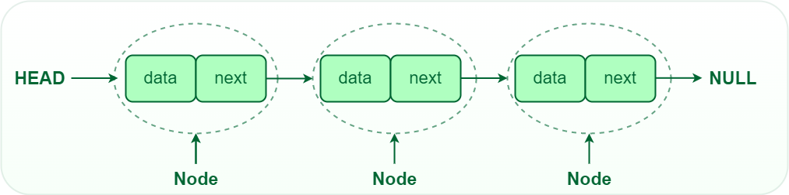

### Ссылки

Про списки можно посмотреть, например, тут:
https://www.geeksforgeeks.org/linked-list-in-c/   

### Списки

**Список** — это структура данных, которая хранит элементы в линейном порядке и позволяет вставлять и удалять элементы в любом месте последовательности. Списки могут быть односвязными, двусвязными или круговыми (циклическими).

У списков разные плюсы минусы как и у всех структур данных, но одно из главных преимществ списка - быстрая вставка/удаление элементов, да и вообще возможность добавить/удалить элемент. В статическом массиве вставка/удаление новых элементов невозможна, в динамическом возможна, но нужно будет двигать все оставшиеся элементы массива, чтобы освободить место для нового элемента.


##### Таблица временной сложности 
| Параметр | Массив (статический) | Массив (динамический) | Односвязный список | Двусвязный список  |
|------|---|---|---|---|
| Доступ                | O(1)  | O(1)   | O(n)  | O(n)  |
| Вставка/Удаление в начало | --- (размер фиксированный) | O(n) (нужно двигать элементы)  | O(1) | O(1) |
| Вставка/удаление в конец           | --- (размер фиксированный) | O(1) (если есть место в массиве), O(n) (если места нет - копирование); удаление O(1)  | O(n)  | O(1) |
| Вставка/удаление в середину        | --- (размер фиксированный) | O(n) (нужно двигать элементы) | O(1) (но добираться до середины O(n)) | O(1) (но добираться до середины O(n)) |
| Поиск        | O(n)  | O(n) | O(n)  | O(n)  |


### Связанные списки (Linked List)
Связанный список представляет собой последовательность узлов, где каждый узел состоит из двух компонентов:

1. Данные: любые значения, например, число, структуры и т.д.
2. Указатель: ссылка на следующий узел в списке.

### Односвязный список в C
Односвязный список состоит из узлов. В каждом узле хранится указатель на следующий узел и сами данные. Указатели последнего узла (хвост - tail) указывают на NULL, что указывает на конец связанного списка (т.е. дальше нет узлов) 

Пример структуры односвязного списка:
```c
struct node
{
    int data; // Пусть в качестве данных у нас будут числа
    struct node *next; // Указатель на следующий узел, если нет узла = NULL
};
```

Чтобы не писать каждый раз **struct node** определим **node_t** через typedef
```c
typedef struct node node_t;
```

**Пример односвязного списка:**   
             

Зачем использовать такую структуру данных как списки?
Одно из главных преимуществ списков - умение вставить/удалить любой элемент за O(1), т.к. для вставки или удаления элемента нам понадобится лишь немного поработать с указателями, перебрасывая стрелки указывающие на следующий элемент и выделить/освободить память под узел. Если взять динамические массивы, то вставить/удалить элемент новый мы сможем за O(n), т.к. придется копировать данные передвигая их (при удалении элемента, все элементы за ним сдвигаются влево на 1 и наоборот при вставке - все двигаются вправо на 1 элемент). В случае очень больших массивов когда очень часто нужно вставлять/удалять элементы - списки будут кажутся более эффективными.

В отличие от массивов, связанные списки не хранят элементы в смежных ячейках памяти. Каждый узел указывает на следующий, образуя цепочечную структуру. Чтобы получить доступ к любому элементу (узлу), необходимо последовательно пройтись по всем узлам перед ним.


## Создадим свой односвязный список

Попробуем создать свой односвязный список и написать типичные функции для работы с ним.
Пусть данные в односвязном списке будут числа - создадим подобие целочисленного массива


### Функция по созданию нового узла

```c
// Ф-ия выделяет память под новый элемент списка, 
// зануляет указатель на следующий (т.к. данный узел не имеет следующего) 
// и присваивает значение data из аргумента data
node_t *newNode(int data) {

    node_t *new_node = (node_t *)malloc(sizeof(node_t));
    new_node->data = data;
    new_node->next = NULL;

    return new_node;
}
```
При вызове такой функции у нас будет выделена память под один **ни с кем не связанный** узел, напишем код и визуализируем:

```c
// Создадим 3 узла с данными 1 2 3, данные могут быть любыми, 
// но чтоб было по красоте сделаем данные равным номеру узла.

node_t *node1 = newNode(1);
node_t *node2 = newNode(2);
node_t *node3 = newNode(3);

```
Визуализация кода выше будет примерно следующей

             

Мы выделили память под три структуры node, заполнили их числами и адрес начала каждой структуры записали в указатели node1, node2 и node3 соответственно

Если представить более реалистично в нашей любимой памяти, то это будет выглядеть примерно так:
             

Указатели node1, node2 и node3 находятся в стеке и вероятнее всего будут лежать рядом друг с другом и друг за другом, а вот сами структуры находятся в куче и могут лежать совсем не по порядку


### Свяжем эти три узла в один список

Для того чтобы связать два узла между, необходимо взять указатель на следующий узел у одного из узлов и бросить его на любой другой, наглядный пример:

```c
    node1->next = node2;
    node2->next = node3;
```
В этом примере мы свяжем узел1 и узел2, а также узел2 и узел3, третий же узел будет указывать на NULL, т.к. это конец нашего списка

             

В итоге у нас получился очень простой список из трех узлов = список из трех чисел (т.к. данные в списке у нас числа)

Если я захочу удалить узел2, то код будет состоять из следующих строк:

```c
    // удалим узел 2 из списка
    node1->next = node2->next; // связываем 1 и 3 узлы
    free(node2); // освободим структуру узла2
    node2 = NULL;
    // Получится список 1 -> 3 -> NULL
```
Картиночка:  
             


В создании списка таким образом есть нюанс: под каждый узел мы создавали свою переменную-указатель со своим именем, а это не серъезно если мы захотим расширяться. В реальности пишут отдельные функции для добавления узла в список, например в конец, начало, между двумя любыми (в середину).

Перед написанием таких функций напишем функции попроще - вывод списка на экран и расчет длины списка

А также создадим указатель head (голова списка), который будет указывать на начало списка:
```c
    node_t* head = NULL; // Список пустой
    head = node1; // привяжемся к списку 1 -> 3
```

             

### Функция вывода всего списка

Алгоритм:    
- Пока текущий узел не равен NULL:
  - Печатаем на экран данные
  - Приравниваем текущий указатель на следующий
- Список закончился
  
```c
// Вывод на экран списка
void printList(node_t *head) {

    node_t* cur = head;
    while (cur) {
        printf("%d -> ", cur->data);
        cur = cur->next;
    }
    printf("NULL\n");
}

//...
    printList(head); // выведет 1 -> 3 -> NULL
//...
```

Визуализация:
               

               

               

### Длина односвязного списка

Алгоритм:    
- Длина списка = 0
- Пока текущий узел не равен NULL:
  - Длина списка + 1
  - Приравниваем текущий указатель на следующий

```c
// Функция поиска длины списка
int lengthList(node_t* head)
{
    int length = 0;

    node_t* cur = head;
    while (cur != NULL) {
        length++;
        cur = cur->next;
    }
    return length;
}
```

### Поиск в односвязном списке

Алгоритм:    
- Пока текущий узел не равен NULL:
  - Если data = искомой
    - Возвращаем true (искомый элемент есть в списке)
  - Приравниваем текущий указатель на следующий

```c
// Функция поиска, проходим по списку, если элемент в списке вернем true иначе false
bool searchList(node_t* head, int target)
{
    while (head != NULL) {
        if (head->data == target) {
            return true; // Нашли
        }
        head = head->next;
    }

    return false; // Не нашли
}
```

А теперь к более взрослым функциям - создание и связывание элементов в функции

В данных примерах будет возвращаться новый указатель на голову списка, однако бывает и 2 вариант, когда в самой функции меняем значение в head, для этого передаем &head и принимаем как **head, тогда можно голову списка менять прямо в функции и возвращать что-то еще

### Добавление элемента в начало списка

             

Алгоритм:    
- Создать новый узел с заданным значением.
- Установить следующий указатель нового узла на текущий head.
- head должен указывать на новый узел.
- Вернуть новую голову списка.

```c
// Функция для вставки в начало списка
node_t* appendFront(node_t* head, int data)
{
    node_t* new_node = newNode(data);
    new_node->next = head;
    return new_node;
}
```

### Удаление первого узла

             

Алгоритм:    
- Проверить, имеет ли голова значение NULL
   - Если да, то вернуть NULL (список пуст)
- Сохранить текущий head во временной переменной
- Переместить указатель головы на следующий узел
- Удалить временный узел
- Вернуть новый head связанного списка

```c

// Функция по удалению первого узла
node_t* removeFront(node_t* head)
{
    if (head == NULL) {
        return NULL;
    }

    node_t* temp = head;
    head = head->next;

    free(temp);

    return head;
}
```

### Добавление элемента в конец

             

Алгоритм:    
- Создать новый узел с заданным значением.
- Проверить пуст ли список:
   - Если да, сделать новый узел головой и вернуть
- Перемещаться по списку до тех пор, пока не будет достигнут последний узел
- Связать новый узел с текущим последним узлом, установив указатель следующего узла у последнего узла на новый узел
```c
// Функция для вставки нового элемента в конец списка
node_t* appendBack(node_t* head, int data)
{
    node_t* new_node = newNode(data);

    if (head == NULL) {
        return new_node;
    }

    node_t* cur = head;
    while (cur->next != NULL) {
        cur = cur->next;
    }

    cur->next = new_node;

    return head;
}
```

### Удаление последнего узла
               

Алгоритм:    
- Проверить пуст ли список (head = NULL)
   - Если да, вернуть NULL (список пуст)
- Проверить, равен ли следующий узел от головы NULL (только один узел в списке - голова)
   - Если да, удалить head и вернуть NULL
- Пройти по списку, чтобы найти предпоследний узел (второй с конца)
- Удалить последний узел (узел после предпоследнего)
- Установить следующий указатель предпоследнего узла в NULL
- Возвращаем head списка

```c
// Функция для удаления элемента из конца списка
node_t* removeBack(node_t* head)
{
    if (head == NULL) {
        return NULL;
    }

    if (head->next == NULL) {
        free(head);
        return NULL;
    }

    node_t *second_last = head; // предпоследний узел
    while(second_last->next->next != NULL) {
        second_last = second_last->next;
    }

    // Освобождаем последний узел
    free(second_last->next);

    // Предпоследний теперь становится последним
    second_last->next = NULL;

    return head;
}
```


### Вставка в середину и удаление из середины

Здесь я уже устал рисовать и расписывать - поэтому **самостоятельно**.   
**Что для этого нужно сделать?**   
Понять все примеры выше с поиском и вставкой/удалением, а также не забывать вначале проверку на пустой список, чтоб не схватить сегу (segfault)

### Стек и Очередь

Стек (англ. stack - стопка) - еще одна из простейших структур данных. Для описания стека часто используется аббревиатура LIFO (Last In, First Out), подчёркивающая, что элемент, попавший в стек последним, первым будет из него извлечён. Классический стек поддерживает всего лишь три операции:
- Добавить элемент в стек push() (Сложность: O(1))
- Извлечь элемент из стека pop() (Сложность: O(1))
- Проверить, пуст ли стек isEmpty() (Сложность: O(1))

Очередь (англ. queue) поддерживает тот же набор операций, что и стек, но имеет противоположную семантику. Для описания очереди используется аббревиатура FIFO (First In, First Out), так как первым из очереди извлекается элемент, раньше всех в неё добавленный.

 

   

### Примеры из реальной жизни
Стеки используются для кнопок отмены в различных программах. Самые последние изменения помещаются в стек. Даже кнопка «Назад» в браузере работает с помощью стека, в который помещаются все недавно посещенные веб-страницы

Очереди используются в любой ситуации, когда вы хотите эффективно поддерживать порядок поступления в порядке очереди для некоторых объектов. Подобные ситуации возникают буквально при каждом типе разработки программного обеспечения.

Представьте, что у вас есть веб-сайт, который предоставляет файлы тысячам пользователей. Вы не можете обслуживать все запросы, вы можете обрабатывать только, скажем, 100 одновременно. Справедливой политикой будет подача в порядке очереди: обслуживайте 100 человек за раз в порядке их поступления. Очередь определенно будет наиболее подходящей структурой данных.

Аналогично в многозадачной операционной системе ЦП не может выполнять все задания одновременно, поэтому задания необходимо группировать в пакеты, а затем планировать в соответствии с некоторой политикой. Опять же, очередь может быть подходящим вариантом в этом случае


## Двусвязный список

Пример структуры двусвязного списка:

```c
// Многосвязный список
node_t {
    node_t *prev; // указатель на предыдущий узел
    int data; // любые данные
    node_t *next; // указатель на следующий узел
};
```
  

#### Преимущества двусвязного списка

- Эффективный обход в обоих направлениях: двусвязные списки обеспечивают эффективный обход списка в обоих направлениях.

- Также может использоваться для реализации стека или очереди: двусвязные списки можно использовать для реализации как стеков, так и очередей, которые являются распространенными структурами данных, используемыми в программировании.

#### Недостатки двусвязного списка

- Более сложный, чем односвязные списки: двусвязные списки более сложны, чем односвязные, поскольку для каждого узла требуются дополнительные указатели.
- Больше накладных расходов на память: двусвязные списки требуют больше накладных расходов на память, чем односвязные списки, поскольку каждый узел хранит два указателя вместо одного.

#### Применение двусвязного списка

- Реализация функций отмены и повтора действий в текстовых редакторах.
- Реализация кэша, где требуется быстрая вставка и удаление элементов.
- Управление историей браузера для навигации между посещенными страницами.
- Приложения для музыки для управления списками воспроизведения и эффективной навигации по песням.
- Реализация структур данных, таких как Дек (Deque - двусторонняя очередь), для эффективной вставки и удаления на обоих концах.

## Циклический список

   

    

### Поиск цикла в списке
Как определить - список циклический или нет? Воспользуемся алгоритмом Флойда "Черепаха и заяц" (или кролик вместо зайца). Пусть за одну итерацию первый указатель (черепаха) переходит к следующему элементу списка, а второй указатель (заяц) на два элемента вперед. Тогда, если эти два указателя встретятся, то цикл найден, если дошли до конца списка, то цикла нет.

Есть еще Алгоритм с маркировкой (см. в гугле)

#### Преимущества кольцевых связанных списков

- В кольцевом связанном списке последний узел указывает на первый узел, т.е. нет ссылок на NULL.
- Мы можем обойти список из любого узла и вернуться к нему без необходимости перезапуска с головы, что полезно в приложениях, требующих кольцевой итерации.
- Кольцевые связанные списки могут легко реализовывать кольцевые очереди, где последний элемент соединяется с первым, что позволяет эффективно управлять ресурсами.
- В кольцевом связанном списке каждый узел имеет ссылку на следующий узел в последовательности. Хотя он не имеет прямой ссылки на предыдущий узел, как в двусвязном списке, мы все равно можем найти предыдущий узел, обойдя список.

#### Недостатки кольцевых связанных списков

- Обход кольцевого связанного списка без четкого условия остановки может привести к бесконечным циклам

#### Применение кольцевых связанных списков

- Он используется для разделения времени между разными пользователями, как правило, с помощью механизма планирования Round-Robin, про который еще не раз услышите)
- В многопользовательских играх кольцевой связанный список может использоваться для переключения между игроками. После хода последнего игрока список циклически возвращается к первому игроку.
- В медиаплеерах кольцевые связанные списки могут управлять плейлистами, что позволяет пользователям непрерывно перебирать песни.

## Выводы по спискам

### Применение, преимущества и недостатки связанного списка

Связанный список — это линейная структура данных, которая используется для хранения набора данных с помощью узлов

- Последовательные элементы соединены указателями/ссылками.
- Последний узел связанного списка указывает на null.
- Точка входа связанного списка называется головой.

- Обычные вариации связанных списков — это Singly, Doubly, Singly Circular и Doubly Circular.
### Преимущества связанных списков (или наиболее распространенные варианты использования):

- Связанные списки в основном используются из-за их эффективной вставки и удаления. Нам нужно изменить всего несколько указателей (или ссылок), чтобы вставить (или удалить) элемент в середине
- Вставка и удаление в любой точке связанного списка занимает O(1) времени. Тогда как в структуре данных массива вставка/удаление в середине занимает O(n) времени.
- Эта структура данных проста и может также использоваться для реализации **стека, очередей и других абстрактных структур данных**. Большинство языковых библиотек используют связанный список внутренне для реализации этих структур данных.
- Связанный список может оказаться более эффективным по сравнению с массивами в случаях, когда мы не можем заранее угадать количество элементов. В случае массивов вся память для элементов выделяется вместе. Даже с динамическими массивами, такими как vector в C++ или list в Python или ArrayList в Java. внутренняя работа включает в себя освобождение всей памяти и выделение большего фрагмента, когда вставки происходят за пределами текущей емкости.
  
### Применения связанных списков в реальном мире

Список песен в музыкальном проигрывателе связан с предыдущей и следующей песнями.

- В веб-браузере URL-адреса предыдущей и следующей веб-страницы могут быть связаны с помощью кнопок «предыдущая» и «следующая» (двухсвязный список)
- В средстве просмотра изображений предыдущее и следующее изображения могут быть связаны с помощью кнопок «предыдущая» и «следующая» (двухсвязный список)
- Циклические связанные списки могут использоваться для реализации действий в циклическом режиме, когда мы переходим к каждому элементу по одному через время t
- Связанные списки предпочтительнее массивов для реализации структур данных Queue и Deque из-за быстрых удалений (или вставок) из начала связанных списков.

### Недостатки связанных списков:
Связанные списки являются популярной структурой данных, но, как и любая другая структура данных, они имеют определенные недостатки. Некоторые из основных недостатков связанных списков:

- Медленное время доступа: доступ к элементам в связанном списке может быть медленным, так как вам нужно пройти по связанному списку, чтобы найти нужный элемент, что является операцией O(n). Это делает связанные списки плохим выбором для ситуаций, когда вам нужно быстро получить доступ к элементам.
- Указатели или ссылки: Связанные списки используют указатели или ссылки для доступа к следующему узлу, что может сделать их более сложными для понимания и использования по сравнению с массивами. Эта сложность может сделать связанные списки более трудными для отладки и обслуживания.
- Более высокие накладные расходы: Связанные списки имеют более высокие накладные расходы по сравнению с массивами, так как каждый узел в связанном списке требует дополнительной памяти для хранения ссылки на следующий узел.
- Неэффективность кэширования: Связанные списки неэффективны в отношении кэширования, так как память не является непрерывной. Это означает, что при обходе связанного списка вы вряд ли получите нужные вам данные в кэше, что приведет к промахам кэша и низкой производительности.

**В заключение хочется напомнить, что необходимо учитывать плюсы и минусы структур данных при их выборе. Например, если вам нужно быстрое время доступа, массивы могут быть лучшим выбором, но если вам нужно часто вставлять или удалять элементы, списки могут быть лучшим выбором**