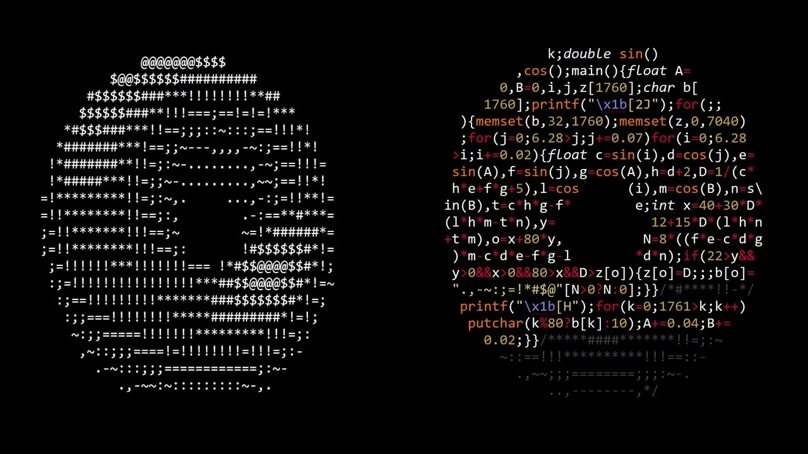

### #мем


**Даже ИИ пишет чистый код** и вы тоже пытайтесь, чтобы от ваши проекты не воняли. Попросите его вас научить, ИИ - неплохой вайб учитель            

### Почитать

Некоторые из примеров и самые популярные принципы хорошего кода мы разберем ниже в этой лекции, но советую все же полистать классические книги или хотя бы посмотреть обзоры по ним.    

Можно полистать:      
- **Чистый код** - Роберт Мартин      
- **Совершенный код** - Стив Макконнелл

Книжка от дяди Боба (Чистый код), будет чуть проще      

Книги не самые новые, но в смысле чистого и читаемого кода IT не изменилось с 80-х годов, поэтому смело можно читать и узнавать полезные вещи. Там много примеров на разных ЯП (Java, C++) как надо и не надо писать код и тесты к коду - очень полезно.         
 
Также погуглить популярные стили написания кода в компаниях, например:

- Google Style Guide
- Документация по стилю для C++: CppCoreGuidelines

Можно следовать гугл стайлу, часто его примерно и придерживаются          

### Зачем это надо?

Чистый код - код, который хорошо читается и в нем легко разобраться, от этого всем только польза           

Конечно же на практике не всегда вы будете встречать/писать такой код, например из-за сроков задачи или из-за производительности    

### Переменные

Они везде, без них мы ничего не сделаем

#### Именование
Это наверное одно из самых важных правил - используйте наглядные и понятные наименования переменных.    

Слова в имени переменной можно разделять например по принципу сamelСase (горабатыйРегистр, верблюжий) или snake_case (змеиный_вариант), а также шашлычный-регистр (через-черточку). Последний вариант не везде поддерживается.    

```c
// bad
char a[] = "192.168.1.2";
int b = 420;
double c = 299792458;

// good
char src_ip[] = "192.168.1.2";
int toyPrice = 420;
double speed_of_light = 299792458;
```

```js
// bad
const yyyymmdstr = moment().format('YYYY/MM/DD');

// good
const currentDate = moment().format('YYYY/MM/DD');
```

Важнейший принцип именования переменных состоит в том, что имя должно полно и точно описывать сущность, представляемую переменной. **ЯП хоть и позволяют задавать очень длинные имена переменным, но лучше так не делать**
       

```go
// bad
type Car struct {
	carModel string
	carColor string
}

func paintCar(car Car, color string) {
	car.carColor = color
}

// good
type Car struct {
	model string
	color string
}

func paintCar(car Car, color string) {
	car.color = color
}
```

Вообщем когда кодируете чего-то придумывайте адекватные имена для переменных, такое потом легко и вам и кому-то еще прочитать      


##### Инициализация и использование

Неверная инициализация - может быть плодородным источником ошибок, особенно для переменных счетчиков и флагов. Не все компиляторы/интерпретаторы/и прочие инициализируют ваши переменные по умолчанию 0. Хорошая практика - инициализировать переменную сразу при объявлении и после инициализации переменную использовать. Не стоит сразу плодить разные переменные под все нужды мира, создаем по необходимости.           

При использовании глобальных переменных можно явно указать, что они глобальные, тоже самое касается и указателей и других типов данных, например:
```c
typedef enum {
    ERROR = 0,
    INFO,
    DEBUG
} log_level_e;

// глобальными по возможности делать только константы
const int version_g = 123; // global
void *foo_p; // pointer
```

Булевы переменные-флаги можно называть, например так:
```c
bool isActive = false; // активен ли? - нет
bool is_running = true; // запущен ли? - да
// ...
while(isActive) {}

while(!is_running) {}
```

Дополнительно:
✅ Хорошие суффиксы/префиксы: 
- count (общее количество)
- num или number версия для англичан nof - number of (количество элементов) 
- total (суммарное значение) 
- index или idx (позиция в коллекции) 
- size (размер коллекции)

❌ Не всегда хороши: 
- cnt (сокращенно - count) 
- n (не совсем очевидно, подходит для математических контекстов) 
- amount (обычно для денег/неисчисляемых величин)

```js
// Количество элементов
const userCount = users.length;
const total_orders = orders.reduce((sum, order) => sum + order.value, 0);
```


### Отступы в коде

Здесь сразу видно кто вайбкодил, а кто сам программировал       

Опять же, можно написать весь код в одну строку (не на питоне) или в форме пончика и он будет работать, но такой код не будет читабелен      

     

Питон здесь вас и приучает писать аккуратно, используя табуляцию или пробелы

```c
// круто классно
public class OrderService
{
    public decimal CalculateTotal(Order order)
    {
        if (order.Items.Count > 0)
        {
            decimal total = 0;
            foreach (var item in order.Items)
            {
                total += item.Price;
            }
            return total;
        }
        return 0;
    }
}

// сомнительно и не окэй
public class OrderService
{
public decimal CalculateTotal(Order order)  // Нет отступа
{
if (order.Items.Count > 0)
{
decimal total = 0;
foreach (var item in order.Items)
{
total += item.Price;  // Нет отступа
}
  return total;  // Неправильный отступ
}
 return 0;  // Несогласованный отступ
}
}
```

Пробелы в коде:

```cpp
// ✅ Хорошо
void draw_rect(int x, int y, int width, int height) {
    if (width > 0 && height > 0) {
        draw(x, y, x + width, y + height);
    }
}

// ❌ Плохо
void draw_rect(int x,int y,int w,int h){
if(w>0&&h>0){draw(x,y,x+w,y+h);}
}
```


### Условные операторы

Стараемся минимизировать вложенность (не более 2-3 уровней): 

```js
// ❌ Плохо
if (x > 0) {
    if (y > 0) {
        if (z > 0) {
            // ...
        }
    }
}

// ✅ Хорошо
if (x > 0 && y > 0 && z > 0) {
    // ...
}
```

switch case вместо длинных цепочек if-else-if, switch case будет поэлегантнее и иногда оптимизированнее чем if-else-if..
```c
// Вместо:
if (status == NEW) {
    // ...
} else if (status == PENDING) {
    // ...
} else if (status == DONE) {
    // ...
}

// Лучше:
switch (status) {
    case NEW:
        // ...
        break;
    case PENDING:
        // ...
        break;
    case DONE:
        // ...
        break;
}
```


### Циклы

Частая проблема, о которой я вам говорил, это повторение констант в циклах и массивах. Это удобно тем, что если понадобится поменять число студентов, вам не придется лазить по всем строкам, а их может быть оочень много, и исправлять (можно потерять и забыть про одно из мест). Пример:

```python
# ❌ Плохо
students[3]

for i in range(3):
    # code

for i in range(3):
    # code

for i in range(3):
    # code

# ✅ Так хорошо
numberOfStudents = 3

students[numberOfStudents]

for i in range(numberOfStudents):
    # code

for i in range(numberOfStudents):
    # code

for i in range(numberOfStudents):
    # code

```


Однобуквенные имена ОК использовать в циклах:
```python
for i in range (1, 10):
    print(i)
```

Однако, для итераторов лучше использовать понятные имена, например:

```python
users = ["Alice", "Bob"]

# Четкое имя итератора
for user in users:
    print(user)
```


```c
// ❌ Опасненько
while (1) {
    printf("Infinite loop...\n");
}

// ✅ Так лучше
bool running = true;
while (running) {
    // ...
    if (condition) running = false;
}
```
Погуглите: как пишет код для NASA и спутников, к которым доступа для отладки нет, написал код и он улетел в космос.. 


### Функции

Как правильно ставить фигурные скобки в ЯП где они используются зависит от вашей компании и код стайла, обычно можно встретить два лагеря:

```c
// первый
int test() {
    for () {
        if () {
            // code
        }
    }
}

// второй
int test()
{
    for ()
    {
        if ()
        {
            // code
        }
    }
}
```


#### Имена функций

Правила имен функций похожи на имена переменных, но **функции принято обзывать глаголами**, например функция сна:
```c
bed(); // bad
sleep(); // good

message(); // bad
send_message(); // good
```

Предикаты - функция-проверка, что возвращает булево значение (true или false)

Для функций (или методов) красиво делаем так:
```c
isEmpty();
isValid();
isBusy();
```

Геттеры/сеттеры (get, set функции и методы)

```c
getMessage();
getTimeOfDay();

setName();
setGenre();
```

#### Длина функции

Если код функции слишком длинный - по возможности разбиваем ее на подфункции (подмодули), но не увлекаемся так, что под каждое действие с одной строкой отдельная функция (в некоторых языках вызовы функций не бесплатны). Идеальная длина функции - та, что пролезет в экран какого-нибудь типичного ноутбука         

Если код часто повторяется в разных местах, то его точно можно выделить в отдельный модулек, а там где он повторяется вызывать этот модуль     

#### Аргументы и возвращаемые значения

**Сигнатура функции** — это объявление функции или метода, а также его параметры     

```c
int save_to_file(const char* filename, const Data* data);
```

Хорошим тонном является объявлять аргументы, что не будут меняться в функции константами - делается для того, чтобы разработчики случайно не изменили значение этой переменной (компилятор отругает) либо понимали, что эта переменная не должна изменяться в данной функции.        

Полезно использовать ранние возвраты, где сначала обратываем ошибки/крайние случаи из функций:
```python
# ❌ Плохо
def process(data):
    if data.is_valid:
        if data.value > 0:
            # Основная логика
            return result
        else:
            return None
    else:
        return None

# ✅ Хорошо
def process(data):
    if not data.is_valid:
        return None
    if data.value <= 0:
        return None
    
    # Основная логика
    return result
```

Тоже самое на Си:

```c
// ❌ Плохо
int process(struct Data data) 
    {
    if (data.is_valid) {
        if (data.value > 0) {

            // здесь много кода ..
            // код
            return result;
        } else {
            return -1;
        }
    } else {
        return -1;
    }
}

// ✅ Хорошо
int process(struct Data data) {
    if (!data.is_valid) {
        return -1;
    }
    if (data.value <= 0) {
        return -1;
    }
    
    // здесь много кода ..
    return result;
}
```

Если функция используется лишь в одном файле, можно ее объявить как static
```c
static void signal_handler() { 
    // sigint хэндлируем    
}
```


#### Пару принципов для разработки KISS, DRY, YAGNI

##### YAGNI - You Aren’t Gonna Need It
Вам это не понадобится

Этот принцип прост - если пишете код, то будьте уверены, что он вам понадобится. Не надо писать такой код, который как вы думаете может пригодится позже - можно потратить время зря.     

##### DRY - Don't Repeat Yourself

Не повторяйтесь. Дублирование кода - пустая трата времени и ресурсов, нужно будет тестировать и отлаживать одну и ту же логику в разных местах, поэтому такие вещи выносим в отдельный блочок модулек - функцию    


##### KISS - Keep It Simple, Stupid

Принцип гласит, что простые системы работают лучше, стабильнее и надежнее. Сначала пишем как можем и чтобы работало, а затем рефакторим и оптимизируем      


### Комментарии

Комментарии нужны, но вставлять их везде может быть избыточно. Отвечаем почему, а не что:
# ❌ Плохо (избыточно)
```python
x = x + 1  # Увеличиваем x на 1
```
# ✅ Хорошо (объясняет причину)
```c
x = x + 1  # Фикс бага #1440: из-за округления в API нужно добавить 1
```
Или чрезмерные пояснения
```java
// ❌ Плохо
/* 
 * Этот цикл проходит по массиву users.
 * Переменная i — это индекс.
 * users[i] — текущий пользователь.
 */
for (int i = 0; i < users.length; i++) { ... }
```

Временные решения или не доделки помечать TODO ✅

```java
// TODO: Заменить на Redis кэш
List<Data> cache = loadFromFile();
```

Сокращения, которые можно встретить в комментариях
WIP - Work in Progress
TODO - To Do
```java
// 
// WIP: загрузчик данных по с
// TODO: добавить поддержку xlsx формата
int loadData(string file) {
    // ...
}
```

Код лучше удалить, а не хранить закомментированную версию. В истории Git репо ваш удаленный код сохранится и в случае необходимости можно всегда откатиться.     
```c
// ❌ not good
// FILE *file = fopen(argv[1], "r");
// if (file == NULL) {
//     perror("Error opening file");
//     exit(1);
// }
```

Если видим устаревшие комменты, то не ленимся их обновить
```python
# ❌ not good
# Здесь всегда возвращается True (устарело)
def check():
    return False

# ✅ good
# Здесь всегда возвращается False
def check():
    return False
```

Очевидные вещи лучше сильно не комментировать
```python
# ❌ не очень
# Складывает a и b и возвращает их сумму
def sum(a, b):
    return a + b

# ✅ good
# Сумма a и b (или вовсе без комментария оставить)
def sum(a, b):
    return a + b
```

Интересный пример из опенсурса 5G: https://gitlab.eurecom.fr/oai/openairinterface5g/-/blob/integration_2025_w20/openair1/SCHED_NR_UE/harq_nr.c?ref_type=heads


Комментарии вначале файла (версия, лицензия, дата создания)

```js
/**
 * Сервис для управления корзиной покупок.
 * Основные функции:
 * - Добавление/удаление товаров
 * - Расчет итоговой суммы
 * - Применение промокодов
 *
 * @author Frontend Team
 * @created 2024-02-10
 * @last-modified 2024-05-15
 * @license Apache-2.0
 */

import { Product } from './types';
```

```python
#!/usr/bin/env python3
# -*- coding: utf-8 -*-

"""
Модуль для работы с API платежной системы.
Обрабатывает запросы, валидирует данные, логирует ошибки.

Автор: Команда Backend (backend@example.com)
Создан: 15.03.2023
Последнее изменение: 20.05.2024
Лицензия: MIT
"""

import requests
import logging
```

```js

/**
 * ВНИМАНИЕ:
 * Этот модуль использует глобальное состояние.
 * Нельзя использовать в конкурентных сценариях без мьютекса.
 */
```

```c
/*!\file ldpc_encoder.c
 * \brief Defines the LDPC encoder
 * \author author1 author2 company
 * \date 27-03-2018
 * \version 1.0
 * \note
 * \warning
 */


```

### Документация 
#### Doxygen

```c
/**
 * Вычисляет сумму двух чисел.
 * @param a Первое число
 * @param b Второе число
 * @return Сумма a и b
 */
int sum(int a, int b) {
    return a + b;
}
```


#### Схемы кода и HLD


### TDD - Test Driven Development


### Синглтон Singletone


### Инструменты для форматирования кода

- gofmt (Go)
- clang-format (C/C++)
- blach (python)
