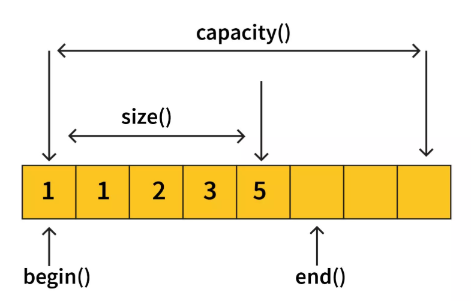
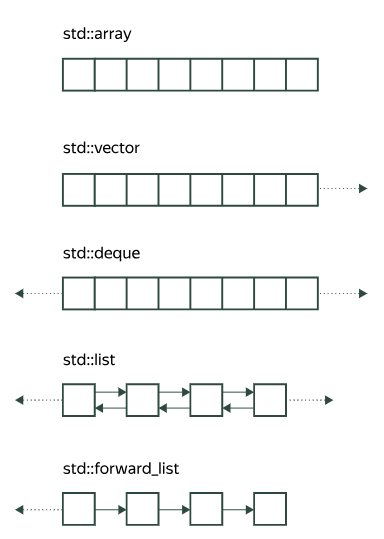
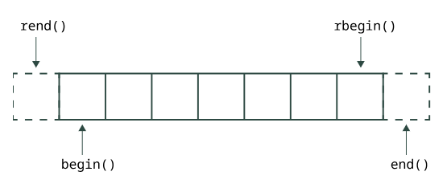
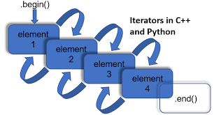

## Немного предислов

C++ как и Си - язык статической типизации (не динамической как python), компилируемый, а также управляем в нем выделением и освобождением памяти ручками
При изучении C++ сначала стоит уделить внимание самым основам, потом

Познавать С++ можно с классики - «Язык программирования C++» (The C++ Programming Language) Бьерн Страуструп, он же создатель языка С++, дальше углубиться в ООП, STL, почитав что-нибудь современного по плюсам, можно посмотреть потоки, а в конце изучать фишки стандартов C++11/17/20/23, там появляется всякая move-семантика, корутины и т.д..

Также для начинающих неплохой материал: https://education.yandex.ru/handbook/cpp

## Примеры
Начнем с хелло ворлд и пробежимся хотя бы до векторов и умных указателей

### Hello, world..

```cpp
#include <iostream>

int main() {

    std::cout << "Hello, world!" << std::endl;
    return 0;
}
```
где
**<<** - оператор вставки, который передает данные в cout
Для ввода с клавиатуры используется cin и **>>**.    
**std::** - стандартное пространство имен, можно не писать если использовать 
```cpp
using namespace std;
```
но такое не рекомендуется использовать в больших проектах из-за возможного конфликта с этими именами и их внутренностями

```cpp
using Complex = std::complex<double>;
```
А такая штука похожа на typedef, только в стиле C++ и означает, что вместо слова Complex будет подставляться std::complex<double>

### Переменные

Такие же как в Си и объявляются точно также, но есть в стандартной библиотеке другие типы данных, например вместо массива char есть string:

```c++
#include <iostream>
#include <string>

int main() {
    std::string name;
    std::getline(std::cin, name);
    std::cout << "Hello, " << name << "!\n";
}
```

Пример ввода и вывода нескольких переменных:
```c++
int main() {
    int a;
    int b;
    int c;
    std::cin >> a >> b >> c;
    std::cout << a << " " << b << " " << c << "\n";
}
```

В отличии от C, где auto - это просто int, в C++ auto определяет сам тип переменной из численной константы
```c++
int main() {
    auto x = 42;  // int
    auto pi = 3.14159;  // double
}
```

Явные преобразования типов здесь очень разные - посмотреть самостоятельно, вот один из них:

```c++
double d = 3.14;
int i = static_cast<int>(d); // явно преобразуем double = 3.14 в int = 3
```

### Циклы и условия

Тут можно все как в Си, например:

```cpp
for (int i = 0; i < 100; i++) {
    if (i % 2 == 0) {
        std::cout << i << " is even\n";
    }
}
```

А можно сделать так (с версии C++11 и новее):

```cpp
std::vector<int> vec = {1, 2, 3, 4, 5};
for (auto num : vec) {
    std::cout << num << " ";
}
```
где vec - вектор,
auto - автоматическое определение типа данных


### Векторы

В стандартной библиотеке C++ вектором (std::vector) называется динамический массив, обеспечивающий быстрое добавление новых элементов в конец и меняющий свой размер при необходимости. Вектор гарантирует отсутствие утечек памяти.      

Векторы и строки также называют контейнерными типами (хранит и обрабатывает разные объекты, т.е. что-то типа массива каких-то типов данных)

```c++
#include <vector>

int main() {

    std::vector<int> data = {1, 2, 3, 4, 5}; // вектор из целых чисел
    std::vector<std::string> empty_vec;  // пустой вектор строк
    std::vector<std::string> str_vec(5);  // вектор из пяти пустых строк
    std::vector<std::string> str_hellos(5, "hello");  // вектор из пяти строк "hello"

    int first = data[0];  // первый элемент вектора
    int last = data[4];  // первый элемент вектора
    int buf_overflow = data[5];  // переполнение буфера
    data[2] = 42;  // меняем элемент 3 на 42

    std::cout << data.size() << "\n"; // Количество элементов в векторе

    return 0;
}
```

Методы: 
- push_back() — добавление в конец.
- pop_back() — удаление последнего элемента.
- front(), back() - взять элементы с начала или с конца
- size(), empty() — проверка размера.
- [] и at() — доступ по индексу, где at() делает проверки на переполнение и выдает исключения

Пример с front() и back()
```c++
std::vector<int> data = {1, 2, 3, 4, 5};
std::cout << data.front() << "\n";  // == data[0]
std::cout << data.back() << "\n";  //  == data[data.size() - 1]
```

Пример с push_back()
```c++
#include <iostream>
#include <vector>

int main() {
    int x;
    std::vector<int> data;
    while (std::cin >> x) {  // читаем числа, пока не закончится ввод
        data.push_back(x);  // добавляем очередное число в вектор
    }

    while (!data.empty() && data.back() == 0) {
        // Пока вектор не пуст и последний элемент равен нулю
        data.pop_back();  // удаляем этот нулевой элемент
    }
}
```



```c++
#include <iostream>
#include <vector>

int main() {
    std::vector<int> vec = {1, 2};
    for (int i = 0; i < 16; i++) {
        std::cout << "[" << i << "] " << vec.size() << "\t" << vec.capacity() << "\n";
        vec.push_back(i);
    }

}
```

Размер при добавлении элементов выделяется заранее, но если элементы будут постоянно добавляться, то vector будет делать реаллокацию (realloc как в Си), что может быть не очень дешево и сердито      

Можно заранее выделить памяти под некоторое количество элементов через метод reserve()


#### Векторы векторов (матрицы)

```c++
#include <iostream>
#include <vector>

int main() {
    size_t m = 5, n = 5;

    // создаём матрицу matrix из m строк, каждая из которых — вектор из n нулей
    std::vector<std::vector<int>> matrix(m, std::vector<int>(n));

    for (size_t i = 0; i < m; ++i) {
        for (size_t j = 0; j < n; ++j) {
            std::cin >> matrix[i][j];
        }
    }

    // напечатаем матрицу, выводя элементы через табуляцию
    for (size_t i = 0; i < m; ++i) {
        for (size_t j = 0; j < n; ++j) {
            std::cout << matrix[i][j] << " ";
        }
        std::cout << "\n";
    }
}
```


### Функции

Перегрузка функций

```cpp
int sum(int a, int b) {
    return a + b;
}
double sum(double a, double b) {
    return a + b;
}
```

Функции могут возвращать вектора!

А можно вообще так:
```cpp
template <typename T>
T sum(T a, T b) {
    return a + b;
}
```
это называется шаблоном и позволяет использовать разные типы данных


### Копмлексные числа

В станртной либе есть тип данных комплексные числа, примерчик:
```cpp
#include <complex>
#include <iostream>

using Complex = std::complex<double>;  // Определяем псевдоним

int main() {
    Complex z1 = 3.0 + 4.0j;  // Complex вместо std::complex<double>
    Complex z2(2.5, -1.5); // конструктор

    std::cout << "z1 = " << z1 << "\n";
    std::cout << "z2 = " << z2 << "\n";
    std::cout << "z1 + z2 = " << z1 + z2 << "\n";

    return 0;
}
```

### Указатели и ссылки

Здесь есть обычные указатели как в Си, но есть еще и понятие ссылки      

```c++
int x = 10;
int *ptr = &x; // берем адрес x и записываем в указатель ptr
*ptr = 20; // разыменовываем
```

#### Ссылки

Используют обычно для передачи в функцию аргументов или возвращения результата     

Ссылки в C++ - это механизм, который позволяет создавать альтернативные имена (псевдонимы) для существующих переменных.   
```c++
int x = 10;
int& ref = x;  // ref - это ссылка на x
ref = 20;      // изменяем x через ссылку
```

- Должны быть инициализированы при объявлении
- Указывают всегда на один объект
- Не могут быть null (в отличие от указателей)

```c++
void swap(int& a, int& b) {
    int temp = a;
    a = b;
    b = temp;
}

int x = 1, y = 2;
swap(x, y);  // x и y поменяются местами
```

Чаще всего эти ссылки используются для передачи переменных по адресу в функции, чтобы не заниматься копированием, но без разыменований как в указателях. Можно думать, что ссылка — это указатель, который сам, автоматически, применяет разыменование (dereference)


ой-ой-ой:
```cpp
int& getMax(int& a, int& b) {
    return a > b ? a : b;
}

int x = 5, y = 3;
getMax(x, y) = 10;  // изменяет x на 10
```

```cpp
std::vector<int> vec = {1, 2, 3};
for (int& num : vec) {
    num *= 2;  // изменяем элементы вектора
}
```
| Характеристика      | References (Ссылки)                          | Pointers (Указатели)                     |
|---------------------|---------------------------------------------|------------------------------------------|
| Reassignment        | Не могут быть переназначены                | Могут быть переназначены                |
| Memory Address      | Используют тот же адрес, что и оригинальная переменная | Имеют собственный адрес памяти         |
| Work               | Являются псевдонимом другой переменной    | Хранят адрес переменной                |
| Null Value         | Не могут иметь значение null              | Могут иметь значение null              |
| Arguments          | Передаются по значению (method pass by value) | Передаются по ссылке (method pass by reference) |


### Контейнеры

- Последовательные
- Ассоциативные
- Мультиконтейнеры

#### Последовательные
- array: коллекция фиксированного размера
- vector: коллекция переменного размера
- deque: двусторонняя очередь
- list: двухсвязный список
- forward_list: односвязный список

            

Как правило, контейнеры определены в одноимённом заголовочном файле стандартной библиотеки.

```c++
#include <array>
#include <vector>
#include <list>
```

list можно представить как
```c++
template <typename T>
struct Node {
    T value;
    Node* prev;
    Node* next;
};
```


#### Итераторы

Итераторы — это специальные объекты, предназначенные для навигации по контейнеру.
Итератор, указывающий на начальный элемент контейнера, возвращает begin()
- begin()
- end()
- rbegin()
- rend()
  


Похожи на указатели, но указатели при опреации ++ передвигают на следующую ячейку памяти, а итераторы на следующий элемент, от чего для контейнеров типа std::list итераторы будут работать



Итераторы и ссылки инвалидируются после реаллокации контейнеров (кроме list и forward_list)
```c++
std::vector<int> v = {1, 2, 3, 4};

auto iter = v.begin();  // итератор
int* ptr = &v.front();  // указатель
int& ref = v.front();  // ссылка

std::cout << *iter << " " << *ptr << " " << ref << "\n";  // 1 1 1

v.push_back(5);  // происходит реаллокация, т.к. не влазим в capacity()

// обращаться к старым итераторам, указателям и ссылкам больше нельзя:
std::cout << *iter << " " << *ptr << " " << ref << "\n";  // неопределённое поведение!
```

#### Ассоциативные контейнеры
- map - [ключ, значение]
- set - [ключ]
- unordered_map - хэш таблица [ключ, значение] со своей хэш функцией
- unordered_set - хэш таблица [ключ]

```c++
#include <map>
#include <set>
#include <unordered_map>
#include <unordered_set>
```

```c++
#include <iostream>
#include <map>
#include <string>

int main() {
    // инициализируем map набором пар {ключ, значение}
    std::map<std::string, int> years = {
        {"Surgut", 431},
        {"Novosibirsk", 132},
        {"Moscow", 878},
    };

    for (const auto& [city, year] : years) {
        std::cout << city << ": " << year << "\n";
    }
}
```

Контейнер map реализован как красно-чёрное дерево - дерево поиска с некоторыми свойствами. Обход такого дерева при итерации будет идти в порядке возрастания ключей (в данном примере по первым буквам строк)       

Частотный анализ
```c++
std::map<std::string, int> freqs;
std::string word;
while (std::cin >> word) {
    ++freqs[word];
}
for (const auto& [word, freq] : freqs) {
    std::cout << word << "\t" << freq << "\n";
}

```
#### Мультиконтейнеры

- std::multimap (в заголовочном файле map);
- std::multiset (в заголовочном файле set);
- std::unordered_multimap (в заголовочном файле unordered_map);
- std::unordered_multiset (в заголовочном файле unordered_set).

Схожи с ассоциативными, но умеют хранить одинаковые ключи

#### Адаптеры

- std::stack является обёрткой над контейнерами типа vector с особым интерфейсом — функциями push, pop и top.     
- std::queue - очередь, функции push, pop, front и back.
- std::priority_queue например

### Namespace (пространство имен)

Конфликты имен в C++ возникают, когда разные части программы используют одно и то же имя для переменных, функций или классов, что приводит к путанице для компилятора. Чтобы избежать этого, C++ вводит пространство имен.          

Пространство имен — это фича, которая предоставляет способ группировать связанные идентификаторы, такие как переменные, функции и классы, под одним именем. Оно предоставляет пространство, в котором мы можем определить или объявить идентификатор, т. е. переменную, метод, классы. По сути, пространство имен определяет область действия.       

namespace'ы обычно выносят в заголовочные файлы        

Пример: https://github.com/kruffka/C-Programming/blob/master/2024-2025/cpp_basics/src/namespace.cpp         


### Алгоритмы

Библиотека стандартных шаблонов (англ. Standard Template Library)

```c++
#include <algorithm>

```

- sort - сортировка
- find - поиск элемента
- copy - копирование от и до
- count - подсчет количества элементов по условию
- for_each - применить функцию для каждого элемента
- и куча-куча других... просим показать ИИ мощь алгоритмов из STL


### random

Есть привычные нам rand() и srand(), но в современном C++ с 11 стандарта появился <random> и супер рандомный и современный генератор mt19937 (алгоритм размножения псевдослучайных чисел, известный как Вихрь Мерсенна), пример работы с ним:

1) Инициализируем объект random_device rd
2) Задаем начальное значение для объекта mt19937 с помощью rd
3) Создадим объект uniform_int_distribution<>, который выдает равномерно распределенные целые числа в указанном диапазоне
4) Вызоваем дистрибьютор, передав ему генератор в качестве параметра, чтобы получить сгенерированное случайное число в диапазоне

```c++
#include <iostream>
#include <random>
using namespace std;

int main()
{
    // Define range
    int min = 1;
    int max = 20;

    // Initialize a random number generator
    random_device rd;
    mt19937 gen(rd());
    uniform_int_distribution<> distrib(min, max);

    // Generate random number in the range [min, max]
    int randomValue = distrib(gen);
    cout << "Random number between " << min << " and "
         << max << " is " << randomValue << endl;

    return 0;
}
```

### ООП

Будет у вас в следующем семестре.. однако рассмотрим хотя бы один пример с инкапсуляцией

#### Классы

Классы очень похожи на структуры, но есть отличия, например объявления внутри struct по умолчанию публичны, а внутри class — приватны, структруры также не поддерживают фишки ООП (наследование и прочие) и не очень подходят для описания более сложного поведения     

Рассмотрим пример класса и одну из концепций ООП - инкапсуляцию. Инкапсуляция - концепция объектно-ориентированного программирования, подразумевающая объединение данных (атрибутов) и методов, которые работают с этими данными, в один логический блок, который в объектно-ориентированном программировании обычно представлен классом. Она также включает контроль доступа к этим данным, ограничивая или запрещая прямой доступ к ним извне.     
https://github.com/kruffka/C-Programming/blob/master/2024-2025/cpp_basics/src/class.cpp

### Исключения

Самостоятельно..

### Умные указатели

Самостоятельно..
