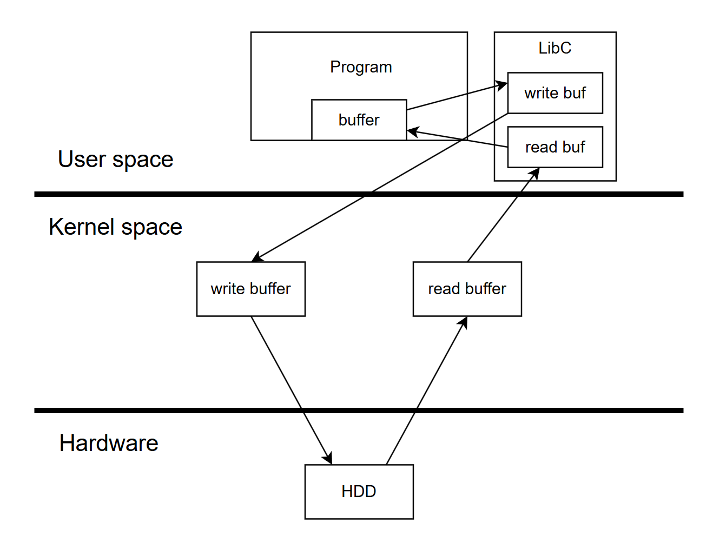

<!-- vscode-markdown-toc -->
* 1. [Файлы](#files)
* 2. [Kernel Space и User Space](#KernelSpaceUserSpace)
* 3. [Файловый ввод/вывод (FILE I/O)](#FILEIO)
* 4. [Функции](#file_io_funcs)
* 5. [Буферизированный ввод/вывод](#buf_io)
	* 5.1. [Текстовые файлы (text)](#text)
		* 5.1.1. [Открыть файл](#open_text)
		* 5.1.2. [Закрыть файл](#close_text)
		* 5.1.3. [Функции для чтения](#read_text)
		* 5.1.4. [Функции для записи](#write_text)
	* 5.2. [Бинарные файлы (binary)](#binary)
		* 5.2.1. [Открыть](#open_bin)
		* 5.2.2. [Закрыть](#close_bin)
		* 5.2.3. [Чтение](#read_bin)
		* 5.2.4. [Запись](#write_bin)
	* 5.3. [Функции для смещения каретки](#move)
	* 5.4. [Таблица режимов открытия файлов (буферизированный I/O)](#open_modes)

<!-- vscode-markdown-toc-config
	numbering=true
	autoSave=true
	/vscode-markdown-toc-config -->
<!-- /vscode-markdown-toc -->

##  1. <a name='files'></a>Файлы

Прежде чем пойдем к файлам неплохо будет копнуть глубже и понять пару вещей про ОС

##  2. <a name='KernelSpaceUserSpace'></a>Kernel Space и User Space

     

Кольца защиты — архитектура информационной безопасности и функциональной отказоустойчивости, реализующая аппаратное разделение системного и пользовательского уровней привилегий.    
https://en.wikipedia.org/wiki/Protection_ring      

В ОС есть разделение на области (кольца), в каждом из которых есть свой уровень привилегий для исполняемых программ. Самое внешнее кольцо - менее привилегированное, самое внутреннее наоборот. Самый высокий уровень привилегий у ядра. Реализуется в процессорах и ОС (процессор понимает с каким уровнем работает благодаря разным режимам)    
    
**Ядро́ (англ. kernel) ОС** — это центральная часть ОС, которая управляет основными ресурсами компьютера, такими как процессор, память и устройства ввода-вывода. Можно представить его как "посредника" между аппаратным обеспечением (железо) и программами, который обеспечивает их взаимодействие. Ядро отвечает за выполнение задач, таких как запуск программ, управление памятью, обработка запросов от устройств и многое другое.   

         
     
В современных ОС обычно используется две области - **kernel space и user space**. **Kernel space** - пространство ядра, а user space - пользовательское пространство.    

       

- **Kernel Space (пространство ядра)**:
   - Это область памяти, где выполняется код операционной системы и ядра, а также драйверы устройств.
   - В этом пространстве выполняются привилегированные операции, такие как управление памятью, управление процессами и взаимодействие с аппаратным обеспечением.
   - Программы, работающие в ядерном пространстве, имеют полный доступ ко всем ресурсам системы. Это означает, что ошибки в таком коде могут привести к сбоям всей системы (поможет перезапуск системы).

- **User Space (пространство пользователя)**:
   - Это область памяти, где выполняются пользовательские приложения и программы.
   - Программы в пространстве пользователя не имеют прямого доступа к аппаратному обеспечению и ресурсам системы. Они должны взаимодействовать с ядром через системные вызовы (syscall).
   - Это разделение повышает безопасность системы, т.к. сбой в программе не приводит к сбою ядра и всей ОС (не нужно перезапускать систему).    

Такое разделение позволяет изолировать пользовательские приложения от критически важного ядра операционной системы, что защищает систему от неисправностей и потенциальных угроз безопасности    

**Систе́мный вы́зов (англ. system call)** в программировании и вычислительной технике — обращение прикладной программы к ядру операционной системы для выполнения какой-либо операции.       

Важно понимать про системные вызовы:    
- Если мы захотим что-либо сделать с железом, например, записать в файл на жесткий диск, то мы должны это сделать через системный вызов, т.к. наша программа будет выполняться в user space и не имеет привилегий доступа к жесткому диску.         
- При исполнении системного вызова происходит переключение контекста - это процесс, при котором ОС меняет состояние выполнения программы с пользовательского уровня на уровень ядра или наоборот. Переключение контекста не самая быстрая вещь, особоенно если очень часто происходят, и по возможности кол-во системных вызовов стоит уменьшать для ускорения выполнения программ на CPU.    
- Системные вызовы - API ядра, т.е. это интерфейс из функций, позволяющий userland программам работать например с тем же железом (записать что-либо на HDD).

##  3. <a name='FILEIO'></a>Файловый ввод/вывод (FILE I/O)

       

На картинке можно увидить три уровня - железо, пространство ядра и пространство пользователя.    
Допустим у нас есть программа (program) с массивом buffer, из которого мы хотим что-то записать в файл. Для этого нам понадобиться вызвать функцию write() (это системный вызов), которая передаст наши данные дальше в ядро для записи на жесткий диск. Прежде чем данные попадут на жетский диск они попадут в драйвер виртуальной файловой системы (VFS), где будет выбрана файловая система (FS) в зависимости от того какая FS стоит на разделе HDD, это нужно для того чтобы пользователи, запускающие программы в user space, не задумывались о том какая файловая система работает на HDD. Просто вызываешь функцию write, а ядро все делает за тебя.       


Немного абстрагируемся от VFS и рассмотрим следующую картинку:    
    

Когда мы читаем данные из жесткого диска, то они сначала попадают в буфер ядра, а затем в буфер нашей программы. Тоесть происходит копирование. Тоже самое, но в другую сторону при записи на жесткий диск. Кажется что проще было бы записывать из нашей программы сразу в HDD, почему это работает так? Зачем этот промежуточный буфер?       

Ответ: 
- Для нас как для современных программистов важна скорость выполнения программ. И главная причина такой реализации промежуточного копирования заключается в медленной записи на HDD. Оперативка у нас сильно быстрее жесткого диска. И жесткий диск является узким местом (bottle neck - горлышко бутылки). Поэтому разработчики ядра Linux взяли и ввели промежуточный уровень - буфер в ядре, а код ядра выполняется в оперативной памяти. Отсюда получается так, что при попытке записать что-либо из нашей программы на жесткий диск мы делаем копирование ОЗУ - ОЗУ (из user в kernel пространство), а далее ядро переключается назад на выполнение нашей программы и набрав определенный буфер у себя более эффективно сольет его на жесткий диск в тот момент времени, в который посчитает нужным. Благодаря такой реализации наша программа не повиснет на записи на жесткий диск из-за ожидания жесткого диска.    
- Помимо этого в системе у нас много процессов и каждая хочет что-то писать/читать на жесткий диск. Ядро рулит этими записями, сортирует их как надо (чтобы сделать как можно меньше записей на жесткий диск) и в нужный момент времени когда ядро (диспетчер ввода/вывода) будет готов отложено от этих программ сделает все эти записи на жесткий диск
- На чтение промежуточный буфер - если наша программа считала с жесткого диска 100 байт, то вероятно через время еще 100 байт захочет считать. Ядро хитрое и читает из жесткого диска в свой буфер наперед.      

##  4. <a name='file_io_funcs'></a>Функции для работы с файловым I/O

    
```c
int open(const char *pathname, int flags);
int open(const char *pathname, int flags, mode_t mode);
int close(int fd);

ssize_t read(int fd, void *buf, size_t count);
ssize_t write(int fd, const void *buf, size_t count);
off_t lseek(int fd, off_t offset, int whence);

void sync(void);
```
- open - открыть файл, вернется файловый дескриптор (FD), где FD — это целое число, которое ОС использует для представления открытых файлов или других объектов ввода/вывода (например, сокетов, канала связи и т.д.)    
- close - закрыть файл
- read - чтение из файла
- write - запись в файл
- lseek - сместить каретку (указатель внутри файла на каком байте файла мы находимся)
- sync - слить данные из ядра на жесткий диск

##  5. <a name='buf_io'></a>Буферизированный ввод/вывод



Одного промежуточного буфера было мало людям и решили добавить второй - в Сишную библиотеку (которая в user space между прочим). Если вызывать функцию типа printf, то мы скопируем наш буфер в буфер библиотеки, оттуда потом копируется в буфер ядра и из буфера ядра уже диспетчером I/O сбрасывается на жесткий диск. При чтении весь путь наоборот.    

В файловом вводе/выводе все понятно, но здесь то зачем?        
 

Ответ: Копирование в ядро порождает переключение контекста из-за системного вызова, а переключение это не очень быстро происходит. Ну и теперь представим такой пример: У нас есть 1000 байт данных, которые хотим залить на жесткий диск, мы можем сделать запись сразу всех 1000 байт, а можем 1000 раз по 1 байту - от чего будет 1000 переходов в режим ядра и обратно..    

Отсюда может возникнуть вопрос какого размера должны данные для файлового I/O и буферизированного I/O, ответ здесь простой: если данных очень много, например какой-нибудь поток - видео, аудио и т.д. то используем буферизированный I/O, если данных немного и мы пишем/читаем крайне редко, то эффективней будет обычный файловый I/O, т.к. не будет лишнего копирования в буфер библиотеки user space.    

Вот кстати еще пример буферизации в реальной жизни: например смотрите видео на ютуб или еще где-то обращали внимание на серую и красные полосочки - серая полосочка это то, насколько скачано ваше видео (буферизировано), а красная насколько оно действительно обработано (проиграно). Таким образом буферизация крайне полезна при работе с видео/аудио и прочими стрим сервисами.      

    

Многие буферизированные I/O функции имеют букву f в имени, fwrite, fopen, fclose, fprintf и т.д. 
А теперь перейдем к примерам с функциями..   

В си обработка файлов делится на 2 типа - текстовый и бинарный.    
        

###  5.1. <a name='text'></a>Текстовые файлы (text)

####  5.1.1. <a name='open_text'></a>Открыть файл 
Для работы с файлами необходимо создать указатель на структуру типа FILE.   
```c
FILE *file;
```
Прежде чем читать/писать из файла нам необходимо его открыть функцией fopen();
```c
file = fopen("/tmp/my_file.txt", "r");
```
где fopen первым аргументом принимает строку - путь до файла, включая сам файл, а второй аргумент строка с буковками, означающими в каком режиме (mode) открыть файл.    
Все режимы открытия fopen читайте в мануале fopen (man fopen) либо см. табличку в самом низу этой доки.    

После попытки открыть файл всегда проверяйте получилось ли его открыть?
```c
if (file == NULL) {
    perror("Error opening file");
    exit(1);
}
```
Если файл не существует, то выдаст следующую строку на экран: 
```bash
Error opening file: No such file or directory
```

####  5.1.2. <a name='close_text'></a>Закрыть файл
```c
int fclose(FILE *stream);
```
- закрывает файл, где stream - это указатель на FILE, возвращенный fopen(). Если возвращен 0, то это означает, что операция закрытия выполнена успешно, а если EOF, то, значит, была ошибка    

EOF == End Of File.    

####  5.1.3. <a name='read_text'></a>Функции для чтения
```c
int fscanf(FILE *stream, const char *format, ...);
```
- эта функция использует форматированную строку и список переменных аргументов для вывода данных в файл, ф-ия подобна ф-ии scanf(), но перед форматом будет аргумент с указателем на FILE,

```c
char *fgets(char *s, int size, FILE *stream);
```
- Считывает всю строку из файла в str

```c
int fgetc(FILE *stream);
```
- Считывает один символ из файла и возвращает его


####  5.1.4. <a name='write_text'></a>Функции для записи
```c
int fprintf(FILE *stream, const char *format, ...);
```
- Подобно printf(), эта функция использует форматированную строку и список переменных аргументов для вывода данных в файл
  
```c
int fputs(const char *s, FILE *stream);
```
- Печатает всю строку файла и '\n' в конце

```c
int fputc(FILE *stream);
```
- Печатает один символ в файл
  
###  5.2. <a name='binary'></a>Бинарные файлы (binary)
####  5.2.1. <a name='open_bin'></a>Открыть
Все также через fopen, но добавляется буковка 'b' в режим открытия (см. мануал или таблицу снизу).

####  5.2.2. <a name='close_bin'></a>Закрыть
Все также как у текстовых файлов

####  5.2.3. <a name='read_bin'></a>Чтение
```c
size_t fread(void *ptr, size_t size, size_t nmemb, FILE *stream);
```
- Считывает указанные байты данных из двоичного файла

####  5.2.4. <a name='write_bin'></a>Запись
```c
size_t fwrite(void *ptr, size_t size, size_t nmemb, FILE *stream);
```
- Эта функция записывает указанное количество байтов в двоичный файл

###  5.3. <a name='move'></a>Функции для смещения каретки
```c
int fseek(FILE *stream, long offset, int whence);

long ftell(FILE *stream);
```
- fseek - перемещает каретку на offset с позиции whence (SEEK_END - конец файла, SEEK_SET - начало файла, SEEK_CUR - текущая позиция в файле)
- ftell - возвращает позицию в файле    

```c
void rewind(FILE *stream);
```
- Перемещает указатель (каретку) файла в самое его начало    

```c
int fflush(FILE *stream);
```
Функция, которая заставляет слить все данные из буфера библиотеки (user space) в буфер ядра (kernel space)


###  5.4. <a name='open_modes'></a>Таблица режимов открытия файлов (буферизированный I/O)
Если добавить букву 'b' к любому из режимов, то файл будет открываться в двоичном режиме (например rb, ab+, wb и т.д.)     
Таблица режимов открытия файла:    
<table><thead><tr><th><span><font style="vertical-align: inherit;"><font style="vertical-align: inherit;">Режимы открытия</font></font></span></th><th><span><font style="vertical-align: inherit;"><font style="vertical-align: inherit;">Описание</font></font></span></th></tr></thead><tbody><tr><td><b><strong><font style="vertical-align: inherit;"><font style="vertical-align: inherit;">r</font></font></strong></b></td><td><span><font style="vertical-align: inherit;"><font style="vertical-align: inherit;">Ищет файл. Если файл открыт успешно, fopen() загружает его в память и устанавливает указатель, указывающий на первый символ в нем. Если файл не может быть открыт, fopen() возвращает NULL.</font></font></span></td></tr><tr><td><b><strong><font style="vertical-align: inherit;"><font style="vertical-align: inherit;">w</font></font></strong></b></td><td><span><font style="vertical-align: inherit;"><font style="vertical-align: inherit;">Открыть для записи в текстовом режиме. Если файл существует, его содержимое перезаписывается. Если файл не существует, создается новый файл. Возвращает NULL, если невозможно открыть файл.</font></font></span></td></tr><tr><td><b><strong><font style="vertical-align: inherit;"><font style="vertical-align: inherit;">a</font></font></strong></b></td><td><span><font style="vertical-align: inherit;"><font style="vertical-align: inherit;">Ищет файл. Если файл открыт успешно, fopen() загружает его в память и устанавливает указатель, указывающий на последний символ в нем. Открывается только в режиме добавления. Если файл не существует, создается новый файл. Возвращает NULL, если файл не удалось открыть.</font></font></span></td></tr><tr><td><b><strong><font style="vertical-align: inherit;"><font style="vertical-align: inherit;">r+</font></font></strong></b></td><td><span><font style="vertical-align: inherit;"><font style="vertical-align: inherit;">Ищет файл. Он успешно открыт fopen() загружает его в память и устанавливает указатель, указывающий на первый символ в нем. Возвращает NULL, если файл не удалось открыть.</font></font></span></td></tr><tr><td><b><strong><font style="vertical-align: inherit;"><font style="vertical-align: inherit;">w+</font></font></strong></b></td><td><span><font style="vertical-align: inherit;"><font style="vertical-align: inherit;">Ищет файл. Если файл существует, его содержимое перезаписывается. Если файл не существует, создается новый файл. Возвращает NULL, если невозможно открыть файл.</font></font></span></td></tr><tr><td><b><strong><font style="vertical-align: inherit;"><font style="vertical-align: inherit;">a+</font></font></strong></b></td><td><span><font style="vertical-align: inherit;"><font style="vertical-align: inherit;">Ищет файл. Если файл открыт успешно, fopen() загружает его в память и устанавливает указатель, указывающий на последний символ в нем. Он открывает файл как в режиме чтения, так и в режиме добавления. Если файл не существует, создается новый файл. Возвращает NULL, если файл не удалось открыть.</font></font></span></td></tr></tbody></table>