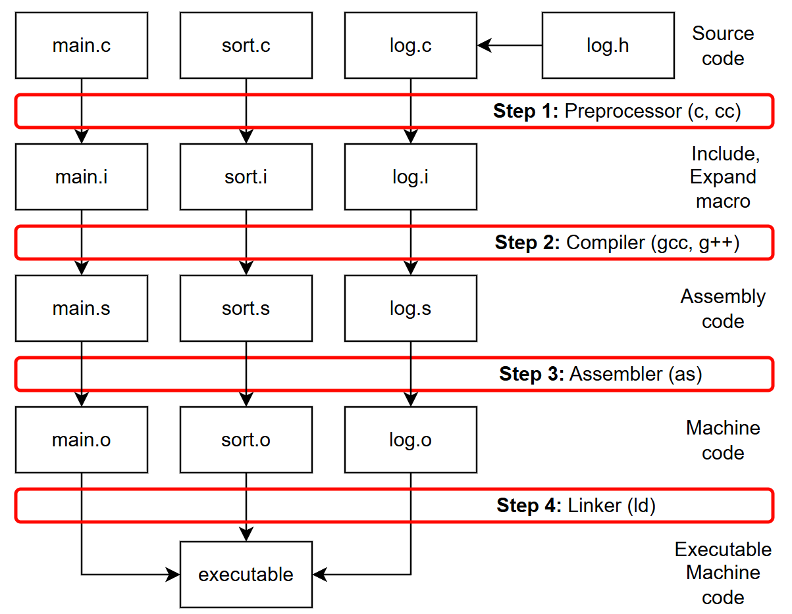
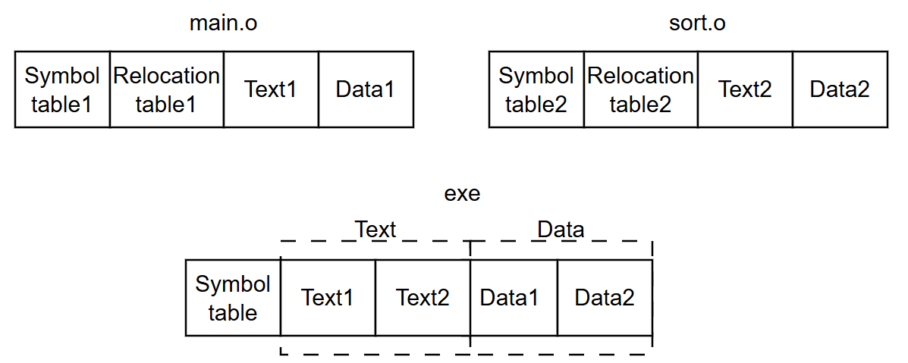
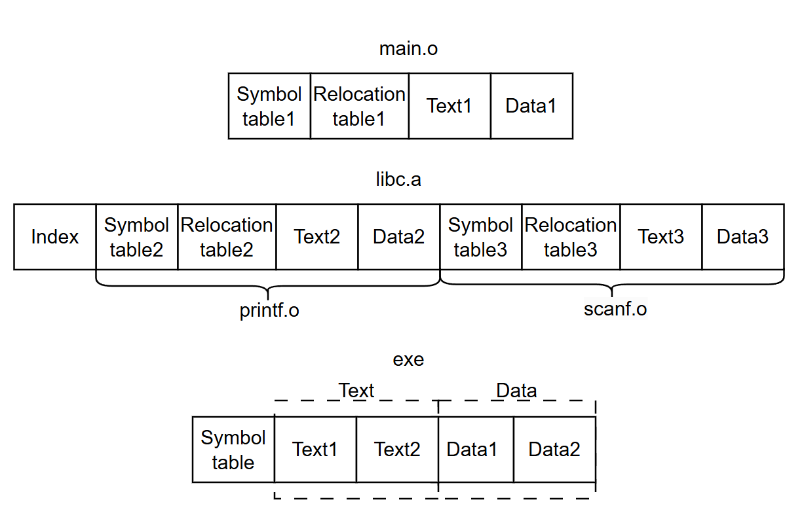

<!-- vscode-markdown-toc -->
* 1. [Библиотеки](#libraries)
	* 1.1. [Линковка объектных файлов](#object)
	* 1.2. [Статическая библиотека](#static)
	* 1.3. [Динамическая библиотека](#dynamic)
		* 1.3.1. [Подключение на горячую, плагин в фотошоп](#plugin)
		* 1.3.2. [Линковка динамической библиотеки](#dynamic_linking)
	* 1.4. [Сборка статической библиотеки](#build_static)
	* 1.5. [Сборка динамической библиотеки](#build_shared)
	* 1.6. [Версионирование библиотек в Linux](#Linux_version)
	* 1.7. [Компиляция и линковка библиотек в CMake](#CMake)

<!-- vscode-markdown-toc-config
	numbering=true
	autoSave=true
	/vscode-markdown-toc-config -->
<!-- /vscode-markdown-toc -->

[Шпаргалка по командам компиляции библиотек](https://github.com/kruffka/C-Programming/blob/master/2024-2025/libraries/README.md)

         

##  1. <a name='libraries'></a>Библиотеки

[Библиоте́ка](https://ru.wikipedia.org/wiki/%D0%91%D0%B8%D0%B1%D0%BB%D0%B8%D0%BE%D1%82%D0%B5%D0%BA%D0%B0_(%D0%BF%D1%80%D0%BE%D0%B3%D1%80%D0%B0%D0%BC%D0%BC%D0%B8%D1%80%D0%BE%D0%B2%D0%B0%D0%BD%D0%B8%D0%B5)) (от англ. library) в программировании — сборник подпрограмм или объектов, используемых для разработки программного обеспечения (ПО). С точки зрения операционной системы (ОС) и прикладного ПО, библиотеки разделяются на динамические и статические.    

Другими словами библиотека - это файл с кодом, содержащий функции, которые мы как разработчики будем вызывать в своем коде.    

Для интерпретируемых языков (python например) библиотека — файл, содержащий либо код на исходном языке (.py), либо байт-код для виртуальной машины. Пример библиотеки для Python - Tkinter, используя его API можно в своей программе сделать графический интерфейс     

Пример библиотеки компилируемых языков (Си например): стандартная Си библиотека с функцией printf(). Библиотеки содержат определение функций (то, что функции делают на самом деле), а в заголовочных файлах содержатся прототипы функций (объявление).   

И на самом деле когда мы в наш код добавляем include и <stdio.h>:
```c
#include <stdio.h>
//...
printf("hello, libraries\n");
```
то мы лишь вставляем в наш код содержимое из заголовочного файла stdio.h, который не содержит реализации функции printf, а содержит лишь ее заголовок (прототип). В /usr/include на Linux системах можно найти заголовочные файлы. stdio.h оттуда будет примерно с таким printf:
```c
extern int printf (const char *__restrict __format, ...);
```
Заголовочный файл нужен, чтобы компилятор и сам разработчик понимал с какими аргументами работает функция и что возвращает    

По умолчанию компилятор gcc линкует нас с библиотекой libc. Код printf в своей системе вы не найдете, нужно лезть в исходники библиотеки

Сама библиотека с кодом будет линковаться к нашей программе линковщиком (линковщик = компоновщик = редактор связей). Один из стандартный путей где лежат библиотеки в Linux системах /usr/lib/     

###  1.1. <a name='object'></a>Линковка объектных файлов

         

Как мы знаем компиляция нашего кода состоит из 4 шагов:    
  1) Обработка препроцессором, include - копирование содержимого из .h и .hpp файлов в .c и .cpp (.cc) файлы, define - и прочие директивы на этом этапе раскрываются
  2) Компиляция, компилятор преобразует исходный код в код на ассемблере (здесь синтаксический и прочие анализы), а также оптимизирует исходный код (флаги -g и -O0, -O1 и т.д.)
  3) Код из ассемблера транслируется в машинный код - код, который понимает процессор
  4) На этом этапе собираются все объектные файлы (.o) в один исполяемый файл    

Теперь чуть подробнее про 4 этап:    
    

Объектный файл получается после трансляции кода из ассемблера в машинный код. В таком коде нет переменных или функций, все заменяется на адреса. Такой код уже понимает процессор, но для запуска на ОС необходим следующий этап, т.к. ОС не знает по каким адресам что грузит, да и некоторые функции могут быть еще не определены (undefined).    
Объектный файл состоит из:
- **таблицы символов** - таблица с именами всех глобальных переменных и функций
- **таблицы релокаций** - адреса (указатели) на заглушки в коде куда нужно подставить адрес вызова undefined ф-ии когда мы найдем такую в других таблицах символов
- **секции text** - код самих функций
- **секции data** - глобальные (и static) инициализированные переменные

Получив объектные файлы из двух исходных линковщик (компоновщик/редактор связей) сделает следующее:       
**Секции data** всех объектных файлов поставит просто друг за другом, тоже самое с **секциями text**.     
Пройдется по таблицам символов и заполнит все недостающие вызовы функций адресами этих функций. Например в app.o вызывается ф-ия sort(), но в app.o нет определения функции sort(), однако ее определение есть в sort.o, линковщик увидит в таблице символов sort.o эту функцию и отдаст ее адрес в app.o.    

Посмотреть таблицу символов можно через команду на Linux и Mac 'nm', пример: 
```bash
nm app.o
```
при выводе будут разные буковки: буква D - секция Data, U - undefined, T - секция text.    

- Если функции нет в sort.c, тогда линковщик выдаст ошибку undefined reference to 'sort' и завершит свою работу, т.к. не смог найти код функции sort()    
- Если определение функции или две глобальных переменных с одним именем встречаются в нескольких объектных файлах, то линковщик также выдаст сообщение об ошибке: multiple definition of 'sort' и завершит работу с ошибкой   

Таблицы релокаций необходимы для запоминания мест где находятся заглушки для вызова функций - в коде на ассемблере для undefined ф-ий можно увидеть инструкцию call и нули (кол-во нулей зависит от разрядности системы). Когда символ нужной функции найдется, адрес этой функции встанет в код вместо нулей и будет инструкция call с адресом функции


###  1.2. <a name='static'></a>Статическая библиотека

Статическая библиотека - набор объектных файлов (архив) содержащий код функций. Стандартные библиотеки многих компилируемых языков программирования распространяются в виде объектных файлов    
  
Расширение у файла статической библиотеки на linux: .a на Windows: .lib   

Линкуется такая библиотека очень просто - ее содержимое просто добавляется в наш исполняемый файл:     

    

Индекс содержит список объектных файлов внутри библиотеки. Это позволяет линковщику быстрее находить необходимые символы и функции без необходимости извлекать каждый объектный файл.

Но есть один нюанс - добавляются лишь объектные файлы, функции из которых используются. Так например если в нашем коде используется лишь printf, но не scanf и остальные тысячи функций из libc, то ко мне в мой исполняемый файл добавится код объектного модуля printf. Если хочется добавлять только используемые функции, то есть специальные флаги для линковщика под это дело       

**Достоинства**:
- Все необходимые функции включаются в один исполняемый файл. Такую программу легко кому-то отдать и не нужно возиться с библиотеками и их путями

**Недостатки**:
- Исполняемый файл занимает больше места на диске и в памяти. Если запустим несколько таких программ, то у нас дублирование кода статической библиотеки
- При обнаружении ошибок в библиотеке требуется пересборка всей программы

Если **очень** хочется слинковать статической библиотекой (например libc) - используем флаг static.    

###  1.3. <a name='dynamic'></a>Динамическая библиотека

Динамическая библиотека - исполняемый файл, содержащий машинный код. Код функций из такой библиотеки не встраивается в наш код. Является исполняемым файлом и загружается в память загрузчиком программ ОС либо при запуске вашей программы, либо по запросу уже работающей программы

Если отдать бинарник слинкованный с такой библиотекой, то необходимо передать и саму библиотеку, чтобы она была загружена вместе с бинарником.    

Из-за этого и возникают все сложности при работе с дин. библиотеками для обывателя. Допустим бабуля вас попросит: **"Внучок, напиши мне программу"**. Вы ей напишите программу, скинете бинарник и библиотеки, а она получив много файлов ей придется с этими библиотеками возиться идти в определнные пути, думая куда и как их засунуть чтоб все заработало, т.е. не очень будет рада. А со статической библиотекой все просто - весь код включается в бинарник и вы бабуле отдаете один файлик и говорите: **"Бабуль, вот тебе файлик тыкни два раза и все заработает"**

        

Расширение у файла динамической библиотеки в UNIX .so (shared object), в Mac .dylib (dynamic library), а в Windows dll (dynamic link library)      

**Достоинства**:
- Экономия памяти за счёт использования одной библиотеки несколькими процессами, т.к. они разделяют библиотеку
- Возможность исправления ошибок (достаточно заменить файл библиотеки и перезапустить работающие программы) без изменения кода основной программы
- Подключение на горячую (плагины в фотошопе)

**Недостатки**:
- Возможность нарушения API — при внесении изменений в библиотеку существующие программы могут перестать работать (утратят совместимость по API);
- Конфликт версий динамических библиотек, — разные программы могут нуждаться в разных версиях библиотеки (опять API)
- Злоумышленник вместо вашей библиотеки может подсунуть вам свою библиотеку со своим кодом

**Таким образом, библиотеки имеют свои плюсы и минусы и нужно отталкиваться как и всегда от конкретных целей и задач.**      

####  1.3.1. <a name='plugin'></a>Подключение на горячую, плагин в фотошоп
         

При загрузке фотошопа появляется квадратик с загрузкой и там куча .dll загружается.        
Сам фотошоп имеет довольно скудный интерфейс, но благодаря плагинам интерфейс сильно расширяется. Плагин - дин. библиотека, которую разработчик специально оформил как библиотеку, т.е. разработчик продумал как загружать дин. библиотеку так, чтобы любой другой мог написать свою библиотеку с любым функционалом и добавить ее в программу. Отсюда выходит так что любой пользователь разобравшись как написать свой плагин - пишет свой плагин и обновляет код фотошопа. Таким образом, пользователь динамически меняет интерфейс программы, не перекомпилируя программу, достаточно просто перезапустить программу и все работает    

####  1.3.2. <a name='dynamic_linking'></a>Линковка динамической библиотеки

Если кратко, то динамическая линковка происходит во время выполнения программы:
1. Во время компиляции к исполняемому файлу добавляются ссылки на динамическую библиотеку. Когда программа запускается, операционная система загружает необходимые библиотеки в память
2. В некоторых случаях программисты могут использовать функции, такие как `dlopen()` (в Linux) или `LoadLibrary()` (в Windows), для явной загрузки библиотек во время выполнения, они же плагины (подробнее см. в гугле или в man)

Пример функций для Linux:
```c
#include <dlfcn.h>

void *dlopen(const char *filename, int flags);   
int dlclose(void *handler);   
char *dlerror(void);    
void *dlsym(void *handle, const char *symbol);    
```
При компиляции нужно добавить -ldl - ключ для линковщика  

Кому интересно системное программирование и хочется изучить более детально как происходит линковка динамических библиотек - идем читать в интернет или в книжках про **PIC (Position-independent code)** и таблицы **GOT, PLT** с **интересными примерами на ассемблере**.     

###  1.4. <a name='build_static'></a>Сборка статической библиотеки

```bash
gcc app.c -c
gcc log.c -c

ar rc libMY_LOG.a app.o log.o

gcc app.o -o static_exe -L. -lMY_LOG
./static_exe
```
где ar - команда для архивации, libMY_LOG.a - статическая библиотека, lib - префикс, MY_LOG - имя библиотеки, а .a расширение, у всех библиотек обязательно есть префикс lib и расширение    

Опции -L. -lMY_LOG нужны для линковщика, т.к. наша библиотека появится там, где ее собрали '.' - текущий каталог, а не в стандартных путях ОС (где ищет линковщик), то нам необходимо прописать путь до нее, -L - путь до каталога с библиотекой, -l имя библиотеки.     

Флаг --static бывает нужен если в этой же папке дин. библиотека с таким же именем. Компилятор по умолчанию выбирает динамическую библиотеку для линковки.     

Посмотреть таблицу символов:     
```bash
nm app.o 
nm log.o

nm libMY_LOG.a
nm prog
```

###  1.5. <a name='build_dynamic'></a>Сборка динамической библиотеки

```bash
gcc app.c -c
gcc log.c -c

gcc --shared app.o log.o -o libMY_LOG.so
```
Компиляцией дин. библиотеки занимается компилятор. lib - префикс, .so - расширение, а MY_LOG - имя библиотеки.       

Далее линковка и запуск

```bash
# -Wl - вызов линковщика, -rpath - путь где искать библиотеку, он вшит в исполняемый файл, '.' - искать в текущем каталоге
gcc app.o -o dynamic_exe -L. -lMY_LOG -Wl,-rpath,.
./prog

# Прописать в переменную окружения LD_LIBRARY_PATH путь до нашей дин. библиотеки ('.' - текущий каталог)
gcc app.o -o dynamic_exe -L. -lMY_LOG
LD_LIBRARY_PATH=. ./prog
```

Также есть переменная для линковщика позволяющая предзагрузить дин. библиотеку    
```bash
LD_PRELOAD=./libTESTLIB.so ./binary
```
Такой уловкой можно подменить слинкованную библиотеку на любую другую      

Посмотреть список слинкованных динамически библиотек - команда ldd, пример:
```bash
ldd *dynamic_exe*
```   

###  1.6. <a name='Linux_version'></a>Версионирование библиотек в Linux

1. **Мажорная версия (major)**: Изменяется, когда происходит несовместимое (breaking) изменение в API библиотеки. Код, который использует старую версию библиотеки, может не работать с новой.

2. **Минорная версия (minor)**: Изменяется, когда добавляются новые функции или улучшения, но изменения являются совместимыми с предыдущими версиями. Существующий код продолжит работать, даже если он не использует новые функции.

3. **Патч (patch)**: Изменяется для мелких исправлений и багфиксов, которые не влияют на API

Пример: в версии `4.2.3`:
- `4` - это мажорная версия
- `2` - это минорная версия
- `3` - это версия патча

Иногда еще можно встретить метку '-dev' - для разработки.

###  1.7. <a name='CMake'></a>Компиляция и линковка библиотек в CMake

Пример создания статической библиотеки MY_LOG из ${MY_LIB_SRC} и линковка этой библиотеки с my_program    
```cmake
add_library(MY_LOG STATIC ${MY_LIB_SRC})

target_link_libraries(my_program MY_LOG)
```

В add_library указывается слово STATIC для статический и SHARED для динамических.   

Пример с лекции:    
https://github.com/kruffka/C-Programming/blob/master/2024-2025/libraries/CMakeLists.txt

https://cmake.org/cmake/help/latest/guide/tutorial/Adding%20a%20Library.html        
https://cmake.org/cmake/help/latest/command/target_link_libraries.html#command:target_link_libraries      