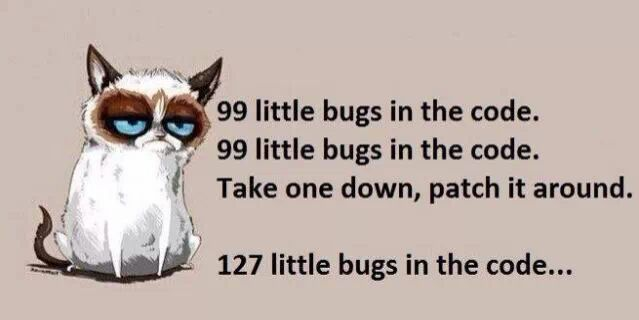

## Тестирование ПО (Software Testing)

### Жизненный цикл разработки ПО (SDLC)

**SDLC (Software Development Life Cycle)** — это процесс, которому следуют для создания программного обеспечения в организациях. SDLC состоит из некоторого плана, который описывает, как разрабатывать, поддерживать, заменять и улучшать программное обеспечение. И в идеальном мире выглядит следующим образом:      

На каждом бывают даже свои должности (разработчик, тестировщик ( QA-инженер), DevOps инженер, бизнес-аналитик, руководитель проекта, архитектор, тех. пис и т.д.)

* Этап 1: **Анализ требований**
    Перед тем как броситься в разработку нужно придумать что разрабатывать, это и есть самый первый этап. Если По уже придумано и мы уже не первый раз сюда попадаем, то обычно анализируют отзывы пользователей, требования к уже существующему ПО
* Этап 2: **Планирование**
    Далее нужно еще подумать (спланировать) реализацию без углубления в технические детали. Без планирования, бросившись сразу на решение задач можно потратить много времени просто так. Здесь думаем есть ли ресурсы на нашу идею, когда и кто будет делать
* Этап 3: **Дизайн/Проектирование архитектуры**
    Определяют дизайн/архитектуру ПО. Продумываются все компоненты ПО, т.к. их создание без наличия плана может привести с дорогостоящим исправлениям. Обычно здесь рисуют схемки, которые называются HLD (High Level Design) - схема с кратким описанием что и как и LLD (Low Level Design) - схема с деталями поглубже
* Этап 4: **Разработка продукта**
    Наконец-то кодинг - разработка, отладка и сборка ПО
* Этап 5: **Тестирование и интеграция продукта**
    ПО после разработки тестируется на ошибки и баги. Также здесь обычно тестируют ПО на известные уязвимости.  
* Этап 6: **Развертывание и обслуживание продуктов**
    Написание документации, развертывание у пользователей ПО, обслуживание

5 этап - есть этап тестирования ПО, по которому мы пробежимся в этой лекции

### Тестирование ПО

**Тестирование ПО** — это процесс проверки и подтверждения того, работает ли приложение так, как ожидалось, включает в себя выявление ошибок и неполадок, которые в будущем могут вызвать проблемы у пользователей приложения. Например, ПО с ошибками в самолетах/машинах и других средствах передвижения вряд ли приведут к чему-то хорошему. Много случаев в истории уже наблюдалось, такие ошибки приводят к финансовым или человеческим потерям (см. в гугле что-нибудь типа "software errors in history")    

Тестирование ПО разделяют на два типа:
- **Ручное тестирование (Manual)**
Ручное тестирование ПО - тестирование приложения ручками. Тестер напрямую взаимодействует с приложением и смотрит работает ли как надо. Если работает не как надо - есть баги, то заводит задачи на разработчиков. В любом случае дает фидбек (обратную связь)      
- **Автоматизированное тестирование (Automation)**
    Автоматизировать тестирование - значит написать код, в котором ожидаемые сценарии сравниваются с тем, что действительно получил пользователь. Простыми словами - тестировщик пишет код/скрипты, которые тестируют программу.

**Виды тестов**
https://www.atlassian.com/ru/continuous-delivery/software-testing/types-of-software-testing           

1. **Модульные тесты (Unit-тесты)**
Модульные тесты работают на очень низком уровне. Они заключаются в тестировании отдельных функций, компонентов или модулей, используемых в ПО. Модульные тесты обычно легковесны и выполняются быстро

1. **Интеграционные тесты (Integration)**
В ходе интеграционного тестирования проверяется, хорошо ли работают вместе различные модули, используемые приложением. Например, можно протестировать взаимодействие с базой данных. Этот вид тестирования является более затратным, поскольку для проведения тестов требуется запуск различных компонентов приложения

1. **Функциональные тесты (Functional)**
В функциональных тестах основное внимание уделяется бизнес-требованиям к приложению. Они проверяют только результат некоторого действия и не проверяют промежуточные состояния системы при выполнении этого действия.

Иногда возникает путаница между понятиями интеграционных и функциональных тестов, так как и те и другие требуют взаимодействия нескольких компонентов друг с другом. Разница в том, что интеграционный тест нужен просто чтобы убедиться, что вы можете отправлять запросы к базе данных, тогда как функциональный тест будет ожидать получения из базы данных определенного значения в соответствии с требованиями продукта.

4. **Сквозные тесты (End to End или E2E)**
Сквозное тестирование копирует поведение пользователя при работе с ПО в контексте всего приложения. Оно обеспечивает контроль того, что различные схемы действий пользователя работают должным образом. Сценарии могут быть как очень простыми (загрузка веб-страницы или вход в систему), так и гораздо более сложными (проверка почтовых уведомлений, онлайн-платежей и т. д.).

Сквозные тесты очень полезны, но их выполнение обходится довольно дорого, к тому же, когда они автоматизированы, такие тесты тяжело обслуживать. Рекомендуется иметь в наличии несколько основных сквозных тестов и активнее полагаться на более низкие уровни тестирования (модульные и интеграционные тесты), чтобы получать возможность быстро выявлять критические изменения.

5. **Приемочное тестирование (Acceptance)**
Приемочные тесты — это формальные тесты, которые проверяют, отвечает ли система требованиям бизнеса. При этом во время тестирования должно быть запущено само приложение, и основное внимание уделяется воспроизведению поведения пользователей. В ходе этого тестирования возможен даже замер производительности системы, и в случае несоответствия установленным требованиям внесенные изменения могут быть отклонены.

6. **Тестирование производительности (performance)**
В тестах производительности оценивается работа системы при определенной рабочей нагрузке. С помощью таких тестов можно оценить надежность, скорость, масштабируемость и отзывчивость приложения. Например, это может быть наблюдение за временем отклика при выполнении большого количества запросов или определение поведения системы при работе со значительными объемами данных. Этот вид тестирования позволяет определить, соответствует ли приложение требованиям к производительности, найти узкие места, оценить стабильность при пиковом трафике и многое другое.

7. **Smoke-тестирование**
Smoke-тесты — это базовые тесты, которые проверяют основные функциональные возможности приложения. Они должны выполняться быстро, поскольку цель таких тестов — убедиться, что основные возможности системы работают как запланировано.

Smoke-тесты полезно запускать сразу после создания новой сборки (для определения, можно ли запускать более ресурсоемкие тесты) или сразу после развертывания (чтобы убедиться, что приложение работает правильно в новой, только что развернутой среде).

### Фазы тестирования
Основные фазы тестирования (https://habr.com/ru/articles/549054/)

- **Pre-Alpha**: прототип, в котором всё ещё присутствует много ошибок и наверняка неполный функционал. Необходим для ознакомления с будущими возможностями программ.
- **Alpha**: является ранней версией программного продукта, тестирование которой проводится внутри фирмы-разработчика.
- **Beta**: практически готовый продукт, который разработан в первую очередь для тестирования конечными пользователями.
- **Release Candidate (RC)**: возможные ошибки в каждой из фичей уже устранены и разработчики выпускают версию на которой проводится регрессионное тестирование.
- **Release**: финальная версия программы, которая готова к использованию.

### Ура, программируем

python и не только

### Реальный пример тестов

TODO. Что-нибудь про докеры сказать, а лучше показать