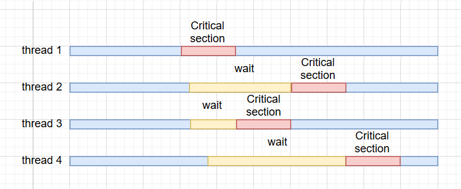

<!-- vscode-markdown-toc -->
* 1. [Процессы и потоки](#procs_and_threads)
	* 1.1. [Теория](#theory)
	* 1.2. [CPU и ядра](#CPU)
	* 1.3. [Pthread](#Pthread)
		* 1.3.1. [Первая многопоточная программа](#first)
		* 1.3.2. [Примитивы синхронизации](#syncho)
		* 1.3.3. [Снова к практике (считаем определённый интеграл)](#integration)
		* 1.3.4. [Атрибуты потоков и мьютексов](#attr)
		* 1.3.5. [Условные переменные cond_wait](#cond_wait)
	* 1.4. [Многопоточные паттерны](#patterns)
		* 1.4.1. [FIFO](#FIFO)
  		* 1.4.2. [Thread Pool](#ThreadPool)
	* 1.5. [Отладка многопоточных программ](#debug)
		* 1.5.1. [GDB](#GDB)
		* 1.5.2. [VSCode](#VSCode)
		* 1.5.3. [TSAN и прочие](#TSAN)
	* 1.6. [Стоит упомянуть](#Good_to_know)
		* 1.6.1. [Атомики](#atomics)
		* 1.6.2. [CPU Affinity](#CPUAffinity)
		* 1.6.3. [SIMD - векторные инструкции (AVX, SSE и их друзья)](#SIMD-AVXSSE)
		* 1.6.4. [lock-free алгоритмы](#lock-free)
	* 1.7. [Литература](#read)

<!-- vscode-markdown-toc-config
	numbering=true
	autoSave=true
	/vscode-markdown-toc-config -->
<!-- /vscode-markdown-toc -->

##  1. <a name='procs_and_threads'></a>Процессы и потоки   

         

**thread - поток - нить**    
###  1.1. <a name='theory'></a>Теория

Возьмем определение из вики:   
**Многопото́чность** (англ. **Multithreading**) — свойство платформы (например, операционной системы, виртуальной машины и т. д.) или приложения, состоящее в том, что процесс, порождённый в операционной системе, может состоять из нескольких потоков, выполняющихся «параллельно», то есть без предписанного порядка во времени. При выполнении некоторых задач такое разделение может достичь более эффективного использования ресурсов вычислительной машины.  

Многопоточность позволяет программе выполнять несколько задач одновременно. Например, когда вы используете веб-браузер: Один поток загружает содержимое веб-страницы (текст, изображения, видео), в то время как другой поток реагирует на ваши действия, такие как движение мыши или прокрутка страницы. Такая многозадачность делает браузер плавным и отзывчивым. Если потоки не используются, браузер может зависать и ждать завершения одной задачи, прежде чем приступить к следующей. Потоки обеспечивают плавность, скорость и отзывчивость работы программы.    

Здесь, пока далеко не ушли, следует вспомнить курс по ОС и понятие процесса, чтобы понимать разницу между процессом и потоком. **Описание и картинки ниже относятся конкретно к Linux, в других ОС реализация может отличаться, но смысл примерно тот же**         

**Процессы** — это программы, которые выполняются на CPU. Процесс требует больше времени для завершения и изолирован от других процессов, что означает, что он не разделяет с ними память.    

Процессы в Linux могут принимать следующие состояния:
  

- Running or Runnable (R)
- Uninterruptible Sleep (D)
- Interruptable Sleep (S)
- Stopped (T)
- Zombie (Z)

В общих чертах процесс состоит из:    

- Identifying information (e.g. process ID and user ID)
- Environment variables
- Working directory
- Program instructions
- CPU state (e.g. registers, fault info)
- Memory allocation (stack and heap)
- File descriptors
- Signal actions
- Shared libraries
- Inter-process communication related information (such as message queues, pipes, semaphores, or shared memory).
    
**Потоки** часто называют «легковесными процессами» (lightweight process), потому что они разделяют некоторые черты процессов, но меньше и быстрее. Каждый поток всегда является частью одного определенного процесса. Поток может находиться в следующих состояниях: Выполняется, Готов, Заблокирован, Сон.    
    
Как поток лежит внутри процесса:    

- Stack pointer
- Registers
- Scheduling properties (such as policy or priority)
- Set of pending and blocked signals
- Thread-specific data
   
Короче говоря процесс очень тяжелая штука и на самом деле это очень здоровенная структура данных и плодить кучу таких будет дорого для системы. Процессы между собой не разделяют память, у каждого она своя. У потоков наоборот, потоки разделяют между собой память т.к. находятся внутри одного процесса.    

Картинки про процессы и потоки на Linux отсюда     
https://hpc-tutorials.llnl.gov/posix/what_is_a_thread/        

Потоки существуют только в контексте процесса. Потоки могут порождать другие потоки и владеть ими, но владеть процессом они не смогут. Даже если вызвать 'fork()' из потока, вся власть над процессом будет у родительского процесса потока. Процессы могут порождать другие процессы с помощью функции **`fork()`**, которые известны как дочерние процессы. Родительский и дочерний процессы различаются по **PID (Process ID)**.

При создании процесса через fork по сути происходит клонирование родительского процесса со всеми его данными и такое копирование на самом деле затрано. Поэтому придумали хитрый метод **Copy-On-Write** (подробнее в гугле или [например тут](https://cpu.land/lets-talk-about-forks-and-cows)), который избегает этих расходов, будучи ленивым: Вместо того, чтобы копировать всю память сразу, он делает вид, что она была скопирована, и фактически копирует только тогда, когда родителю или потомку нужно хранить разные значения по одному и тому же адресу     

**Если вкратце в среде UNIX, то процесс — это выполняемая программа, тогда как поток:**
- Существует внутри процесса и использует ресурсы процесса
- Работает пока жив родительский поток
- Дублирует только основные ресурсы, которые ему нужны для независимого планирования, что делает его легким
- Может совместно использовать ресурсы процесса с другими потоками

**Поскольку потоки в одном процессе совместно используют ресурсы:**
- Изменения, внесенные одним потоком в общие системные ресурсы (например, закрытие файла), будут видны всем другим потокам
- Два указателя с одинаковым значением указывают на одни и те же данные
- Возможно чтение и запись в одни и те же области памяти, поэтому требуется явная синхронизация со стороны программиста     


###  1.2. <a name='CPU'></a>CPU и ядра


Все наши и не наши программы выполняются на процессоре. В современных реалиях везде используются многоядерные процессоры, т.е. процессоры содержащие 2 и более ядра на одном камне или в одном корпусе. Каждый из таких ядер может выполнять одновременно с другими выполнять задачи.    

Узнать количество ядер на нашей системе можно через командную строку (на любой OS) или диспетчер задач (на windows)    
Например в Linux можно через lscpu увидеть всю информацию о процессоре:
```bash
Architecture:             x86_64
  CPU op-mode(s):         32-bit, 64-bit
  Address sizes:          46 bits physical, 48 bits virtual
  Byte Order:             Little Endian
CPU(s):                   16
  On-line CPU(s) list:    0-15
Vendor ID:                GenuineIntel
  Model name:             12th Gen Intel(R) Core(TM) i5-12600K
    CPU family:           6
    Model:                151
    Thread(s) per core:   2
    Core(s) per socket:   8
    Socket(s):            1
    Stepping:             2
    BogoMIPS:             7372.79
    Flags:                sse sse2 sse4_1 .. avx ...
```    
В ней мы можем увидеть информацию об архитектуре процессора (x86_64 - x86 архитектура и 64 разрядная). Порядок байт - Little Endian. Количество процос (socket) = 1, количество ядер = 8, количество потоков на ядро = 2. Итого можно сказать, что одновременно процессор сможет потянуть 1*8*2 потоков со своими задачами. Но на практике конечно зависит от сценария. Физических ядер 8, т.е. это 8 ядер внутри одного CPU, которые что-то выполняют, логические ядра - не физические, их не существует, логические ядра придумала компания Intel, разработав технологию Гиперпоточности (Hyper-Threading или HT, у AMD процов аналог - SMT), если вкратце, то работает следующим образом: ядро хранит в себе состояние сразу двух потоков (регистры и т.д.) и для ОС это выглядит как два логических ядра. И таким образом если одно из логических ядер по той или иной причине находится в ожидании, второе логическое начинает работать, а также инструкции с обоих логических ядер могут перемешиваться и выполняться одновременно.    


     
В былые времена было лишь одно ядро. И чтобы ОС не зависала на выполнении одной программы инженеры подумали и реализовали следующее: процессоры выполняют очень-очень много инструкций за одну секунду и для человека будет незаметно если его программа не будет выполняться малую долю секунды, почему бы не взять и не разделить время выполнения программ на процессоре так, что каждой программе будет доставаться определенный кусочек времени процессора, т.е. проц будет очень быстро переключаться между потоками. Таким образом на одном ядре была достигнута "параллельность" выполнения. Современные процессоры выполняют миллиарды операций в секунду и такой подход все также остался с нами. Такой задачей занимается планировщик (scheduler, он же диспетчер задач) ОС. И в таком случае программы конкурируют за время процессора.        

Вообще тема процессоров довольно интересная:
Современные процессоры нереально сложная штука: необходимы очень нежные условия расположения завода, где из песка роботизированные машины месяцами работают над процессорами и очень большая часть из них после производства дефектные (80-95% дефектных для некоторых моделей у Intel).     

####

Когда рассказывают про параллельные вещи, то обычно также упоминают эти два термина:      
- **Конкурентность** - это выполнение задач за определённое время     


- **Параллелизм** - это одновременное выполнение нескольких действий     


###  1.3. <a name='Pthread'></a>Pthread

Для написания многопоточных программ мы с вами познакомимся с POSIX API, где  
**POSIX (Portable Operating System Interface)** — это семейство стандартов, определяющих общий набор API для Unix-подобных операционных систем (Ubuntu, MacOs и прочие). Для Windows есть свой API для потоков - Win API, отличаются функции, но смысл все тот же.    
Конкретно из POSIX нас интересует классическая библиотека для разработки многопоточных приложений - **pthread**. На Windows его тоже можно использовать если установить библиотеку pthread        

####  1.3.1. <a name='first'></a>Первая многопоточная программа

Заголовочный файл 
```c
#include <pthread.h>
```

Не забываем слинковать с библиотекой pthread: -lpthread    

Мануал: 
```bash
man pthreads
```

[Знакомимся с pthread](https://github.com/kruffka/C-Programming/blob/master/2024-2025/threads/src/hello_thread.c)

**pthread_create()** - создать поток. Порядок запуска потоков из pthread_create случайный - определяет диспетчер задач (планировщик). Функция не блокирующая     
**pthread_join()** - объединить две нити в одну как в этой замечательной картинке снизу из paint. Блокирующая функция     
    

[Передача аргументов и возврат из потока значения](https://github.com/kruffka/C-Programming/blob/master/2024-2025/threads/src/thread_arg.c)

[Одна из проблем с не внимательной передачей аргумента](https://github.com/kruffka/C-Programming/blob/master/2024-2025/threads/src/thread_arg2.c)


####  1.3.2. <a name='syncho'></a>Примитивы синхронизации

Начнем с классического мьютекса (Mutex = Mutual exclusion - взаимное исключение). Mutex (Мьютекс) - примитив синхронизации, обеспечивающий взаимное исключение исполнения критических участков кода. Мьютекс позволяет захватить разделяемый ресурс lock() и освободить с помощью unlock(). Мьютекс работает благодаря атомарным операциям.        

Операция в общей области памяти называется **атомарной**, если она завершается в один шаг относительно других потоков, имеющих доступ к этой памяти. Итого если несколько потоков одновременно попрубуют выполнить такую атомарную операцию, то **гарантированно** выполнится в один момент времени лишь одна из них. Реализуется эта штука на уровне процессора, т.е. в процессоре есть специальные атомарные инструкции.           

**Критическая секция** — участок исполняемого кода программы, в котором производится доступ к общему ресурсу, который не должен быть одновременно использован более чем одним потоком выполнения. При нахождении в критической секции двух потоков возникает состояние «гонки» (**race condition**), рассмотрим пример с целочисленной переменной value:        

```c
int value = 0;
void routine() {
  ++value;
}
```
Если эту функцию выполнять в двух потоках **одновременно** N-раз, то в результате мы не получим value = N+N, а будем получать каждый раз случайное число меньше N+N. [Пример гонки потоков на Си](https://github.com/kruffka/C-Programming/blob/master/2024-2025/threads/src/race_condition.c)       

Такая ситуация называется **гонка потоков (race condition)**. Почему оно возникает? Операция "переменная++" состоит из 3 итераций:
1. Прочитать значение переменной
2. Прибавить 1 к значению
3. Записать результат переменной

     

На картинке можно увидеть пошагово что не так слева направо по шагам. У нас на картинке есть общая переменная value, поток1 и поток2     
1. поток1 прочитал значение value (1)
2. поток1 прибавил 1 к значению value (2); поток2 прочитал значение value(1)
3. поток1 записал результат value (2) в память; поток2 прибавил 1 к значению value (2);
4. поток2 записал значение value(2) в память.    

Решается такая проблема с помощью примитивов синхронизации. [Пример с mutex](https://github.com/kruffka/C-Programming/blob/master/2024-2025/threads/src/slow_mutex.c)     

```c
pthread_mutex_lock(&mutex);
++value;
pthread_mutex_unlock(&mutex);
```

Каждое обращение к переменной value мы оборачиваем mutex_lock() и mutex_unlock(). Эти функции позволяют синхронизировать потоки - потоки будут выполнять строку ++value по очереди, т.е. не паралаллельно, а синхронно.    
Работает это довольно просто:
1) Поток1 попадает в lock()
2) Если lock() ни кем не занят, поток его занимает
3) Поток1 выполняет код критической секции. Все потоки, что попали на lock() ожидают
4) Поток1 завершил крит. секцию - разблокирует mutex. Следующий поток забирает lock()



Секция кода между lock() и unlock() называется **критической секцией**     
Любой другой поток при попытке зайти в mutex_lock() заблокируется если кто-то из потоков уже забрал ресурс и выполняет код в критической секции. Если два и более потоков одновременно попытаются занять ресурс (выполнить mutex lock), то лишь один из них зайдет в критическую секцию и начнет ее выполнять, а все остальные заблокируются на ожидании первого. Такое поведение гарантируется благодаря атомарным операциям внутри mutex lock() и unlock().            

Сам mutex необходимо инициализировать перед использованием, есть два способа:    
1) Функция 
```c
pthread_mutex_t mutex;
pthread_mutex_init(&mutex, NULL); // второй аргумент - атрибуты mutex
```
2) Статически инициализировать при объявлении: 
```c 
pthread_mutex_t mutex = PTHREAD_MUTEX_INITIALIZER;
```

Добавив mutex мы начнем каждый запуск получать правильный ответ и казалось бы все проблемы решены - просто к любой многопоточной программе добавляй mutex и забудь о гонках потоков, но не все так просто: если замерим время, то увидим, что время выполнения в разы ухудшилось.    

Отсюда напрашивается вывод, что последовательно в одном потоке выполнять код было бы быстрее чем при запуске его же параллельно и результат правильный получался всегда. Поэтому не всем задачам параллельность дает прирост скорости и с примитивами синхронизациями нужно быть осторожнее. Правильном ответом в данной задаче будет сложение равных частей параллельно, а затем последовательно сложить результаты параллельных вычислений в один; либо вовсе все вычисления делать последовательно. **Можно попробовать самостоятельно с помощью утилиты time перед запуском исполняемого файла: time ./mutex**          

Mutex - частный случай семафора, "двоичный семафор". Семафор - еще один примитив синхронизации. Мьютекс объекта может захватить одновременно только один поток, а в случае с семафором используется счетчик потоков, и доступ к ресурсу могут получить сразу несколько из них    

**Семафо́р** — примитив синхронизации работы процессов и потоков, в основе которого лежит счётчик, над которым можно производить две атомарные операции: увеличение и уменьшение значения на единицу, при этом операция уменьшения для нулевого значения счётчика является блокирующейся. Пример из реальной жизни    

Очередь в ресторане: в ресторане клиентам может потребоваться войти и одновременно сформировать очередь. Однако ресторан имеет определенную вместимость, и наличие слишком большого количества клиентов внутри может привести к длительному времени ожидания и затору. Для управления этой ситуацией можно использовать семафор.

Семафор подсчета, называемый «количество столов», представляет количество доступных столов в ресторане. Первоначально значение семафора устанавливается на основе вместимости ресторана (например, если есть 10 пустых столов, значение семафора может быть 10).
Когда клиент хочет войти в ресторан, проверяется наличие свободных столов (значение семафора). Если есть свободные столы, клиенту разрешается войти, а значение семафора уменьшается.
Если пустых столов нет (значение семафора равно 0), клиент не может войти и ему предлагается встать в очередь. Ожидающие клиенты ждут, пока значение семафора увеличится.

```c
#include <semaphore.h>
int sem_wait(sem_t *sem); // lock a semaphore
int sem_post(sem_t *sem); // unlock a semaphore
```

Кроме мьютексов и семафоров бывают еще спин локи (spin lock), rw lock, rcu lock и много-много других, которые подходят для своих задач.      

Спин-блокировка (spin) очень похожа на mutex, но отличается тем как происходит процесс ожидания разблокировки. Потоки при попадании в занятый mutex идут в сон, а Спин локи находятся в так называемом 'busy wait' - бесконечном цикле, который без перерыва на сон проверяет разблокировался ли ресурс или нет. **Использовать mutex следует для не малых критических секций, а spin lock для разделения очень маленьких критических секций**.      

rw lock - еще один вид блокировок, расшифровывается как read write lock, используется там где много потоков на чтение и несколько на запись. Т.к. читать из переменной не модифицируя ее потоки могут спокойно без критической секции, то нет необходимости блокировать потоки на чтение пока переменная остается не тронутой, но как только переменную хочет изменить поток на запись, перенная блокируется для всех и поток на запись ее изменяет. Это крайне эффективно когда запись происходит редко, а чтение постоянно и много. Например какая-нибудь база данных, читаем из нее данные мы обычно очень часто, а вот записываем пореже.      


rcu lock - еще один из примеров блокировок, но реализовать такой нереально сложно. Однако его суть проста:
rcu - Read Copy Update. Когда потоки читают переменную мы не блокируемся, но если какой-то поток решил поменять эту переменную, то мы создадим копию этой переменной и все новые потоки, что захотят ее прочитать будут обращаться к новой версии переменной, а старые потоки будут продолжать читать старую версию. И как только все потоки дочитают старую версию мы ее обновим на новую и все потоки будут работать теперь только с новой версией переменной. Вместо этой переменной в реальности может быть какая большая табличка данных, с которой работают все потоки, опять же для БД что-нибудь можно придумать. Главная сложность в реализации такого метода - необходимо иметь доступ к контекстам всех потоков и знать что они сейчас делают.    
Такой алгоритм относится к lock-free алгоритмам, т.к. по сути не блокирует наши потоки на ожидание.    


####  1.3.3. <a name='integration'></a>Снова к практике (считаем определённый интеграл)

Попробуем найти определённый интеграл с помощью одного из простейших методов численного интегрирования, но не самого точного - метода средних прямоугольников (в англоязычной литературе - midpoint rule).         

Из математики (надеюсь помним), что интеграл - это площадь фигуры под графиком некоторой функции f(x). Как раз таки площадь некоторой функции на определенном отрезке мы попытаемся найти. Спойлер: площадь этой фигуры будет равняться числу Пи, чтобы было с чем сравнить полученный результат.    

Кратко про метод прямоугольников (точнее средних прямоугольников). Отрезок, на котором мы будем искать площадь мы разобъем на N равных частей равных h. Затем для средних частей от h: x = h/2 вычислим значения функции (получим наш y - высоту прямоугольника). А далее все просто, площадь первого прямоугольника равна y1 * h, второго y2*h и т.д, где h - ширина прямоугольника (для всех одинакова), а yn - высота прямоугольника, а сумма площадей всех прямоугольников даст нам приближенное значение нашего интеграла. И чем больше таких прямоугольников мы сделаем (чем больше N), тем точнее мы посчитаем наш интеграл.     

      

[Оригинал картинки с очень простым объяснением отсюда](https://www.youtube.com/watch?v=hEuU8QPpVCc&ab_channel=%D0%92%D0%BB%D0%B0%D0%B4%D0%B8%D0%BC%D0%B8%D1%80%D0%A5%D1%83%D0%B4%D0%B5%D0%BD%D0%BA%D0%BE)      


Число Пи можно получить очень разными способами, мы попробуем через определенный [Гауссов интеграл](https://ru.wikipedia.org/wiki/%D0%93%D0%B0%D1%83%D1%81%D1%81%D0%BE%D0%B2_%D0%B8%D0%BD%D1%82%D0%B5%D0%B3%D1%80%D0%B0%D0%BB):       
      

**Далее предлагаю самостоятельно поразбираться с параллельными вычислениями**. Можно попробовать другие интегралы посчитать и с онлайн калькулятором сравнить. Либо выбрать один из любых других методов распараллеливания расчета числа Пи (Ряд Лейбница, определенные интегралы от 0 до 1 для f(x) = 4/(1 + x^2) и т.д.)          

[Код последовательный (пробуем самостоятельно распараллелить)](https://github.com/kruffka/C-Programming/blob/master/2024-2025/threads/src/pi/pi0.c)        

Параллелят вычисления обычно одним из следующих способов:
1. Разбить N элементов на обработку на количество обрабатываемых потоков таким образом, что N/число потоков элементов обрабатывает первый поток, второй берет следующие N/число потоков и т.д.      
        
2. Распределяем элементы на потоки циклически, т.е. сначала поток1, потом поток2, поток3 и т.д.   
     

**В случаях когда N не делится на цело на число потоков, оставшиеся элементы от остатка от деления до выполняются кем-то отдельно. Скажем было 10 элементов, а потоков 3, каждому из потоков можно выдать по 3 элемента, но остается еще один, который уйдет кому-то из потоков дополнительно**

[Параллельный код с гонкой потоков (пробуем самостоятельно решить c mutex)](https://github.com/kruffka/C-Programming/blob/master/2024-2025/threads/src/pi/pi1.c)     

[Пример параллельный кода ответ как решить гонку с помощью mutex (пробуем самостоятельно сделать без mutex)](https://github.com/kruffka/C-Programming/blob/master/2024-2025/threads/src/pi/pi2.c)     

####  1.3.4. <a name='attr'></a>Атрибуты потоков и мьютексов
Атрибуты pthread     

* Можно выбрать размер стека потока,
* Его приоритет выполнения (scheduling priority)
* Его алгоритм планирования (Scheduling policy) - тут есть разные планировщики (SCHED_FIFO, SCHED_RR, SCHED_OTHER)
* Можно его отдетачить от родительского потока и тогда родительскому потоку не нужно ожидать завершения этого потока с pthread_join (такое ожидание будет вечным, т.к. дочерний поток не вернет результат родительскому). Однако при завершении родительского процесса поток с таким атрибутом все равно будет завершен.     
```bash
man pthread_attr_init    
```

Атрибуты Mutex - Гуглим или также в мануал лезем   
```bash
man pthread_mutexattr_init 
```

Чаще всего встречается такой атрибут как тип мьютекса (deadlocking, deadlock-detecting, recursive, etc)   
Рекурсивный мьютекс позволяет захватывать один и тот же ресурс много раз без дедлока.    

Нет, это не игра такая, **это зависание потока намертво при попытке залочиться дважды** на одном и том же мьютексе. Так как зависает поток и скорее всего вся программа в его ожидании, то спасает лишь ребут программы..      


####  1.3.5. <a name='cond_wait'></a>Условные переменные cond_wait

Прикольная штука, постоянно часто можно встретить при реализации очередей между потоками..

```c
global:
	pthread_mutex_t mutex = PTHREAD_MUTEX_INITIALIZER;
	pthread_cond_t cond = PTHREAD_COND_INITIALIZER;

thread1:
    pthread_mutex_lock(&mutex);
    while (!condition)
        pthread_cond_wait(&cond, &mutex);
    // do something that requires holding the mutex and condition is true
    pthread_mutex_unlock(&mutex);

thread2:     
    pthread_mutex_lock(&mutex);    
    // do something that might make condition true    
    pthread_cond_signal(&cond); // или pthread_cond_broadcast
    pthread_mutex_unlock(&mutex);    
```


###  1.4. <a name='patterns'></a>Многопоточные паттерны
Какая-то картинка с запрещенных в РФ сайтах, но все же можно подчерпнуть пару полезных паттернов:     
     

* Producer Consumer паттерн – классический пример с очередью. Например есть клиенты (производители), каждый из них в случайное время производит запрос к серверам (потребителям). Очередь к серверам одна. Повар (producer) готовит – Курьер (consumer) забирает (fifo очередь)
* ThreadPool – набор потоков (пул), которые готовы решать задачи, поступающие из очереди. Например к нам поступают матрицы и нам необходимо посчитать от них обратную матрицу. Задача кладется в очередь тасков и потоки свободные эти задачки разбирают
* Futures and Promises паттерн относится к асинхронному  программированию. Пример: заказываем еду в ресторане и получаем чек (Future) – способ обменяться на еду. Пока еда готовится, мы делаем что-то ещё (в телефоне сидим). Когда блюдо будет готово (Promise – обещание выполнено), ты обменяешь чек на еду. "promise" - это то куда ИСПОЛНИТЕЛЬ положит результат, а "future" - это то откуда ПОТРЕБИТЕЛЬ заберет результат
* Barrier паттерн – останавливает все потоки на определенной фазе выполнения и дает им работать дальше когда все завершат работу. Пример: Игра начнется когда все игроки загрузятся
* Monitor Object – Единственный объект в системе, который синхронизирует получение доступов
* RW lock – читатели читают всегда пока писатель не пишет, а писатель может писать лишь когда читатели не читают

####  1.4.1. <a name='FIFO'></a>FIFO

[Пример с FIFO](https://github.com/kruffka/C-Programming/blob/master/2024-2025/threads/src/fifo.c)      

Самостоятельно можно попробовать реализовать не блокирующие версии FIFO: try_enqueue и try_dequeue 

####  1.4.2. <a name='ThreadPool'></a>Thread Pool
Бассейн потоков, он же тред пул: 
[Пример с Thread Pool](https://github.com/kruffka/C-Programming/blob/master/2024-2025/threads/src/tpool.c)        

В каком порядке забирать задачи потокам из пула? В примере LIFO, однако можно по всякому, например по приоритетам, FIFO и т.д.    
Распределять задачи по потокам тоже можно по всякому.. например что-то типа Round Robin, т.е. каждый поток по очереди берет задачку и решает           

###  1.5. <a name='debug'></a>Отладка многопоточных программ

Собираем по классике с опцией -g, по желанию с/без оптимизациями (-O)     
Рассмотрим на примере [tpool.c](https://github.com/kruffka/C-Programming/blob/master/2024-2025/threads/src/tpool.c)        

```bash
gcc tpool.c -g
```

Все остальное как и однопоточных программ, но пару незначительных отличий:    
* При выполнении команд step и next не только наш поток выполняет действия 
* Если у нас стоит где-то breakpoint, то когда кто-то из потоков на него наткнется, отладчик переключится на этот поток

Чтобы step и next работал ТОЛЬКО в том потоке, в котором мы находимся, можно сделать такое:
```bash
set scheduler-locking step
```

####  1.5.1. <a name='GDB'></a>GDB

Отладка в консоли:     
Поставим точку останова (breakpoint), например, в 173 строке (перед enqueue_task()) и запустимся       
```bash
gdb ./a.out

br 173

run
```     
Breakpoint 1 at 0x18e9: file tpool.c, line 173.     
    
        

Попробуем вывести информацию о всех текущих потоках:     

```bash
info threads
```
      

Увидим кучу информации обо всех потоках, LWP здесь - light weight process (легковесный процесс). У каждого из потоков есть свой стек вызовов и свой id. Под звездочкой обозначен поток, на котором мы сейчас остановились в отладчике.        

Для переключения между потоками можно использовать след. команду:
```bash
thread <THREAD_ID>
```
где <THREAD_ID> - порядковый айди треда из первой колонки     

С помощью backtrace команды можно поглядеть стек вызовов функций у потока. Прям видно будет ф-ии, которые создали наш поток (clone() и start_thread(), а затем идут наши функции).       
       

####  1.5.2. <a name='VSCode'></a>VSCode

Создадим конфиг файл как обычно, а затем поставим breakpoint, например, в 173 строке (перед enqueue_task()) и запустимся       


Слева в CALL STACK увидим стек вызовов для всех потоков. Мышкой свободно можно перемещаться по этим потокам и их стеку.      


Команды step/next здесь:      


####  1.5.3. <a name='TSAN'></a>TSAN и прочие
Для C/C++ есть ThreadSanitizer - это как ASan, что с памятью и утечками, но по потокам (TSan коротко). Для других ЯП также можно найти подобные - просто гуглим их     

Помогает обнаружить гонку потоков      

###  1.6. <a name='Good_to_know'></a>Стоит упомянуть

     

####  1.6.1. <a name='atomics'></a>Атомики

Атомики в Си полезны для простых сценариев (счётчики, флаги), но не заменяют полноценные примитивы синхронизации в сложных ситуациях, т.к. могут делать лишь простые вещи (сложение, сравнение)       

[Пример переменной Atomic (работает с C11)](https://github.com/kruffka/C-Programming/blob/master/2024-2025/threads/src/atomic_var.c)        

Также с ними бывает легко запутаться, например:      
```c
_Atomic uint32_t atomic_counter = 0;
//...
atomic_counter++; // все ок, атомарно будет
atomic_counter = atomic_counter + 1; // будет гонка потоков, атомарность не сработает
```

Из плюсов атомики будут быстрее в **некоторых сценариях**.     
С атомиками легко ошибиться (проблема ABA - классическая проблема в lock-free). Поэтому проще и лучше всегда сначала использовать mutex, а на атомики уже переходить когда с mutex все работает и есть время, нужда и вообще алгоритм переносим на атомики       

####  1.6.2. <a name='CPUAffinity'></a>CPU Affinity

Код потоков при выполнении обычно скачет между ядрами процессора. Однако потоки можно привязать к конкретному ядру и называется это Affinity.    

Бывает иногда важно сказать ОС, чтобы она не использовала какое-то ядро, а нашей программе наоборот, чтобы утилизировала (занимала) под себя все ядро        

Удобно для оптимизации, т.к. наглядно видно сколько % CPU времени занимает ваша программа    

####  1.6.3. <a name='SIMD-AVXSSE'></a>SIMD - векторные инструкции (AVX, SSE и их друзья)

Про это тоже хочется пару слов вставить. Есть у нас в процессоре еще один метод распараллеливания инструкций - это векторные инструкции.     
Такие инструкции позволяют выполнить несколько операций одинаковых за один такт. Например:     
Мы работаем с чем-то где есть вектора и вместо того чтобы в цикле работать с каждым элементов массива по отдельности, мы работаем с 8 (например) элементами сразу за раз. Достигается это за счет использования специальных векторных инструкций в процессоре. Инструкции на каждом процессоре опять же разные, могли слышать про такие на x86: SSE, SSE4, AVX, AVX512 и кучу прочих, а на arm NEON       

       

```bash
cat /proc/cpuinfo | grep avx
```
     
Такие инструкции в обязательно порядке используются при написании кода, который постоянно работает с векторами данных и очень-очень важна скорость работы    

Intel x86 дока с такими инструкциями (интринсики):      
https://www.intel.com/content/www/us/en/docs/intrinsics-guide/index.html       

####  1.6.4. <a name='lock-free'></a>lock-free алгоритмы

Также же стоит сказать пару слов о таком виде программирования как lock-free, оно же без блокировок. Отдельный вид искусства в программировании, который не просто довольно сложно написать, но и довольно сложно осмыслить.    


Lock-free методы - методы работы с потоками, которые разделяют общую память, но не блокируют друг друга ради получения ресурса и имеют не попадают в состояние гонки          
Такие lock-free алгоритмы подходят для некоторых видов задач, часто основаны на атомарных операциях и барьерах, которые предотвращают переупорядочивание инструкций на уровне компилятора и процессора. Компиляторы как и процессоры таким любят заниматься ради ускорения наших программ.      
На нашем курсе мы с ними работать не будем, но упомянуть их стоит. О таких алгоритмах можно найти в интернетах и книжках по параллельному программированию (ссылки будут в конце).    

###  1.7. <a name='read'></a>Литература

1. Blaise Barney. POSIX Threads Programming // https://computing.llnl.gov/tutorials/pthreads
2.  Maurice Herlihy, Nir Shavit. The Art of Multiprocessor Programming. – Morgan Kaufmann, 2008. – 528 p
3. Эндрюс Г.Р. Основы многопоточного, параллельного и распределенного программирования. – М.:
Вильямс, 2003. – 512 с.
4. «Экстремальный Cи. Параллелизм, ООП и продвинутые возможности»
5.  Darryl Gove. Multicore Application Programming: for Windows, Linux, and Oracle Solaris. – Addison-Wesley, – 480 p.
6. Спросить вашего любимого китайского кореша объяснить. А также на видеохостингах очень много неплохих объяснений