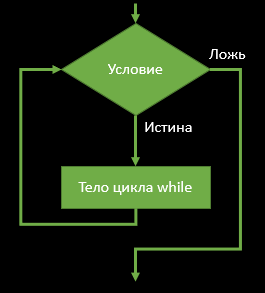
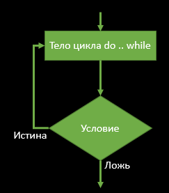
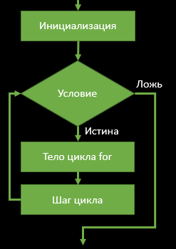
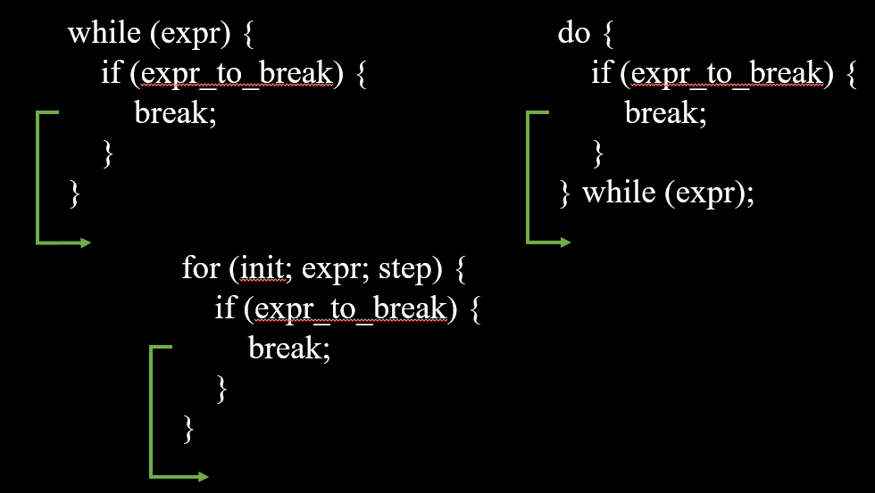

<!-- vscode-markdown-toc -->
* 1. [Loops](#1)
	* 1.1. [while](#1.1)
	* 1.2. [do/while](#1.2)
	* 1.3. [for](#1.3)
		* 1.3.1. [for variations](#1.3.1)
	* 1.4. [break/continue](#1.4)
		* 1.4.1. [break](#1.4.1)
		* 1.4.2. [continue](#1.4.2)
* 2. [Nested loops](#2)
	* 2.1. [break/continue](#2.1)
* 3. [loop unroll](#3)

<!-- vscode-markdown-toc-config
	numbering=true
	autoSave=true
	/vscode-markdown-toc-config -->
<!-- /vscode-markdown-toc -->


# Loops

Циклы (loops) позволяют выполнять инструкцию столько раз сколько попросим     

               

##  1. <a name='1'></a>Loops

Циклы позволяют сократить количество кода и время на программирование, а также делают код более читаемым         
В программирование обычно можно встретить циклы **for** и **while**. В языке Си помимо них еще есть **do/while**                  


###  1.1. <a name='1.1'></a>while

**Цикл while (пока)** - проверяем условие и если оно истинно, то выполняем код внутри блока цикла. Такой цикл называют еще **цикл с предусловием**, т.к. сначала проверяем условие. Блок-схема работы цикла while:            
       

Синтаксис цикла while на языке Си следующий:                                    
```c
while (condition) {
  // code block to be executed
}
```
                 
Давайте попробуем **три** раза мяукнуть на экран (полный пример [while.c](https://github.com/kruffka/C-Programming/blob/2025-2026/2_loops/src/while.c)):

```c
int i = 0;
while (i < 3) {
  printf("meow\n");
  i = i + 1; // или i += 1 или i++ или ++i
}
```
- Объявляем переменную, которая будет выполнять роль счетчика - по ней будем понимать количество мяу на экране. Обязательно зануляем (изначально 0 раз выполнено)
1. while (i < 3) -  На этом шаге проверяем i < 3. Пока i < 3 делаем что-то внутри {}.
  2. Печатаем meow на экран
  3. Прибавляем 1 к счетчику i
  4. Возвращаемся к п.1


**Интересно:** Почему мы используем букву i в качестве имени переменной? Это **переменная-счётчик** и её часто выбирают в простых циклах, потому что она короткая и по классике обозначает **индекс** или **итератор**.           

**Важно:** Сочетание клавиш **CTRL+C** позволяет остановить программу, особенно полезно если у вас случился бесконечный цикл (например while(1))              


###  1.2. <a name='1.2'></a>do/while

Еще один вариант **while**, но в отличие от while сначала делаем действия, а затем проверяем условие цикла (**цикл с постусловием**). Блок-схема:        

          

Синтаксис цикла do-while на языке Си следующий:                                    
```c
do {
  // code block to be executed
} while (condition);
```

**Когда может понадобиться?** Когда в любом случае нужно выполнить код **хотя бы один раз**, полезно бывает когда хочется сначала сделать, а потом проверить что сделали, например в [do_while.c](https://github.com/kruffka/C-Programming/blob/2025-2026/2_loops/src/do_while.c) мы просим пользователя ввести положительное число, а затем проверяем ввод пользователя на корректность.             

```c
int number = -1;
do {
    printf("Enter a positive number\n");
    scanf("%d", &number);
} while(number > 0);
```


###  1.3. <a name='1.3'></a>for

Цикл, который позволяет делать сразу все вещи, которые обычно присущи циклам: инициализация; условие выхода из цикла; шаг цикла. Блок-схема:       
            

Синтаксис для Си следующий:        

```c
for (s1; s2; s3) { 
    // code block to be executed
}
```
- s1 – блок инициализации
- s2 – логическое выражение
- s3 – шаг цикла

Живой пример [for.c](https://github.com/kruffka/C-Programming/blob/2025-2026/2_loops/src/for.c)     

```c
for (int i = 0; i < 5; i++) {
	printf("%d ", i);
}
printf("\n");
```
1. В блоке инициализации объявляем i и сразу зануляем              
2. Проверяем условие i < 5           
   21.  Выводим значение i и пробел            
   22. Прибавляем 1 к i (шаг 1)        
   23. Возвращаемся к п.2        

**Важно:** i можно использовать только внутри цикла, т.к. объявили ее в for. Если объявить перед for, то переменная i будет доступна и в икле for и после цикла for:
```c
int i;
for (i = 0; i < 5; i++) {
	printf("%d ", i);
}
printf("\n");
```

####  1.3.1. <a name='1.3.1'></a>for variations

В цикле for все блоки опциональны и их можно оставить пустыми:     
```c  
1. for (s1; s2; s3) { ... }
2. for (; s2; s3) { ... }
3. for (s1;; s3) { ... }
4. for (s1; s2;) { ... }
5. for (; s2;) { ... }
6. for (s1;;) { ... }
7. for (;; s3) { ... }
8. for (;;) { ... }
```
Но тогда эти блоки необходимо разместить где-то до или в for если не хотим получить бесконечный цикл.       

###  1.4. <a name='1.4'></a>break/continue

Во всех циклах можно использовать операторы **break** (сломать/остановить) или **continue** (продолжить)

####  1.4.1. <a name='1.4.1'></a>break

С помощью break и какого-нибудь условия мы можем остановить цикл раньше условия выхода самого цикла.            



Пример [break.c](https://github.com/kruffka/C-Programming/blob/2025-2026/2_loops/src/break.c) с циклом while:        
```c
int i = 0;
while (i < 10) {
    printf("i = %d\n", i);

    if (i == 4) {
        break;
    }
    i++;
}            
```

На экран выведется:
```bash
i = 0
i = 1
i = 2
i = 3
i = 4
```
А затем цикл остановит свою работу, т.к. мы попали на break при i == 4.           

####  1.4.2. <a name='1.4.2'></a>continue

Если попадается инструкция **continue**, то мы сразу прыгаем на следующую **итерацию цикла** и проверку **условия выхода**.         

Обычно его используют для пропуска **итерации цикла**, например [continue.c](https://github.com/kruffka/C-Programming/blob/2025-2026/2_loops/src/continue.c) и цикл for:         

```c
for (int i = 0; i < 10; i++) {
    if (i == 4) {
        continue;
    }
    printf("%d\n", i);
}
```
В выводе мы увидем все числа кроме 4, т.к. на пятой итерации (i = 4) мы пропустим printf()


##  2. <a name='2'></a>Nested loops

**Nested (вложенный)** - в программировании можно использовать циклы внутри циклов, так например, мы можем вывести таблицу умножения (3x3) [nested.c](https://github.com/kruffka/C-Programming/blob/2025-2026/2_loops/src/nested.c):

```c
for (int i = 1; i <= 3; i++) { // Внешний
    for (int j = 1; j <= 3; j++) { // Внутренний
        printf("%d ", i * j);
    }
    printf("\n");
}
```

Цикл по i - здесь будет **внешним (outer)** циклом, цикл по j **внутренним (inner)**. Результат:        
```bash
1 2 3
2 4 6
3 6 9
```

**Самостоятельно:** Поменять число итераций в j так, чтобы с каждой новой строкой i выполнялось на одну итерацию меньше, чтобы получился треугольник из цифр

###  2.1. <a name='2.1'></a>break/continue

**break/continue** во вложенных циклах применяются **ИМЕННО** к тому циклу, **который их вызвал**. Если их вызывает какой-либо **внутренний** цикл, то именно этот **внутренний** цикл совершит **break/continue**, а все остальные циклы нет                                   

**continue** здесь будет будет применим только для внутреннего цикла for
```c
for (s11; s12; s13) {
    for (s21; s22; s23) {
        continue;
        // ...
    }
}
```

**break** здесь сломает именно внешний цикл после выполнения внутренненого, т.е. внешний цикл выполнится лишь 1 раз.             
```c
for (s11; s12; s13) {
    for (s21; s22; s23) {
        // ...
    }
    break;
}
```

##  3. <a name='3'></a>loop unroll

**Самостоятельно:** Посчитать количество инструкций следующего for:
```c
for (int i = 1; i <= 10; i++) {
    a = a + i; // Считаем за одну
}
```

<details>               
<summary>Ответ</summary>    
- Всего инструкций: 32            
   - i = 1: 1               
   - i <= 10: 11              
   - i++: 10            
   - a=a+i: 10                
</details>                  

**Самостоятельно:** Посчитать количество инструкций для этого for:
```c
for (int i = 1; i <= 5; i++) {
    a = a + i; // Считаем за одну
    a = a + (5 + i); // Считаем за одну
}
```

<details>               
<summary>Ответ</summary>    
Всего инструкций 1 + 6 + 5 + 10 = 22           
</details>   

Таким образом, мы сократили количество инструкций, которое будет выполнять процессор почти на 1/3. Мы могли бы "развернуть" цикл еще больше, сделав сравнений в 4 раза меньше и т.д..
           
Называется все это дело **loop unrolling (разворачивание циклов)**. Оно позволяет оптимизировать работу циклов за счет уменьшения числа инструкций сравнения, которые есть во всех циклах.                   

**Важно:** loop unroll лучше всего использовать когда в цикле **достаточно много итераций** и сам блок цикла возможно развернуть, обычно по возможности это делает за нас компилятор на этапе оптимизаций. Нет смысла выворачивать каждый цикл, что мы пишем, т.к. это только будет ухудшать читаемость кода.             