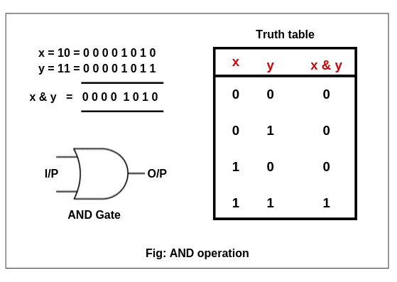
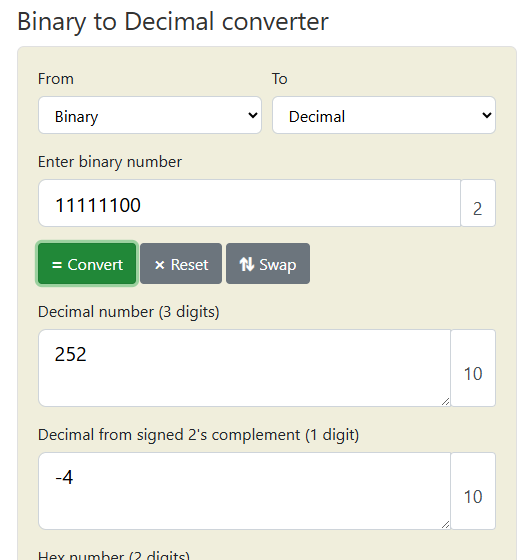

<!-- vscode-markdown-toc -->
* 1. [Зачем?](#1)
* 2. [printf bin?](#2)
* 3. [Битовые операторы](#3)
	* 3.1. [Побитовое И "&"](#3.1)
	* 3.2. [Побитовое ИЛИ "|"](#3.2)
	* 3.3. [Исключающее ИЛИ (XOR) "^"](#3.3)
	* 3.4. [Отрицание "~"](#3.4)
	* 3.5. [Побитовые сдвиги ">>", "<<"](#3.5)
	* 3.6. [Побитовые хитрости и формулы](#3.6)
		* 3.6.1. [Умножение и деление на 2](#3.6.1)
		* 3.6.2. [Получение конкретного байта](#3.6.2)
		* 3.6.3. [Получение конкретного бита](#3.6.3)
* 4. [printf bin](#4)

<!-- vscode-markdown-toc-config
	numbering=true
	autoSave=true
	/vscode-markdown-toc-config -->
<!-- /vscode-markdown-toc -->

# Bitwise operations

**Битовые операции**                     
               

##  1. <a name='1'></a>Зачем?

Зачем нам нужны битовые операции?               
**Во-первых**, тип данных с минимальным размером, с которым можно работать, это **char (1 байт)**, а для работы с чем-то поменьше (битами) необходимо использовать **битовые операции**. Работать с битами приходится программам, например, которые открывают нам картинки с котиками, т.к. в самих картинках содержится некоторая **метаинформация** (**информация об информации**), что нужна для программ, или например **IP пакет** из сети, который доставил нам эту картинку, он также использует **отдельные биты в своем заголовке**, ну и всякие разные алгоритмы шифрования.         

IP-пакет:             
                

**Во-вторых**, битовые операции работают **быстрее** арифметических (деление и умножение). Современные компиляторы по возможности заменяют арифметику на битовые операции ради оптимизации нашего кода.              

**Важно:** то, что битовые операции шустрее некоторых арифметических, они могут поломать читаемость кода, поэтому **не стоит их вставлять повсюду**                       

##  2. <a name='2'></a>printf bin?

В Языке Си можно задавать значения переменных с помощью приставок:
- **без приставки**: decimal (десятичная)
- **0x** - hexademical (шестнадатеричная)
- **0** - octal (восьмеричная)
- **0b** - binary (двоичная)
  
А также выводить следующие значения в printf:
- **%d** - dec
- **%x** - hex
- **%o** - oct

Например число 123 в различных система счисления:
```c
char dec = 123;
char hex = 0x7b; // или 0x7B
char oct = 0173;
char bin = 0b1111011;

printf("%d == %d == %d == %d", dec, hex, oct, bin);
printf("%d == %x == %o == ?", dec, hex, oct);
```

**Однако для binary в printf нет своего формата**           

Чтобы вывести в printf число в двоичном виде необходимо **использовать битовые** операции                   

##  3. <a name='3'></a>Битовые операторы

В языке Си существуют следующие битовые операторы:    
- `&` - побитовое **И**
- `|` - побитовое **ИЛИ**
- `>>`, `<<` - побитовый **сдвиг вправо** и **влево** (shift)
- `~` - побитовое **отрицание**
- `^` - **XOR (исключающее ИЛИ)**

**Важно:** не путать один символ `&` - **побитовое И**, а два символа `&&` - это уже **логическое И**, тоже самое с ИЛИ                     

Полный пример со всеми побитовыми операциями в [bitwise_ops.c](https://github.com/kruffka/C-Programming/blob/2025-2026/3_bitwise_ops/src/bitwise_ops.c)                 

###  3.1. <a name='3.1'></a>Побитовое И "&"

Таблица истинности для И:                
| a | b | & |
|---|---|---|
| 0 | 0 | 0 |
| 1 | 0 | 0 |
| 0 | 1 | 0 |
| 1 | 1 | 1 |

Попробуем посчитать 3 & 7, в качестве типа данных возьмем char (размер char = 1 байт)            
```c
char a = 3, b = 7;
char c = a & b;
```
a = 3 в dec = 00000011 в bin               
b = 7 в dec = 00000111 в bin              

Теперь возьмем двоичное представление a и b и запишем в столбик
```
a    00000011            
b    00000111            
&    ????????
```
Для вычисления a & b необходимо брать биты a и b и согласно **таблице истинности для &** вычислять результирующий бит.              
Начнем справа налево:           
- 1 в a и 1 в b по таблице дают 1, следовательно запишем 1 в младший бит результата
- 1 в a и 1 в b снова 1
- 0 в a и 1 в b даст 0
- далее везде 0 дадут только 0

В результате получим a & b = 00000011:           

```
a    00000011            
b    00000111            
&    00000011
```
где 00000011 = 3 в десятичной системе счисления.       

**Самостоятельно:** a = 17, b = 5; a & b = ?        

<details>               
<summary>Ответ</summary> 
a & b = 1
</details> 

###  3.2. <a name='3.2'></a>Побитовое ИЛИ "|"

Таблица истинности для ИЛИ:

| a | b | \| |
|---|---|---|
| 0 | 0 | 0 |
| 1 | 0 | 1 |
| 0 | 1 | 1 |
| 1 | 1 | 1 |              

a = 3, b = 7, a | b = ?
```
a     = 00000011        
b     = 00000111       
a | b = 00000111 = 7
```
**Самостоятельно:** a = 17, b = 6; a | b = ?        

<details>               
<summary>Ответ</summary> 
a | b = 23 <br>
</details> 

###  3.3. <a name='3.3'></a>Исключающее ИЛИ (XOR) "^"

Таблица для XOR:       

| a | b | ^ |
|---|---|---|
| 0 | 0 | 0 |
| 1 | 0 | 1 |
| 0 | 1 | 1 |
| 1 | 1 | 0 |

a = 3, b = 7, a ^ b = ?
```
a     = 00000011        
b     = 00000111       
a ^ b = 00000100 = 4
```

**Самостоятельно:** a = 17, b = 8; a ^ b = ?     

<details>               
<summary>Ответ</summary> 
a ^ b = 25
</details> 


###  3.4. <a name='3.4'></a>Отрицание "~"

Таблица для XOR:       

| a | ~ |
|---|---|
| 0 | 1 |
| 1 | 0 |

Все биты числа переворачиваются                         

```c
char a = ~3;
```
```
3 = 00000011
~ = 11111100
```
Результат будет зависить от того знаковый тип данных или нет:           
~a = -4 для signed char (%hhd) и 252 для unsigned char (%hhu)              

Можно проверить себя на [онлайн калькуляторе:](https://www.rapidtables.com/convert/number/binary-to-decimal.html?x=11111100
)                       
                           

**Важно:** Чтобы не запутаться с минусом, **обычно** при работе с **битовыми операциями** создают переменные **unsigned** типа                            

**Самостоятельно:** a = -5, ~a = ?              
<details>               
<summary>Ответ</summary> 
~a = 4
</details> 


###  3.5. <a name='3.5'></a>Побитовые сдвиги ">>", "<<"

Сдвиг работает только для **целых чисел**                        

**Сдвиг** (**shift**) влево и вправо позволяет двигать все биты числа влево и вправо соотвественно.           
Рассмотрим сдвиг влево **"<<"**. Допустим у нас есть **a = 3** и попробуем ее подвинуть **влево на 1 бит**.             
```c
char a = 3;
a = a << 1; // Положим в a результат сдвига a на 1 бит влево
printf("a = %d\n", a); // a = 6
```
В двоичном виде:
```
a = 3  = 00000011
a << 1 = 00000110
```
Несложно заметить что все биты сдвинулись ровно на один. Теперь попробуем сдвинуть влево a на 5
```
a = 3  = 00000011
a << 5 = 01100000
```
Увидим, что появилось 5 нулей перед нашими '1', это и есть результат сдвига числа 3 влево на 5 бит. Переменная типа **char занимает 1 байт**, а что будет если сдвинуть эту переменную на 7 бит влево?

```
a = 3  = 00000011
a << 7 = 10000000
```
На самом деле самая первая единичка навсегда убежит, а результат будет = -128 (для signed) и 128 для (unsigned).           
Если взять любую переменную типа char и **сдвинуть влево на 8 бит, то получим 0**.                         

Теперь попробуем подвигать **3 вправо на 1 бит**.
```
a = 3  = 00000011
a >> 1 = 00000001
```
Снова потеряем единичку! Если число 3 сдвинуть вправо на 2 бита, то и вовсе получим 0.                             

**Важно:** При сдвиге **вправо** или **влево** при сдвиге битов за наш **допустимый размер** мы эти биты теряем. Исключением являются отрицательные числа (signed тип данных). Если самый старший бит содержит 1 и сдвинуть все число вправо на X бит, то справа мы потеряем X бит, а слева в старшие биты запишется X единиц - такое работает лишь для **знаковых типов данных**.         
```c
char a = -128; // = 10000000
a = a >> 1; // = 11000000 = -64
```                     

Пример со сдвигами [shift.c](https://github.com/kruffka/C-Programming/blob/2025-2026/3_bitwise_ops/src/shift.c)               
 

**Самостоятельно:** 
```c
int a = 0xBAADF00D;
(a >> 24) << 8 = ?
```
<details>               
<summary>Ответ</summary> 
(a >> 24) << 8 = 0xBA00
</details> 
<br>           

Слова из hex букв и цифр:              
https://en.wikipedia.org/wiki/Hexspeak                      

###  3.6. <a name='3.6'></a>Побитовые хитрости и формулы

####  3.6.1. <a name='3.6.1'></a>Умножение и деление на 2

Можно заметить, что при сдвиге числа влево мы его **умножаем на 2 в степени количества сдвинутых бит**. Простыми словами: сдвигая **влево на 1 бит** умножаем **на 2**, сдвигая на **2 бита** умножаем **на 4**, на **3 бита** умножаем **на 8** и т.д..           
```
a = 3  = 00000011
a << 4 = 00110000 = 3 * 2^4 = 48
```

**Деление на 2**:

Сдвигая вправо на 1 бит - делим на 2 и т.д..
```
a = 17 = 00010001
a >> 1 = 00001000 = 17 / 2 = 8
```

####  3.6.2. <a name='3.6.2'></a>Получение конкретного байта

```c
unsigned int a = 0x00C0FFEE;
unsigned char c;
c = (a & 0xFF); // тоже что и (a & 0x000000FF)
printf("first byte of a = %x\n", c); // c == 0xEE
c = ((a >> 8) & 0xFF); 
printf("second byte of a = %x\n", c); // c == 0xFF
```

####  3.6.3. <a name='3.6.3'></a>Получение конкретного бита

(x >> i) & 1
где
- x - исходное число,
- i - номер искомого бита

```c
unsigned char a = 17;
unsigned char b = (a >> 5) & 1; // 5 бит с нуля (6 бит)
```

##  4. <a name='4'></a>printf bin

**sizeof()** - дословно размер чего-либо что в скобках, это **оператор**, знающий размеры типов данных и переменых в **байтах**                           
```c
char a;
sizeof(a); // = 1 байт
sizeof(int); // = 4 байта (вероятнее всего)
```         

Теперь, узнав побитовые операции, мы должны смочь вывести на экран с помощью printf значение в двоичном виде [printf_bin.c](https://github.com/kruffka/C-Programming/blob/2025-2026/3_bitwise_ops/src/printf_bin.c)             

