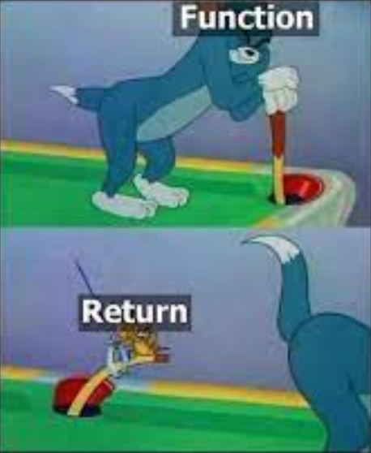

<!-- vscode-markdown-toc -->
* 1. [Функции?](#1)
* 2. [Скелет функции](#2)
* 3. [Функция суммы двух чисел](#3)
* 4. [void функции](#4)
* 5. [Заголовок функции](#5)
* 6. [Примеры](#6)
	* 6.1. [Поиск максимального](#6.1)
	* 6.2. [Предикаты](#6.2)
	* 6.3. [Имена функций](#6.3)

<!-- vscode-markdown-toc-config
	numbering=true
	autoSave=true
	/vscode-markdown-toc-config -->
<!-- /vscode-markdown-toc -->
# Functions part 1
            
                      

##  1. <a name='1'></a>Функции?

**Функция в программировании** - блок кода (обычно с именем) для решения конкретной задачи, который можно использовать повторно.          

Функции позволяют: 
- Избегать повторения кода. Написали блок кода один раз - используете его везде сколько угодно раз
- Структуирование. Программу можно разбить на логические части, увеличивает читаемость. 
- Проще искать и исправлять ошибки в небольших блоках (функциях) чем бегать по всей программе

Итого: **Функция** — это **именованный блок** кода для решения задачи, который можно повторно использовать.                
В языке Си все функции имеют имя. В других ЯП могут встретиться функции без имен - так называемые лямбда-функции.               

##  2. <a name='2'></a>Скелет функции

Английскими словами: 
```c
returnType functionName(arguments) {
    // function body
    return (value);
}
```

Тоже самое на русском:         
```c
типВозвращаемогоЗначения имяФункции(Аргументы) {
    // Тело функции
    return (Возвращаемое значение);
}
```

Функции обычно состоят из следующих вещей:
- **Тип возвращаемого значения** (то, что функция куда-то кому-то возвращает);
  - int - вернет целое число;
  - float/double - вернет вещественное число;
  - void - ничего не вернет;
- **Имя функции** - имя нашего блока кода;
- **Аргументы** (или параметры) в круглых скобках, это входные данные в наш блок, могут быть пустыми;
- **Тело функции** в фигурных скобках {}. Это и есть блок кода с инструкциями;         
- **return** - **вернуть**. Значение, которое функция отдаст как результат. Если в типВозвращаемогЗначения стоит void, то пишем либо `return;` либо вовсе не пишем его;


##  3. <a name='3'></a>Функция суммы двух чисел

Рассмотрим один из простейших примеров с функцией - функция суммы двух чисел.             

[Полный пример с функцией суммы 2 чисел](https://github.com/kruffka/C-Programming/blob/2025-2026/3_functions_p1/src/sum.c)                 

```c
int sum(int a, int b) {
    return a + b;
}
```
Здесь имя функции - `sum`. Функция возвращает тип данных int. На вход принимает два int аргумента - a и b оба типа int.                       

**Важно:** В аргументах прописывается тип данных для каждой переменной!             

В теле функции видим `return a + b;`, что означает вернуть сумму значений переменных a и b в целочисленном виде (перед именем функцией int)                   

Как вызвать этот блок кода? Для **вызова функций** (**function call**) мы используем имя этой функции.              

```c
int main() {

    int result = sum(1, 2);
    printf("sum = %d\n", result);

    return 0;
}
```
В коде выше в **функции** main() как только мы наткнемся на **вызов функции**, то мы пойдем в эту функцию и выполним весь ее блок **последовательно** (инструкция за инструкцией), а затем **вернемся** назад и продолжим выполнять блок функции main(). Результат, посчитанный в sum() (в a запишется 1, в b 2 и их сумма = 3) вернется и запишется в переменную result. Для того чтобы забрать возвращаемое значение в переменную - необходимо перед функцией поставить знак равно.          

```c
    int result = sum(1, 2);
```
Объявили result типа int, вызвали sum(1, 2), посчитали 1 + 2 в sum(), вернули результат 3 и записали его в result переменную               


Эту же самую функии sum можно было написать, например так:
```c
int sum(int a, int b) {
    int c = a + b;
    return c;
}
```
А в функции main **необязательно** результат записывать в result. Возвращаемое значение можно передать сразу в `printf()`, например:   
```c
    printf("sum = %d\n", sum(1, 2));
```
Т.к. sum возвращает int, то используем `%d`                     

**Важно:** Если мы попали в функции на **return**, то весь код ниже этого return не будет выполняться! Мы сразу выйдем из функции.         
```c
int sum(int a, int b) {
    return a + b; // Это выполним

    int c = 5; // Сюда НИКОГДА не попадем
    return c; // Сюда тоже
    // Сюда тем более
}
```

**Самостоятельно:** Написать простой калькулятор для двух чисел и знака операции, введенных с клавиатуры. Каждая операция `+`, `-`, `*`, `/` и т.д. - отдельная функция. Опционально: использовать **switch-case** для выбора функции. **Подсказка** по вводу с клавиатуры:            
```c
int a, b;
char s; // знак
scanf("%d%c%d", &a, &s, &b); // пользователь вводит что-то типа 5+2, в a запишет 5, в b 2, а в s '+'               
```

##  4. <a name='4'></a>void функции

Функции могут ничего не возвращать, используя void в **типеВозвращаемогоЗначения**             

Например если мы хотим, чтобы наша функция ничего не считала, а просто выводила на экран что-либо:                      

```c
void meow(int n) {

    for (int i = 0; i < n; i++) {
        printf("meow\n");
    }
    return; // return здесь не обязателен
}
```

Вызываем в main():
```c
meow(5); // мяукает 5 раз
```          
                  

Если попытаться забрать возвращаемое значение (его здесь нет, т.к. void), то компилятор выдаст об ошибке.               

##  5. <a name='5'></a>Заголовок функции
Компилятор проверяет использование функций в исходном файле сверху вниз и если он найдет вызов функции раньше чем объявлена сама функция, то это может привести к неопределенному поведению программы. Компилятор в таких случаях делает **предупреждение** - **implicit declaration** (**неявное объявление**)        

Если мы хотим написать нашу функцию `meow()` под функцией `main()`, в которой вызывается эта самая `meow()`, то мы должны над main написать заголовок функции `meow()`. Таким образом мы сообщаем компилятору, что функция meow существует и имеет конкретные аргументы и возвращаемый тип данных, но сам функция будет **определена** ниже.         
**Заголовок функции** правильно называют еще словом **прототип**.             

Отсюда два новых понятия для функций:
- **Объявление (declaration)** функции - сообщаем компилятору кратко какое имя у функции и какие типы данных
- **Определение (definition)** функции - определяем что делает функция, т.е. все то, что содержит имя функции и тело функции - есть уже определение.             

[Пример](https://github.com/kruffka/C-Programming/blob/2025-2026/3_functions_p1/src/definition.c):             

```c
void woof(int n); // Объявление (definiton)

int main() {
    woof(5); // Вызывается до определения
}

void woof(int n) { // Определение (declaration)

    for (int i = 0; i < n; i++) {
        printf("meow\n");
    }
    return;
}
```

##  6. <a name='6'></a>Примеры
###  6.1. <a name='6.1'></a>Поиск максимального

Попробуем написать функцию поиска максимального среди двух целых чисел [max.c](https://github.com/kruffka/C-Programming/blob/2025-2026/3_functions_p1/src/max.c)                   

```c
int max(int a, int b) {
    if (a > b) {
        return a;
    } else {
        return b;
    }
}
```
a и b - входные аргументы в функцию с именем **max**, вернем из функции наибольшее из чисел. Если `a > b`, то вернем значение a, иначе значение b.                

**Самостотельно:** Используя тернарный оператор и return упростить тело функции max до 1 строки                 

###  6.2. <a name='6.2'></a>Предикаты
**Предикаты** — это выражения или утверждения, которые могут быть либо истинными, либо ложными               

Напишем свою функцию (предикат), что возвращает булево значение - проверка на четность [even.c](https://github.com/kruffka/C-Programming/blob/2025-2026/3_functions_p1/src/even.c):      
```c
int isEven(int a) {
    return a % 2 == 0 ? 1 : 0;
}
```

###  6.3. <a name='6.3'></a>Имена функций

Хорошим тоном является функции называть **глаголами (по возможности)**, например не "кровать", а "спать", сразу становится понятней, что выполняет та или иная функция лишь из названия               

```c
bed(); // bad
sleep(); // good

message(); // bad
send_message(); // good
```

Функции-предикаты красиво называть можно следующим образом:                

```c
if (!isEmpty()) {
    // ...
}
// или
if (isValid()) {
    // .. do smth
}

while (isBusy()) {
    // ..
}
```
Таким образом имена isчто-то по смыслу неплохо кладутся в циклы и условия и делают код чуть красивше                 

Или так называемые сеттеры/геттеры для установки/получений значений
```c
getMessage();
getTimeOfDay();

setName();
setGenre();
```

