<!-- vscode-markdown-toc -->
* 1. [Массивы](#1)
	* 1.1. [Объявление (инициализация)](#1.1)
	* 1.2. [Присвоение](#1.2)
	* 1.3. [Размер массива (количество элементов в нем)](#1.3)
	* 1.4. [Удаление и вставка элемента из/в массива](#1.4)
	* 1.5. [Массивы и функции](#1.5)
	* 1.6. [Максимальное/минимальное в массиве](#1.6)
* 2. [Случайные числа](#2)
* 3. [Комплексные числа](#3)
* 4. [Время сортировать](#4)
	* 4.1. [Bubble sort](#4.1)
	* 4.2. [Insertion Sort](#4.2)
	* 4.3. [Selection Sort](#4.3)
	* 4.4. [Counting Sort и Radix Sort](#4.4)
	* 4.5. [Merge Sort и Quick Sort](#4.5)
	* 4.6. [Bogo Sort](#4.6)
* 5. [Матрицы](#5)
* 6. [Строки](#6)
	* 6.1. [Функции для работы со строками в Си](#6.1)

<!-- vscode-markdown-toc-config
	numbering=true
	autoSave=true
	/vscode-markdown-toc-config -->
<!-- /vscode-markdown-toc -->
# Arrays
##  1. <a name='1'></a>Массивы

Представим, что перед нами стоит задача посчитать средний балл для 3 студентов по Матану.                      

```c
int score1 = 77; // Паша
int score2 = 43; // Маша
int score3 = 100; // Даша

float avg = (score1 + score2 + score3) / 3;
```
Вроде это несложно: нам понадобится 3 переменных для хранения баллов каждого из студентов. Затем вычисляем их сумму и делим на количество. Задачу победили, **но что если этих студентов будет не 3, а 1000? 2000? N?**                            
В подобных случаях нас выручают массивы (arrays)              

**Массивы** используются для хранения **нескольких значений в одной переменной** вместо объявления отдельных переменных для каждого значения. 

Если **переменная - это коробка** со значением, то **массив - это шкаф с этими коробками**       

                  

**Важно:** Массивы во многих ЯП (в том числе Си) умеют хранить значения только **одного типа данных**, т.е. один массив не может хранить сразу и целые и вещественные типы данных                                  

Для создания массива в Си используются квадратные скобки [], в которых указывается размер этого массива и фигурные скобки {}, в которых перечисляются элементы массива.                   

```c
int scores[3] = {77, 43, 100};
```
Таким образом, мы можем **объявить** переменную с именем scores, что является массивом из **3 элементов** типа **int**. Оператором присвоения мы кладем целые числа 77, 43, 100 в наш массив.                  

Для **доступа** к элементам массива нам необходимо использовать индексы массива. Например, для получения первого элемента (77) мы воспользуемся индексом 0, для второго 1, а для последнего 2                     

```c
float avg = (scores[0] + scores[1] + scores[2]) / 3;
printf("Scores: %d, %d, %d; avg = %f\n", scores[0], scores[1], scores[2], avg);
```
Полный пример в [score.c](https://github.com/kruffka/C-Programming/blob/2025-2026/5_arrays/src/score.c)                     

**Важно:** Массивы в C/C++, Python, Java, Go и многих других ЯП **индексируются с нуля**. Исключения, где массивы начинаются с индекса 1: MATLAB, lua, R, Julia и т.д.                 


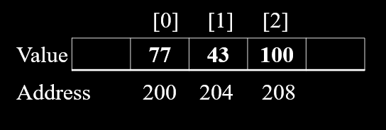         

Несложно заметить, что индексы меняются от 0 до размера массива минус 1 с шагом 1. Отсюда мы можем взять и бахнуть цикл, например:                      

```c
printf("Scores: ");
for (int i = 0; i < 3; i++) {
    printf("%d, ", scores[i]);
}
printf("\n");
```

**Циклы и массивы дружат**. Далее будем использовать циклы и массивы вместе очень часто.                                           

###  1.1. <a name='1.1'></a>Объявление (инициализация)

Все предложенные ниже варианты допустимы для инициализации массива              
```c
#define N 5

int a[N];
int b[5] = {1, 2, 3, 4, 5};
float c[] = {1.5, 3.2, 2.5};
int d[5] = {[3] = 9};
char e[N] = {0};
```

###  1.2. <a name='1.2'></a>Присвоение

```c
int a[5] = {5, 6, 7, 8, 9};
int b[5] = {1, 2, 3, 4, 5};

b = a; // Error
a = {5, 3}; // Error
a[2] = -17; // Ok
a[0] = b[4]; // Ok
a[2.5] = 33; // Error
b[4000] = 100; // Error, segfault
a[-1] = 8; // Ok, possible segfault
```

В языке Си с массивами нельзя:
- Одну переменную-массив присвоить другой
- Инициализировать массив второй раз `a = {5, 3}`
- Индексировать не целыми числами

С массивами можно:
- Индексировать целыми числами, индексация с нуля
- выскочить за размер массива `b[4000] = 100` допустимо, но можно получить ошибку во время работы - **segmentation fault (segfault)**
- отрицательный индекс у массива - это не тоже самое, что последний элемент массива, это также может привести к ошибкам                

**segmentation fault** - ошибка во время выполнения программы, когда программа попыталась обратиться к памяти, к которой доступ не разрешен.                    
Например если у вас есть массив размером 3 элемента, а вы попытаетесь в 10000 элемент положить значение 100 - получите segfault, т.к. попытаетесь обратиться к адресу за вашей программой.                 
Хотя при попытке положить или прочитать значение до, например, 100, **segfault** не получите. Однако можете натворить чего-то непонятного в памяти вашей программы, неявно перезаписав значения других ваших переменных.                      

Так как в Си нет **проверки на выход за диапазон значений массива** - программы на Си работают быстрее чем программы написанные на ЯП, где постоянно проходят такие проверки.            
В Языке Си вся ответственность лежит на программисте. **Написал программу, а она часто вылетает?** Не стоит винить язык Си в этом, проблема в том коде, который вы написали.                             
**Программа делает ровно то, что ей сказали**.**Напоминаю**, программы, что крайне нестабильны и которые постоянно вылетают - обычно **никому не нужны**.                                     

###  1.3. <a name='1.3'></a>Размер массива (количество элементов в нем)

Можно получить так:
```c
int m[] = {1, 2, 3}; // 3 элемента
int array_size = sizeof(m) / sizeof(m[0]); // 12 / 4 = 3
```
sizeof(m) - в данном случае выдает размер всего массива в байтах                      

###  1.4. <a name='1.4'></a>Удаление и вставка элемента из/в массива

В "обычном" массиве нельзя удалить элемент и уменьшить/увеличить размер самого массива. Такое можно будет делать с **динамическими массивами**, скоро их посмотрим                             

###  1.5. <a name='1.5'></a>Массивы и функции

Что такое функции [читать здесь](https://github.com/kruffka/C-Programming/blob/68d3b54087e3a111c3f517c7c45ccde86d2d055d/3_functions_p1/lecture.md)             

В Функцию **можно передать массив** и что-то с ним там сделать. Посмотрим функцию вывода на экран массива [print_arr.c](https://github.com/kruffka/C-Programming/blob/2025-2026/5_arrays/src/print_arr.c):             
```c
void print_arr(int n, int array[n]) {

    for (int i = 0; i < n; i++) {
        printf("array[%d] = %d\n", i, array[i]);
    }
    printf("\n");
}
```
Данная функция написана 1 раз, но использовать ее можно сколько угодно раз и для любых целочисленных массивов:            

```c
    int scores[N] = {77, 43, 100, 55, 11};
    print_arr(N, scores);

    int array[M] = {1, 2, 3};
    print_arr(M, array);
```

###  1.6. <a name='1.6'></a>Максимальное/минимальное в массиве

Как найти максимальный или минимальный элемент в массиве?                    

Один из вариантов:
1) Завести переменную, например `max`, под результат и присвоить ее первому элементу массива.       
2) Завести цикл для перебора всех элементов массива и сравнения с переменной max
3) В теле цикла если max < текущего элемента массива:
   1) max становится равным текущему элементу массива          
4) Готово

Для поиска минимального достаточно поменять знак на противоположный (min > array[i])                         

Алгоритм на языке Си [find_max.c](https://github.com/kruffka/C-Programming/blob/2025-2026/5_arrays/src/find_max.c)                   

```c
int find_max(int arrSize, int scores[arrSize]) {

    int max = scores[0];
    for (int i = 1; i < arrSize; i++) {
        if (max < scores[i]) {
            max = scores[i];
        }
    }
    return max;
}
```

##  2. <a name='2'></a>Случайные числа

Как в языке Си заполнить массив случайными числами?    

С этим нам поможет функция `rand()`.               
для rand() нужно подключить `<stdlib.h>`.          
rand() - ф-ия, что возвращает случайное **целое** число (целое в диапазоне от 0 до RAND_MAX, где RAND_MAX - определен в stdlib.h)
```c
#include <stdlib.h>
// ...
int random = rand(); // 1804289383
```
Если сделаем так, то всегда будем получать одно и тоже число, вероятнее всего 1804289383. Связано это с тем, что рандом (случайность) не совсем рандом - а псевдорандом,
что подчиняется определенным формулам.            
Для **получения случайных чисел в каждый запуск** - мы можем воспользоваться ф-ией `srand()` и `time()`.
- srand - ф-ия задания seed (семя) для псевдорандома. Seed - некоторое число, что каким-то образом влияет на формулу случайных чисел           
- time - ф-ия возвращающая кол-во секунд прошедших с 00:00:00 UTC, 1 Января, 1970 года, называется - Unix timestamp (timestamp - временная метка).              

Ф-ия time каждую секунду возвращает этот самый счетчик. https://www.unixtimestamp.com/                       

Итак, попробуем задать seed для рандома равным значению ф-ии time, чтобы каждую секунду наши числа менялись. Сделать это достаточно 1 раз. Пример здесь [random.c](https://github.com/kruffka/C-Programming/blob/2025-2026/5_arrays/src/random.c)          
```c
    printf("rand() = %d\n", rand()); // всегда 1804289383

    // Указываем seed для псевдорандома и в качестве аргумента передаем текущее время
	srand(time(NULL)); // достаточно сделать 1 раз
	printf("Unix timestamp = %ld\n",  time(NULL)); // Unix timestamp
    printf("Random [0..99] = %d\n", rand() % 100); // Случайное число от 0 до 99
```
**Важно:** Так как rand() выдает числа от 0 до RAND_MAX, то чтобы получить числа скажем от -50 до 49 мы должны выполнить несколько математических операций:        
```c
// % 100 - ограничивает rand до чисел от 0 до 99
// - 50  - сдвигает наш диапазон до числе от -50 до 49
int rand = rand() % 100 - 50; 
```

**Самостоятельно:** заполнить массив размером N случайными числами от 0 до 999 и найти в нем минимальный элемент - вывести его на экран            

##  3. <a name='3'></a>Комплексные числа

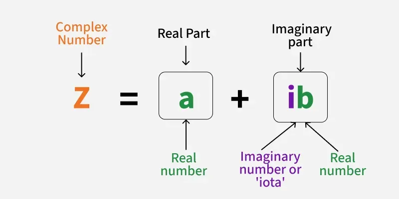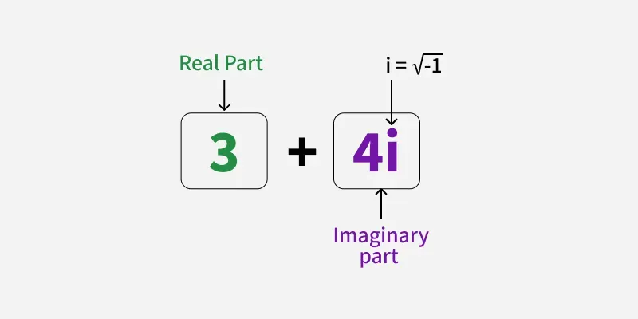                      

**Комплексное число** – выражение вида a + bi, где a и b некоторые **целые** либо **вещественные** числа, а i это корень из -1.     
Как представить комплексное число и положить его в компьютер?            
Одно комплексное число создают из двух чисел – a и b, а i пропускается. Соответственно массив из 3 комплексных чисел есть массив из 6 обычных чисел. 
И тогда числа под четными индексами — это реальная часть комплексного числа, а нечетные индексы мнимая часть: 
- [RE0, IM0, RE1, IM1, RE2, IM2], 
  - RE – Real (реальная часть), 
  - IM – Imag (imaginary, мнимая часть).
  
Так, например, наши с вами телефоны из воздуха достают большие массивы комплексных чисел, когда работают с беспроводными сетями типа Wi-Fi или 4G, 5G..       
Эти комплексные числа образуют различные "созвездия", которые затем преобразуются в более понятные анные из `0` и `1`       
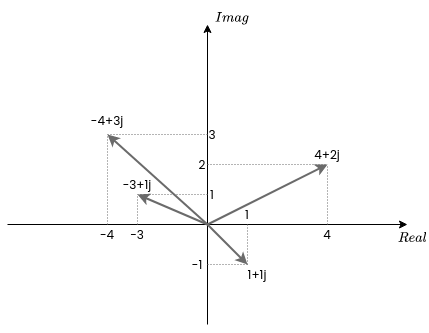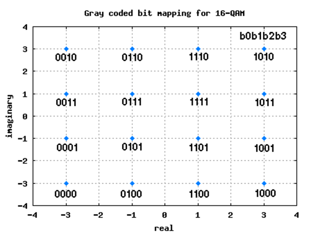                                  

Допустим нам из воздуха пришло 10 комплексных целых чисел, где реальная и мнимая части занимают по 16 бит, как мы можем упаковать их в массив?          

<br>

Например, мы можем создать под эти числа short int массив:
```c
short int complex[20];
```
где
- complex[четный_индекс] - реальная часть
- complex[нечетный_индекс] - мнимая часть

А можем хранить их в обычном int (32 бита):
```c
int complex[10];
```
где
- complex[i] - комплексное число
  - (complex[i] & 0xffff) - реальная часть
  - (complex[i] >> 16) & 0xffff - мнимая часть

Т.е. вот еще один пример где могут понадобиться битовые операции. С помощью них мы разбираем 32-битный int на два целых 16-битных short int


##  4. <a name='4'></a>Время сортировать

Что такое сортировка и зачем нужна?             
**Сортировки** - алгоритмы для упорядочивания данных в массивах (по возрастанию или убыванию).                 
Алгоритмов сортировок существует очень много и с разными данными они работают с разной **эффективностью** (сложностью).               

С отсортированными данными обычно проще и быстрее работать. Например в записной книжке с телефонами или рецептами быстрее найти что-либо если записанные данные отсортированы, например, по алфавиту.      

Парочку алгоритмов сортировок:         
- Bubble Sort - Пузырьковая сортировка
- Insertion Sort - Сортировка вставками
- Selection Sort - Сортировка выбором
- Counting Sort - Сортировка подсчетом
- Radix Sort - Поразрадная сортировка
- Merge Sort - Сортировка слиянием
- Quick Sort - Быстрая сортировка

Сильно **подробнее** с сортировками вы познакомитесь на отдельном курсе (СиАОД) либо если откроете и полистаете любую книжку по алгоритмам. Без знания алгоритмов в разработке программ обычно не очень       

Прежде чем пойдем сортировать, необходимо понять то, что если мы хотим поменять местами два элемента массива, то нам необходима временная переменная:                      
```c
int temp = array[0];
array[0] = array[1];
array[1] = temp;
```
Делается это для того, чтобы не затереть значение и не получить на выходе два одинаковых элемента, т.е. как бы очевидно не было, но вот это будет ошибкой:              
```c
array[0] = array[1];
array[1] = array[0]; 
```
И не поменяет два элемента местами.   

Имя temp или tmp - от слова временный (temporary)             

###  4.1. <a name='4.1'></a>Bubble sort

Рассмотрим пример самой простой сортировки чисел в массиве - пузырьковая сортировка.             

Суть у нее проста, мы будем перемещаться по массиву много раз и сравнивать текущий и следующий элементы, если текущий больше следующего, то меняем их местами.                 

На псевдокоде этот алгоритм будет выглядит примерно так:              
```c
ДЛЯ i от 0 до n-1:
    ДЛЯ j от 0 до n-i-1:
        ЕСЛИ arr[j] > arr[j+1]:
            поменять местами arr[j] и arr[j+1]
```
                  

На языке Си [bubble.c](https://github.com/kruffka/C-Programming/blob/2025-2026/5_arrays/src/bubble.c) для сортировки по возрастанию:            
```c
void bubble_sort(int size, int arr[size]) {
    for (int i = 0; i < size; i++) {
        for (int j = 0; j < size - i - 1; j++) {
            if (arr[j] > arr[j + 1]) { // если текущий > следующего, то делаем swap - меняем местами
                int tmp = arr[j];
                arr[j] = arr[j + 1];
                arr[j + 1] = tmp;
            }
        }
    }
}
// ...
    int array[N] = {6, -5, 3, 77, 4};
    // Сортируем по возрастанию
    bubble_sort(N, array);
// ...
```

**Важно:** в функцию **можно передать массив**, но из функции **нельзя его вернуть**. Функции в Си умеют возвращать лишь простые типы данных, **массивы - это набор таких простых типов данных**, поэтому его не назвать простым                            
Однако в других ЯП можно встретить, что функции умеют возвращать и массивы.        

Псевдо код различных алгоритмов сортировок можно найти в интернете и там же можно найти неплохие визуализации как это работает                   

###  4.2. <a name='4.2'></a>Insertion Sort

Сортировка вставками (gif с wiki):                 
            

Здесь мы проходим по элементам массива, например слева направо, забираем элемент и "вставляем" его туда где он должен оказаться в отсортированном массиве, а отсортированный массив у нас потихоньку растет с каждым новым элементом. В самом начале отсортированным массивом мы считаем первый элемент, поэтому цикл начнется с 1 индекса (с нуля)                                

###  4.3. <a name='4.3'></a>Selection Sort

Сортировка выбором (gif с wiki)
            

Алгоритм примерно следующий: находим минимальный элемент из всего неотсортированного списка и вставляем этот элемент в его отсортированное место.            

###  4.4. <a name='4.4'></a>Counting Sort и Radix Sort

Эти сортировки довольны интересны, т.к. они одни из самых быстрых, а также им не требуются операции сравнения для сортировки. Но несмотря на все плюсы, данные сортировки все равно имеют нюансы и не универсальны.            

**Counting sort:**         
В нем нам понадобится дополнительный массив с количеством элементов равным от минимального и максимального значения в сортируемом значении. Здесь уже можно заподозрить нюансы..                

Далее мы считаем по простой формуле сколько раз и какой элемент встречается в массиве: 
```c
count[arr[i]]++; // i - индекс, массив arr - оригинальный сортируемый массив, count - массив для подсчета
```

А далее самая магия - мы просто проходимся по массиву count и выдаем значения по порядку:               
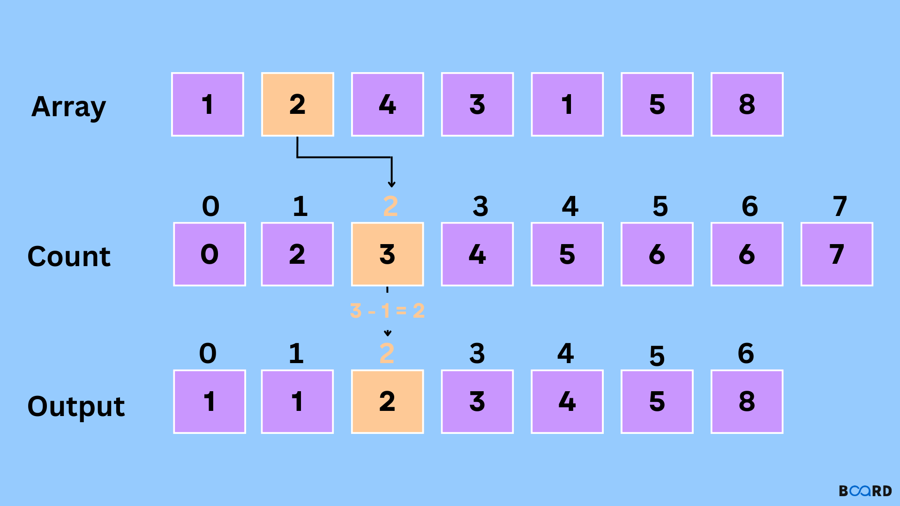                   

Два раза встретилась единичка? Выведем ее два раза на экран                

**Radix sort:**              

В поразрядной сортировке мы сортируем числа по разрядам, вот пример для десятичной системы счисления:             
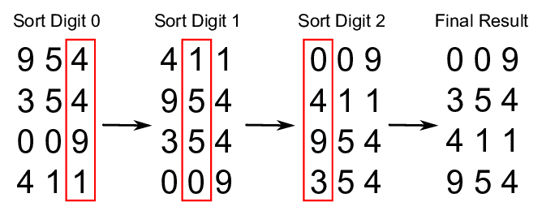         
Все тоже самое можно сделать и в двоичной.                

###  4.5. <a name='4.5'></a>Merge Sort и Quick Sort

Эти сортировки отличаются от других более сложными алгоритмами, но в среднем они дают наибольшую скорость. Реализации данных сортировок можно встретить в реальных библитеоках и проектах        

Картинка QuickSort с вики:           
     

Суть примерно следующая - мы делим массив на половинки до тех пор пока это можно делать:            
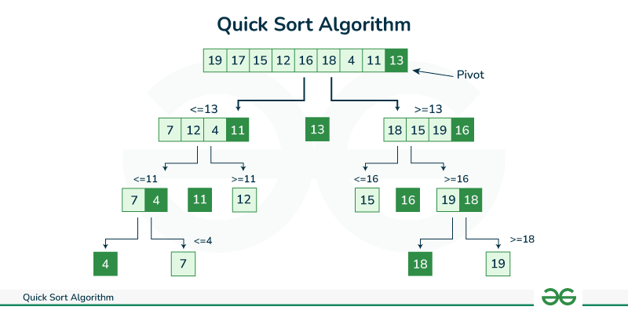                      

А затем эти половинки мы понемножку сортируем, в Quick Sort мы делим поровну относительно некоторого **pivot** (опорный элемент) - число, для которого мы будем все числа массива разбивать на две части - меньшие и большие pivot. Сам pivot можно выбирать очень по-разному, можно брать всегда первый или последний или элемент по середине, а можно брать **случайный**, чтобы не было ситуаций когда для некоторого pivot все числа были слева или справа.                   

В Merge Sort мы разделяем всегда массив также на две части ровно пополам до тех пор пока не останется по 2 элемента, а затем происходит этот самый **Merge** (слияние по-русски) - мы соединяем половинки в целое:               
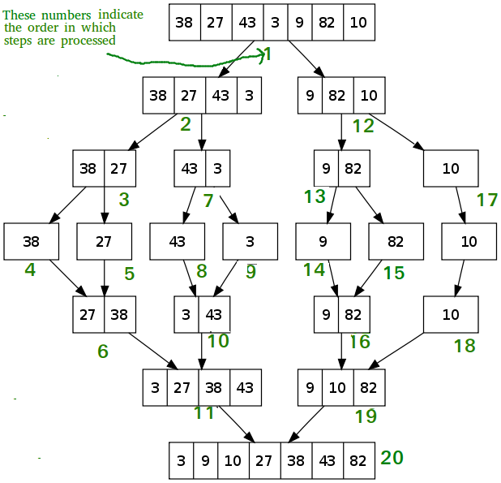                  

**Полезно:** Эти сортировки также отлично можно распараллелить - выполнять сортировку половинок параллельно на разных ядрах процессора, а затем одно другое ядро все это собирает            

###  4.6. <a name='4.6'></a>Bogo Sort 

Конечно же без шуточных сортировок никуда. Одна из наиболее известных - bogo sort.          

Ее суть проста - мы переставляем все числа в массиве случайным образом и есть некоторый шанс, что после случайной перестановки все числа встанут на свои отсортированные места... Если не удалось, то расставляем заного случайным образом и так до тех пор пока не отсортируем                              

           

Для малых размером это еще ок, но для больших массивов такая штука будет сортировать веками..        

<br>          
https://ru.wikipedia.org/wiki/Bogosort:              

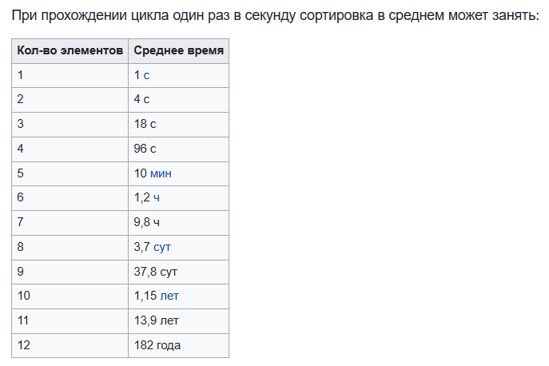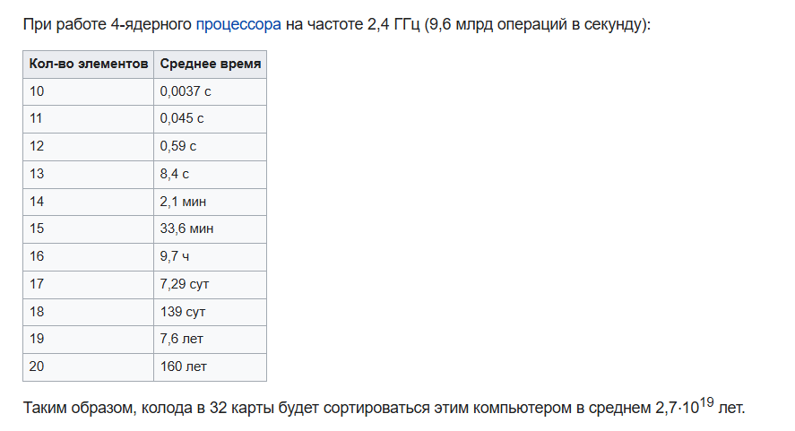        

С такой сортировкой отсортировать массив любого размера можно с 1 раза, однако шанс не велик.. **но он есть**         

Про сложности алгоритмов поговорим чуть попозже..    

##  5. <a name='5'></a>Матрицы

Продолжим наши аналогии. Переменная - коробка, массив - шкаф с коробками, матрица - комната со шкафами..                     
          

Массивы могут быть не только одномерными, могут быть двумерными.. n-мерными. Двумерные массивы обычно называют словом **матрица**, т.к. они похожи на матрицы (или таблицы) со строками и столбцами. Индексы все также начинаются с **нуля**!             

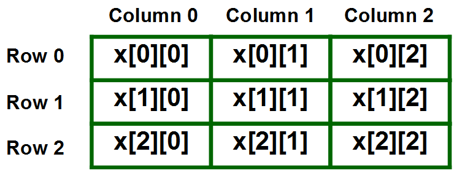             

Для матриц нам потребуется уже две квадратные скобки, а также 2 цикла (вспоминаем лабу с фигурами) [matrix.c](https://github.com/kruffka/C-Programming/blob/2025-2026/5_arrays/src/matrix.c).           

```c
int matrix[N][N];
for (int i = 0; i < N; i++) {
    for (int j = 0; j < N; j++) {
        matrix[i][j] = i + j + 1;
    }
}

for (int i = 0; i < N; i++) {
    for (int j = 0; j < N; j++) {
        printf("%d ", matrix[i][j]);
    }
    printf("\n");
}
```

В памяти ПК матрица 3x3 будет выглядить как три подряд идущий одномерных массива по 3 элемента:                        
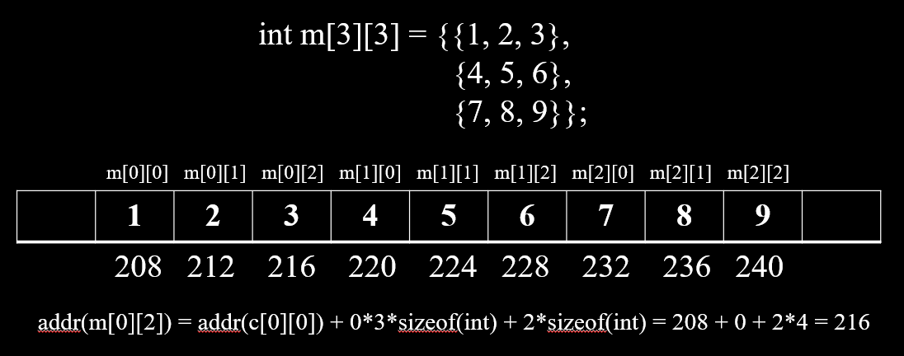                      


У матриц можно выделить две диагонали - главная и побочная           

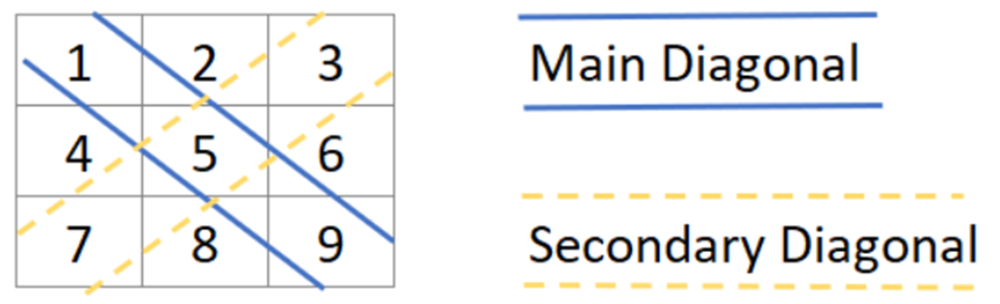          

Для главной диагонали индекс строки и столбца будут равны (i == j), т.е. для вывода элементов главной диагонали можно сделать так:               

```c
for (int i = 0; i < N; i++) {
    for (int j = 0; j < N; j++) {
        if (i == j) {
            printf("%d ", matrix[i][j]);
        }
    }
}
printf("\n");
```

**Самостоятельно:** какая формула у побочной диагонали?               

3D массив - это уже будет квартира с комнатами со шкафами с коробками... 4-D - дом с квартирами.. и так можно продолжать долго..                         
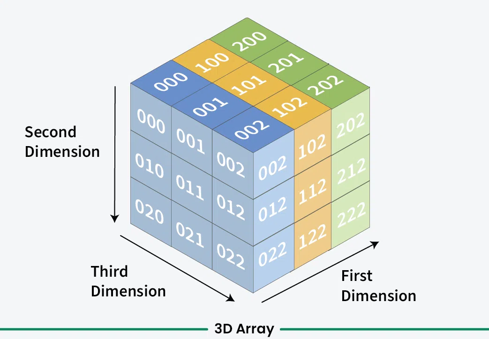          

Так можно продолжать очень долго, но на практике обычно используется не более 2-3 размерностей, т.к. чем больше у вас мерностей в массиве, тем сложнее и дольше его обрабатывать                  


##  6. <a name='6'></a>Строки

Что будет выведено на экран для следующего кода?                       
```c
char c1 = 'H';
char c2 = 'i';
char c3 = '!';

printf("%c %c %c\n", c1, c2, c3);
printf("%d %d %d\n", c1, c2, c3);
```

Правильно: 3 символа через пробел 'H', 'i', '!' и с новой строки 3 их численных эквивалента по ASCII табличке.           
Но что если мы захотим символы хранить в массиве? У нас получится **строка**. В языке Си нет такого примитивного типа данных как строки (string), в Си **строка - есть массив символов**.          

Как создать строку и вывести на экран? Ну например.. так:            
```c
char s[] = "Hi!";
printf("%s\n", s);
```

Пустые скобки мы оставили, чтобы компилятор за нас посчитал размер строки. Формат в printf - "%s" позволяет выводить строки на экран (от слова string).                    

Но как printf понимает где заканчивается одна строка и начинается другая? Если вспомнить как в памяти выглядит одномерный массив, то мы увидим просто подряд идущие символы, а что если за этой строкой будет какая-нибудь еще строка и еще? **Как компьютер поймет где закончилась одна и началась другая?**                   

А еще почему sizeof(s) == 4 байта?? Это как.. символа же 3..                     

Для задачи разделения строк был придуман так называемый нуль-терминатор (NUL, он же '\0'). **Нул-терминатор ('\0') - это символ конца строки.** Благодаря ему printf понимает что строка закончилась, т.е. по сути printf выводит по одному символу в некотором цикле пока символ не будет равен '\0' (по таблице ASCII = 0):                               
```c
while (string[i] != '\0') {
    печатай("%c", string[i]);
}
```
Если в строке не будет '\0', то printf начнет выводить все что идет дальше в памяти пока не встретит 0.                   

Оперативка:            
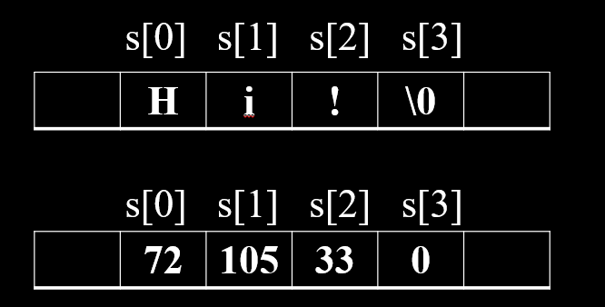               

А что если мы захотим массив строк? Это будет уже массив массивов символов.                    

```c
    char words[2][5] = {"Hi!", "Bye!"};
    // Первая строка "Hi!"
    printf("%s\n", words[0]);

    // Первая строка "Bye!"
    printf("%s\n", words[1]);

    // Первая строка по символам
    printf("%c%c%c\n", words[0][0], words[0][1], words[0][2]);

    // Вторая строка по символам
    printf("%c%c%c%c\n", words[1][0], words[1][1], words[1][2], words[1][3]);
```

Допустим строка - это массив символов, можно ли ее ввести как-то по удобному, а не по отдельному символу?                      

Есть пару вариантов в Си:

- scanf() - считывает до пробела, используем формат %s, не используем амперсанд, т.к. имя массива нам даст адрес переменной массива.       
- fgets() - считывает с пробелами            

**scanf:**               
```c
char name[20];
printf("Enter name: ");
scanf("%s", name); 
printf("Your name is %s\n", name);
```

**fgets:**            
```c
printf("Enter name: ");
fgets(name, sizeof(name), stdin);
printf("My name is %s\n", name);
```

- **stdin** – стандартный ввод, то куда попадают наши вводимые данные в ОС
- **stdout** – стандартный вывод
- **stderr** – стандартный вывод для ошибок

**Важно:** Почему scanf не безопасен?                         
```c
char buffer[8];
// Если ввести больше 7 символов, то мы получим переполнение, т.к. выйдем за границы массива             
scanf("%s", buffer);
```
Подобное поведение может просто поломать вашу программу или ваша программа будет ввести себя непредсказуемо                         
Также таким способом когда-то давно (сейчас компиляторы защищают с помощью "канарейки") взламывали программы                     

scanf() можно ограничить вводимый буфер через формат:            
```c
char buffer[8];
scanf("%7s", buffer);  // Явное ограничение длины
```
Но на практике scanf сложно встретить, обычно его юзают лишь для академических целей (учебы)                                                                             

###  6.1. <a name='6.1'></a>Функции для работы со строками в Си
 
Полный пример тут [string_h.c](https://github.com/kruffka/C-Programming/blob/2025-2026/5_arrays/src/string_h.c)         
```c
#include <string.h> // Для работы с функциями 
                    // обработки строк
strlen();   // Длина строки, не включая '\0'
strcpy();   // Копирование одной строки в другую
strncpy();  // Тоже самое, но не выходя за размер n
puts();     // Вывод на экран строки
fgets();    // Ввод с клавиатуры строки
strcmp();   // Сравнение двух строк
strcat();   // Объединение двух строк
```


