<!-- vscode-markdown-toc -->
* 1. [Массивы](#1)
	* 1.1. [Зачем нужны массивы](#1.1)
	* 1.2. [Объявление и инициализация](#1.2)
	* 1.3. [Индексы и доступ к элементам](#1.3)
	* 1.4. [Размер массива](#1.4)
	* 1.5. [Что можно, а что нельзя делать с массивами](#1.5)
	* 1.6. [Массивы и функции](#1.6)
	* 1.7. [Задачи на массивах](#1.7)
	* 1.8. [Типичные ошибки](#1.8)
* 2. [Массивы в реальном мире](#2)
* 3. [Случайные числа](#3)
* 4. [Матрицы](#4)
	* 4.1. [Объявление и инициализация](#4.1)
	* 4.2. [Обход, ввод и вывод](#4.2)
	* 4.3. [Как матрица лежит в памяти](#4.3)
	* 4.4. [Диагонали](#4.4)
	* 4.5. [Транспонирование](#4.5)
	* 4.6. [Матрицы и функции](#4.6)
	* 4.7. [Матрицы в реальности и 3D](#4.7)
	* 4.8. [Свёртка: как размывают картинку](#4.8)
	* 4.9. [Игра «Жизнь» Конвея](#4.9)
* 5. [Строки](#5)
	* 5.1. [Символы, ASCII и UTF-8](#5.1)
	* 5.2. [Строка - это массив символов, а нуль-терминатор её конец](#5.2)
	* 5.3. [Ввод и вывод строк](#5.3)
	* 5.4. [strlen и strcpy своими руками](#5.4)
	* 5.5. [Функции из string.h и ctype.h](#5.5)
	* 5.6. [Массив строк](#5.6)
	* 5.7. [Частые ошибки со строками](#5.7)
	* 5.8. [Мини-задачи и примеры](#5.8)
* 6. [Время сортировать](#6)
	* 6.1. [Bubble sort](#6.1)
	* 6.2. [Insertion Sort](#6.2)
	* 6.3. [Selection Sort](#6.3)
	* 6.4. [Counting Sort и Radix Sort](#6.4)
	* 6.5. [Merge Sort и Quick Sort](#6.5)
	* 6.6. [Bogo Sort и другие шуточные сортировки](#6.6)
	* 6.7. [Сложность сортировок](#6.7)
	* 6.8. [Бинарный поиск: зачем сортировать](#6.8)
* 7. [Сложность алгоритмов](#7)
* 8. [Приёмы: окно и префиксные суммы](#8)
<!-- vscode-markdown-toc-config
	numbering=true
	autoSave=true
	/vscode-markdown-toc-config -->
<!-- /vscode-markdown-toc -->
# Arrays

Ноутбук, телефон, сервер, микроволновка - почти в каждой программе есть **массивы**. Это самая базовая структура данных, на которой держится всё остальное.


##  1. <a name='1'></a>Массивы

Представим задачу: посчитать средний балл трёх студентов по Матану.

```c
int score1 = 77;  // Паша
int score2 = 43;  // Маша
int score3 = 100; // Даша

float avg = (score1 + score2 + score3) / 3.0f;
printf("Scores: %d, %d, %d; avg = %.2f\n", score1, score2, score3, avg);
```
Полный пример в [score.c](src/score.c).

Три переменные - это ок. **А если студентов 1000? 2000? N?** Объявлять `score1`, `score2`, `…`, `score2743` - плохая идея. Тут на сцену выходят **массивы** (arrays).

**Массив** - это несколько значений **одного типа**, лежащих в одной переменной, а не куча отдельных переменных.

Если **переменная - это коробка** со значением, то **массив - это шкаф с этими коробками**:

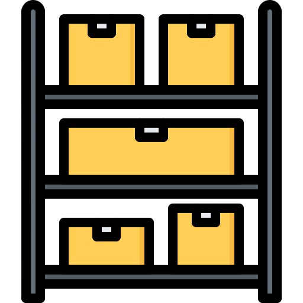

**Важно:** массив хранит значения **только одного типа**. Один массив не может одновременно хранить `int` и `float` (для этого позже будут структуры).

###  1.1. <a name='1.1'></a>Зачем нужны массивы

- **Масштаб.** Три переменные ещё можно пережить, тысячу - уже нет. Массив задаётся одной строкой независимо от количества элементов.
- **Циклы дружат с массивами.** Все элементы однотипны и пронумерованы подряд, значит их можно перебрать циклом, а не писать 1000 `printf`.
- **Удобная передача в функцию.** Написали `print_arr()` один раз - прогоняете через неё любой массив.
- **Основа для всего остального.** Матрицы, строки, буферы, таблицы и куча структур данных - это всё массивы.

###  1.2. <a name='1.2'></a>Объявление и инициализация

Синтаксис: `тип имя[размер] = {элементы};`. Квадратные скобки `[]` задают размер, фигурные `{}` - значения.

```c
int scores[3] = {77, 43, 100};
```

Это массив с именем `scores` из **3 элементов** типа `int`. Все предложенные ниже варианты допустимы:

```c
#define N 5

int a[N];                        // без инициализации - внутри "мусор"
int b[5] = {1, 2, 3, 4, 5};      // полная инициализация
float c[] = {1.5, 3.2, 2.5};     // размер посчитает компилятор, будет 3
int d[5] = {1, 2};               // первые два заданы, остальные = 0
int e[5] = {[3] = 9};            // designated initializer: e[3] = 9, остальные 0
char f[N] = {0};                 // залили нулями весь массив
```

**Важно:**
- `int a[N];` **без инициализации** - это не нули! Там будет мусор из памяти. Забыли заполнить - будете долго искать баг. Инициализируйте: `{0}`.
- `{1, 2}` в массиве из 5 элементов **не ошибка**: первые два - указанные, остальные автоматически `0`.
- `[3] = 9` - **designated initializer** (С99), удобно заполнять "точечно".
- Размер задаётся **константой времени компиляции**: `#define` или `enum`. Так принято и сейчас, чтобы не хардкодить число по всему коду.

Размер лучше вынести в константу и больше нигде не писать число руками:

```c
#define N 10

int a[N];
for (int i = 0; i < N; i++) { // а не i < 10
    a[i] = i * i;
}
```

Поменяли `N` в одном месте - поменялось везде.

###  1.3. <a name='1.3'></a>Индексы и доступ к элементам

Доступ к элементу - через **индекс** в квадратных скобках. Индексация в Си (и в C++, Python, Java, Go…) начинается **с нуля**: первый элемент - `scores[0]`, последний - `scores[размер - 1]`.

```c
int scores[3] = {77, 43, 100};

printf("%d\n", scores[0]); // 77  - первый
printf("%d\n", scores[1]); // 43
printf("%d\n", scores[2]); // 100 - последний!
// scores[3] - уже выход за границы массива
```

Индексы идут от `0` до `size - 1` с шагом 1 - значит можно взять цикл:

```c
printf("Scores: ");
for (int i = 0; i < 3; i++) {
    printf("%d, ", scores[i]);
}
printf("\n");
```

**Важно:** условие цикла `< size`, а не `<= size`. `<=` - самая частая ошибка

Изменять элементы можно так же, как обычные переменные:

```c
scores[1] = 90;  // Маша пересдала
scores[2] += 5;  // Даше накинули
```

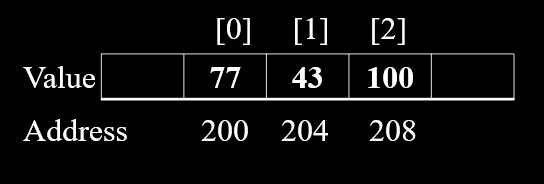

Есть языки, где массивы начинаются с единицы - MATLAB, R, Julia, Lua. В Си это не так, и это нормально.

###  1.4. <a name='1.4'></a>Размер массива

Сколько элементов в массиве? Если массив объявлен локально (в той же функции, где мы спрашиваем), можно использовать `sizeof`:

```c
int m[] = {1, 2, 3};
int m_size = sizeof(m) / sizeof(m[0]); // 12 / 4 = 3
```

`sizeof(m)` возвращает размер всего массива в **байтах**, `sizeof(m[0])` - размер одного элемента. Их отношение и есть количество элементов.

Именно поэтому `sizeof(arr) / sizeof(arr[0])` - универсальный способ: он сам подстроится под тип элемента.

**Важно:** внутри **функции** так не получится. В функцию массив приходит не целиком, а как ссылка на первый элемент, поэтому `sizeof` вернёт размер ссылки (обычно 8 байт), а не всего массива. Вывод: **размер массива передаём в функцию отдельным аргументом**:

```c
void print_arr(int n, int arr[n]) {
    // sizeof(arr) тут бесполезен, поэтому n приходит снаружи
}
```

В современном Си для размеров и длин используют тип `size_t` (беззнаковый) и печатают его через `%zu`:

```c
#include <stddef.h>

size_t n = sizeof(m) / sizeof(m[0]);
printf("size = %zu\n", n);
```

###  1.5. <a name='1.5'></a>Что можно, а что нельзя делать с массивами

```c
int a[5] = {5, 6, 7, 8, 9};
int b[5] = {1, 2, 3, 4, 5};

b = a;         // Ошибка: массив нельзя присвоить другому массиву
a = {5, 3};    // Ошибка: повторная инициализация тоже запрещена
a[2] = -17;    // ОК: обращение к элементу
a[0] = b[4];   // ОК: копируем один элемент
a[2.5] = 33;   // Ошибка: индекс обязан быть целым
b[4000] = 100; // ОК с точки зрения компилятора… но это выход за границы
a[-1] = 8;     // … тоже "ОК" и тоже плохо
```

Нельзя:
- присвоить один массив другому целиком (`b = a`);
- инициализировать массив второй раз (`a = {5, 3}`);
- индексировать нецелыми числами.

Можно:
- читать/писать элементы по целому индексу (с нуля);
- выйти за границы массива - компилятор не остановит, и это **плохо** (см. ниже).

Почему `b = a` нельзя? Потому что копировать надо было бы содержимое поэлементно, а Си не делает этого автоматически в присваивании. Копируем циклом:

```c
for (int i = 0; i < 5; i++) {
    b[i] = a[i];
}
```

**segmentation fault (segfault)** - ошибка во время выполнения: программа обратилась к памяти, к которой доступа нет. Массив из 3 элементов, а мы пишем в 10000-й - привет, segfault. А если пишем/читаем недалеко (например `a[100]`), программа может не упасть, но **незаметно перезапишет другие переменные** - и баг всплывёт где-то совсем в другом месте. Такие баги самые неприятные.

В Си **нет проверки выхода за границы массива**. За это он и быстрый: ни одна инструкция не тратит время на проверку индекса. Плата за скорость - ответственность полностью на программисте.

**Важно:** если программа падает, виноват не язык. Программа делает ровно то, что вы написали. Нестабильные программы, которые постоянно вылетают, обычно никому не нужны.

Для поиска таких ошибок существуют отладчики и санитайзеры (gdb, ASan), но о них чуть позже     

###  1.6. <a name='1.6'></a>Массивы и функции

Что такое функции - [читай здесь](../3_functions_p1/lecture.md).

В функцию **можно передать массив** и делать с ним что угодно. Функция вывода массива [print_arr.c](src/print_arr.c):

```c
void print_arr(int n, const int values[n], const char title[]) {
    printf("%s: ", title);
    for (int i = 0; i < n; i++) {
        printf("%d ", values[i]);
    }
    printf("\n");
}
```

Написана 1 раз, используется сколько угодно раз и для любых целочисленных массивов:

```c
#define SENSORS 5
#define SUBJECTS 3

int temp[SENSORS] = {-5, -2, 0, 3, 1}; // датчики на улице, C
print_arr(SENSORS, temp, "Температура по датчикам");

int scores[SUBJECTS] = {5, 4, 3};       // оценки за семестр
print_arr(SUBJECTS, scores, "Оценки");
```

**Важно:** в функции **можно передать массив**, но из функции **массив вернуть нельзя**. Функции в Си возвращают простые типы (`int`, `float`…), а массив - это набор таких значений, он "не влезает" в `return`. Обходной путь: результат пишем в массив, который передали аргументом (он изменится), либо возвращаем что-то простое (число, индекс, признак). Массивы из функций умеют возвращать другие языки, но не Си.

Размер и массив обычно указывают вместе: `void f(int n, int a[n])`. По коду сразу видно связь между `n` и `a`, и санитайзер сможет поймать выход за границы.

###  1.7. <a name='1.7'></a>Задачи на массивах

Это тот минимум, который встречается в лабах, на собеседованиях и в реальном коде. Все примеры в `src/` - сценарные: чеки кофейни, корзина товаров, заказы, датчики, продажи магазинов.

Сумма и среднее:
```c
long long sum = 0;
for (int i = 0; i < n; i++) {
    sum += arr[i];
}
float avg = (float)sum / n;
```
Сумму копим в `long long`, чтобы на больших массивах не переполнить `int`.

Максимум и минимум (самый дорогой товар в корзине, самая высокая температура):
```c
int max = arr[0]; // стартуем с первого элемента, а не с нуля!
for (int i = 1; i < n; i++) {
    if (arr[i] > max) {
        max = arr[i];
    }
}
```
Для минимума меняем знак: `if (arr[i] < min)`.
**Нельзя** стартовать с `0`: если все числа отрицательные, максимум будет неверным. Полный пример [find_max.c](src/find_max.c).

Линейный поиск (есть ли товар в заказах и где он впервые встретился):
```c
int index = -1;                // -1 = "не нашли"
for (int i = 0; i < n; i++) {
    if (arr[i] == value) {
        index = i;
        break;                 // нашли - выходим
    }
}
```
Обычно это заворачивают в функцию: возвращаем индекс или `-1`. Пример [search.c](src/search.c).

Подсчёт вхождений:
```c
int count = 0;
for (int i = 0; i < n; i++) {
    if (arr[i] == value) {
        count++;
    }
}
```

Переворот массива на месте:
```c
for (int i = 0; i < n / 2; i++) {
    int tmp = arr[i];
    arr[i] = arr[n - 1 - i];
    arr[n - 1 - i] = tmp;
}
```
Идём с двух концов навстречу и меняем местами `i`-й и `n-1-i`-й элементы. Меняем только до середины - иначе все числа встануть на свои места обратно.

Проверка на палиндром:
```c
int is_palindrome = 1;
for (int i = 0; i < n / 2; i++) {
    if (arr[i] != arr[n - 1 - i]) {
        is_palindrome = 0;
        break;
    }
}
```

"Удаление" и "вставка" элемента. В статическом массиве размер изменить нельзя - он зафиксирован при объявлении. Но можно "удалить" элемент, сдвинув хвост влево, и держать актуальную длину отдельной переменной:

```c
// удалить элемент с индексом pos
for (int i = pos; i < n - 1; i++) {
    arr[i] = arr[i + 1];
}
n--; // размер теперь меньше; "лишний" хвост просто игнорируем
```
Все реальные "динамические" списки умеют то же самое плюс расширение памяти. Как только дело доходит до изменения размера - это уже динамический массив или двусвязный список, но их основы всё те же.

Всё это вместе с копированием и `sizeof` собрано в [array_basics.c](src/array_basics.c).

###  1.8. <a name='1.8'></a>Типичные ошибки

1. **Выход за границы** (`arr[n]` вместо `arr[n-1]`, цикл `i <= n`). Симптом: случайное поведение или segfault.
2. **Неинициализированный массив.** `int a[10];` - там мусор. Долго ищете "странное" число - проверьте, заполнили ли массив.
3. **`b = a` вместо поэлементного копирования.** Компилятор скажет `error`, и это хорошо.
4. **`sizeof` внутри функции.** Размер массива так не узнать - передавайте `n` отдельно.

Когда что-то не сходится - печатайте массив отладочным `print_arr()` и смотрите на реальные значения. И компилируйте с `-Wall -Wextra`: часть проблем компилятор подсветит заранее.

```bash
gcc prog.c -o prog -Wall -Wextra
```

##  2. <a name='2'></a>Массивы в реальном мире

Теперь небольшая пауза: посмотрим, где массивы реально работают - например, внутри вашего телефона.

Начнём с того, что вообще летает по воздуху. Wi-Fi, 4G и 5G передают данные не нулями и единицами, а радиоволной - синусоидой. Чтобы запихнуть в неё информацию, меняют сразу два параметра: **амплитуду** (насколько громко) и **фазу** (с каким сдвигом). Косинус и синус одной частоты складываются в одну формулу:

```
A × cos(wt + fi) = a × cos(wt) - b × sin(wt)
```

То есть пара чисел `(a, b)` полностью описывает кусочек сигнала. Это и есть **комплексное число** `a + bi`, где `i` - мнимая единица. В радиотехнике эти две компоненты называют **I** (In-phase) и **Q** (Quadrature), а сам поток - **IQ-данные**.

Сколько бит влезает в одну точку `(a, b)`, зависит от модуляции:

| Модуляция | Точек | Бит на точку |
| --- | --- | --- |
| BPSK | 2 | 1 |
| QPSK | 4 | 2 |
| 16-QAM | 16 | 4 |
| 64-QAM | 64 | 6 |
| 256-QAM | 256 | 8 |
| 1024-QAM | 1024 | 10 |

Эти точки на плоскости и есть **constellation** ("созвездие") - те самые картинки из даташитов Wi-Fi. Чем плотнее созвездие, тем больше данных в одном символе, но и тем сложнее его "прочитать" сквозь шум: 1024-QAM (Wi-Fi 6) работает только при очень хорошем сигнале, и модем честно падает до 16-QAM, если в эфире стало шумно.

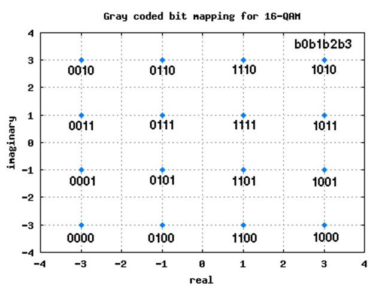 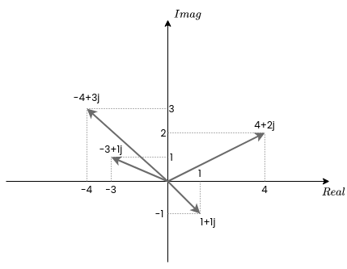

Каждое принятое из эфира значение - это пара `(a, b)`. Приёмник получает их **потоком**, десятки миллионов в секунду: одна секунда Wi-Fi в канале 160 МГц - это сотни миллионов чисел. Держать такое можно только в массивах-буферах, и обрабатывать пачками.

Комплексное число `a + bi` в памяти - просто два числа рядом, так что массив из трёх комплексных чисел - это массив из шести чисел:

```
[RE0, IM0, RE1, IM1, RE2, IM2]
```

где `RE` - Real (реальная часть, она же I), `IM` - Imaginary (мнимая, она же Q).

Теперь упакуем 10 комплексных чисел, каждая часть по 16 бит - два рабочих варианта.

По компоненте на элемент:
```c
short iq[20]; // [I0, Q0, I1, Q1, …]
// iq[2 * i]     - компонента I числа i
// iq[2 * i + 1] - компонента Q числа i
```

Или целое число (32 бита) в одном `int`:
```c
int iq_packed[10];
// число целиком: iq_packed[i]
// компонента I:  iq_packed[i] & 0xFFFF
// компонента Q:  (iq_packed[i] >> 16) & 0xFFFF
```

Второй вариант - прямое применение [битовых операций](../4_bitwise_ops/lecture.md): один 32-битный `int` разбирается на две 16-битные половинки. Так экономят память и трафик.

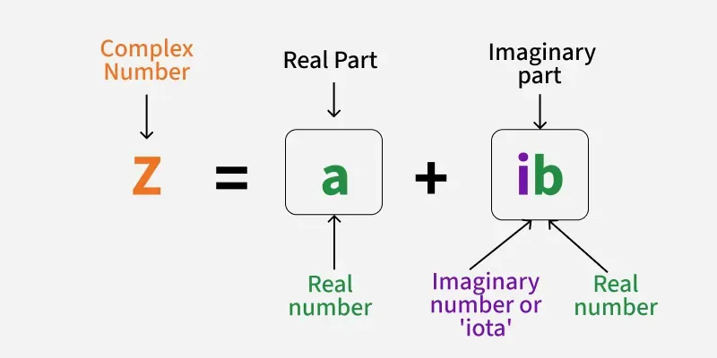

Осталось упомянуть OFDM, на котором стоят Wi-Fi, LTE и 5G. Он делит канал на десятки-тысячи **поднесущих**. На одном символе OFDM выходит массив из сотен комплексных чисел, и дальше его прогоняют через **FFT** - специальный быстрый алгоритм для массивов. Считать такое "в лоб" было бы слишком долго, а FFT успевает миллионы раз в секунду: без него не было бы ни видео по воздуху, ни мобильного интернета.


Ещё массивы - это векторы. Именно так нейросети описывают слово, картинку или пользователя: набором чисел. У слова "кот" есть вектор из 768 чисел (по-английски - embedding), а близость по смыслу считается через **скалярное произведение** - тот же цикл по массиву:

```c
int dot(int n, const int a[n], const int b[n]) {
    int sum = 0;
    for (int i = 0; i < n; i++) {
        sum += a[i] * b[i];
    }
    return sum;
}
```

Чем больше число, тем ближе по смыслу. На таких векторах работает поиск по смыслу, рекомендации и весь современный ИИ, а чисел в векторе у настоящих моделей - сотни и тысячи. Игрушечный пример с "котёнком" - [similarity.c](src/similarity.c).

Про 2026 год стоит сказать отдельно: ИИ-помощник легко сгенерирует вам сотню циклов по массивам. Но границы он тоже может перепутать (`< n` или `<= n`, `arr[n-1]` или `arr[n]`), а компилятор такое ловит не всегда. Так что массивы надо понимать не меньше, а больше: писать код теперь может и робот, а отвечать за выход за границы - вам.

##  3. <a name='3'></a>Случайные числа

Как заполнить массив случайными числами? Поможет `rand()` из `<stdlib.h>`.

`rand()` возвращает псевдослучайное **целое** число от `0` до `RAND_MAX`.

```c
#include <stdlib.h>

int r = rand(); // 1804289383
```

Запустите это несколько раз - и увидите **одно и то же** число. Потому что `rand()` **псевдослучайный**: он считает числа по формуле, а не бросает кубик. Стартовое число этой формулы (зерно, **seed**) по умолчанию фиксировано.

Чтобы числа менялись от запуска к запуску, задают seed функцией `srand()`. Классический источник seed - текущее время:

- `time()` возвращает количество секунд с 00:00:00 UTC 1 января 1970 года - **Unix timestamp** (меняется каждую секунду).

Полный пример [random.c](src/random.c):

```c
#include <stdio.h>
#include <stdlib.h>
#include <time.h>

int main(void) {
    printf("rand() = %d\n", rand()); // всегда 1804289383

    srand(time(NULL)); // seed. Достаточно вызвать 1 раз за программу
    printf("Unix timestamp = %ld\n", time(NULL));
    printf("Random [0..99] = %d\n", rand() % 100);

    return 0;
}
```

**Важно:** `srand(time(NULL))` вызываем **один раз** в начале программы (обычно первым делом в `main`). Если вызвать в цикле, где всё происходит за наносекунды, `time()` вернёт одно и то же значение и числа повторятся.

Как получить нужный диапазон?

```c
rand() % 100                     // [0..99]
rand() % 100 + 1                 // [1..100]
rand() % 100 - 50                // [-50..49]
min + rand() % (max - min + 1)   // [min..max]
```

Напишем удобную функцию:

```c
int rand_range(int min, int max) {
    return min + rand() % (max - min + 1);
}
```

Заполняем массив:
```c
#define N 10
int arr[N];
for (int i = 0; i < N; i++) {
    arr[i] = rand_range(-30, 35); // температура на улице, C
}
```

`rand()` - легаси из 70-х: качество чисел так себе, а `% n` даёт лёгкий перекос (modulo bias), когда диапазон не делит `RAND_MAX` ровно. Для лабы, игры или заполнения массива - нормально. Для криптографии и серьёзной статистики берут другие генераторы (например `getrandom()` в Linux). "Случайность" в компьютере всё равно вычисляется по формуле, а значит её можно предсказать - это и удобно (повторяемость при отладке), и опасно (предсказуемость там, где нужна настоящая случайность).

Случайные числа нужны не только чтобы заполнить массив, но и чтобы его **перемешать** - колода карт, плейлист, порядок вопросов в тесте. Для этого есть тасование Фишера-Йетса: идём с конца и меняем текущий элемент со случайным из ещё не перемешанной части:

```c
for (int i = n - 1; i > 0; i--) {
    int j = rand() % (i + 1); // индекс от 0 до i включительно
    int tmp = arr[i];
    arr[i] = arr[j];
    arr[j] = tmp;
}
```

Частая ошибка - бегать по всему массиву и менять `arr[i]` со случайным из всего массива. Тогда одни перестановки выпадают чаще других, и "случайность" на глаз выглядит странно: песни как будто липнут друг к другу, а нужный трек всё не выпадает. На такой перекос жаловались пользователи музыкальных сервисов, поэтому их "умный шаффл" иногда повторяется реже, чем настоящая случайность.

Колода из 52 карт целиком - [shuffle.c](src/shuffle.c).

**Самостоятельно:** заполнить массив размером N случайными числами от 0 до 999 и найти в нём минимальный элемент - вывести его и его индекс на экран.

##  4. <a name='4'></a>Матрицы

Продолжаем аналогию. Переменная - коробка, массив - шкаф с коробками, а **матрица - комната со шкафами**.


Массивы бывают не только одномерными. **Двумерный** массив обычно называют **матрицей**, потому что он выглядит как таблица со строками и столбцами. Индексы по-прежнему начинаются с **нуля**!

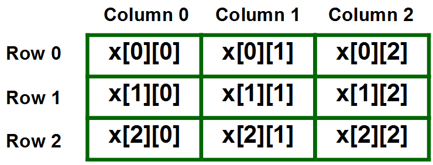

###  4.1. <a name='4.1'></a>Объявление и инициализация

Для двумерного массива нужны две пары квадратных скобок: `имя[строки][столбцы]`.

```c
#define ROWS 3
#define COLS 4

int m[ROWS][COLS]; // 3 строки, 4 столбца
```

Первый индекс - **строка** (row), второй - **столбец** (column). Доступ: `m[i][j]`, где `i` - номер строки, `j` - номер столбца.

Варианты инициализации:
```c
// Полная - по строкам, как в тетради
int a[2][3] = {
    {1, 2, 3},
    {4, 5, 6}
};

// То же самое, но в одну строку (браузер читает так же)
int b[2][3] = {1, 2, 3, 4, 5, 6};

// Недостающие элементы станут нулями; строки можно "недозаполнять"
int c[3][3] = {
    {1, 2},        // 1 2 0
    {4},           // 4 0 0
    {7, 8, 9}      // 7 8 9
};

// Всё нулями
int zeros[3][3] = {0};

// Designated initializers (С99)
int d[3][3] = {[0][0] = 1, [2][2] = 1}; // единичная матрица 3×3

// Размер по первой размерности можно не указывать
int grid[][3] = {{1, 2, 3}, {4, 5, 6}}; // размер посчитается сам: grid[2][3]
```

**Важно:** указывать нужно **обе** размерности: и количество строк, и количество столбцов. Компилятору это необходимо, чтобы знать, сколько памяти отвести под строку.

Для матриц заводите константы `ROWS`/`COLS` - иначе легко перепутать местами `i` и `j` и потом час искать, почему всё падает.

###  4.2. <a name='4.2'></a>Обход, ввод и вывод

Так как индексов два - и циклов тоже два, вложенных. Внешний цикл - по строкам, внутренний - по столбцам.

Заполним матрицу по формуле `m[i][j] = i + j + 1` и выведем [matrix.c](src/matrix.c):

```c
#define N 5

int matrix[N][N];

// Заполнение
for (int i = 0; i < N; i++) {       // идём по строкам
    for (int j = 0; j < N; j++) {   // идём по столбцам
        matrix[i][j] = i + j + 1;
    }
}

// Вывод
for (int i = 0; i < N; i++) {
    for (int j = 0; j < N; j++) {
        printf("%d ", matrix[i][j]);
    }
    printf("\n"); // в конце строки - перевод на новую
}
```

**Важно:** `printf` с элементом матрицы стоит внутри внутреннего цикла, а `printf("\n")` - **после** него. Забыли `\n` - и вся матрица выведется одной строкой. Именно так выглядит чаще всего задание "вывести матрицу красиво".

Чтобы столбцы были ровными, задают ширину поля:
```c
printf("%4d", matrix[i][j]); // каждое число минимум 4 символа
```

Ввод матрицы с клавиатуры:
```c
for (int i = 0; i < ROWS; i++) {
    for (int j = 0; j < COLS; j++) {
        scanf("%d", &matrix[i][j]); // здесь & нужен!
    }
}
```

Почему тут `&`, а для строк через `%s` - нет? Потому что `matrix[i][j]` - это одна `int`-переменная, и в `scanf` нужно передать её **адрес** (`&`). А `matrix` уже само по себе передаёт адрес начала. Подробнее - в разделе про строки.

**Самостоятельно:** заполнить матрицу N × M случайными числами и вывести её на экран. Затем найти среднее арифметическое всех элементов.

###  4.3. <a name='4.3'></a>Как матрица лежит в памяти

Матрица - это **не** "двумерный кусок памяти". Память линейна! Двумерность - удобная абстракция компилятора. В памяти матрица 3×3 лежит как три подряд идущих одномерных массива по 3 элемента (по строкам):

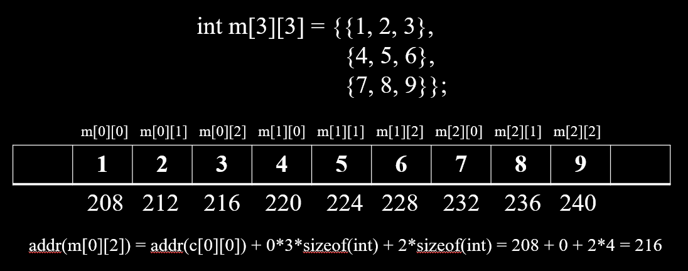

```c
int m[3][3] = {
    {1, 2, 3},   // в памяти первыми: 1 2 3
    {4, 5, 6},   // потом: 4 5 6
    {7, 8, 9}    // и последними: 7 8 9
};
// в памяти: 1 2 3 4 5 6 7 8 9
```

Такой порядок называется **row-major** (по строкам). Именно поэтому при обходе матрицы внешний цикл ставят по строкам: так мы идём по памяти последовательно, и процессор кэширует данные оптимально.

На практике это очень заметно: обход большой матрицы "не по порядку" может быть в разы медленнее только из-за кэша, хотя кода почти столько же. Подробно - в курсе по архитектуре, а пока правило простое: **внутренний цикл - по последнему индексу**.

###  4.4. <a name='4.4'></a>Диагонали

У квадратной матрицы есть две диагонали: **главная** (из левого верхнего угла в правый нижний) и **побочная** (из правого верхнего в левый нижний).

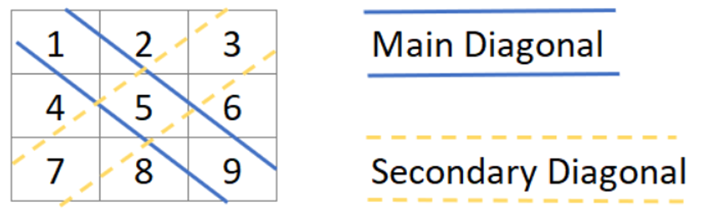

Главная диагональ: элемент лежит на ней, когда номер строки равен номеру столбца, т.е. `i == j`:

```c
for (int i = 0; i < N; i++) {
    printf("%d ", matrix[i][i]); // [0][0], [1][1], [2][2], …
}
printf("\n");
```

Побочная диагональ: индексы строки и столбца связаны формулой `i + j == N - 1`:

```c
for (int i = 0; i < N; i++) {
    printf("%d ", matrix[i][N - 1 - i]); // [0][N-1], [1][N-2], …
}
printf("\n");
```

Ещё пара задач на диагонали:
```c
// Сумма элементов главной диагонали
int sum = 0;
for (int i = 0; i < N; i++) {
    sum += m[i][i];
}

// Проверка: симметрична ли матрица относительно главной диагонали
int is_symmetric = 1;
for (int i = 0; i < N; i++) {
    for (int j = 0; j < N; j++) {
        if (m[i][j] != m[j][i]) {
            is_symmetric = 0;
        }
    }
}
```

**Через сравнение `if (i == j)` внутри двойного цикла тоже можно** - но это медленнее: мы пробегаем всю матрицу ради `N` элементов. Одним циклом короче и быстрее.

**Самостоятельно:** какая формула у побочной диагонали, если считать по столбцам, а не по строкам?

###  4.5. <a name='4.5'></a>Транспонирование

**Транспонирование** - отражение матрицы относительно главной диагонали: строка становится столбцом. `m[i][j]` меняется местами с `m[j][i]`.

Для квадратной матрицы можно сделать на месте, меняя только верхний треугольник (иначе обменяем дважды):

```c
// Квадратная матрица N × N
for (int i = 0; i < N; i++) {
    for (int j = i + 1; j < N; j++) { // j начинается с i+1 !!
        int tmp = m[i][j];
        m[i][j] = m[j][i];
        m[j][i] = tmp;
    }
}
```

`j = i + 1` тут не случайно: как в Перевороте массива, идём только по одной половине, иначе обменяем элементы дважды и получим исходную матрицу.

Для **неквадратной** матрицы ROWS × COLS транспонирование на месте невозможно (получится COLS × ROWS, размер другой), поэтому результат пишут в отдельный массив:

```c
int t[COLS][ROWS];
for (int i = 0; i < ROWS; i++) {
    for (int j = 0; j < COLS; j++) {
        t[j][i] = m[i][j]; // строки и столбцы поменялись местами
    }
}
```

**Самостоятельно:** для матрицы найти сумму элементов каждой строки и каждого столбца. Строка - один цикл по `j` при фиксированном `i`, столбец - наоборот. Готовый пример с обоими вариантами - в [matrix_ops.c](src/matrix_ops.c).

###  4.6. <a name='4.6'></a>Матрицы и функции

Матрица передаётся в функцию так же, как массив, но размерностей в параметре тоже две:

```c
void print_matrix(int rows, int cols, const int m[rows][cols]) {
    for (int i = 0; i < rows; i++) {
        for (int j = 0; j < cols; j++) {
            printf("%4d", m[i][j]);
        }
        printf("\n");
    }
}
```

Вызов:
```c
#define SHOPS 3
#define DAYS  4

// Выручка магазинов сети по дням, тыс. руб.
int sales[SHOPS][DAYS] = {
    {120, 150, 130, 170},
    {90,  110, 95,  140},
    {200, 180, 210, 230}
};
print_matrix(SHOPS, DAYS, sales);
```

**Важно:** `[rows][cols]` в параметре - это не украшение. Компилятору обязательно нужно знать **количество столбцов**, чтобы посчитать положение элемента в плоской памяти (i × cols + j). Количество строк можно не знать - поэтому `rows` приходит отдельным аргументом, как длина у одномерного массива.

Практический пример - сумма всех элементов [matrix_ops.c](src/matrix_ops.c):

```c
int sum_matrix(int rows, int cols, const int m[rows][cols]) {
    int sum = 0;
    for (int i = 0; i < rows; i++) {
        for (int j = 0; j < cols; j++) {
            sum += m[i][j];
        }
    }
    return sum;
}
```

Вернуть матрицу из функции нельзя - только простые типы. Поэтому функции либо работают с матрицей, которую им передали, либо возвращают число/индекс.

###  4.7. <a name='4.7'></a>Матрицы в реальности и 3D

Матрицы - рабочая лошадка очень многих областей:

- **Графика и игры.** Поворот, масштаб, сдвиг 3D-модели - это умножение на матрицу 4×4. Ваш персонаж двигается в игре именно так.
- **Картинки.** Чёрно-белая картинка - матрица яркостей, цветная - три матрицы (R, G, B).
- **Нейросети и ML.** В основе "нейронок" - умножение матриц на матрицы. Чем быстрее умножаем, тем быстрее обучается модель.
- **Таблицы данных.** Excel, база данных, журнал оценок - всё это таблицы, то есть матрицы.

Массивы бывают и трёхмерными: 3D-массив - это "квартира с комнатами со шкафами с коробками", 4D - дом с квартирами… и так далее.

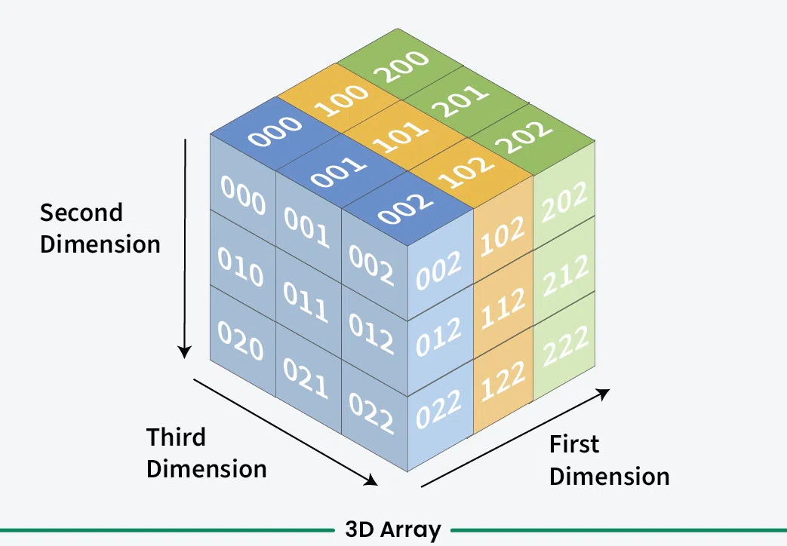

```c
#define X 2
#define Y 3
#define Z 4

int cube[X][Y][Z]; // 2 × 3 × 4
```

На практике больше 2-3 размерностей берут редко: чем больше мерностей, тем сложнее код и тем хуже он ложится в кэш. Если захотелось 5D-массив - скорее всего, структуру данных стоит пересмотреть.

На собеседованиях любят просить умножение матриц: `A[r][k]` на `B[k][c]`, результат в `C[r][c]`. Тройной цикл и формула C[i][j] += A[i][t] × B[t][j]. Попробуйте написать сами - отличная тренировка вложенных циклов.

И ещё одно применение рядом с радио - **MIMO**. Wi-Fi и 5G передают сразу с нескольких антенн и принимают на несколько (в 5G - до 256). Каждая пара "передающая-приёмная" даёт свой коэффициент искажения, и всё вместе это **матрица канала** `H`. Приёмник решает `y = H × x + noise`, где `x` - что передали, `y` - что приняли: обычное умножение матрицы на вектор, только в чипе вашего телефона.

###  4.8. <a name='4.8'></a>Свёртка: как размывают картинку

Картинка - это матрица яркостей. Размытие, повышение резкости, поиск границ - всё это **свёртка**: новое значение пикселя считается как взвешенная сумма его соседей.

Проще всего показать на размытии 3×3: новый пиксель - среднее арифметическое девяти соседей.

```c
#define H 4
#define W 4

void blur(int h, int w, int src[h][w], int dst[h][w]) {
    for (int i = 0; i < h; i++) {
        for (int j = 0; j < w; j++) {
            int sum = 0;
            int count = 0;

            for (int di = -1; di <= 1; di++) {
                for (int dj = -1; dj <= 1; dj++) {
                    int ni = i + di; // соседняя строка
                    int nj = j + dj; // соседний столбец
                    // проверка границ: за пределами матрицы не читаем!
                    if (ni >= 0 && ni < h && nj >= 0 && nj < w) {
                        sum += src[ni][nj];
                        count++;
                    }
                }
            }
            dst[i][j] = sum / count;
        }
    }
}
```

Тут важны две вещи. Первая - **проверка границ**: у краевых пикселей нет девяти соседей, и чтение `src[i - 1][j]` без проверки вылетит за массив. Вторая - результат пишем в **отдельную** матрицу: если писать сразу в `src`, то соседи, которые ещё не обработаны, уже окажутся размытыми и картинка "поплывёт" при движении слева-вправо-вниз. Полный пример [convolution.c](src/convolution.c).

Так же работают фильтры в Photoshop и соцсетях, и первые слои свёрточных нейросетей (CNN) - только там ядро посложнее, чем "все соседи по единице". И ещё тут хорошо видно, зачем матрице знать количество столбцов: позиция элемента в памяти считается как i × w + j, поэтому вторую размерность нельзя взять "из воздуха".

**Самостоятельно:** сделайте ядро для повышения резкости (центральный пиксель с большим весом, соседи - с отрицательным) либо напишите игру «Жизнь» Конвея: там вся логика тоже крутится вокруг соседей в матрице.

###  4.9. <a name='4.9'></a>Игра «Жизнь» Конвея

Ещё один способ поиграть с матрицей и соседями - **клеточный автомат**, самый известный из которых придумал Джон Конвей в 1970 году: игра «Жизнь».

Правила такие: каждая клетка матрицы живая (1) или мёртвая (0), а следующее поколение зависит от восьми соседей. Живая клетка с 2-3 соседями выживает, иначе умирает от скуки или перенаселения; мёртвая клетка, у которой ровно 3 соседа, рождается.

Правил - на три строчки, а поведение залипательное: по полю ползут «глайдеры», мигают «мигалки», появляются целые фабрики. Поиграться можно по запросу "игра жизнь Конвея" - и это хорошая тренировка вложенных циклов и проверок границ.

##  5. <a name='5'></a>Строки

Что выведет этот код?

```c
char c1 = 'H';
char c2 = 'i';
char c3 = '!';

printf("%c %c %c\n", c1, c2, c3);
printf("%d %d %d\n", c1, c2, c3);
```

Правильно: `H i !` и с новой строки - их **числовые коды по ASCII** (`72 105 33`). Потому что `char` - это маленькое целое число, а символ - просто договорённость, как это число рисовать.

###  5.1. <a name='5.1'></a>Символы, ASCII и UTF-8

Символ в компьютере - это число. Таблица соответствия "число - символ" называется **кодировкой**.

- **ASCII** - историческая таблица на 128 символов (латиница, цифры, знаки, спецсимволы вроде `\n` и `\0`). Один символ - 1 байт. Работает до сих пор, потому что компактно и просто.
- **UTF-8** - современная кодировка (победила везде: веб, Linux, JSON). Хитрость: ASCII-символы занимают в UTF-8 ровно 1 байт (обратная совместимость!), а русские буквы, эмодзи и прочее - 2-4 байта.

```c
printf("%c\n", 'A');     // A
printf("%d\n", 'A');     // 65 - код в ASCII
printf("%c\n", 'A' + 1); // B - с символами можно "арифметикать"
```

**Важно:** `'A'` - это **символ** (`char`, 1 знак, одинарные кавычки), `"A"` - это **строка** (массив символов, двойные кавычки). Это разные вещи.

В Си `char` - ровно 1 байт, а "символ" в UTF-8 может занимать несколько: `strlen("Привет")` не вернёт 6. Для русского текста и эмодзи нужны отдельные библиотеки - держите это в голове, когда будете делать что-то с текстом для людей.

###  5.2. <a name='5.2'></a>Строка - это массив символов, а нуль-терминатор её конец

В Си нет отдельного примитивного типа `string`. **Строка в Си - это массив `char`, в конце которого стоит особый символ - нуль-терминатор `'\0'`.**

```c
char s[] = "Hi!";
printf("%s\n", s); // Hi!
```
Полный пример в [string.c](src/string.c).

Пустые `[]` - компилятор сам посчитает размер. `%s` - формат для строки в `printf`.

Как компьютер понимает, где строка заканчивается? В памяти просто подряд идут символы. Если за строкой будет ещё одна, как отличить? Именно для этого придумали **нуль-терминатор** (`'\0'`, ASCII-код 0). `printf` выводит символы в цикле, пока не встретит `'\0'`:

```c
int i = 0;
while (s[i] != '\0') {
    putchar(s[i]);
    i++;
}
```

А почему `sizeof(s) == 4`, если символа 3? Потому что `"Hi!"` в памяти - это `{'H', 'i', '!', '\0'}` - 4 байта. Компилятор **добавляет** нуль-терминатор сам.

Оперативка:
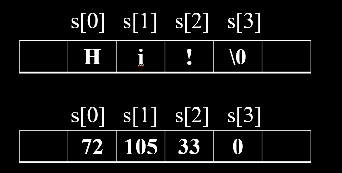

Отсюда следствия:
- строка из `k` символов требует минимум `k + 1` байт;
- `strlen()` возвращает длину **без** `'\0'`;
- если в массиве нет `'\0'`, `printf("%s")` побежит по памяти дальше и напечатает мусор (или упадёт).

Как объявить строку ещё:
```c
char a[] = "Hi!";                 // размер 4 (с '\0')
char b[10] = "Hi!";               // 10 байт: H i ! \0 \0 \0 \0 \0 \0 \0
char c[4] = {'H', 'i', '!', '\0'}; // то же, что a, но руками
```

**Самостоятельно:** вывести строку по символам, но в обратном порядке. Подсказка: сначала найди длину, потом иди циклом от `len - 1` до `0`.

###  5.3. <a name='5.3'></a>Ввод и вывод строк

Вывод. `printf("%s", s)`, `puts(s)` (добавляет `\n`), `putchar(c)` (один символ).

```c
char s[] = "Hi!";
printf("%s\n", s);
puts(s);             // то же самое, но перевод строки добавит сам
printf("%.2s\n", s); // Hi - "обрезать" вывод до 2 символов (иногда полезно)
```

Ввод. Есть два основных способа.

1) `scanf` со спецификатором `%s` - читает до первого пробела/перевода строки. `&` **не нужен**, потому что имя массива уже само по себе передаёт адрес первого элемента:

```c
char name[20];
printf("Enter name: ");
scanf("%s", name);
printf("Your name is %s\n", name);
```

Минусы: пробелы не читает (для `"Ivan Petrov"` получим только `"Ivan"`) и **не ограничивает** ввод по длине.

Почему `scanf` небезопасен?
```c
char buffer[8];
// Если ввести больше 7 символов (без учёта '\0'), получим переполнение буфера:
scanf("%s", buffer); // вылезем за границы массива
```
Это может сломать программу или привести к потере контроля над ней. Именно так когда-то взламывали программы (сейчас компиляторы защищают "канарейками", но лучше не полагаться на удачу).

Ограничить поле ввода можно так:
```c
char buffer[8];
scanf("%7s", buffer); // максимум 7 символов + '\0'
```

2) `fgets()` - современный и безопасный вариант. Читает строку **вместе с пробелами** и никогда не пишет больше, чем поместится:

```c
char name[20];
printf("Enter name: ");
fgets(name, sizeof(name), stdin); // stdin - стандартный поток ввода (клавиатура)
printf("My name is %s\n", name);
```

Про потоки: `stdin` - стандартный ввод, `stdout` - стандартный вывод, `stderr` - вывод ошибок.

Нюанс `fgets`: он оставляет `\n` в конце, если строка поместилась. Обычно перевод строки срезают:

```c
fgets(name, sizeof(name), stdin);

size_t len = strlen(name);
if (len > 0 && name[len - 1] == '\n') {
    name[len - 1] = '\0';
}
```

`scanf` встречается в основном в учебных задачах. В реальном коде строки читают через `fgets`: он безопаснее и читает пробелы.

###  5.4. <a name='5.4'></a>strlen и strcpy своими руками

Чтобы понять строки, полезно один раз написать базовые функции самому. Они удивительно короткие.

Длина строки:
```c
int my_strlen(const char s[]) {
    int len = 0;
    while (s[len] != '\0') {
        len++;
    }
    return len;
}
```
Идём по символам, пока не встретим `'\0'`. Отсюда и название - нуль-терминатор.

Копирование строки:
```c
void my_strcpy(char dest[], const char src[]) {
    int i = 0;
    while (src[i] != '\0') {
        dest[i] = src[i];
        i++;
    }
    dest[i] = '\0'; // не забываем закрыть строку!
}
```
Классическая ошибка - забыть `dest[i] = '\0'`. Тогда из строки будет торчать мусор, и `printf` поедет дальше по памяти.

Сравнение строк вручную:
```c
int my_strcmp(const char a[], const char b[]) {
    int i = 0;
    while (a[i] != '\0' && a[i] == b[i]) {
        i++;
    }
    return a[i] - b[i]; // 0 = равны, >0 = a больше, <0 = a меньше
}
```

`const` в параметрах (`const char s[]`) - хороший стиль: сообщаем компилятору и другим людям, что функция **не должна** менять строку на входе. Попробуем случайно - получим ошибку компиляции.

**Важно:** `sizeof` для строки в функции тоже не работает (строка приходит как ссылка на первый элемент). Длину берите через `strlen` или передавайте размер отдельно.

###  5.5. <a name='5.5'></a>Функции из string.h и ctype.h

Всё то, что мы написали выше, уже есть в стандартной библиотеке. Полный пример [string_h.c](src/string_h.c).

```c
#include <string.h>
```

- `strlen(s)` - длина строки без `'\0'`
- `strcpy(dest, src)` - копирование строки
- `strncpy(dest, src, n)` - то же, но не более `n` байт
- `strcmp(a, b)` - сравнение: `0` если равны
- `strncmp(a, b, n)` - сравнение первых `n` символов
- `strcat(dest, src)` - дописать `src` в конец `dest`
- `strncat(dest, src, n)` - то же, но не более `n` символов
- `fgets(s, n, stdin)` - ввод строки
- `puts(s)` - вывод строки плюс `\n`
- `strcspn(s, reject)` - длина "головы" строки до первого символа из `reject`

Значения `strcmp`:
- `0` - строки **равны**;
- `> 0` - первый различающийся символ в `a` больше, чем в `b`;
- `< 0` - меньше.

Пример:
```c
char login[128] = "ivan";             // логин пользователя
printf("Длина логина: %zu\n", strlen(login)); // 4

strcpy(login, "student");             // логин сменили
printf("Новый логин: %s\n", login);   // student

char email[128];                      // собираем email из логина и домена
strncpy(email, login, sizeof(email));
email[sizeof(email) - 1] = '\0';      // strncpy может не закрыть строку
strncat(email, "@sibguti.ru", sizeof(email) - strlen(email) - 1);
printf("Email: %s\n", email);         // student@sibguti.ru

if (strcmp(saved, entered) == 0) {    // проверка пароля при входе
    puts("Пароль верный");
}
```

Осторожно с `strcat` и `strcpy`: первый массив обязан быть достаточно большим, чтобы влезла вся получившаяся строка. Никаких проверок тут нет - переполнение снова на совести программиста. Безопаснее версии с `n`: `strncat`, `strncpy`.

Из `<ctype.h>` пригодятся функции для проверки и преобразования символов:
```c
#include <ctype.h>

isalpha(c); // буква?
isdigit(c); // цифра?
isspace(c); // пробел/таб/перевод строки?
isupper(c); // заглавная?
toupper(c); // в верхний регистр
tolower(c); // в нижний регистр
```
Пример: посчитать количество заглавных букв в строке:
```c
int count = 0;
for (int i = 0; str[i] != '\0'; i++) {
    if (isupper(str[i])) {
        count++;
    }
}
```

Ещё полезное:
```c
#include <stdlib.h>

atoi("123");  // строка в int
atof("3.14"); // строка в double
```
`atoi` пригодится, чтобы превратить число, введённое как строка, обратно в число.

Форматирование в строку (обратная операция к `printf`):
```c
#include <stdio.h>

char buffer[64];
snprintf(buffer, sizeof(buffer), "x = %d, y = %d", 10, 20);
printf("%s\n", buffer); // x = 10, y = 20
```
`snprintf` безопасен: не напишет больше `sizeof(buffer)`. Обычный `sprintf` не проверяет границы, и им легко переполнить буфер.

###  5.6. <a name='5.6'></a>Массив строк

Строка - это массив `char`, значит массив строк - это **массив массивов `char`**. Двумерный массив символов:

```c
char words[2][5] = {"Hi", "Bye"};

printf("%s\n", words[0]);  // "Hi"  - первая строка
printf("%s\n", words[1]);  // "Bye" - вторая строка

printf("%c%c\n", words[0][0], words[0][1]);                 // по символам: H i
printf("%c%c%c\n", words[1][0], words[1][1], words[1][2]);  // B y e
```

`words[i]` - это `i`-я строка целиком (её можно вывести через `%s`), а `words[i][j]` - `j`-й символ этой строки. По сути та же матрица, только из `char`.

**Важно:** второй размер (здесь `5`) - максимум **под каждую** строку, поэтому он должен покрывать самую длинную строку **плюс один байт** на `'\0'`. `"Bye"` - это 3 символа + `'\0'` = 4; взяли с запасом 5.

```c
#define MAX_LEN 20
#define WORDS   3

char names[WORDS][MAX_LEN] = {"Pasha", "Masha", "Dasha"};

for (int i = 0; i < WORDS; i++) {
    printf("%d: %s\n", i, names[i]);
}
```

Это, пожалуй, самый практичный способ хранить список слов на этом этапе. В реальном коде для этого чаще используют другой способ (динамические строки разной длины), но это тема следующих лекций.

**Самостоятельно:** дан массив слов. Вывести все слова, которые начинаются с буквы `'M'`. Или: посчитать суммарное количество гласных букв во всех словах.

###  5.7. <a name='5.7'></a>Частые ошибки со строками

1. **Сравнение строк через `==`:**
   ```c
   char a[] = "hi";
   char b[] = "hi";
   if (a == b) { /* СЮДА НЕ ЗАЙДЁТ */ }
   ```
   `==` сравнивает **не текст**, а где эти строки лежат в памяти. Для содержимого нужен `strcmp(a, b) == 0`.

2. **Забыли `'\0'`.** Написали символы в массив руками, но не закрыли строку - и `printf("%s")` поехал по мусору.

3. **Мало места.** `char name[3] = "Vasya";` - переполнение. Считайте: длина + 1.

4. **`strcat`/`strcpy` без запаса.** Складываем 2 строки - проверьте, влезает ли результат в первый массив.

5. **`strncpy` может не поставить `'\0'`,** если исходная строка длиннее `n`. После него безопасно выставить последний байт в `'\0'` вручную.

6. **`fgets` оставляет `\n`.** Если сравниваете результат `strcmp(name, "exit")`, лишний `\n` ломает сравнение - срезайте его (см. 5.3).

7. **`%c` vs `%s`.** `%c` - один символ, `%s` - строка. Перепутали - получили не то, что ожидали.

8. **Русский текст.** `char` = 1 байт, а UTF-8-символ может занимать несколько байт, поэтому `strlen` для "Привет" не даст 6, а `s[1]` может попасть в середину буквы. Для серьёзной работы с Unicode - отдельные библиотеки.

###  5.8. <a name='5.8'></a>Мини-задачи и примеры

Всё вместе в [strings_extra.c](src/strings_extra.c).

Палиндром (читается одинаково в обе стороны, без учёта регистра):
```c
int is_palindrome(const char s[]) {
    int i = 0;
    int j = my_strlen(s) - 1;

    while (i < j) {
        char left  = tolower(s[i]);
        char right = tolower(s[j]);
        if (left != right) {
            return 0;
        }
        i++;
        j--;
    }
    return 1;
}
```
Здесь тот же приём с двумя границами: вместо элементов массива мы двигаем индексы строки навстречу - `i` с начала, `j` с конца.

Сколько раз встречается символ:
```c
int count_char(const char s[], char target) {
    int count = 0;
    for (int i = 0; s[i] != '\0'; i++) {
        if (s[i] == target) {
            count++;
        }
    }
    return count;
}
```

Перевод в верхний регистр на месте:
```c
void to_upper(char s[]) {
    for (int i = 0; s[i] != '\0'; i++) {
        s[i] = (char)toupper(s[i]);
    }
}
```

Развернуть строку на месте:
```c
void reverse(char s[]) {
    int n = my_strlen(s);
    for (int i = 0; i < n / 2; i++) {
        char tmp = s[i];
        s[i] = s[n - 1 - i];
        s[n - 1 - i] = tmp;
    }
}
```

Сумма, поиск, два индекса с разных концов, обмен - те же приёмы, что и для обычных массивов. Строка и есть массив `char` с `'\0'` на конце, без магии.

**Самостоятельно:** вытащить из поста все хэштеги. Пост - строка, слова разделены пробелами, хэштег начинается с `#`. Пройдите строку по символам и на каждом слове печатайте только то, что начинается с решётки - так же разбирают @упоминания и ссылки.

Если из всего раздела вынести только три вещи, то вот они: строка - это массив `char`, закрытый `'\0'`; под строку всегда нужно место "длина + 1"; а содержимое сравнивают через `strcmp`, потому что `==` смотрит не на текст, а на место в памяти.

##  6. <a name='6'></a>Время сортировать

**Сортировка** - алгоритм упорядочивания данных в массиве (по возрастанию или убыванию).

Зачем? С отсортированными данными проще и быстрее работать. В записной книжке телефона контакты отсортированы по алфавиту, товары в каталоге - по цене, посты - по дате. Отсортированный массив можно быстро просмотреть глазами и быстро искать (например, бинарным поиском, который невозможен на неотсортированных данных, а как он устроен - в конце раздела)

Алгоритмов сортировок много, и работают они с разной **эффективностью** (сложностью):

- Bubble Sort - пузырьковая
- Insertion Sort - вставками
- Selection Sort - выбором
- Counting Sort - подсчётом
- Radix Sort - поразрядная
- Merge Sort - слиянием
- Quick Sort - быстрая

Подробно - на СиАОД, а нам достаточно понять идеи и минимум кода.

Сначала swap. Почти каждая сортировка меняет элементы местами, а это требует временной переменной:

```c
int tmp = arr[0];
arr[0] = arr[1];
arr[1] = tmp;
```

Но вот так - **ошибка**, элементы не поменяются, второй затрёт первый:

```c
arr[0] = arr[1];
arr[1] = arr[0]; // теперь оба равны старому arr[1]
```

Имя `tmp` (или `temp`) - от слова temporary (временный).

###  6.1. <a name='6.1'></a>Bubble sort

Самая простая для понимания. Много раз проходим по массиву и сравниваем соседние элементы: если текущий больше следующего - меняем местами. Большие числа "всплывают" к концу, как пузырьки.

Псевдокод:
```
ДЛЯ i от 0 до n-1:
    ДЛЯ j от 0 до n-i-1:
        ЕСЛИ arr[j] > arr[j+1]:
            поменять местами arr[j] и arr[j+1]
```


На Си [bubble.c](src/bubble.c):
```c
void bubble_sort(int size, int arr[size]) {
    for (int i = 0; i < size; i++) {
        for (int j = 0; j < size - i - 1; j++) {
            if (arr[j] > arr[j + 1]) { // текущий больше следующего, меняем местами
                int tmp = arr[j];
                arr[j] = arr[j + 1];
                arr[j + 1] = tmp;
            }
        }
    }
}

// …
#define N 6
int prices[N] = {1290, 199, 450, 89, 640, 79}; // цены в каталоге
bubble_sort(N, prices); // отсортировано по возрастанию цены
```

Сортировку можно чуть ускорить: если за очередной проход не было ни одного swap, массив уже отсортирован - можно выйти:

```c
int swapped = 1;
for (int i = 0; i < size && swapped; i++) {
    swapped = 0;
    for (int j = 0; j < size - i - 1; j++) {
        if (arr[j] > arr[j + 1]) {
            int tmp = arr[j];
            arr[j] = arr[j + 1];
            arr[j + 1] = tmp;
            swapped = 1;
        }
    }
}
```

**Важно ещё раз:** массив **можно передать в функцию**, но **вернуть массив из функции нельзя**. Поэтому все сортировки меняют массив прямо на месте.

###  6.2. <a name='6.2'></a>Insertion Sort


Идём слева направо. Каждый новый элемент "вынимаем" и **вставляем** в правильное место среди уже отсортированной левой части. Отсортированная часть растёт с каждым шагом. Первый элемент считаем отсортированным - поэтому внешний цикл начинается с индекса 1.

Как в быту разбирают карты в руке: новую карту вставляют в нужное место между уже упорядоченными. На почти отсортированных данных это самый быстрый из трёх простых алгоритмов.

```c
void insertion_sort(int size, int arr[size]) {
    for (int i = 1; i < size; i++) {
        int key = arr[i];        // "вынимаем" текущий
        int j = i - 1;
        while (j >= 0 && arr[j] > key) {
            arr[j + 1] = arr[j]; // сдвигаем большие вправо
            j--;
        }
        arr[j + 1] = key;        // вставляем на место
    }
}
```

###  6.3. <a name='6.3'></a>Selection Sort


Находим минимальный элемент в ещё не отсортированной части и ставим его в начало этой части. Повторяем. Здесь swap происходит максимум `n-1` раз - это плюс, когда обмен элементов "дорогой".

```c
void selection_sort(int size, int arr[size]) {
    for (int i = 0; i < size - 1; i++) {
        int min_index = i;
        for (int j = i + 1; j < size; j++) {
            if (arr[j] < arr[min_index]) {
                min_index = j;
            }
        }
        int tmp = arr[i];
        arr[i] = arr[min_index];
        arr[min_index] = tmp;
    }
}
```

###  6.4. <a name='6.4'></a>Counting Sort и Radix Sort

Эти сортировки одни из самых быстрых, и им **не нужно сравнивать** элементы между собой.

**Counting Sort** работает, когда значения лежат в небольшом известном диапазоне. Идея: заводим массив-счётчик `count` размером с диапазон и считаем, сколько раз встречается каждое значение:

```c
count[arr[i]]++;  // arr - сортируемый массив, count - счётчик
```

Потом проходим по `count` по порядку и печатаем значения столько раз, сколько насчитали - массив выходит отсортированным. Два раза встретилась единица? Выведем два раза. Картинка:

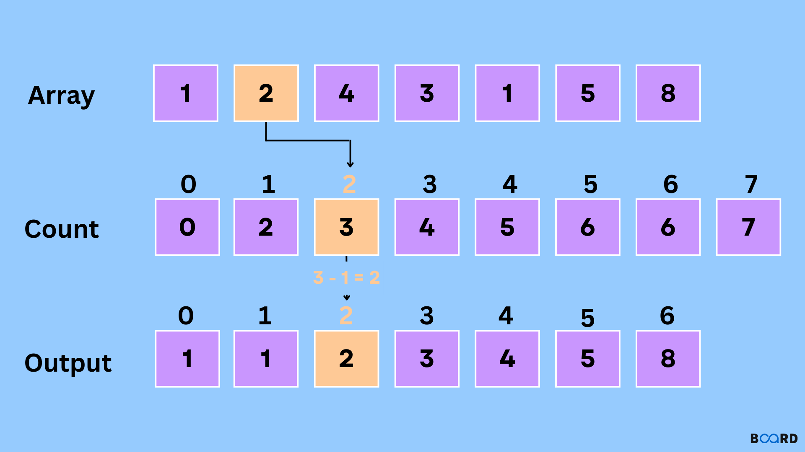

Нюансы уже видны: если числа от 0 до 1 000 000, то массив `count` будет на миллион элементов - память улетает, а отрицательные числа так просто не засунуть. Поэтому метод не универсален.

**Radix Sort** сортирует по разрядам: сначала по младшему, потом по следующему и так далее. Для десятичной системы:

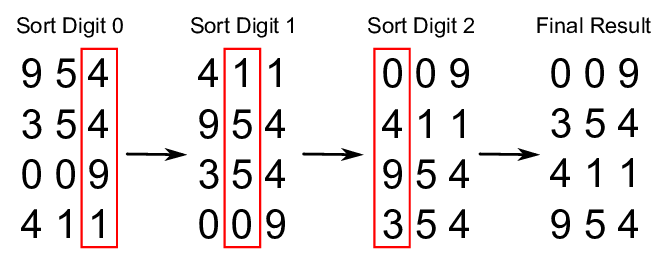

То же самое работает и в двоичной системе.

Плюсы: быстрые и без сравнений. Минус: применимы не ко всем данным (нужны целые числа в известном диапазоне).

###  6.5. <a name='6.5'></a>Merge Sort и Quick Sort

Эти два - "взрослые" сортировки. Они сложнее, но в среднем дают `O(n log n)` вместо `O(n²)` у простых, и именно их идеи лежат в реальных библиотеках.

Quick Sort: выбираем **pivot** (опорный элемент), делим массив на "меньшие pivot" и "большие pivot", и рекурсивно сортируем половинки. Pivot выбирают по-разному (первый, последний, средний, случайный) - случайный берут, чтобы на неудачных данных не получить худший случай, когда pivot всегда крайний.


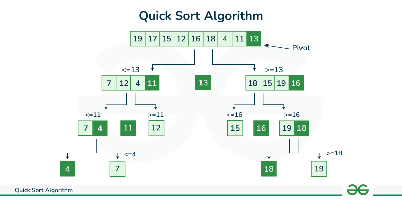

Merge Sort: делим массив ровно пополам, пока в частях не останется по 1-2 элемента, а потом **сливаем** (merge) отсортированные половинки в одну.

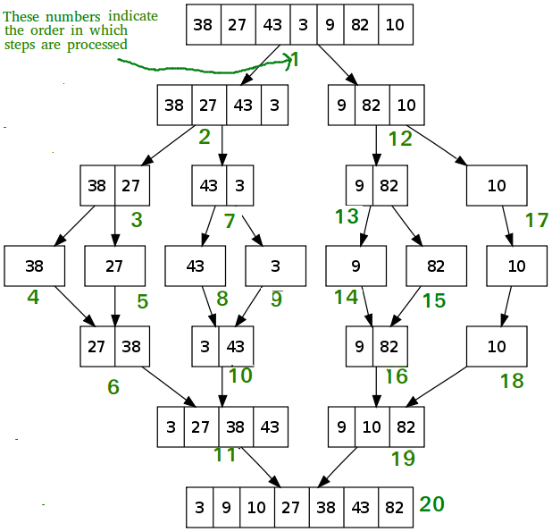

Обе сортировки хорошо распараллеливаются: половинки можно сортировать одновременно на разных ядрах, а потом собрать результат.

Про стандартную библиотеку: Знать сортировки полезно, но писать свою в реальном коде не нужно: в `<stdlib.h>` есть готовая `qsort()`, и обычно зовут её. Но её аргумент - **функция-компаратор**, а это тема функций высшего порядка, до неё дойдём позже. Пока - сортируем руками, чтобы понимать, что происходит под капотом.

###  6.6. <a name='6.6'></a>Bogo Sort и другие шуточные сортировки

Без шуточных сортировок никуда. **Bogo sort:** случайно переставляем элементы и **проверяем**, отсортировались ли. Не повезло - перемешиваем заново. И так до победы.


Для массива из 5 элементов иногда срабатывает. Для больших массивов ожидание измеряется веками, а теоретически может и не завершиться никогда, пока "везёт" плохо.

https://ru.wikipedia.org/wiki/Bogosort:

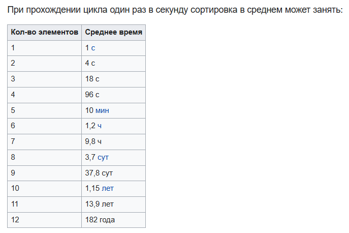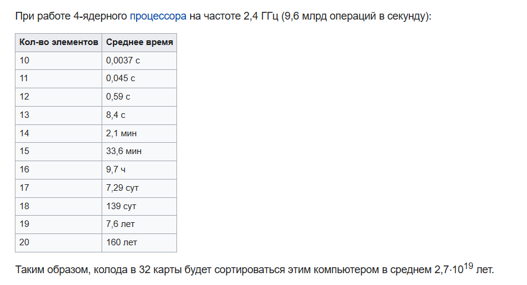

Такая сортировка может завершиться за один проход при любом размере массива - просто шанс маленький. **Но он есть.**

У bogo есть целая родня, и по ней хорошо видно, что "отсортировать массив" и "решить задачу сортировки" - не совсем одно и то же.

- **Bozo sort** - почти bogo, но меняем местами ровно два случайных элемента, а не всю перестановку. Чуть-чуть умнее, всё ещё безнадёжно.
- **Stalin sort** (сталинская) - идём слева направо и оставляем только те элементы, что не меньше предыдущего, остальные "удаляем". Один проход и гарантированный порядок, правда, уже не для всех данных:

```c
// Возвращает новый (уменьшенный) размер массива
int stalin_sort(int n, int arr[n]) {
    int j = 0; // сюда пишем элементы, которые остались
    for (int i = 1; i < n; i++) {
        if (arr[i] >= arr[j]) {
            arr[++j] = arr[i]; // элемент проходит
        }
        // иначе элемент "удалён"
    }
    return j + 1;
}
```

- **Thanos sort** (таносовская) - случайно удаляем половину массива; не отсортировался - удаляем ещё половину.
- **Sleep sort** - на каждое число запускаем свой поток, который "спит" это число секунд, а потом печатает его. Числа выстраиваются по времени, но работает только для неотрицательных и ждать придётся долго.
- **Miracle sort** - проверяем, отсортирован ли массив, и если нет, то просто ждём и проверяем снова. Вдруг случится чудо.
- **Quantum bogosort** - генерируем все перестановки сразу во всех вселенных и объявляем правильной ту вселенную, где массив уже отсортирован. `O(n)`, но требует мультивселенную.
- **Intelligent design sort** - массив отсортирован по определению, вероятность случайно получить отсортированный `1/n!`, так что делать ничего не надо.

Смысл всей этой коллекции не в том, чтобы её писать, а в том, что **сложность алгоритма - не абстракция**: она решает, будет сортировка работать или превратится в шутку.

###  6.7. <a name='6.7'></a>Сложность сортировок

Ещё раз всё вместе - кто из сортировок чем платит:
| Сортировка | Лучший | Средний | Худший | Память |
| --- | --- | --- | --- | --- |
| Bubble | O(n) | O(n²) | O(n²) | O(1) |
| Insertion | O(n) | O(n²) | O(n²) | O(1) |
| Selection | O(n²) | O(n²) | O(n²) | O(1) |
| Counting | O(n+k) | O(n+k) | O(n+k) | O(k) |
| Merge | O(n log n) | O(n log n) | O(n log n) | O(n) |
| Quick | O(n log n) | O(n log n) | O(n²) | O(log n) |
| Bogo | O(n) | O(n*n!) | бесконечно | O(1) |

Константы и множители отбрасывают: `3n + 100` и `n` - оба `O(n)`, потому что при больших `n` важен характер роста, а не множитель. По умолчанию говорят про **худший случай** - так гарантия честнее; средний указывают отдельно (у Quick Sort средний `O(n log n)`, а худший `O(n²)`).

Запись ещё и упрощают: оставляем только самый "тяжёлый" член и выбрасываем множители:

```
O(2n)      = O(n)
O(3n)      = O(n)
O(10000*n²) = O(n²)
O(n² + n)  = O(n²)
O(n²) + O(log n)      = O(n²)
O(n³ + 100*n*log n)   = O(n³)
O(n! + 999) = O(n!)
```

Посмотрим на числах:

| n | O(log n) | O(n) | O(n log n) | O(n²) | O(2ⁿ) |
| --- | --- | --- | --- | --- | --- |
| 10 | 3 | 10 | 33 | 100 | 1024 |
| 1 000 | 10 | 1 000 | 10 000 | 1 000 000 | слишком много |
| 1 000 000 | 20 | 1 000 000 | ≈2*10⁷ | 10¹² | невозможно |
| 1 000 000 000 | 30 | 10⁹ | ≈3*10¹⁰ | 10¹⁸ | никогда |

###  6.8. <a name='6.8'></a>Бинарный поиск: зачем сортировать
Вот и ответ, зачем мы всё это сортировали: в **отсортированном** массиве элемент находится за `O(log n)`. Делим массив пополам и выбрасываем ту половину, где элемента точно нет.

```c
int binary_search(int n, int arr[n], int value) {
    int left = 0;
    int right = n - 1;

    while (left <= right) {
        int mid = left + (right - left) / 2; // так не переполнится
        if (arr[mid] == value) {
            return mid;
        }
        if (arr[mid] < value) {
            left = mid + 1; // ищем справа
        } else {
            right = mid - 1; // ищем слева
        }
    }
    return -1;
}
```

На миллионе элементов это максимум 20 шагов. Но только на отсортированном массиве - на несортированном бинарный поиск бесполезен. В `<stdlib.h>` есть готовая `bsearch()`, но она требует указателей, так что пока пишем сами. Окно, префиксные суммы и бинарный поиск собраны в [array_advanced.c](src/array_advanced.c).

##  7. <a name='7'></a>Сложность алгоритмов

Немного про то, как измерять алгоритмы. **Сложность** - это про ресурсы, которых требует алгоритм: **время** и **память** (time and space complexity). Про время и говорит запись **O(f(n))** - это "скорость роста" работы при росте входных данных. Не количество секунд, а ответ на вопрос: во сколько раз больше работы станет, если данных будет в 10 раз больше?


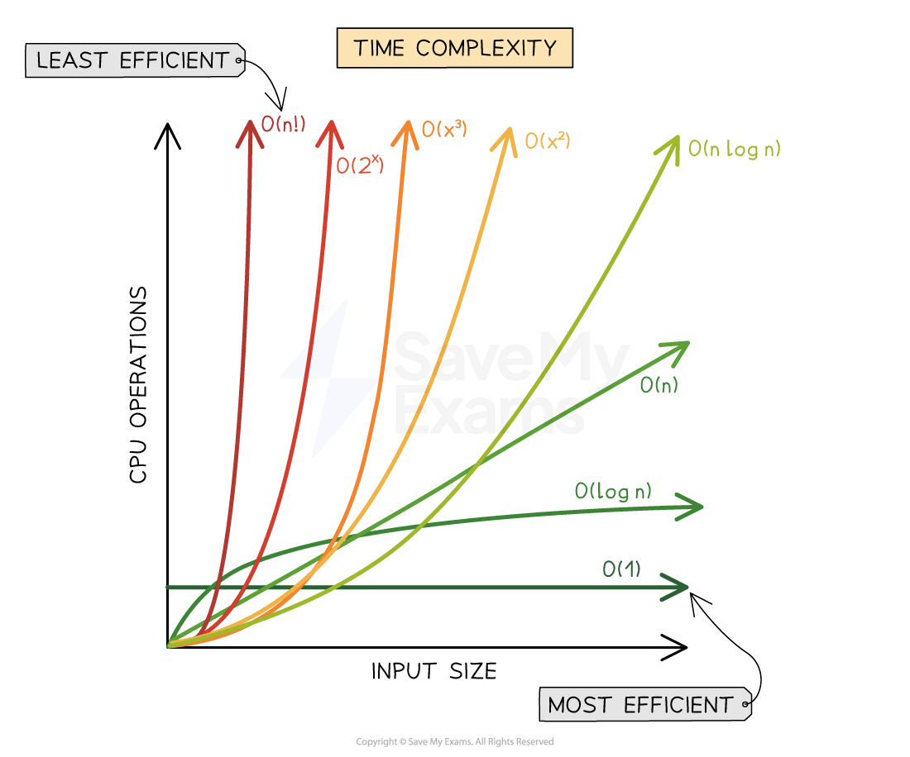

Вот почему алгоритмы уровня `n log n` берут в реальные проекты: на миллионе элементов `n²` - это ≈10¹² операций, а `n log n` - всего ≈2*10⁷. Это не "чуть быстрее", а "работает против не работает".

Насколько это чувствуется на практике? Пусть обработка одного элемента занимает 1 мс. Тогда найти элемент среди 1 000 000 линейным поиском - это ≈11 дней, а бинарным - ≈20 мс. Разница в 50 миллионов раз, и это и есть магия Big O: не "немного быстрее", а "никогда против мгновенно".

Сложность можно прикинуть прямо по коду: смотришь на циклы и держишь в голове готовые примеры:

- один проход по массиву (сумма, максимум, линейный поиск) - это `O(n)`;
- доступ к элементу по индексу `arr[i]` - `O(1)`, размер массива тут ни при чём;
- два **вложенных** цикла по `n`: перемножаем, получаем `O(n²)`;
- три вложенных цикла - уже `O(n³)`;
- два цикла **подряд** (не вложенных): складываем, выходит `O(n + m)`;
- каждый шаг делит диапазон пополам (`n/2`, потом `n/4`…) - это `O(log n)`;
- деление пополам **плюс** проход по массиву - `O(n log n)`;
- наивная рекурсия Фибоначчи `fib(n-1) + fib(n-2)` - `O(2ⁿ)`;
- перебор всех перестановок - `O(n!)`.

Посчитайте глазами, сколько операций сделает код при `n = 1000`:
```c
int sum = 0;
for (int i = 0; i < n; i++) {
    for (int j = 0; j < n; j++) {
        sum += i * j;
    }
}
```
Вложенные циклы по `n` дадут примерно `10⁶` операций, то есть `O(n²)`.

Память тоже считают, и колонка «Память» в таблицах сложности - не для красоты:

- `O(1)` - работаем на месте, дополнительная память не нужна;
- `O(n)` - нужен второй массив размером с исходный;
- `O(log n)` - глубина рекурсии растёт как `log n`.

Конкретные примеры, кто из алгоритмов сколько памяти ест, есть в таблице сложностей сортировок.


Иногда выгоднее потратить память и получить скорость - обычный инженерный размен.

`O(...)` - это про рост, а не про секунды: два алгоритма с одинаковым `O` могут отличаться в разы: решают константа и кэш (вспомните row-major из раздела про матрицы - тот же `O(n²)`, но обход "не по порядку" медленнее). Поэтому `O` говорит про масштаб, а не про "быстрее на пару миллисекунд".

И не спешите всё оптимизировать: преждевременная оптимизация - источник зла, ещё Кнут в 1974 написал. Сначала понятный и правильный код, потом замер там, где реально болит. Программа, которая быстро выдаёт неправильный ответ, обычно никому не нужна.

Оцените сложность функций, ответы - под спойлером.

```c
int find_max(int n, int arr[n]) {
    int max = arr[0];
    for (int i = 1; i < n; i++) {
        if (arr[i] > max) {
            max = arr[i];
        }
    }
    return max;
}
```
<details>
<summary>Ответ</summary>
`O(n)` - один проход по массиву.
</details>

```c
int sum_of_pairs(int n, int arr[n]) {
    int sum = 0;
    for (int i = 0; i < n; i++) {
        for (int j = 0; j < n; j++) {
            sum += arr[i] + arr[j];
        }
    }
    return sum;
}
```
<details>
<summary>Ответ</summary>
`O(n²)` - два вложенных цикла по `n`.
</details>

```c
const int keys[] = {0x0, 0xDEADBEEF, 0xC0FFEE, 0xFFFF};

int get_key(int n) {
    return keys[n];
}
```
<details>
<summary>Ответ</summary>
`O(1)` - одно обращение к элементу, размер массива тут ни при чём.
</details>

Операции для разных `O` можно посчитать руками - в [complexity.c](src/complexity.c). За подробностями по сложности - на СиАОД.

И главное: даже мощный суперкомпьютер плохой алгоритм превратит в калькулятор, а хороший алгоритм посчитает всё шустро и на стареньком ноуте.

##  8. <a name='8'></a>Приёмы: окно и префиксные суммы
Начнём со скользящего окна. Владелец кофейни хочет узнать, какие 3 дня подряд дали больше всего выручки (чтобы понять, что реально влияет на поток гостей). Выручка по дням лежит в массиве `revenue`, и в лоб пришлось бы для каждой позиции заново складывать три числа - это `O(n·k)`, где `n` - число дней, а `k` - длина окна. Но при сдвиге окна на один день меняются всего два числа: уходит самый старый день, приходит новый.

```c
// revenue[] - выручка по дням, k - сколько дней подряд
int best_window(int n, const int revenue[n], int k) {
    int sum = 0;
    for (int i = 0; i < k; i++) {
        sum += revenue[i];        // первое окно
    }
    int best = sum;
    for (int i = k; i < n; i++) {
        sum += revenue[i] - revenue[i - k];
        if (sum > best) {
            best = sum;
        }
    }
    return best;
}
```

Один проход вместо двух вложенных циклов - `O(n)`.

Теперь префиксные суммы. Вопрос из зала: "а сколько выручки было со 2-го по 4-й день?". Если такие отрезки спрашивают часто (аналитика, банковские приложения, статистика в играх), каждый раз складывать заново долго.

Считаем так же, как накопительный итог в чеке: если он есть, то сумму позиций со 2-й по 4-ю можно получить, вычтя один итог из другого. Пересчитывать ничего не нужно.

Один раз пройдём по массиву и запишем накопительные суммы:

```
дни:      1     2     3     4     5
выручка: 1500  2200  1800   900  2600

prefix[0] = 0        // ещё ничего не прошло
prefix[1] = 1500     // за 1 день
prefix[2] = 3700     // за первые 2 дня (1500 + 2200)
prefix[3] = 5500     // за первые 3 дня
prefix[4] = 6400     // за первые 4 дня
prefix[5] = 9000     // за первые 5 дней
```

Выручка за дни со 2-го по 4-й - это `prefix[4] - prefix[1]` = 6400 - 1500 = **4900** (2200 + 1800 + 900). Почему так: до 4-го дня включительно накопилось 6400, а до 2-го дня (не считая его) - 1500. Разность и есть нужный отрезок.

```c
// prefix[i] - сколько пришло за первые i дней
int prefix[n + 1];
prefix[0] = 0;
for (int i = 0; i < n; i++) {
    prefix[i + 1] = prefix[i] + revenue[i];
}
// выручка за дни l..r (l и r - индексы массива, 0 - первый день)
int period = prefix[r + 1] - prefix[l];
```

По массиву проходим один раз, а дальше любой отрезок - одно вычитание. Готовые примеры окон и префиксов - в [array_advanced.c](src/array_advanced.c).

**Самостоятельно:** по массиву температур найти отрезок из `k` дней, где погода в среднем самая жаркая. Это та же задача про окно.
