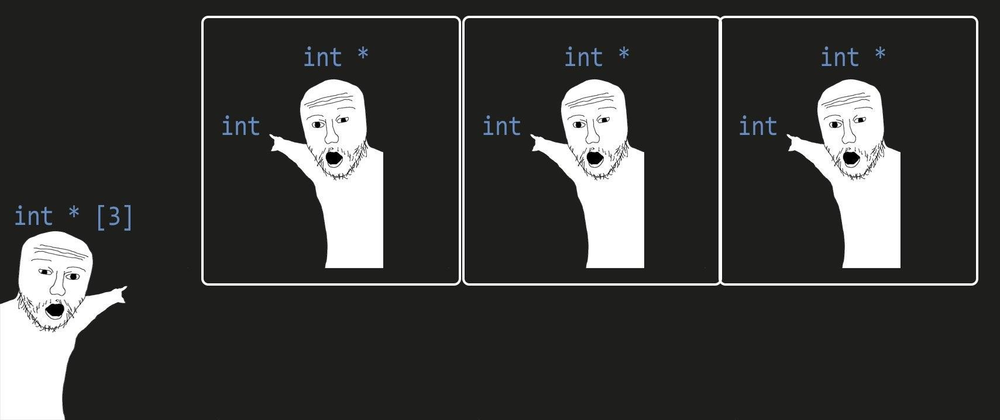
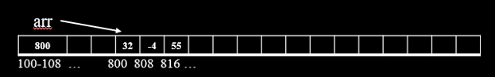
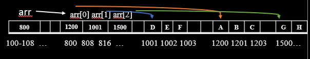
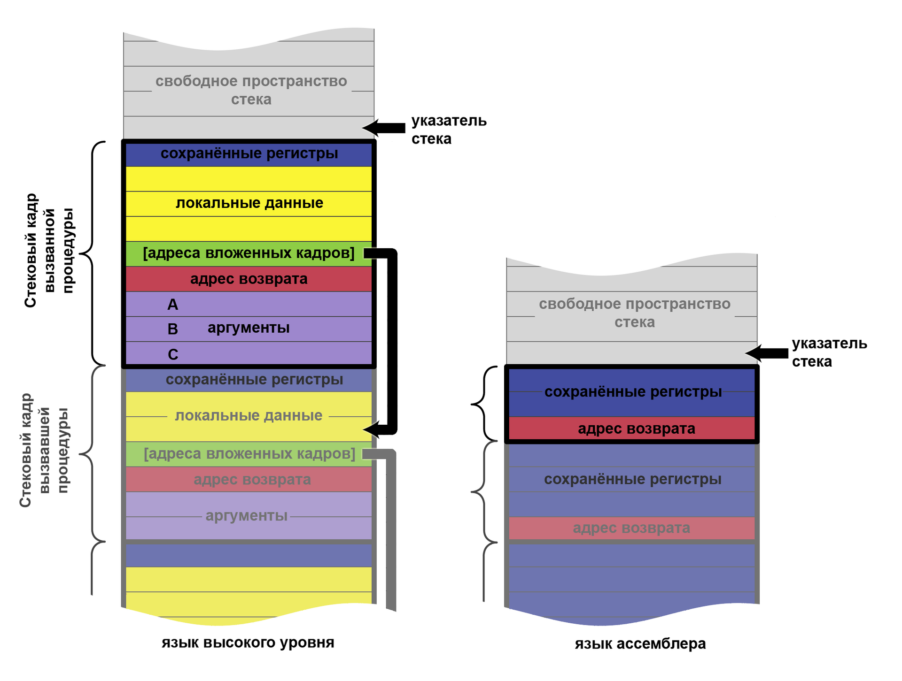
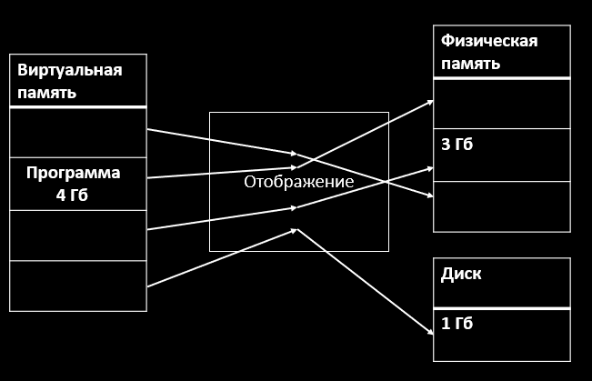
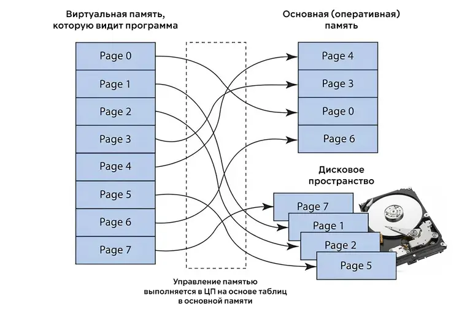
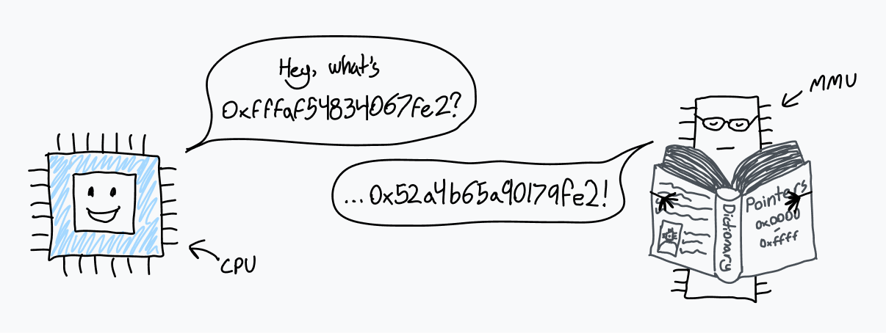

<!-- vscode-markdown-toc -->
* 1. [Address](#1)
* 2. [Pointers](#2)
	* 2.1. [Void pointer](#2.1)
	* 2.2. [NULL](#2.2)
	* 2.3. [Загадка](#2.3)
* 3. [Pointer to pointer](#3)
	* 3.1. [Еще загадка](#3.1)
* 4. [Pointer arithmetics](#4)
* 5. [Endianness](#5)
	* 5.1. [Читаем байты из памяти](#5.1)
* 6. [Dynamic arrays](#6)
	* 6.1. [malloc()](#6.1)
	* 6.2. [free](#6.2)
		* 6.2.1. [memory leak](#6.2.1)
		* 6.2.2. [double free](#6.2.2)
	* 6.3. [calloc()](#6.3)
	* 6.4. [realloc()](#6.4)
	* 6.5. [N-dimensional arrays](#6.5)
* 7. [Variable scope](#7)
* 8. [Stack vs Heap](#8)
* 9. [Модель памяти Языка Си](#9)
* 10. [Virtual and Physical memory](#10)

<!-- vscode-markdown-toc-config
	numbering=true
	autoSave=true
	/vscode-markdown-toc-config -->
<!-- /vscode-markdown-toc -->

# Pointers

Интернал поинтар вэриабл..  ват из зис?                 

             

Это одна из тяжелых тем в языке Си для понимания. Во многих ЯП вы не найдете указатели, их спрятали, чтобы сберечь нервы для разработки на высоком уровне.          
Однако язык Си позволяет работать с указателями, что означает, что мы можем напрямую обращаться к памяти, эффективно управляя ею. Например,указатели позволяют забирать несколько значений из функций, передавать здоровенные переменные в функции, не копируя их. Открывают мир динамический массивов и структур данных (связанные списки, деревья и прочие важные и сложные штуки). В конце концов для работы с железками без указателей не обойтись..                                                                   

##  1. <a name='1'></a>Address

Например, возьмем какой-нибудь телевизор с 4 ГБ оперативной памяти, если ее разложить в одну линию на ячейки по 1 байту, то получим 4 млрд ячеек. Каждая такая ячейка будет иметь свой адрес - порядкой номер байта с 0.          

Допустим возьмем массив из 3 чисел и некоторую переменную.                           
```c
int scores[3] = {77, 43, 100};
char ch = 'a';
```
Попробуем представить как это будет лежать в оперативной памяти:                                  
                      

Все это похоже на один оооочень длинный массив байт, где индексы этого массива - **есть адреса** (строка с Address), а значения массива - **значения, что хранятся в памяти** (строка Value)                          

Кстати, а мы ведь уже встречались с операцией взятия адреса - `&` когда использовали scanf для чтения чисел с клавиатуры, попробуем посмотреть "реальные" адреса в памяти наших переменных. Для этого воспользуемся `%p` - это специальный формат для вывода адресов (от слова pointer), выводит в hex'ах                                      

Пример тут [address.c](https://github.com/kruffka/C-Programming/blob/2025-2026/6_pointers/src/address.c)                
```c
printf("scores addresses: [0] = %p, [1] = %p, [2] = %p\n", &scores[0], &scores[1], &scores[2]);
printf("ch addr = %p\n", &ch);
```

После запуска мы увидим кучу чисел:        
```bash
scores addresses: [0] = 0x7ffc4b94e80c, [1] = 0x7ffc4b94e810, [2] = 0x7ffc4b94e814
ch addr = 0x7ffc4b94e80b
```
Здесь число 0x7ffc4b94e80b, что в десятичной 140721576536075, означает номер байта в оперативной памяти с нуля, где расположилась переменная ch.       
Если повычитать адреса scores, то получим ровно по 4 байта между 0 и 1, а также между 1 и 2, как раз столько и занимает один элемент массива, а сосед у массива scores - переменная ch, которая расположилась сразу левее от 0 элемента, разница в адресах всего 1 байт.         
                            
Кстати, **имя массива это и есть адрес нулевого элемента этого массива**: scores == &scores[0]. Тоже для матриц matrix == &matrix[0] == &matrix[0][0]               

**Важно: Адрес - номер в памяти с нуля, обозначающийся целым числом, для удобства обычно в hex. `&` - операция взятия адреса переменной**.                         

##  2. <a name='2'></a>Pointers

**Указатель (pointer)** - это **переменная**, которая хранит **адрес ячейки памяти**.      
Как ее объявить? Какой тип данных использовать для указателей?                   
Для объявления указателя необходимо использовать символ `*` и тип данных, на который будет указывать наш указатель, например, создадим указатель на char:            

```c
char a = 'A'; // 65
char *ptr;
```
В данном примере ([pointer.c](https://github.com/kruffka/C-Programming/blob/2025-2026/6_pointers/src/pointer.c)) мы инициализируем переменнкую-указатель ptr, что будет **указывать** на char, а также переменную типа char.             
`char *` - где `*` - указатель, таким образом, ptr - это указатель на char. Наглядно:                            

                         

Здесь `-27` в ptr - мусор, т.к. мы не проинициализировали ptr чем-либо. Как и со всеми локальными переменными - не гарантируется, что они без инициализации будут равны 0.           

Попробуем записать в ptr адрес переменной a:       
```c
ptr = &a;
printf("ptr = %p, &a = %p, a = %d\n", ptr, &a, a);
```
Допустим адрес переменной a = 200, это значит, что в ptr мы положим число 200.               

                           

Что теперь? Теперь попробуем обратиться к нашей переменной a, но не используя переменную a:           

```c
*ptr = 67;
printf("ptr = %p, &a = %p, *ptr = %d, a = %d\n", ptr, &a, *ptr, a);
```
Такая штука называется **разыменовыванием (dereference)** - когда мы переходим по адресу, что хранит переменная-указатель и **считываем оттуда или записываем туда значение**. Как раз таки здесь нам и нужно знать на что мы указываем, здесь мы указываем на тип char, а тип char как помним занимает ровно 1 байт, эта информация нам необходима для того чтобы понимать СКОЛЬКО данных мы хотим вычитать после разыменования           

                      


**Важно:** Здесь не путаем `*` когда объявляем и когда разыменовываем переменную, это разные вещи:                      
- int *ptr; - `*` здесь значит, что мы объявляем указатель
- *ptr = 5; - `*` здесь означает операцию разыменовывания              

При объявлении указателя есть **ТОЛЬКО ДВА** варианта где поставить звездочку:                 
- тут 
  - int *ptr; 
- или тут
  - int* ptr;

###  2.1. <a name='2.1'></a>Void pointer

Указатели могут указывать на все примитивные типы, например, int, double, char и прочие.. но есть еще один тип данных, который подходит указателям:              
- Указатели могут указывать на void (на пустоту).                                

Переменную типа void создать не получится, т.к. void - буквально пустота и не имеет никакого размера, а компилятору важно знать размер.           

```c
void b = 5; // Ошибка!
```

Но указатель на пустоту мы вполне себе можем создать:          
```c
void *ptr; // Указатель на пустоту
```
Почему? ~~Да потому, что ты дыня.. извините..🍈~~ Потому что указатели хранят адреса, а адреса вполне себе имеют конкретные размеры. Зависит от разрядности вашей системы. Сегодня современные процессоры **64-разрядные**, что означает сколько бит мы можем адресовать. Для **32-разрядных систем размер указателя будет 4 байта, для 64 - 8 байт**. Это означает, что в 32-разрядных системах мы можем пользоваться лишь 4 ГБ оперативной памяти (2^32) без всяких хитростей (с хитростями можно и больше), а в 64-разрядной уже можем адресовать сильно больше (2^64). Разрядность зависит от ОС и архитектуры процессора.        

```c
// Все sizeof ниже дадут одинаковый результат
sizeof(char *);
sizeof(void *); 
sizeof(int *);       
// Если система 64-разрядная, то 8 байт           
```

Допустим указатели на void позволяют хранить адреса как любые другие указатели, но что если его разыменовать?              
```c
int a = 5;
void *ptr = &a;
*ptr = 3; // ошибка!
```
Мы получим ошибку, т.к. void не имеет размера и перейдя по адресу, что лежит в ptr, мы не можем знать сколько байт нам читать/писать.               

Однако, несмотря на это, указатель на void довольно часто можно встретить в программах на Си, его использует как универсальный указатель, чтобы передать просто адрес, а далее там где захочет с помощью явного преобразования преобразовать в любой нужный тип данных. 
```c
int a = 5;
void *ptr = &a;

char b = *((char *)ptr); // преобразовали к char * и разыменовали, вытащив 1 байт в переменную b            
```

Самая магия с этими преобразованиями начнется как познакомимся с более сложными данными, но позже..        

###  2.2. <a name='2.2'></a>NULL

Для указателей есть свой 0 - `NULL`, если навестись, например, в VSCode на него мышкой, то мы увидим, что это 0, который был **явно приведен** к указателю на **void**.        

```c
#define NULL ((void *)0)
```
NULL - это адрес на нулевую ячейку к памяти. Всем программам к ней доступ закрыт и при попытке разыменовать NULL получим segfault.                          

Но это гораздо лучше чем если вы забудете проинциализировать указатель и далее попытаетесь его разыменовать, а он возьмет и разыменуется и вы неявно случайно устроите в своей программе магию (undefined behaviour)          
```c
int *ptr;

*ptr = 5; // непредсказумое поведение (undefined behaviour)
```

Как и для обычных переменных - хорошим тоном является инициализация сразу при объявлении, например:
```c
int *ptr = NULL;
// ..
if (ptr != NULL) { // ptr инициализирован?
    // Что-то выполняем
}
```

###  2.3. <a name='2.3'></a>Загадка

..Жака Фреско: что мы здесь объявили?             
```c
int* a, b;
```

<details>               
<summary>Ответ</summary> 
a - указатель на int, b - просто int.                       
</details>                   
<br>      


##  3. <a name='3'></a>Pointer to pointer

Самое простое объяснение:           
            

Посмотрим пример [ptr2ptr.c](https://github.com/kruffka/C-Programming/blob/2025-2026/6_pointers/src/ptr2ptr.c):           
```c
char a = 'A';
char *ptr1;
char **ptr2; // указатель на указатель на int             
```
Несложно догадаться, что можно не останавливаться на 2 звездочках и бахнуть больше, но на практике, лично я не видел больше 5 `*`, наиболее используемое число `*`, что можно встретить 1-3 - как с размерностью массива (и это не просто так)                                         

Здесь 45 и -27 - случайные числа = мусор, т.к. ptr1 и ptr2 не проинициализированы                         
       

Адреса снова от балды и небольшие, чтобы проще было ориентироваться                    

Сделаем так:        
```c
ptr1 = &a;
```
Получится так:                  
                

А сделаем так:
```c
ptr2 = &ptr1;
```
Выйдет так:             
             

При выводе на экран:
```c
printf("ptr2 = %p\n", ptr2);       // 250
printf("*ptr2 = %p\n", *ptr2);     // 200
printf("**ptr2 = %c\n", **ptr2);   // A
printf("&ptr = %p\n", &ptr2);      // 216
```
Или чуть более реальные цифры:          
```bash
ptr2 = 0x7ffe1fc066d8
*ptr2 = 0x7ffe1fc066d7
**ptr2 = A
&ptr = 0x7ffe1fc066e0
```

```c
printf("**ptr2 = %c\n", **ptr2);
```
Здесь мы дважды разыменовываем, т.е.:
-   первое разыменовывание переходим по адресу что лежит в ptr2 (250) попадаем в ptr1
    -   второе разыменовывание переходим по адресу что лежит по адресу 250 (200) попадаем в переменную a
        -   выводим значение по адресу 200 с типом char ('A')

###  3.1. <a name='3.1'></a>Еще загадка 
Что происходит и чему равно выражение в комменте 
```c
int a = 123;
int *ptr = &a;
// *&*&*&*ptr = ?                
```

<details>               
<summary>Ответ</summary> 
Разыменовываем больше раз чем берем адрес на один раз, следовательно это можно сократить до *ptr, что равно 123
</details>                   
<br>      


##  4. <a name='4'></a>Pointer arithmetics

У указателей есть своя арифметика, рассмотрим пример [arithmetic.c](https://github.com/kruffka/C-Programming/blob/2025-2026/6_pointers/src/arithmetic.c):             

Допустим адрес a = 130, а адрес ptr = 100             
```c
int a = 5; 
int *ptr = &a;
```
                  

Выполним разыменование и добавим 5:        
```c
*ptr = *ptr + 5;
```
Получим:              
            

Прибавим 1 к указателю:
```c
ptr = ptr + 1;
```
             
Получим не 131, а 134!                  
**Важно:** прибавляя 1 к указателю вы прибавляете не 1 байт, а sizeof байт на что указывает ваш указатель, в данном случае прибавиться 1 размер int'а (4 байта)                           

**Самостоятельно:** Посчитать что выведется в printf:
```c
int arr[] = {10, 20, 30, 40, 50, 60, 70};
int *ptr = arr;
printf("%d\n", *ptr); 			    // = ?
printf("%d\n", *(ptr + 3)); 		// = ?
printf("%d\n", ptr[2]); 		    // = ?
printf("%ld\n", (ptr + 4) - ptr);   // = ?

```

**Самостоятельно:** Посчитать что выведется в printf:
```c
int matrix[3][4] = {
    {1, 2, 3, 4},
    {5, 6, 7, 8},
    {9, 10, 11, 12}
};
    
int (*ptr)[4] = matrix;
    
printf("%d\n", **ptr);                              // = ?
printf("%d\n", *(*(ptr + 1) + 2));                  // = ?         
printf("%d\n", (*ptr)[3]);                          // = ?
printf("%d\n", *(ptr[2] + 1));                      // = ?
printf("%ld\n", (char *)(ptr + 2) - (char *)ptr);   // = ?
```
        

##  5. <a name='5'></a>Endianness

Есть такая штука как endianness (порядок байт) - который определяет порядок хранения байт числа в памяти. Он определяет какой байт числа будет записан первым - **старший или младший**               

Возьмем классический пример с числом 0x12345678:          

             

- Big Endian: Сначала старший байт, число слева направо
  - 0x12, 0x34, 0x56, 0x78
- Little Endian: Сначала младший байт, число справа налево
  - 0x78, 0x56, 0x34, 0x12

Зачем? Если кратко, то исторически так сложилось.. в прошлом веке делали как умели..      
- intel делал little-endian и с тех пор ничего не поменялось, в современных ПК с архитектурой x86 (Intel, AMD) вы увидите little-endian (прямой порядок байт)             
- Сетевые протоколы строились на big endian, называется это сетевым порядком байт

ARM процессоры (телефоны, планшеты) чаще всего тоже в little endian, однако могут быть настроены на другой порядок байт, а x86 **зафиксированы** на little endian                    

С этой проблемой можно столкнуться, например, если вы:
- Обмениваетесь данными между двумя системами с разным порядком байт
- Передача данных по сети (TCP/IP)
- Работа с файлами (PNG, JPEG)
- При чтении памяти

###  5.1. <a name='5.1'></a>Читаем байты из памяти

- Как пройтись по памяти с помощью указателя?

```c
int a = 0xC0FFEE;
char *ptr = (char *)&a;

// для little-endian
printf("first byte of a = %hhx\n", *ptr); // 0xEE
ptr++;
printf("second byte of a = %hhx\n", *ptr); // 0xFF
ptr++;
```
Преобразуем адрес a к указателю на char, т.к. у нас ptr это (char *) и далее при разыменовании мы будем вытаскивать **ровно 1 байт** (размер char). А когда делаем ptr++ - прибавляем ровно 1 байт.                           

**Самостоятельно:** Попробовать (short int *) и пройтись по массиву из 10 комплексных чисел, упакованных в массив из int (реальная и мнимая части по 16 бит, внутри int)                 
```c
int complex[10];
```

Т.е. без битовых операций, но с помощью указателей можно сделать распаковку int на два short int [RE0, IM0]                  

##  6. <a name='6'></a>Dynamic arrays

Динамические массивы - массивы, размер которых можно менять по ходу выполнения программы.                        
Заголовочный файл `<stdlib.h>`. Функции для работы с динамическими массивами:                  
- malloc()
- calloc()
- realloc()
- free()

Динамические массивы в Языке Си будут выглядеть сложно и страшно, но такова реальность. И эта реальность лежит под капотом у большинства языков высокого уровня (Python, Java и т.д.), скрывающих работу с указателями и адресами для более быстрого написания кода программистами. В языке Си с помощью указателей мы можем создавать различные структуры данных (списки, деревья, графы и прочие важные штуки)..             

###  6.1. <a name='6.1'></a>malloc()

Пример тут [malloc.c](https://github.com/kruffka/C-Programming/blob/2025-2026/6_pointers/src/malloc.c)                   

- malloc - **M**emory **Alloc** - **выделяет динамическую память** для хранения данных. Это значит, что мы в некоторой области памяти, которую называют кучей (heap) попросим выделить нам память для дальнейшего использования. Ф-ия malloc имеет 1 **аргумент - количество байт, которое необходимо выделить**. **Возвращает адрес на выделенную память в случае успеха, а в случае неудачи** (кончилась память, например) - **возвращает NULL**, с которым мы уже знакомы.                      

```c
// Выделяем 12 байт (3 размера int)   
int *arr = malloc(3 * sizeof(int));        
```         
                        

- В случае успеха:
  - В переменную arr запишется адрес, который указывает на выделенную память. В выделенной памяти у нас будет доступно 12 байт, но заполнены они будут всяким мусором.           
- В случае неудачи:
  - Обязательно проверяем, что получили не NULL

```c
if (arr == NULL) {
    printf("Error malloc!\n");
    return -1;
}
```
Иногда вы можете увидеть такой вариант malloc:        
```c
int *arr = (int *)malloc(3 * sizeof(int));        
```
Здесь void*, что возвращает malloc явно преобразуют в int*, т.к. arr - указатель на int*, но в современном Си такое уже не делают, т.к. 
1. void* автоматически без ошибок преобразуется в любой другой указатель.
2. чуточку менее читаемый код и лишние повторения
3. если забыли подключить <stdlib.h>, то явным преобразованием мы можем скрыть это предупреждение, а в очень худшем случае и вовсе получить ошибку, т.к. без объявления ф-ии, компилятор считает, что функция возвращает int, а размер int (обычно 4 байта) и указателя (для 64-разрядной системы 8 байт) разные  

Попробуем чему-нибудь присвоить:              

```c
arr[0] = 123; arr[1] = 2; arr[2] = 3;
```
Т.е. работать с таким массивом мы можем также как с обычным, с помощью обычных индексов в квадратных скобках, ну либо более сложный вариант:            
```c
*arr = 123; *(arr + 1) = 2; *(arr + 2) = 3;
```

          

После того как нам надоест работать с массивом - мы его должны освободить с помощью ф-ии free().            

###  6.2. <a name='6.2'></a>free

free - освободить, освобождает память, позволяя другим программам ее забрать и использовать.              
```c
free(arr);
```
После free другие процессы/программы из ОС могут пользоваться динамической памятью                  

             
Поэтому при попытке залезть в эту память мы можем увидеть разные случайные числа от других программ, указатель на такую память называют **"висячим указателем" (dangling pointer)**. В этом указателе остался адрес на память, которая уже не связана с нашей программой либо эта память достанется нам позже и при работе с этим указателем мы поймаем лишь непредсказуемое поведение и "гейзенбаги" (см. в гугле).                               
Для того, чтобы не нарушать покой других, кто использует эту память и во избежания ошибок в будущем при использовании указателя arr - его лучше занулить:                
```c
arr = NULL;
```
Так мы отвяжем наш указатель от памяти, что уже освободили и куда не хотели бы лазить.. При повторной попытке разыменовать указатель, который явно всегда = NULL мы гарантированно получим segfault - такое очень легко пофиксить отладчиком.                                 

                    

####  6.2.1. <a name='6.2.1'></a>memory leak

**Утечка памяти** - ситуация, когда программа выделяет память и не освобождает, например:
```c
int *ptr = malloc(10000); // выделим 10000 байт и адрес запишем в ptr
ptr = malloc(20000); // не освободим 10к байт мы перезаписываем в ptr новый адрес
```

**Важно:** в случае если ваша програма завершилась, а вы не сделали free, то **ОС подчистит всю память за вас**.         
Однако если ваша программа работает долго в цикле и в ней постоянно выделяется память и не освобождается, то ваша программа, а в худшем случае ОС повиснет и отвалится.                          
Для обнаружения утечек в программах на C/C++ есть специальные инструменты, познакомимся подробнее с ними чуть позже                                

В языке Си нет сборщика мусора, который замедляет выполнение программы, но освобождает данные, что не нужны или утекли. Снова повторю - вся ответственность за управлением памятью перекладывается на руки программиста!          

**Интересно:** в утилите ls в linux утекает память, т.к. ls не освобождает, что выделил ради повышения скорости своего выполнения, перекладывая освобождение памяти на ОС.                

####  6.2.2. <a name='6.2.2'></a>double free

При попытке освободить память дважды, наша программа вылетит с ошибкой `double free`
```c
int *ptr = malloc(100);
free(ptr);
free(ptr); // double free
```

###  6.3. <a name='6.3'></a>calloc()

Такой же как malloc, тоже выделяет динамическую память, но инициализирует данные нулями и принимает два аргумента - **количество элементов** и **размер в байтах** (см. [calloc.c](https://github.com/kruffka/C-Programming/blob/2025-2026/6_pointers/src/calloc.c)).                     

```c
int *arr = calloc(3, sizeof(*arr)); // или calloc(1, 3 * sizeof(int));
```
С помощью функции memset() можно повторить calloc, используя malloc:                     

**Важно:** в sizeof я указал `*arr`, это такой лайфхак, позволяющий нам немного полениться - если вдруг тип, на который указывает arr, мы захотим поменять, то нам не придется лезть в sizeof и менять тип еще и там               

Если мы вдруг выделили память через malloc, то мы всегда можем ее очистить через memset (string.h):
```c
int *arr = malloc(3 * sizeof(*arr));           
if (arr == NULL) { /* ошибка */ }
memset(arr, 0, 3 * sizeof(*arr)); // начиная с адреса arr установить 12 нулей
```

Calloc работает чуточку медленнее чем malloc, т.к. он зануляет память, однако он в любом случае будет быстрее чем malloc + memset                 

###  6.4. <a name='6.4'></a>realloc()

Позволяет перевыделять память, сохраняя при этом оригинальные значения в выделенной памяти. В случае если мы захотим выделить достаточно много памяти, то может поменяться адрес на эту выделенную память, а также ф-ии realloc придется скопировать все значение в новое место в памяти                                       

Пример [realloc.c](https://github.com/kruffka/C-Programming/blob/2025-2026/6_pointers/src/realloc.c)

```c
#define N 10
#define M 5

// ..
char *str = malloc(N * sizeof(char)); // выделяем массив размером N байт
if (str == NULL) return -1;
// ..

str = realloc(str, M * sizeof(char)); // уменьшим массив до M байт
if (str == NULL) return -1;
// ..

free(str);
str = NULL; 
```

**Важно:** Здесь если realloc потерпит неудачу - то он вернет NULL и указатель в str мы потеряем! Следовательно утечка памяти, поэтому лучше делать, например так:          
```c
char *tmp = realloc(str, M * sizeof(char)); // уменьшим массив до M байт
if (tmp != NULL) str = tmp;
```

###  6.5. <a name='6.5'></a>N-dimensional arrays

Что если мы хотим создать динамическую матрицу? Или 3-мерный дин. массив? 4-мерный и т.д..         

Рассмотрим пример с матрицей 3 на 3, можно это сделать с помощью массива указателей:
```c
#define N 3
// ..
int *arr[N];
for (int i = 0; i < N; i++) {
  arr[i] = calloc(N, sizeof(arr[i]));
}
```
Здесь нам понадобится выделить для каждого указателя по одному одномерному массиву. И впринципе это дело будет работать, но это у нас получась полудинамическая матрица, т.к. контролировать мы можем лишь количество столбцов в каждой строке, но не количество самих строк         

Попробуем сделать **настоящую** динамическую матрицу (полный пример [matrix.c](https://github.com/kruffka/C-Programming/blob/2025-2026/6_pointers/src/matrix.c)):           

```c
#define N 3
// ..
char **arr = malloc(N * sizeof(*arr));
if (arr == NULL) { /* error */ }
```
Получим указатель, указывающий на N указателей на int, которые сейчас равны мусору:       
           

Выделим память для каждого из указателей для N int'ов и присвоим сразу чему-нибудь
```c
for (int i = 0; i < N; i++) {
    arr[i] = malloc(sizeof(**arr));
    if (arr[i] == NULL) { /* error */ }
    for (int j = 0; j < N; j++) {
        arr[i][j] = 'A' + i; // 'A', 'B'..
    }
}
```
Получится:         
        

Для работы с матрицей воспользуемся привычными квадратными скобками:            
```c
arr[0][0] = 'X';
arr[1][2] = 'Y';
```
или менее читаемым вариантом:               
```c
**arr = 'X';
*(*(arr + 1) + 2) = 'Y';
```

Для вывода на экран напишем функцию передав указатель на указатель на char:        
```c
void print_array(char **arr) {
    for (int i = 0; i < N; i++) {
        for (int j = 0; j < N; j++) {
            printf("%c ", arr[i][j]);
        }
        printf("\n");
    }
}
// ..
print_array(arr);
// ..
```

Для освобождения пройдемся в обратном порядке (относительно выделения памяти):             

```c
for (int i = 0; i < N; i++) {
  free(arr[i]);
  arr[i] = NULL;
}

free(arr);
arr = NULL;
```
**Самостоятельно:** Почему освобождаем сначала arr[i], а потом arr, а не наоборот?                   

Итого:    
| Характеристика | Статический массив | Динамический массив |
|----------------|-------------------|-------------------|
| **Выделение памяти** | На этапе компиляции, в стеке (stack) | Во время выполнения, в куче (heap) |
| **Размер** | Фиксированный, известен на этапе компиляции | Может изменяться во время выполнения |
| **Время жизни** | Автоматическое (при выходе из области видимости) | Контролируется программистом |
| **Освобождение памяти** | Автоматическое | Ручное (с помощью `free()`) |
| **Изменение размера** | Невозможно | Возможно с помощью `realloc()` |
| **Производительность** | Быстрее (выделение в стеке) | Медленнее (выделение в куче) |
| **Безопасность** | Более безопасен (автоуправление) | Риск утечек памяти |
| **Размер массива** | `sizeof(arr)` возвращает общий размер | `sizeof(ptr)` возвращает размер указателя |
| **Область видимости** | Локальная или глобальная | Доступна откуда угодно, пока не освобождена |      

Также по умолчанию размер в ОС, который мы можем создать для массива для динамической памяти не ограничен, а для стека ограничен (1-8МБ обычно, см. `ulimit -a` в командной строке linux, снимается ограничение этой же утилитой)                         

##  7. <a name='7'></a>Variable scope

- Глобальная область
```c
int a;

int func(void) {
    // ..    
}
```
Здесь **a - глобальная переменная**, т.к. она объявлена за всеми в функциями (не входит ни в одно из тел функций), это значит, что переменная a будет видна всем функциям. Существует глобальная переменная всю жизнь программы.                                    
           
- Локальная область
```c
int func(int a) {
    int b;
    // ..    
}
```
Здесь a - аргумент в ф-ию, видна только внутри этой функции, тоже самое касается и локальной переменной с именем b.                    

- Блок
```c
int func(int a) {
    // ..
    {
        int b;
    }
    // ..
}
```
b - локальная переменная для блока в фигурных скобках {}, будет видна только внутри этих {}                                

**Самостоятельно:** В примере ниже чему будет равна переменная a в разных областях видимости? 
```c
#include <stdio.h>

int a = 15;

void func(void) {
    printf("global a = %d\n", a);
}

int main(void) {
    int a = 10;
    {
          int a = 20;
    }
    printf("main a = %d\n", a);
    func();
}
```
##  8. <a name='8'></a>Stack vs Heap

- **Stack (стек)** - это быстрая и упорядоченная область памяти, работающая по принципу LIFO (Last In First Out, последний пришел — первый ушел).              
  - Это как стол, на котором лежит стопка книг, для доступа к нужной книге сначала достанем все книги сверху. Если книг положить очень много на стек - то они свалятся со стола, называется это stack overflow (переполнение стека), такое можно сделать создав массив больше размера стека, либо сделав бесконечную рекурсию..                                    
- **Heap (куча)** - это большая и гибкая область памяти, где можно выделять блоки произвольного размера вручную. Управление памятью лежит на программисте (или в некоторых ЯП сборщике мусора, на англ. garbage collector)
  - Это как гараж, места много, но все валяется хрен знает где, поэтому найдем что ищем не так быстро                            

| Критерий | Stack (Стек) | Heap (Куча) |
|----------|--------------|-------------|
| **Основное назначение** | Локальные переменные, вызовы функций | Динамическое выделение памяти |
| **Принцип работы** | LIFO (Last In, First Out) | Свободное распределение |
| **Управление памятью** | Автоматическое | Ручное (malloc/calloc/realloc/free) |
| **Скорость доступа** | ⚡️быстренько | 🐢 не очень |
| **Риски** | Stack Overflow | Утечки памяти |
| **Время жизни данных** | Пока выполняется блок тела | Пока явно не освобождена |
| **Идеально для** | Временных данных | Объектов с заранее неизвестным размером |

**Интересно:** Есть такой форум для программистов, в который вы вероятно попадете если ИИ не даст ответ на ваш вопрос и вы пойдете в гугл: https://stackoverflow.com/                    

                      


##  9. <a name='9'></a>Модель памяти Языка Си

Залезем еще чуть глубже под капот..                                  

**Модель памяти** - абстракция, с помощью которой описывается взаимодействие программы с памятью.                       

Любую программу на языке Си в памяти можно представить так следующих секций:
1. Text - Код программы (текст), здесь все наши функции с кодом
2. Data - Данные, здесь хранятся все переменные явно проинициализированные чем-либо кроме 0           
3. BSS (Block Started by Symbol) - все глобальные переменные, что инициализированы 0 или не инициализированы ничем 
4. Heap - секция кучи, вся динамически выделенная память через malloc/calloc/realloc
5. Stack - секция стека, все локальные переменные, вызовы функций (при вызове функции создается кадр функции для возможности вернуться в вызываемое место)

```
+----------------------+  0xffffffff
|         Stack        |  |
|          |           |  |  Рост стека
|          v           |  |
+----------------------+  |
|          ^           |  |
|          |           |  |  Рост кучи
|         Heap         |  |
+----------------------+  |
|         BSS          |  |
+----------------------+  |
|         Data         |  |
+----------------------+  |
|         Text         |  |
|                      |  |
+----------------------+  0x000000000
```

При вызове функции или создании локальных переменных наш стек растет в сторону кучи, при выделении памяти вырастает куча.                 

Такая вещь как модель памяти Языка:
- Позволяет понимать ошибки типа висячих указателей. Мы знаем, что функция в стеке будет существовать только пока эта функция выполняется, если мы вернем адрес любой локальной переменной из этой функции, то мы получим **висячий указатель**, т.к. он не будет указывать на что-то валидное:               
```c
int *get_dangling_ptr() {
  int test = 5;
  return &test; // функция завершится и test больше не будет существовать
}

int func() {
  int *ptr = get_dangling_ptr(); // получим адрес на память, что была освобождена после завершения работы функции
  *ptr = 5; // Undefined Behaviour
}
```
- Те, кто такие вещи глубоко понимают ранее придумали способы взлома программ:
  - Функция при ее вызове создает "кадр функции" (мы слегка потрогаем его когда познакомимся с отладчиком) в стеке:                       
                                       
  - В этом кадре функции есть адрес куда нужно вернуться в памяти после выполнения функции, т.е. то место откуда эту функцию дернули. RBP - верхушка стека до вызова функции     
  - И например.. злой дядя (а может и тетя) понимая эту модель может подменить адрес возврата на свой и начать выполнять **свои злые функции**. Современные компиляторы конечно уже в курсе этого и в качестве защиты используют "канарейку"                                          
- Также, в основе многих других ЯП лежит похожая модель памяти. Поняв эту, проще будет с другими..                                      

При компиляции компилятор вычисляет размеры секций Text, BSS и Data, остальные секции (стек и куча) появятся при загрузке программы в память ОС.         

              

Сильно подробно не будем останавливаться здесь, кому интересно системное программирование, то попробуйте эти секции потрогать, диззассемблировав исполняемый файл (objdump) или с помощью специальных утилит типа "nm" (пример [model.c](https://github.com/kruffka/C-Programming/blob/2025-2026/6_pointers/src/model.c)):
```bash
gcc src/model.c -o model
nm model
```
где буковки будут означать       
- T - Text
- B - BSS
- D - Data


##  10. <a name='10'></a>Virtual and Physical memory

Оказывается, что при работе с указателями нам выводились фейковые адреса..                                             

**Чего блин?**             

                                  

Допустим у нас есть память и программа А и Б
- Что если программа А захочет залезть в память программы Б? Она это возьмет и сделает без проблем, т.е. выйдет так, что любая программа способна положить всю операционную систему (ОС - тоже программа) в случае неправильной работы с памятью                   
- Что если оперативная память у нас на 8 ГБ, программа А занимает 6 ГБ памяти, а программа Б 3 ГБ памяти? А если еще и запустить программу С? Придется ждать пока программа А завершится, чтобы программа Б влезла           

В computer science (айти) многие проблемы решаются с помощью "абстракций". Решение проблем описанных выше примерно следующее:
Операционная система реализует механизм виртуальной памяти, что является абстракцией между программами и РЕАЛЬНОЙ физической памятью компьютера
1. Виртуальная память как и физическая разбиваются на блоки фиксированного размера - **страницы** (обычно 4КБ). Когда программа пытается получить доступ к своей виртуальной памяти, **ОС и процессор и чип MMU (Memory Management Unit) переводят виртуальный в физический адрес**. Когда процу говорят прочитай значение целого числа по некоторому адресу, то он лезет в MMU для перевода этого адреса в физический и далее получив адрес читает что надо из оперативки.                           
2. Не всем страницам обязательно быть в оперативной памяти, некоторые неиспользуемые можно временно сгрузить на более медленные хранилища (SSD или HDD) в специальный **файл подчкачки** (swap-раздел). Так, например, можно открыть Google Chrome и в нем кучу-кучу вкладок, рано или поздно эти вкладки сьедят всю оперативку и начнут сгружатся на жесткий диск, а если мы попробуем открыть старую вкладку, то она подкачается с HDD в оперативку и произойдет это не очень быстро. Таким образом мы можем запустить программ больше чем влезет в оперативную память
3. С виртуальной памятью у каждой программы есть свое адресное пространство, так как у каждой программы свое отображение виртуальных на физические адреса и при попытке залезть в виртуальные адреса, что не размаплены на физически мы получим segmentation fault.                   

Опять же, если интересно системное программирование, то обязательно подробнее почитать, например, тут:              
https://tproger.ru/articles/kak-rabotaet-virtualnaya-pamyat-v-operacionnyh-sistemah                          
                    
                  
и еще глубже тут (из чего состоит виртуальный адрес):                        
https://cpu.land/the-translator-in-your-computer#memory-is-fake                     
                     
 