<!-- vscode-markdown-toc -->
* 1. [Адреса](#1)
* 2. [Указатели](#2)
	* 2.1. [Указатель на void](#2.1)
	* 2.2. [NULL](#2.2)
	* 2.3. [Загадка](#2.3)
* 3. [Указатель на указатель](#3)
	* 3.1. [Ещё загадка](#3.1)
* 4. [Арифметика указателей](#4)
* 5. [Порядок байт (endianness)](#5)
	* 5.1. [Читаем байты из памяти](#5.1)
* 6. [Динамические массивы](#6)
	* 6.1. [malloc()](#6.1)
	* 6.2. [free()](#6.2)
		* 6.2.1. [Утечка памяти](#6.2.1)
		* 6.2.2. [Двойное освобождение](#6.2.2)
	* 6.3. [calloc()](#6.3)
	* 6.4. [realloc()](#6.4)
	* 6.5. [Динамические матрицы](#6.5)
* 7. [Область видимости переменных](#7)
* 8. [Стек и куча](#8)
* 9. [Модель памяти языка Си](#9)
* 10. [Виртуальная память](#10)
<!-- vscode-markdown-toc-config
	numbering=true
	autoSave=true
	/vscode-markdown-toc-config -->
<!-- /vscode-markdown-toc -->

# Pointers

Интернал поинтар вэриабл..  ват из зис?


Это одна из тяжелых тем в языке Си для понимания. Во многих ЯП вы не найдете указатели, их спрятали, чтобы сберечь нервы для разработки на высоком уровне.
Однако язык Си позволяет работать с указателями, что означает, что мы можем напрямую обращаться к памяти, эффективно управляя ею. Например, указатели позволяют вернуть из функции несколько значений и передать туда здоровенную переменную, не копируя её. Они открывают мир динамических массивов и структур данных (связные списки, деревья и прочие важные штуки). А уж для работы с железом (драйверы, микроконтроллеры) указатели вообще незаменимы.

##  1. <a name='1'></a>Адреса

Например, возьмём телевизор с 4 ГБ оперативной памяти. Если разложить её в одну линию на ячейки по 1 байту, получится 4 млрд ячеек. Каждая такая ячейка имеет свой адрес - порядковый номер байта, начиная с нуля.

Допустим, возьмём массив из 3 чисел и переменную.
```c
int scores[3] = {77, 43, 100};
char ch = 'a';
```
Попробуем представить, как это будет лежать в оперативной памяти:
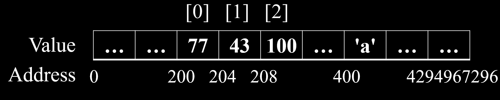

Всё это похоже на один оооочень длинный массив байт, где индексы - это **адреса** (строка Address), а элементы - **значения, которые хранятся в памяти** (строка Value).

Кстати, мы уже встречались с операцией взятия адреса - `&` - когда использовали `scanf`. Теперь посмотрим "реальные" адреса наших переменных. Для этого есть `%p` - специальный формат для вывода адресов (от слова pointer), печатает в hex.

Пример тут [address.c](src/address.c)
```c
printf("scores addresses: [0] = %p, [1] = %p, [2] = %p\n", &scores[0], &scores[1], &scores[2]);
printf("ch addr = %p\n", &ch);
```

После запуска мы увидим кучу чисел:
```bash
scores addresses: [0] = 0x7ffc4b94e80c, [1] = 0x7ffc4b94e810, [2] = 0x7ffc4b94e814
ch addr = 0x7ffc4b94e80b
```
Число 0x7ffc4b94e80b (в десятичной системе это 140721576536075) - номер байта, начиная с нуля, где расположилась переменная `ch`.
Если повычитать адреса `scores`, между элементами [0] и [1], а также [1] и [2] будет ровно по 4 байта - как раз столько занимает один `int`. А сосед у массива `scores` - переменная `ch`, она расположилась сразу левее нулевого элемента, разница в адресах всего 1 байт.

**Важно:** порядок локальных переменных в памяти компилятор соблюдать не обязан: он может их переставить и вставить выравнивание (padding). Гарантия есть только одна - элементы массива лежат подряд.

И адреса каждый запуск новые. Это ASLR - ОС специально рандомизирует адреса, чтобы усложнить жизнь взломщикам (подробнее в последнем разделе про виртуальную память).

Кстати, **имя массива - это и есть адрес нулевого элемента**: `scores == &scores[0]`. С матрицами так же: `matrix == &matrix[0] == &matrix[0][0]`.

**Важно:** адрес - это номер байта в памяти (целое число, для удобства обычно в hex), а `&` - операция взятия адреса переменной.

##  2. <a name='2'></a>Указатели

**Указатель (pointer)** - это **переменная**, которая хранит **адрес ячейки памяти**.
Указатель - как адрес квартиры в записке: сама записка крошечная (8 байт), а за ней - целый дом с данными. Как его объявить и какой тип данных использовать?
Для объявления указателя необходимо использовать символ `*` и тип данных, на который будет указывать наш указатель, например, создадим указатель на char:

```c
char a = 'A'; // 65
char *ptr;
```
В примере ([pointer.c](src/pointer.c)) мы объявляем переменную-указатель `ptr`, которая будет **указывать** на `char`, и переменную `a` того же типа.
В записи `char *ptr` звёздочка и есть "указатель": `ptr` - указатель на `char`. Наглядно:

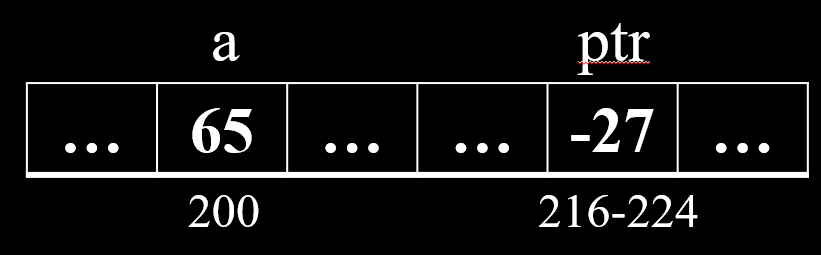

Здесь `-27` в `ptr` - мусор: указатель мы ничем не проинициализировали. Как и у всех локальных переменных, нуля без инициализации не будет.

Попробуем записать в ptr адрес переменной a:
```c
ptr = &a;
printf("ptr = %p, &a = %p, a = %d\n", ptr, &a, a);
```
Допустим адрес переменной a = 200, это значит, что в ptr мы положим число 200.

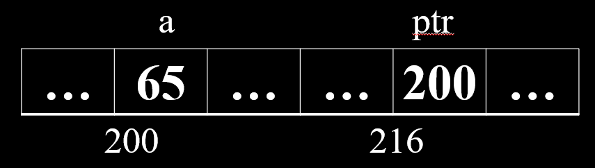

Что теперь? Теперь попробуем обратиться к нашей переменной a, но не используя переменную a:

```c
*ptr = 67;
printf("ptr = %p, &a = %p, *ptr = %d, a = %d\n", ptr, &a, *ptr, a);
```
Это называется **разыменованием (dereference)**: мы переходим по адресу из указателя и **читаем оттуда или пишем туда значение**. Поэтому и важно знать, на что указывает указатель: здесь это `char`, а `char` занимает ровно 1 байт - значит, при разыменовании заберём ровно один байт.

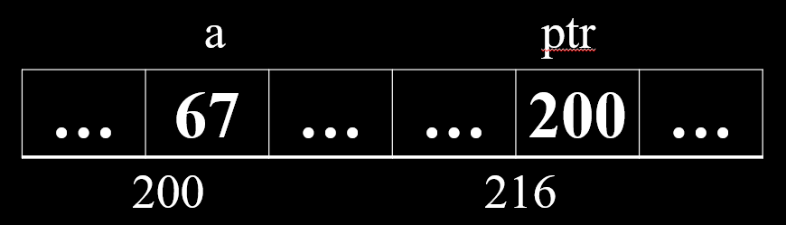


**Важно:** не путаем `*` при объявлении и при разыменовании - это разные вещи:
- int *ptr; - `*` здесь значит, что мы объявляем указатель
- *ptr = 5; - `*` здесь означает операцию разыменовывания

При объявлении указателя есть **ТОЛЬКО ДВА** варианта где поставить звездочку:
- тут
  - int *ptr;
- или тут
  - int* ptr;

###  2.1. <a name='2.1'></a>Указатель на void

Указатели могут указывать на любые примитивные типы (int, double, char и прочие), но есть ещё один, который им тоже подходит:
- указатели могут указывать на void (на пустоту).

Переменную типа `void` создать не получится: `void` - буквально пустота, размера у неё нет, а компилятору размер важен.

```c
void b = 5; // Ошибка!
```

Но указатель на пустоту мы вполне себе можем создать:
```c
void *ptr; // Указатель на пустоту
```
Почему? Потому что указатели хранят адреса, а у адреса конкретный размер - он зависит от разрядности системы. Сегодня процессоры в основном **64-разрядные**, а разрядность - это сколько бит мы можем адресовать. Для **32-разрядных систем размер указателя 4 байта, для 64 - 8 байт**. Это означает, что в 32-разрядных системах мы можем пользоваться лишь 4 ГБ оперативной памяти (2^32) без всяких хитростей (с хитростями можно и больше), а в 64-разрядной уже можем адресовать сильно больше (2^64). Разрядность зависит от ОС и архитектуры процессора.

```c
// Все sizeof ниже дадут одинаковый результат
sizeof(char *);
sizeof(void *);
sizeof(int *);
// Если система 64-разрядная, то 8 байт
```

Указатель на `void` хранит адрес, как и любой другой указатель. А что будет, если его разыменовать?
```c
int a = 5;
void *ptr = &a;
*ptr = 3; // ошибка!
```
Получим ошибку: у `void` нет размера, и, перейдя по адресу из `ptr`, мы не знаем, сколько байт читать или писать.

Тем не менее `void *` встречается постоянно: его используют как универсальный указатель - передают просто адрес, а потом явным преобразованием превращают в нужный тип. Так работают `malloc`, `memcpy` и `qsort`.
```c
int a = 5;
void *ptr = &a;

char b = *((char *)ptr); // преобразовали к char * и разыменовали, вытащив 1 байт в переменную b
```

Настоящая магия с этими преобразованиями начнётся, когда познакомимся с более сложными данными - но это позже.

###  2.2. <a name='2.2'></a>NULL

У указателей есть свой ноль - `NULL`. Если в VS Code навести на него мышкой, увидим, что это 0, **явно приведённый** к указателю на **void**.

```c
#define NULL ((void *)0)
```
`NULL` - это адрес нулевой ячейки памяти. Доступ к ней закрыт всем программам, поэтому разыменование `NULL` гарантированно даёт segfault.

И это гораздо лучше, чем забыть проинициализировать указатель и разыменовать мусор: получится та самая непредсказуемая магия (undefined behaviour).
```c
int *ptr;

*ptr = 5; // непредсказумое поведение (undefined behaviour)
```

Как и для обычных переменных - хорошим тоном является инициализация сразу при объявлении, например:
```c
int *ptr = NULL;
// ..
if (ptr != NULL) { // ptr инициализирован?
    // Что-то выполняем
}
```

###  2.3. <a name='2.3'></a>Загадка

..Жака Фреско: что мы здесь объявили?
```c
int* a, b;
```

<details>
<summary>Ответ</summary>
a - указатель на int, b - просто int.
</details>
<br>


##  3. <a name='3'></a>Указатель на указатель

Самое простое объяснение:


Посмотрим пример [ptr2ptr.c](src/ptr2ptr.c):
```c
char a = 'A';
char *ptr1;
char **ptr2; // указатель на указатель на char
```
Можно не останавливаться на двух звёздочках и поставить больше, но на практике больше пяти `*` я не видел. Живое число - 1-3 штуки, как с размерностью массива (и это не просто так).

Здесь 45 и -27 - случайные числа, то есть мусор: `ptr1` и `ptr2` не проинициализированы
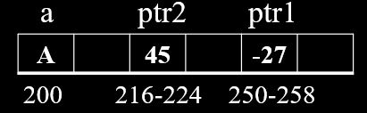

Адреса снова от балды и небольшие, чтобы проще было ориентироваться

Сделаем так:
```c
ptr1 = &a;
```
Получится так:
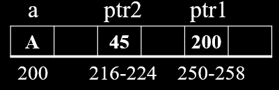

А сделаем так:
```c
ptr2 = &ptr1;
```
Выйдет так:
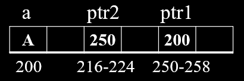

При выводе на экран:
```c
printf("ptr2 = %p\n", ptr2);       // 250
printf("*ptr2 = %p\n", *ptr2);     // 200
printf("**ptr2 = %c\n", **ptr2);   // A
printf("&ptr = %p\n", &ptr2);      // 216
```
Или чуть более реальные цифры:
```bash
ptr2 = 0x7ffe1fc066d8
*ptr2 = 0x7ffe1fc066d7
**ptr2 = A
&ptr = 0x7ffe1fc066e0
```

```c
printf("**ptr2 = %c\n", **ptr2);
```
Здесь мы дважды разыменовываем, т.е.:
-   первое разыменовывание переходим по адресу что лежит в ptr2 (250) попадаем в ptr1
    -   второе разыменовывание переходим по адресу что лежит по адресу 250 (200) попадаем в переменную a
        -   выводим значение по адресу 200 с типом char ('A')

###  3.1. <a name='3.1'></a>Ещё загадка
Что происходит и чему равно выражение в комментарии
```c
int a = 123;
int *ptr = &a;
// *&*&*&*ptr = ?
```

<details>
<summary>Ответ</summary>
Разыменовываем больше раз чем берем адрес на один раз, следовательно это можно сократить до *ptr, что равно 123
</details>
<br>


##  4. <a name='4'></a>Арифметика указателей

У указателей есть своя арифметика, рассмотрим пример [arithmetic.c](src/arithmetic.c):

Допустим адрес a = 130, а адрес ptr = 100
```c
int a = 5;
int *ptr = &a;
```
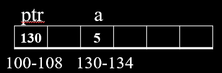

Выполним разыменование и добавим 5:
```c
*ptr = *ptr + 5;
```
Получим:
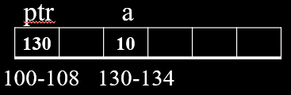

Прибавим 1 к указателю:
```c
ptr = ptr + 1;
```
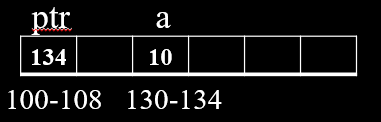
Получим не 131, а 134!
**Важно:** прибавляя 1 к указателю, вы прибавляете не 1 байт, а `sizeof` того, на что он указывает: для `int *` это 4 байта. Поэтому в примере получится не 131, а 134.

**Кстати:** последнее `*ptr` в примере - это уже чтение за пределами переменной `a`, то есть undefined behaviour. Санитайзер такое ловит мгновенно, а обычная сборка просто покажет случайное число из соседних байт.

**Самостоятельно:** Посчитать что выведется в printf:
```c
int arr[] = {10, 20, 30, 40, 50, 60, 70};
int *ptr = arr;
printf("%d\n", *ptr); 			    // = ?
printf("%d\n", *(ptr + 3)); 		// = ?
printf("%d\n", ptr[2]); 		    // = ?
printf("%ld\n", (ptr + 4) - ptr);   // = ?

```

<details>
<summary>Ответ</summary>
`10`, `40`, `30` и `4`. Здесь нет ничего волшебного: `ptr[2]` и `*(ptr + 2)` - одно и то же, а разность указателей считается в элементах, а не в байтах - между ними 4 `int`.
</details>
<br>

**Самостоятельно:** Посчитать что выведется в printf:
```c
int matrix[3][4] = {
    {1, 2, 3, 4},
    {5, 6, 7, 8},
    {9, 10, 11, 12}
};

int (*ptr)[4] = matrix;

printf("%d\n", **ptr);                              // = ?
printf("%d\n", *(*(ptr + 1) + 2));                  // = ?
printf("%d\n", (*ptr)[3]);                          // = ?
printf("%d\n", *(ptr[2] + 1));                      // = ?
printf("%ld\n", (char *)(ptr + 2) - (char *)ptr);   // = ?
```
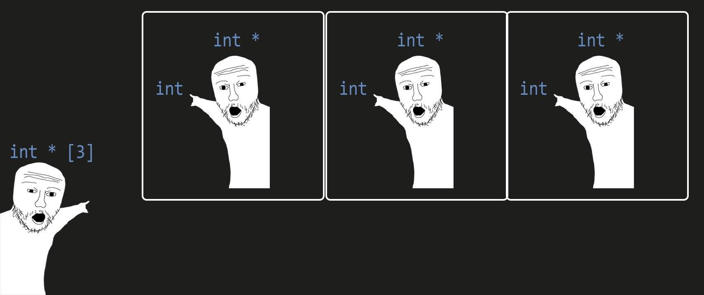

<details>
<summary>Ответ</summary>
`1`, `7`, `4`, `10` и `32`. `ptr` - указатель на строку из 4 `int`, поэтому `ptr + 2` уходит на две строки вперёд, а разность, приведённая к `char *`, даёт байты: 2 × 4 × 4 = 32.
</details>
<br>

Зачем это в жизни: так возвращают данные из функций через аргумент, так устроен `argv` у `main`, так лежит динамическая матрица из раздела 6.5.

##  5. <a name='5'></a>Порядок байт (endianness)

Есть такая штука - endianness (порядок байт). Она определяет, в каком порядке байты числа лежат в памяти: какой байт записывается первым - **старший или младший**.

Возьмем классический пример с числом 0x12345678:

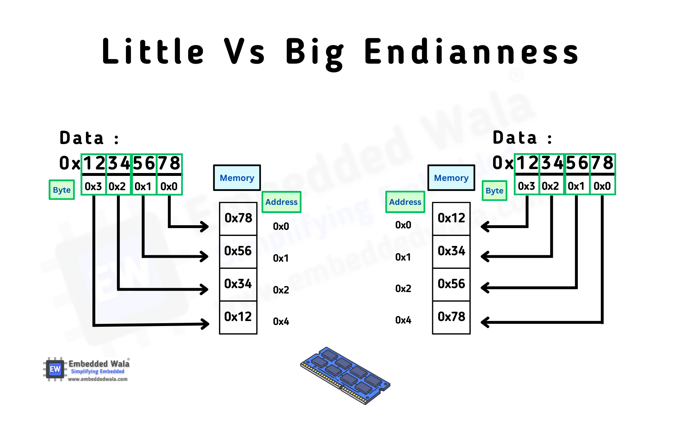

- Big Endian: Сначала старший байт, число слева направо
  - 0x12, 0x34, 0x56, 0x78
- Little Endian: Сначала младший байт, число справа налево
  - 0x78, 0x56, 0x34, 0x12

Зачем? Если кратко, то исторически так сложилось.. в прошлом веке делали как умели..
- Intel сделал little-endian, и с тех пор ничего не поменялось: на современных ПК с архитектурой x86 (Intel, AMD) вы увидите little-endian
- Сетевые протоколы строились на big endian, называется это сетевым порядком байт

ARM-процессоры (телефоны, планшеты) обычно тоже little-endian, но умеют переключаться, а x86 **зафиксированы** на little-endian

С этой проблемой можно столкнуться, например, если вы:
- Обмениваетесь данными между двумя системами с разным порядком байт
- Передача данных по сети (TCP/IP)
- При работе с файлами (PNG, JPEG)
- При чтении памяти

Классика жанра: два компьютера передают друг другу число, и оно приходит "задом наперёд" - и вот уже час дебага из-за порядка байт.

###  5.1. <a name='5.1'></a>Читаем байты из памяти

- Как пройтись по памяти с помощью указателя?

```c
int a = 0xC0FFEE;
char *ptr = (char *)&a;

// для little-endian
printf("first byte of a = %hhx\n", *ptr); // 0xEE
ptr++;
printf("second byte of a = %hhx\n", *ptr); // 0xFF
ptr++;
```
Мы приводим адрес `a` к `char *`: `&a` - это `int *`, и просто так по байтам им не пройдёшь. Зато `char *` при разыменовании вытаскивает **ровно 1 байт**, и `ptr++` прибавляет тоже 1 байт.

**Самостоятельно:** взять `(short int *)` и пройтись по массиву из 10 комплексных чисел, упакованных в массив из `int` (реальная и мнимая части по 16 бит внутри `int`). Это та самая упаковка I/Q, которую мы разбирали в лекции про массивы.
```c
int complex[10];
```

То есть без битовых операций, только указателями, можно распаковать `int` на два `short` - [RE0, IM0].

##  6. <a name='6'></a>Динамические массивы

Динамические массивы - массивы, размер которых можно менять по ходу выполнения программы. Заголовочный файл - `<stdlib.h>`. Функции для работы с динамическими массивами:
- malloc()
- calloc()
- realloc()
- free()

Зачем это нужно? В реальных задачах размер почти никогда не известен заранее: сколько сообщений прилетит в чат, сколько игроков зайдёт в лобби, какого размера кадр отдаст камера. Статический массив под это не подгонишь, и тут на сцену выходит куча.

Динамические массивы в Языке Си будут выглядеть сложно и страшно, но такова реальность. И эта реальность лежит под капотом у большинства языков высокого уровня (Python, Java и т.д.), скрывающих работу с указателями и адресами для более быстрого написания кода программистами. В Си с помощью указателей можно собирать любые структуры данных (связные списки, деревья, графы) - про них в следующих лекциях.

###  6.1. <a name='6.1'></a>malloc()

Пример тут [malloc.c](src/malloc.c)

`malloc` (**m**emory **alloc**) **выделяет динамическую память**. Мы просим у кучи (heap) кусок памяти для дальнейшего использования. У `malloc` один **аргумент - количество байт, которое нужно выделить**. **В случае успеха возвращает адрес выделенной памяти, а в случае неудачи** (например, память кончилась) - **NULL**, с которым мы уже знакомы.

```c
// Выделяем 12 байт (3 размера int)
int *arr = malloc(3 * sizeof(int));
```
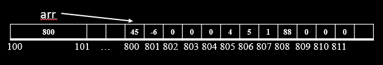

- В случае успеха:
  - В переменную arr запишется адрес, который указывает на выделенную память. В выделенной памяти у нас будет доступно 12 байт, но заполнены они будут всяким мусором.
- В случае неудачи:
  - Обязательно проверяем, что получили не NULL

```c
if (arr == NULL) {
    printf("Error malloc!\n");
    return -1;
}
```
Иногда вы можете увидеть такой вариант malloc:
```c
int *arr = (int *)malloc(3 * sizeof(int));
```
Здесь `void *`, который возвращает `malloc`, явно преобразуют в `int *`. В современном Си так уже не делают:
1. void* автоматически без ошибок преобразуется в любой другой указатель.
2. чуточку менее читаемый код и лишние повторения
3. если забыли подключить `<stdlib.h>`, явным преобразованием можно спрятать предупреждение - а в худшем случае получить ошибку: без объявления функции компилятор считает, что она возвращает `int`, а размеры `int` (обычно 4 байта) и указателя (8 байт на 64-разрядной системе) разные

Попробуем чему-нибудь присвоить:

```c
arr[0] = 123; arr[1] = 2; arr[2] = 3;
```
То есть работать с таким массивом можно как с обычным - квадратные скобки, - либо чуть сложнее, через арифметику указателей:
```c
*arr = 123; *(arr + 1) = 2; *(arr + 2) = 3;
```

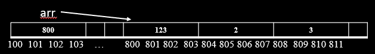

Когда массив больше не нужен, память нужно освободить: `free()`. Классический сценарий - пришедшее сообщение, длина которого заранее неизвестна: буфер растёт по мере поступления символов ([growing_buffer.c](src/growing_buffer.c)).

###  6.2. <a name='6.2'></a>free()

`free` освобождает память - возвращает её в кучу, откуда её снова можно выделить.
```c
free(arr);
```
После `free` эта память снова доступна системе: её может забрать другой процесс или ваша же программа под новый `malloc`.

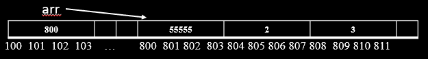
Поэтому, залезая в освобождённую память, легко увидеть чужие случайные числа. Указатель на такую память называют **"висячим" (dangling pointer)**. В указателе остался устаревший адрес: память уже не наша, её могут отдать под новые данные - работать с таким указателем означает ловить непредсказуемое поведение и "гейзенбаги" (см. в гугле).
Чтобы не устраивать этого и не путаться в будущем, указатель после освобождения лучше занулить:
```c
arr = NULL;
```
Так указатель отвязывается от уже освобождённой памяти. Если разыменуем его повторно, получим гарантированный segfault - а такое отладчиком ловится за секунды, а не за вечер.

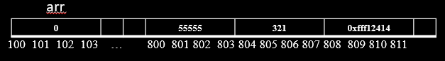

####  6.2.1. <a name='6.2.1'></a>Утечка памяти

**Утечка памяти** - ситуация, когда программа выделяет память и не освобождает, например:
```c
int *ptr = malloc(10000); // выделим 10000 байт и адрес запишем в ptr
ptr = malloc(20000); // не освободим 10к байт мы перезаписываем в ptr новый адрес
```

**Важно:** если программа завершилась, а `free` вы не сделали, **ОС подчистит всю память за вас**.
Но если программа работает долго и в цикле выделяет память без освобождения, она будет пухнуть и в какой-то момент приедет - а в худшем случае прихватит и ОС. Именно так падают серверы: в обработке запросов теряется по кусочку памяти, за сутки набегает гигабайт.
Утечки ловят специальными инструментами: `valgrind` или встроенный санитайзер (`gcc -fsanitize=address`). С ними познакомимся подробнее чуть позже.

В Си нет сборщика мусора (garbage collector), который бы прибирал ненужные данные за вас. Повторюсь: вся ответственность за управление памятью лежит на программисте.

**Интересно:** в утилите ls в linux утекает память, т.к. ls не освобождает, что выделил ради повышения скорости своего выполнения, перекладывая освобождение памяти на ОС.

####  6.2.2. <a name='6.2.2'></a>Двойное освобождение

Если освободить одну и ту же память дважды, программа упадёт с ошибкой `double free` - заодно развалив внутренние структуры аллокатора (это ещё и целый класс уязвимостей).
```c
int *ptr = malloc(100);
free(ptr);
free(ptr); // double free
```

###  6.3. <a name='6.3'></a>calloc()

Почти как `malloc`: тоже выделяет память, но зануляет её и принимает два аргумента - **количество элементов** и **размер одного элемента** (см. [calloc.c](src/calloc.c)).

```c
int *arr = calloc(3, sizeof(*arr)); // или calloc(1, 3 * sizeof(int));
```
**Важно:** в `sizeof` я указал `*arr` - это лайфхак, чтобы немного полениться: если вдруг поменяем тип элементов, размер пересчитается сам.

И обратный трюк: память, выделенную через `malloc`, всегда можно занулить через `memset` (из `string.h`) - получится тот же `calloc`:
```c
int *arr = malloc(3 * sizeof(*arr));
if (arr == NULL) { /* ошибка */ }
memset(arr, 0, 3 * sizeof(*arr)); // начиная с адреса arr установить 12 нулей
```

`calloc` работает чуточку медленнее `malloc` (всё-таки зануляет память), но всё равно быстрее, чем `malloc` + `memset`.

###  6.4. <a name='6.4'></a>realloc()

Позволяет перевыделить память, сохранив прежние значения. Если кусок получится большой, адрес может измениться - тогда `realloc` скопирует все данные на новое место. Именно так растут динамические массивы во всех языках: `std::vector` в C++, `ArrayList` в Java, `list` в Python.

Пример [realloc.c](src/realloc.c)

```c
#define N 10
#define M 5

// ..
char *str = malloc(N * sizeof(char)); // выделяем массив размером N байт
if (str == NULL) return -1;
// ..

str = realloc(str, M * sizeof(char)); // уменьшим массив до M байт
if (str == NULL) return -1;
// ..

free(str);
str = NULL;
```

**Важно:** если `realloc` потерпит неудачу, он вернёт `NULL` - и указатель в `str` мы потеряем, а это утечка. Поэтому делают так:
```c
char *tmp = realloc(str, M * sizeof(char)); // уменьшим массив до M байт
if (tmp != NULL) str = tmp;
```

###  6.5. <a name='6.5'></a>Динамические матрицы

А если нужна динамическая матрица? Или 3-мерный массив? Или 4-мерный?

Рассмотрим пример с матрицей 3 на 3, можно это сделать с помощью массива указателей:
```c
#define N 3
// ..
int *arr[N];
for (int i = 0; i < N; i++) {
  arr[i] = calloc(N, sizeof(arr[i]));
}
```
Здесь каждому указателю достаётся свой одномерный массив. Работать это будет, но матрица получается полудинамическая: число строк фиксировано на стеке, а поменять можно только длину строки.

Попробуем сделать **настоящую** динамическую матрицу (полный пример [matrix.c](src/matrix.c)):

```c
#define N 3
// ..
char **arr = malloc(N * sizeof(*arr));
if (arr == NULL) { /* ошибка */ }
```
Получим указатель на N указателей на char, которые сейчас указывают на мусор:
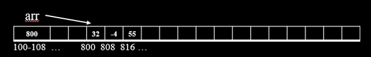

Выделим память под каждую строку (по N символов) и сразу что-нибудь туда запишем:
```c
for (int i = 0; i < N; i++) {
    arr[i] = malloc(N * sizeof(**arr)); // строка из N символов
    if (arr[i] == NULL) { /* ошибка */ }
    for (int j = 0; j < N; j++) {
        arr[i][j] = 'A' + i; // 'A', 'B'..
    }
}
```
Получится:
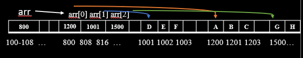

Для работы с матрицей воспользуемся привычными квадратными скобками:
```c
arr[0][0] = 'X';
arr[1][2] = 'Y';
```
или менее читаемым вариантом:
```c
**arr = 'X';
*(*(arr + 1) + 2) = 'Y';
```

Для вывода напишем функцию, приняв указатель на указатель на `char`.
```c
void print_array(char **arr) {
    for (int i = 0; i < N; i++) {
        for (int j = 0; j < N; j++) {
            printf("%c ", arr[i][j]);
        }
        printf("\n");
    }
}
// ..
print_array(arr);
// ..
```

Для освобождения пройдемся в обратном порядке (относительно выделения памяти):

```c
for (int i = 0; i < N; i++) {
  free(arr[i]);
  arr[i] = NULL;
}

free(arr);
arr = NULL;
```
**Самостоятельно:** Почему освобождаем сначала arr[i], а потом arr, а не наоборот?
<details>
<summary>Ответ</summary>
Сначала освобождаем строки `arr[i]`, и только потом массив указателей `arr` - то есть в порядке, обратном выделению. Если сначала освободить `arr`, мы потеряем адреса строк, и каждая из них потечёт.
</details>
<br>


Итого:
| Характеристика | Статический массив | Динамический массив |
|----------------|-------------------|-------------------|
| **Выделение памяти** | На этапе компиляции, в стеке (stack) | Во время выполнения, в куче (heap) |
| **Размер** | Фиксированный, известен на этапе компиляции | Может изменяться во время выполнения |
| **Время жизни** | Автоматическое (при выходе из области видимости) | Контролируется программистом |
| **Освобождение памяти** | Автоматическое | Ручное (с помощью `free()`) |
| **Изменение размера** | Невозможно | Возможно с помощью `realloc()` |
| **Производительность** | Быстрее (выделение в стеке) | Медленнее (выделение в куче) |
| **Безопасность** | Более безопасен (автоуправление) | Риск утечек памяти |
| **Размер массива** | `sizeof(arr)` возвращает общий размер | `sizeof(ptr)` возвращает размер указателя |
| **Область видимости** | Локальная или глобальная | Доступна откуда угодно, пока не освобождена |

По умолчанию под кучу размер почти не ограничен, а стек ограничен (обычно 1-8 МБ; смотрится через `ulimit -a` в Linux).

Ещё один живой пример - таблица оценок студентов, где и число студентов, и число предметов известны только в рантайме: [matrix_dynamic.c](src/matrix_dynamic.c).

##  7. <a name='7'></a>Область видимости переменных

- Глобальная область
```c
int a;

int func(void) {
    // ..
}
```
Здесь `a` - **глобальная переменная**: она объявлена вне всех функций, видна всем функциям и живёт всю программу.

- Локальная область
```c
int func(int a) {
    int b;
    // ..
}
```
Здесь `a` - аргумент функции, виден только внутри неё; то же самое с локальной переменной `b`.

- Блок
```c
int func(int a) {
    // ..
    {
        int b;
    }
    // ..
}
```
`b` - локальная переменная блока в фигурных скобках `{}`, видна только внутри них.

**Самостоятельно:** В примере ниже чему будет равна переменная a в разных областях видимости?
```c
#include <stdio.h>

int a = 15;

void func(void) {
    printf("global a = %d\n", a);
}

int main(void) {
    int a = 10;
    {
          int a = 20;
    }
    printf("main a = %d\n", a);
    func();
}
```

<details>
<summary>Ответ</summary>
`func` напечатает 15 (глобальная `a`), а в `main` будет 10 - блочная `a = 20` живёт только внутри своих `{}`. Локальная переменная "закрывает" глобальную, но только в своей области видимости.
</details>
<br>

##  8. <a name='8'></a>Стек и куча

- **Stack (стек)** - это быстрая и упорядоченная область памяти, работающая по принципу LIFO (Last In First Out, последний пришел - первый ушел).
  - Это как стол, на котором лежит стопка книг, для доступа к нужной книге сначала достанем все книги сверху. Если книг положить очень много на стек - то они свалятся со стола, называется это stack overflow (переполнение стека), такое можно сделать создав массив больше размера стека, либо сделав бесконечную рекурсию..
- **Heap (куча)** - это большая и гибкая область памяти, где можно выделять блоки произвольного размера вручную. Управление памятью лежит на программисте (или, в некоторых ЯП, на сборщике мусора - garbage collector)
  - Это как гараж, места много, но все валяется хрен знает где, поэтому найдем что ищем не так быстро

| Критерий | Stack (Стек) | Heap (Куча) |
|----------|--------------|-------------|
| **Основное назначение** | Локальные переменные, вызовы функций | Динамическое выделение памяти |
| **Принцип работы** | LIFO (Last In, First Out) | Свободное распределение |
| **Управление памятью** | Автоматическое | Ручное (malloc/calloc/realloc/free) |
| **Скорость доступа** | ⚡️быстренько | 🐢 не очень |
| **Риски** | Stack Overflow | Утечки памяти |
| **Время жизни данных** | Пока выполняется блок тела | Пока явно не освобождена |
| **Идеально для** | Временных данных | Объектов с заранее неизвестным размером |

**Интересно:** Есть такой форум для программистов, в который вы вероятно попадете если ИИ не даст ответ на ваш вопрос и вы пойдете в гугл: https://stackoverflow.com/


##  9. <a name='9'></a>Модель памяти языка Си

Залезем еще чуть глубже под капот..

**Модель памяти** - абстракция, с помощью которой описывается взаимодействие программы с памятью.

Любую программу на языке Си в памяти можно представить так следующих секций:
1. Text - Код программы (текст), здесь все наши функции с кодом
2. Data - Данные, здесь хранятся все переменные явно проинициализированные чем-либо кроме 0
3. BSS (Block Started by Symbol) - все глобальные переменные, что инициализированы 0 или не инициализированы ничем
4. Heap - секция кучи, вся динамически выделенная память через malloc/calloc/realloc
5. Stack - секция стека, все локальные переменные, вызовы функций (при вызове функции создается кадр функции для возможности вернуться в вызываемое место)

```
+----------------------+  0xffffffff
|         Stack        |  |
|          |           |  |  Рост стека
|          v           |  |
+----------------------+  |
|          ^           |  |
|          |           |  |  Рост кучи
|         Heap         |  |
+----------------------+  |
|         BSS          |  |
+----------------------+  |
|         Data         |  |
+----------------------+  |
|         Text         |  |
|                      |  |
+----------------------+  0x000000000
```

При вызове функции или создании локальных переменных наш стек растет в сторону кучи, при выделении памяти вырастает куча.

Такая модель памяти языка:
- Позволяет понимать ошибки типа висячих указателей. Мы знаем, что функция в стеке будет существовать только пока эта функция выполняется, если мы вернем адрес любой локальной переменной из этой функции, то мы получим **висячий указатель**, т.к. он не будет указывать на что-то валидное:
```c
int *get_dangling_ptr() {
  int test = 5;
  return &test; // функция завершится и test больше не будет существовать
}

int func() {
  int *ptr = get_dangling_ptr(); // получим адрес на память, что была освобождена после завершения работы функции
  *ptr = 5; // Undefined Behaviour
}
```
- А те, кто понял это раньше других, придумали целый класс взломов программ:
  - Функция при ее вызове создает "кадр функции" (мы слегка потрогаем его когда познакомимся с отладчиком) в стеке:
  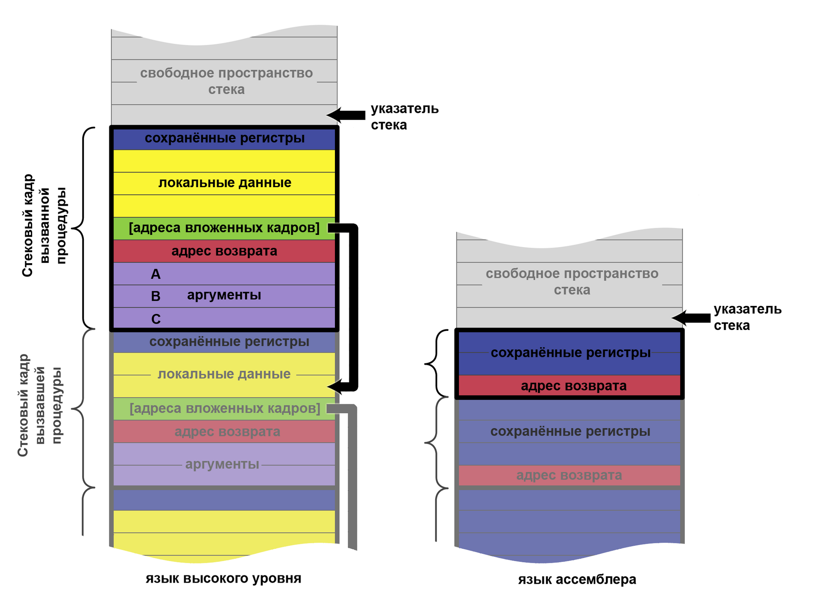
  - В этом кадре функции есть адрес куда нужно вернуться в памяти после выполнения функции, т.е. то место откуда эту функцию дернули. RBP - верхушка стека до вызова функции
  - И вот злой дядя (а может и тётя), зная эту модель, подменяет адрес возврата на свой и начинает выполнять **свои злые функции**. Современные компиляторы конечно уже в курсе этого и в качестве защиты используют "канарейку"
- В основе большинства других языков лежит похожая модель памяти - поняв эту, проще будет и с остальными.

При компиляции компилятор вычисляет размеры секций Text, BSS и Data, остальные секции (стек и куча) появятся при загрузке программы в память ОС.

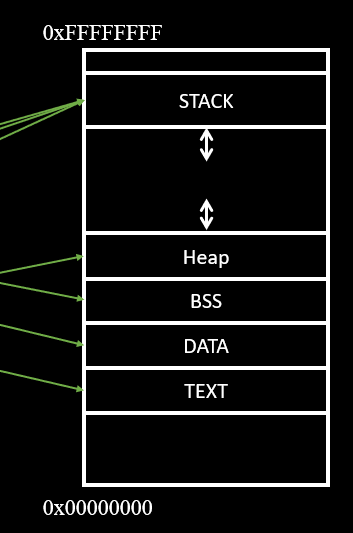

Сильно подробно не будем останавливаться здесь, кому интересно системное программирование, то попробуйте эти секции потрогать, диззассемблировав исполняемый файл (objdump) или с помощью специальных утилит типа "nm" (пример [model.c](src/model.c)):
```bash
gcc src/model.c -o model
nm model
```
где буковки будут означать
- T - Text
- B - BSS
- D - Data


##  10. <a name='10'></a>Виртуальная память

Оказывается, что при работе с указателями нам выводились фейковые адреса.. (в первом разделе они ещё и каждый запуск были новые - теперь понятно, почему).

**Чего блин?**

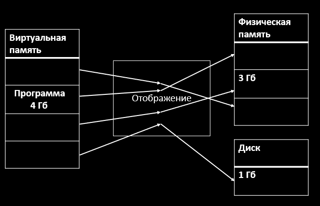

Допустим, у нас есть память и две программы - А и Б
- Что если программа А захочет залезть в память программы Б? Она возьмёт и сделает это без проблем. Выходит, любая программа может положить всю операционную систему (а ОС - тоже программа) при неаккуратной работе с памятью
- А если памяти всего 8 ГБ, программа А заняла 6 ГБ, а программа Б - 3 ГБ? А потом запустить ещё и программу С? Пришлось бы ждать, пока А завершится, чтобы Б влезла

В computer science (айти) многие проблемы решаются "абстракциями". Здесь работает такая:
операционная система реализует механизм виртуальной памяти - абстракцию между программами и РЕАЛЬНОЙ физической памятью компьютера
1. И виртуальная, и физическая память разбиты на блоки фиксированного размера - **страницы** (обычно 4 КБ). Когда программа пытается получить доступ к своей виртуальной памяти, **ОС и процессор и чип MMU (Memory Management Unit) переводят виртуальный в физический адрес**. Когда процу говорят прочитай значение целого числа по некоторому адресу, то он лезет в MMU для перевода этого адреса в физический и далее получив адрес читает что надо из оперативки.
2. Не всем страницам обязательно быть в оперативной памяти, некоторые неиспользуемые можно временно сгрузить на более медленные хранилища (SSD или HDD) в специальный **файл подкачки** (swap). Так можно открыть Chrome с кучей-кучей вкладок: рано или поздно они съедят всю оперативку и начнут сгружаться на диск. А когда попробуете открыть старую вкладку, она подкачается с HDD обратно - и это будет не очень быстро. Так мы можем запустить программ больше, чем влезет в оперативную память.
3. Благодаря виртуальной памяти у каждой программы своё адресное пространство: своё отображение виртуальных адресов на физические. Полезли по виртуальному адресу, который никуда не отображён, - получили segmentation fault (привет лекции про массивы).

Опять же, если интересно системное программирование, то обязательно подробнее почитать, например, тут:
https://tproger.ru/articles/kak-rabotaet-virtualnaya-pamyat-v-operacionnyh-sistemah
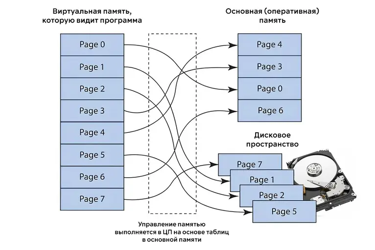

и еще глубже тут (из чего состоит виртуальный адрес):
https://cpu.land/the-translator-in-your-computer#memory-is-fake
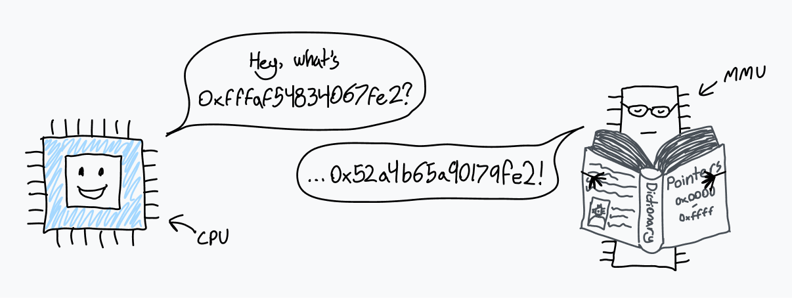
