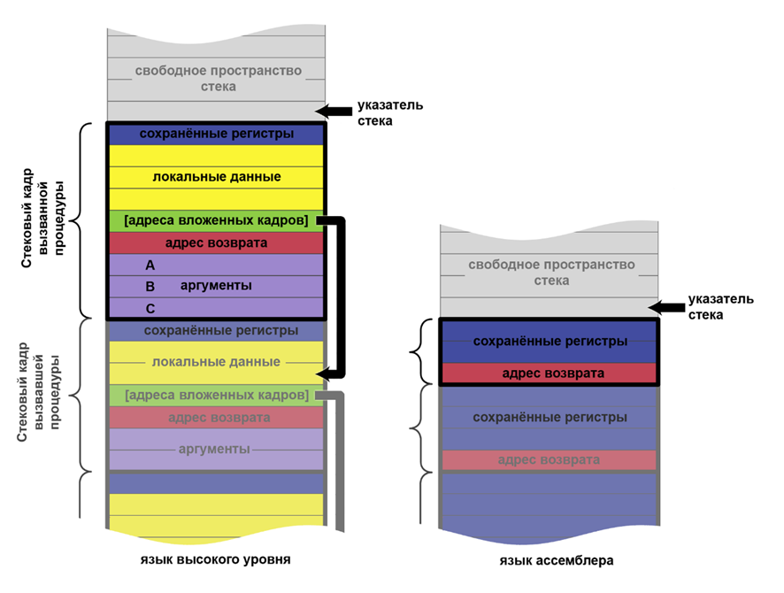
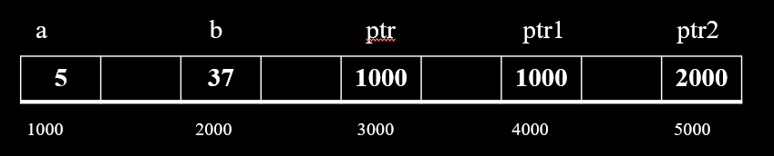
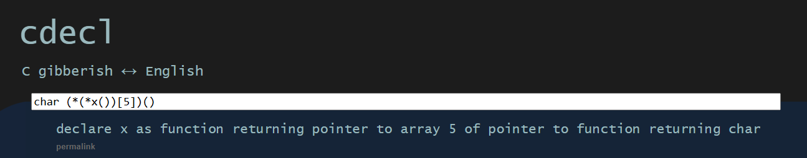

# Functions part 2

## Part 1

Сначала лучше понять [функции часть 1](https://github.com/kruffka/C-Programming/blob/68d3b54087e3a111c3f517c7c45ccde86d2d055d/3_functions_p1/lecture.md)          


## Recursion

В программировании, **рекурсия - это функция, которая вызывает саму себя.**                

Рекурсию можно сделать с любой функцией, даже с ф-ией main(). На самом деле рекурсия очень похожа на цикл, в котором могут быть начальные условия, шаг, а также условие выхода.                

Например, два варианта нахождения факториала (полный пример [recursion.c](https://github.com/kruffka/C-Programming/blob/2025-2026/7_functions_p2/src/recursion.c)):
- Простой с помощью цикла:      
```c
int factorial_non_recursive(int N) {
    int res = 1;
    for (int i = N; i > 1; i--) {
        res = res * i;
    }
    return res;
}
// ..
int n = factorial_non_recursive(5);
```

- С помощью рекурсии, но результат тот же
```c
int factorial(int N) {
    if (N < 1) return 1; // условие выхода
    return N * factorial(N - 1); // рекурсия - здесь ф-ия вызывает саму себя, где N-1 = шаг
}
// ..
int n = factorial(5); // Первый вызов ф-ии с начальным значением 5.                 
```

Представить можно примерно так:        
```c
/* 
 * factorial(5) ->
 * 
 * N = 5 и N > 1, возвращаем 5 * factorial(4)
 *                    |
 *                    +-- 4 * factorial(3)
 *                           |
 *                           +-- 3 * factorial(2)
 *                                  |
 *                                  +-- 2 * factorial(1)
 *                                         |
 *                                         +-- 1 * factorial(0)
 *                                                |
 *                                                +-- 1
 * 
 * Раскрытие вычислений:
 * 
 * factorial(5) = 5 * factorial(4)
 *               = 5 * (4 * factorial(3))
 *               = 5 * (4 * (3 * factorial(2)))
 *               = 5 * (4 * (3 * (2 * factorial(1))))
 *               = 5 * (4 * (3 * (2 * (1 * factorial(0)))))
 *               = 5 * (4 * (3 * (2 * (1 * 1))))
 *               = 5 * (4 * (3 * (2 * 1)))
 *               = 5 * (4 * (3 * 2))
 *               = 5 * (4 * 6)
 *               = 5 * 24
 *               = 120
 */
```

В языке Си рекурсия - не самая эффективная штука (см. ниже), однако в языках **функциональной парадигмы** (Haskell) она **крайне эффективна**               

Однако рекурсия вам может понадобиться при решении на оценку 5  задачки с матрицами (нахождение определителя)

## Кадр ф-ии

В прошлой лекции мы познакомились с моделью памяти языка Си и Стеком. И оказывается, что при вызове ф-ии в памяти создается некоторая сущность под названием **"кадр функции" (function frame)**. Кадр функции состоит из локальных данных, входных аргументов в функцию, а также , некоторых важных адресов - один из них адрес возврата, который необходим примерно для того, чтобы после вызова функции мы могли вернуться в место откуда эту ф-ию вызывали, продолжив работу.        

Кадр ф-ии ([картинка из wiki](https://ru.wikipedia.org/wiki/Стековый_кадр
)):                   
             


На какие мысли это дело может наводить?                       
- Во-первых, локальные переменные и аргументы - они существуют только пока существует функция. 
- Во-вторых, вызывая ф-ию мы создаем кадр этой функции над кадром другой функции, занимая в памяти место, что если у нас будет ф-ия бесконечно рекурсировать? Ответ - переполнение Стека         
- Ну и например, что у ф-ий есть какие-то адреса?..

Чуть позже в **отладчике** мы эти кадры функции еще увидим                 

### Аргументы в ф-ию

Допустим мы хотим написать ф-ию swap(), что меняет две переменных местами:              

Допустим у нас получилось нечто вроде:
```c
void swap(int a, int b) {
    int tmp = a;
    a = b;
    b = tmp;
}
// ..
int a = 5;
int b = 37;
swap(a, b);
printf("a = %d, b = %d\n", a, b);
```
Но после запуска такого кода можно увидеть, что a и b не поменялись местами, но как так?             

Все дело в том, что при вызове ф-ии мы передаем в нее в качестве аргументов **значения** переменных, а не сами переменные, т.е. при создании кадра ф-ии swap создаются локальные копии переменных a и b и тут даже не важно как называются наши переменные. a и b в swap и a и b до вызова swap - локальные переменные своих функций. В swap передаются лишь значения этих переменных. Так как же поменять значение переменной в функции? С помощью указателей (Полный пример [swap.c](https://github.com/kruffka/C-Programming/blob/2025-2026/7_functions_p2/src/swap.c))               

```c
void swap(int *a, int *b) {
    int tmp = *a;
    *a = *b;
    *b = tmp;
}
// ..
int a = 5;
int b = 37;
swap(&a, &b);
printf("a = %d, b = %d\n", a, b);
```
Именно поэтому при вызове scanf() мы передавали адрес переменной - чтобы изменить значение переменной внутри функции.                
- swap(&a, &b) - передаем адреса a и b в ф-ию
- swap(int *a, int *b) - принимаем адреса в функцию (указатель на int)
- *a и *b - операции разыменования - переходим по адресу и читаем/пишем оттуда/туда

Таким же образом можно из ф-ий возвращать больше одного элемента. Передаем в функцию переменные по адресу - меняем их там и затем после вызова функции получаем новые значения в переменных (return больше одного значения не умеет возвращать).                     

Что если мы передадим оооочень большой массив в функцию, все его элементы будут скопированы в новый локальный массив? Все массивы в функции передаются по адресу (имя массива = адрес 0 элемента массива), а это значит, что массивы, что отдали в аргументах в функцию, могут быть изменены в самой функции.               

Хорошо, рассмотрим пример чуть сложнее - мы все также хотим записать значение b в a               
```c
void swap(int *ptr1, int *ptr2) 
{
    printf("swap: %d\n", *ptr1); // 5
    ptr1 = ptr2;
    printf("swap: %d\n", *ptr1); // 37
}
// ..
int a = 5;         // &a = 1000
int b = 37;        // &b = 2000
int *ptr = &a;     // &ptr = 3000

printf("%d\n", *ptr); // 5
swap(ptr, &b);
printf("a = %d\n", a); // 5
printf("%d\n", *ptr);  // 5
```

Почему после ф-ии swap здесь значение a осталось прежним? В самой функции ведь после ptr1 = ptr2 значение стало равным 37 (равным b)..             

<details>               
<summary>Ответ</summary> 
ptr1 и ptr2 - аргументы в ф-ию, а это значит, что это локальные переменные и все что мы сделали так это временно записали в ptr1 адрес ptr2.              

                             
</details>                   
<br>      

**Важно:** Чтобы поменять в функции любую переменную (даже указатель) необходимо ее передать по адресу! [Еще примерчик ptr.c](https://github.com/kruffka/C-Programming/blob/2025-2026/7_functions_p2/src/ptr.c)         


### int argc, char *argv[]

Ф-ия main тоже умеет принимать аргументы и это очень полезная штука, что позволяет при запуске задавать различные параметры в программу.                   
- argc - целое число, количество аргументов, всегда как минимум будет один нулевой аргумент - название исполняемого файла
- argv - массив строк, в нем будут аргументы в виде строк, индексы строк от 0 до argc - 1 включительно        

Попробуем ([argv.c](https://github.com/kruffka/C-Programming/blob/2025-2026/7_functions_p2/src/argv.c)):              
```c
#include <stdio.h>

int main(int argc, char *argv[]) {

    for (int i = 0; i < argc; i++) {
        printf("argv[%d] = %s\n", i, argv[i]);
    }
}
```
и позапускать:
```bash
gcc src/argv.c
./a.out 123 4 qwerty -c hello
```
Увидим:
```bash
argv[0] = ./a.out
argv[1] = 123
argv[2] = 4
argv[3] = qwerty
argv[4] = -c
argv[5] = hello
```

Из интересного - таким образом мы можем задавать размер нашим массивам либо указывать любые другие входные аргументы в нашу программу.

Например, в linux есть утилита `cowsay`, которая принимает некоторые аргументы и печатает их:

```bash
cowsay hello
```
```bash
 _______
< hello >
 -------
        \   ^__^
         \  (oo)\_______
            (__)\       )\/\
                ||----w |
                ||     ||
```

Или если подать чуть больше входных аргументов в main программы cowsay:     
```bash
cowsay -f dragon rawr
```

```bash
 ______
< rawr >
 ------
      \                    / \  //\
       \    |\___/|      /   \//  \\
            /0  0  \__  /    //  | \ \    
           /     /  \/_/    //   |  \  \  
           @_^_@'/   \/_   //    |   \   \ 
           //_^_/     \/_ //     |    \    \
        ( //) |        \///      |     \     \
      ( / /) _|_ /   )  //       |      \     _\
    ( // /) '/,_ _ _/  ( ; -.    |    _ _\.-~        .-~~~^-.
  (( / / )) ,-{        _      `-.|.-~-.           .~         `.
 (( // / ))  '/\      /                 ~-. _ .-~      .-~^-.  \
 (( /// ))      `.   {            }                   /      \  \
  (( / ))     .----~-.\        \-'                 .~         \  `. \^-.
             ///.----..>        \             _ -~             `.  ^-`  ^-_
               ///-._ _ _ _ _ _ _}^ - - - - ~                     ~-- ,.-~
                                                                  /.-~
```


#### Еще один dangling pointer

Как делать не надо:
```c
char *f() {
    char s
    return &s;
}
```
Почему? Потому что переменная s из стека исчезнет вместе с кадром функции как только мы выполним return. Вернется адрес на память, в которой уже не будет s, а будет хз что..


### Указатели на ф-ию

У функций как и у переменных тоже есть адреса и мы даже можем этим воспользоваться, например:
```c
int (*cipher_func)(int, char *);
```

Как это читать? Идем с названия переменной - cipher_func, затем налево, затем направо, затем снова налево. Звучит сложно, но попробуем:      
cipher_func - имя переменной, а справа звездочка - это указатель, все это дело в скобках, значит это указатель на функцию. В скобках правее будут аргументы (int, char*), а слева останется возвращаемый тип. Итого: **cipher_func - указатель на ф-ию, которая принимает int и char*, а возвращает int**.            

Кстати, научиться читать сишные объявления можно, например тут https://cdecl.org/                   
                

Какой ужас.. Зачем этот указатель на ф-ию?                        

На самом деле, такие сложные штуки позволяют писать более хитрый код. Например, мы пишем какой-нибудь 6G модем, в котором используются различные алгоритмы шифрования. Эти алгоритмы шифрования вероятнее всего будут принимать одни и те же аргументы и возвращать один (сообщение и некоторый ключ) и тот же тип данных (результат шифра - успех или не очень). Так вот, во время работы нашего модема модем выберет некотрый алгоритм шифрования и чтобы каждый раз не проверять какую функцию вызывать - мы будем вызывать указатель на функцию, например:        

```c
int snow3g(int key, char *text) {
    // ..
}

int aes(int key, char *text) {
    // ..
} 

int grasshopper(int key, char *text) {
    // ..
}

// Объявили указатель на функцию
int (*cipher_func)(int, char *);
// Выбираем ф-ию snow3g
cipher_func = snow3g;
// ..
cipher_func(); // Вызываем snow3g ф-ию
```
Это нам позволит избежать проверок какую функцию шифрования вызывать при необходимости что-либо зашифровать, т.к. мы один раз выбрали нужную функцию и далее к ней всегда обращаемся..               

### Массив указателей на функции

Еще одна вещь, которая встречается на практике - массив указателей на функции (массив функций). Примерчик [func_arr.c](https://github.com/kruffka/C-Programming/blob/2025-2026/7_functions_p2/src/func_arr.c)               

```c
void (*dfts_fun[])(float, int) = { dft128, dft256, dft512, dft1024 };
```
dfts_fun - переменная, массив-указателей на ф-ии принимающий в аргументы float и int и ничего не возвращающих             

А это еще зачем? Это очень удобно когда опять же есть много однотипных функций. Например преобразование Фурье (с которым вы тоже скоро познакомитесь). Оно обычно делается для степеней двойки и если у нас будет массив таких функций [Фурье для 128 элементов, Фурье для 256 элементов и т.д..], то выбрав нужный индекс мы можем выбрать и вызвать нужную нам функцию:        
```c
dfts_fun[1](/*аргументы*/); // вызовется ф-ия dft256()
```

### variadic functions

Пока это немного пропустим.. вернемся попозже, но если вкратце, то функции в Си умеют принимать неограниченное количество аргументов (например тот же printf)..            

[va_arg.c](https://github.com/kruffka/C-Programming/blob/2025-2026/7_functions_p2/src/va_arg.c)                         

### Callback

**Callback** — это функция, которая передаётся в другую функцию как аргумент и вызывается позже (когда произойдёт какое-то событие или завершится операция)                 

Callback в программировании - такая техника в программировании (не только в Си, очень много где еще) когда мы в функцию передаем другую функцию, что будет вызвана в вызываемой функции.         

Самый простой пример - мы хотим заполнить некоторый массив B из массива A, отфильтровав по некоторому признаку, например^ 
- только четные числа
- только нечетные числа
Функция фильтра - и будет нашим callback (полный пример в [callback.c](https://github.com/kruffka/C-Programming/blob/2025-2026/7_functions_p2/src/callback.c))


### API

Допустим мы пришли в ресторан.
- Вы (клиент) — это одна программа.
- Кухня (сервер или библиотека) — это другая программа, у которой есть все данные и возможности (еда).
- Официант (API) — это посредник

Вы не идёте на кухню сами, чтобы приготовить еду. Вы даёте заказ (запрос) официанту по определённым правилам (из меню). Официант относит его на кухню, а затем приносит вам готовое блюдо (ответ).                   
Простыми словами API:            
**API (Application Programming Interface)** — это набор правил и инструкций, который позволяет одним программам общаться с другими.   
API говорит: «Если ты хочешь получить от меня какие-то данные или выполнить действие, обратись ко мне вот таким способом, и я тебе вот так отвечу».            

Еще примеры:                         
- Мобильное банковское приложение или сайт
  - Когда вы на сайте/приложении оплачиваете заказ, сайт/приложение использует API банка или платёжной системы
  - Приложение передаёт API данные вашей карты (в зашифрованном виде) и говорит: «Спиши с этой карты 1000 рублей».            
- Погодное приложение
  - Приложение не знает погоду само по себе. Оно через API отправляет запрос на сервер погодной службы, например: «Дай погоду в Москве»
  - Сервер через API возвращает приложению данные (температура, влажность).
  - Приложение красиво показывает эти данные вам.
- Карты (2гис, google карты, яндекс карты)
- Боты в мессенджерах (телеграм, вк и т.д.)

Все эти API - есть некоторые функции в программах (библиотеках), которые скрывают всю внутрянку и предоставляют лишь пользователям интерфейс, с помощью которого мы (пользователи) можем что-либо делать                

И это API - очень важное понятие в программировании.. однако редко, но можно от системных программистов еще услышать такое слово как ABI.           

**ABI (Application Binary Interface)** — это низкоуровневое соглашение о том, как одна скомпилированная программа (уже в виде нулей и единиц) должна взаимодействовать с другой на уровне процессора и операционной системы. Грубо говоря, API — для программистов, а ABI — для компиляторов и операционных систем                
Например:
- Как передаются аргументы в функцию? (В регистры процессора или в стек? В каком порядке?)
- Как функция возвращает результат?
- Как данные располагаются в памяти?
- Какой формат исполняемого файла? (ELF в Linux)
- Как происходит системный вызов (обращение к ядру) 

API - общение программ между собой, ABI - общение программ с машиной. Отсюда вылезают две проблемы:
- API несовместимость. Например программа скопилированная под linux не запустится на Windows
- ABI несовместимость. Программа работает с библиотекой, где ф-ия calculate_sum() принимает два аргумента, внезапно программу перенесли на другой ПК с более новой библиотекой - там функция calculate_sum() уже принимает обязательно три аргумента.. 

ABI гарантирует, что скомпилированная библиотека от одного компилятора будет работать с программой, скомпилированной другим компилятором, если они соблюдают одно и то же ABI                       
