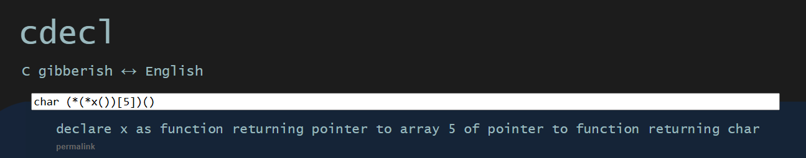
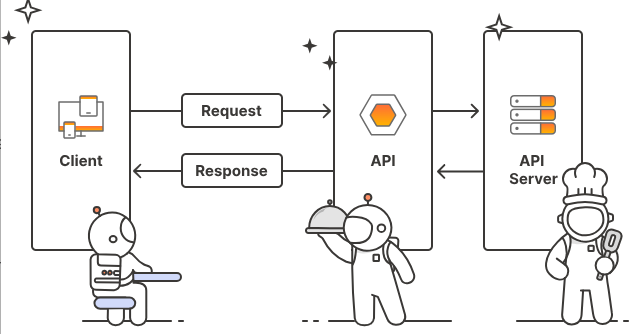

<!-- vscode-markdown-toc -->
* 1. [Рекурсия](#1)
* 2. [int argc, char *argv[]](#2)
* 3. [Указатели на функцию](#3)
	* 3.1. [Массив указателей на функции](#3.1)
* 4. [Callback](#4)
* 5. [API и ABI](#5)
<!-- vscode-markdown-toc-config
	numbering=true
	autoSave=true
	/vscode-markdown-toc-config -->
<!-- /vscode-markdown-toc -->
# Functions part 2

В первой части мы разобрались, как писать свои функции. Теперь посмотрим, что с ними можно делать дальше: вызывать функцию из неё самой, принимать аргументы при запуске программы, передавать функцию в функцию как обычное значение и собирать из этого библиотеку, которой пользуются другие программы.

##  1. <a name='1'></a>Рекурсия

**Рекурсия - это функция, которая вызывает саму себя.** Так можно сделать с любой функцией, даже с `main()`. По устройству рекурсия похожа на цикл: есть начальное значение, шаг и условие выхода.

Посчитаем факториал двумя способами ([recursion.c](src/recursion.c)). Циклом:

```c
int factorial_non_recursive(int N) {
    int res = 1;
    for (int i = N; i > 1; i--) {
        res = res * i;
    }
    return res;
}
```

И рекурсией, результат тот же:

```c
int factorial(int N) {
    if (N < 1) return 1;          // условие выхода
    return N * factorial(N - 1);  // шаг: функция вызывает саму себя
}
```

Как это раскрывается:

```
factorial(5) = 5 * factorial(4)
             = 5 * (4 * factorial(3))
             = 5 * (4 * (3 * factorial(2)))
             = 5 * (4 * (3 * (2 * factorial(1))))
             = 5 * (4 * (3 * (2 * 1)))
             = 120
```

**Важно:** на каждый вызов создаётся новый кадр функции, поэтому глубокая рекурсия съедает стек. Забыли условие выхода - программа упадёт с переполнением стека. В Си рекурсия не самая быстрая, зато удобна там, где задача сама себя повторяет: например, определитель матрицы через миноры в практике по матрицам.

##  2. <a name='2'></a>int argc, char *argv[]

У `main` тоже есть аргументы, и это удобно: при запуске программы можно передать ей параметры.

- `argc` - целое число, количество аргументов. Их всегда минимум один: нулевой аргумент - это имя исполняемого файла.
- `argv` - массив строк с аргументами, индексы от 0 до `argc - 1`.

Попробуем ([argv.c](src/argv.c)):

```c
#include <stdio.h>

int main(int argc, char *argv[]) {
    for (int i = 0; i < argc; i++) {
        printf("argv[%d] = %s\n", i, argv[i]);
    }
    return 0;
}
```

Собираем и запускаем с аргументами:

```bash
gcc src/argv.c -o argv
./argv 123 4 qwerty -c hello
```

Увидим:

```bash
argv[0] = ./argv
argv[1] = 123
argv[2] = 4
argv[3] = qwerty
argv[4] = -c
argv[5] = hello
```

Так программе можно передать размер массива, имя файла, режим работы - что угодно. Например, консольная утилита `cowsay` берёт аргументы и печатает их в облачке:

```bash
cowsay its the first day of the month
```

```bash
 ________________________________
< its the first day of the month >
 --------------------------------
        \   ^__^
         \  (oo)\_______
            (__)\       )\/\
                ||----w |
                ||     ||f
```

А если добавить ещё один аргумент, корова превращается в дракона:

```bash
cowsay -f dragon rawr
```

```bash
 ______
< rawr >
 ------
      \                    / \  //\
       \    |\___/|      /   \//  \\
            /0  0  \__  /    //  | \ \
           /     /  \/_/    //   |  \  \
           @_^_@'/   \/_   //    |   \   \
           //_^_/     \/_ //     |    \    \
        ( //) |        \///      |     \     \
      ( / /) _|_ /   )  //       |      \     _\
    ( // /) '/,_ _ _/  ( ; -.    |    _ _\.-~        .-~~~^-.
  (( / / )) ,-{        _      `-.|.-~-.           .~         `.
 (( // / ))  '/\      /                 ~-. _ .-~      .-~^-.  \
 (( /// ))      `.   {            }                   /      \  \
  (( / ))     .----~-.\        \-'                 .~         \  `. \^-.
             ///.----..>        \             _ -~             `.  ^-`  ^-_
               ///-._ _ _ _ _ _ _}^ - - - - ~                     ~-- ,.-~
                                                                  /.-~
```

Так устроено большинство консольных утилит Linux: аргументы говорят программе, что именно делать. Свою такую картинку можно нарисовать и самому, пример - [ascii.c](src/ascii.c).

##  3. <a name='3'></a>Указатели на функцию

У функций, как и у переменных, есть адреса, и этим можно пользоваться:

```c
int (*cipher_func)(int, char *);
```

Как это читать? Идём от имени переменной: `cipher_func` - имя. В скобках справа `*` значит, что это указатель на функцию, правее в скобках перечислены аргументы `(int, char *)`, а слева остаётся возвращаемый тип. Итого: **`cipher_func` - указатель на функцию, которая принимает `int` и `char *` и возвращает `int`**.

Разбирать сложные объявления удобно на https://cdecl.org/:



Зачем это нужно? Допустим, мы пишем модем, в котором есть несколько алгоритмов шифрования. Все они принимают одни и те же аргументы и возвращают один и тот же результат:

```c
int snow3g(int key, char *text) { /* ... */ }
int aes(int key, char *text) { /* ... */ }
int grasshopper(int key, char *text) { /* ... */ }

int (*cipher_func)(int, char *); // указатель на функцию
cipher_func = snow3g;            // выбрали алгоритм один раз
// ...
cipher_func(42, "secret");       // вызывается snow3g
```

Вместо того чтобы на каждом шаге проверять, какой сейчас алгоритм выбран, мы один раз записали нужную функцию в указатель и дальше вызываем его.

###  3.1. <a name='3.1'></a>Массив указателей на функции

Однотипных функций бывает много, и тогда их удобно сложить в массив:

```c
void (*dfts_fun[])(float, int) = { dft128, dft256, dft512, dft1024 };
```

`dfts_fun` - массив указателей на функции, которые принимают `float` и `int` и ничего не возвращают. Нужная функция выбирается по индексу:

```c
dfts_fun[1](/* аргументы */); // вызовется dft256()
```

Живой пример: преобразование Фурье обычно делают для степеней двойки (128, 256, 512, 1024 элементов), и вместо длинной цепочки `if` пишут массив функций, а нужную выбирают по индексу. Полный пример с выбором функции и по аргументам командной строки, и по массиву - [func_arr.c](src/func_arr.c).

##  4. <a name='4'></a>Callback

**Callback** (функция обратного вызова) - это передача функции в другую функцию как обычного аргумента. Вызываемый код сам решает, что делать с этой функцией.

Пример: нужно переложить элементы из массива `A` в массив `B`, но не все подряд, а по признаку - только чётные или только нечётные. Признак и передаётся функцией:

```c
// condition_func - это и есть callback
void filter(int size_in, const int in[], int size_out, int out[], int (*condition_func)(int)) {
    memset(out, 0, size_out * sizeof(out[0])); // сначала обнулим приёмник

    int j = 0;
    for (int i = 0; i < size_in; i++) {
        if (condition_func(in[i])) { // вызываем ту функцию, которую передали
            out[j++] = in[i];
        }
    }
}

int is_even(int num) { return num % 2 == 0; }
int is_odd(int num)  { return num % 2 != 0; }

// ...
filter(5, A, 5, B, is_even); // в B попадут чётные
filter(5, A, 5, B, is_odd);  // в B попадут нечётные
```

Одна и та же функция `filter` работает с любым признаком: логика сравнения приходит снаружи. Полный пример - [callback.c](src/callback.c).

На колбэках держится многое: сортировка `qsort` из `<stdlib.h>` принимает функцию-компаратор, обработчики нажатий в интерфейсах, обработчики событий в сетевых библиотеках. Про `qsort` и компаратор мы говорили в лекции про массивы - теперь понятно, чем является этот компаратор.

##  5. <a name='5'></a>API и ABI

**API (Application Programming Interface)** - это набор правил, по которым одна программа обращается к другой: какие функции можно вызвать, что им передать и что они вернут. Внутреннее устройство при этом скрыто.

Аналогия - ресторан:



- вы (клиент) - это одна программа;
- кухня (сервер или библиотека) - другая программа, у которой есть данные и возможности;
- официант - это API: посредник, который принимает заказ по правилам меню и приносит ответ.

Примеры из жизни:

- банковское приложение: при оплате заказа приложение обращается к API банка и говорит, какую сумму списать, не зная, как банк устроен внутри;
- приложение погоды: само оно погоду не знает, а спрашивает сервер погодной службы и показывает ответ;
- карты (2ГИС, Яндекс.Карты), боты в мессенджерах - всё это общение через API.

Простыми словами: API говорит, что если хочешь что-то получить, обратись вот таким способом, и я отвечу вот так. Библиотека `stdio.h`, которой мы пользуемся с первой лекции, - это тоже API: `printf` скрывает от нас всю работу с терминалом и буферами.

**ABI (Application Binary Interface)** - соглашение на уровень ниже: о том, как уже скомпилированные программы общаются между собой на уровне процессора и операционной системы. Здесь договариваются о том:

- как передаются аргументы (в регистрах процессора или в стеке, в каком порядке);
- как функция возвращает результат;
- как данные расположены в памяти;
- какой формат исполняемого файла (в Linux это ELF);
- как выполняется системный вызов к ядру.

Коротко: **API - про общение программ между собой, ABI - про общение программы с машиной.** Отсюда и две классические проблемы:

- несовместимость API: программа, собранная под Linux, не запустится на Windows;
- несовместимость ABI: программа работала с библиотекой, где функция принимала два аргумента, библиотеку обновили и она ждёт три - старая программа с новой библиотекой работать не будет.

ABI как раз и нужен, чтобы библиотека, собранная одним компилятором, заработала с программой, собранной другим, если оба соблюдают одно и то же ABI.
