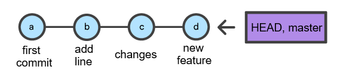
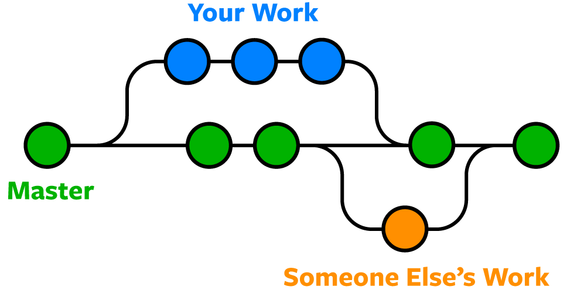

<!-- vscode-markdown-toc -->
* 1. [Кто такой Git?](#1)
* 2. [Git не следует путать с GitHub и прочими](#2)
* 3. [Практическая часть с Git](#3)
	* 3.1. [Getting started](#3.1)
	* 3.2. [Создание Репозитория](#3.2)
	* 3.3. [Запись изменений в репозиторий (Коммит)](#3.3)
		* 3.3.1. [.gitignore](#3.3.1)
		* 3.3.2. [Коммит](#3.3.2)
	* 3.4. [Удаленные репозитории (push, clone, fetch, pull)](#3.4)
	* 3.5. [Ветвление в Git](#3.5)
		* 3.5.1. [Ветки](#3.5.1)
		* 3.5.2. [Merge и конфликты](#3.5.2)
	* 3.6. [Отмена изменений](#3.6)
	* 3.7. [Версия проекта через git](#3.7)
	* 3.8. [git submodules](#3.8)
	* 3.9. [git stash](#3.9)
	* 3.10. [Gitlens](#3.10)
	* 3.11. [Фича github: VSCode в github.com](#3.11)
  	* 3.12. [А теперь рассмотрим Gitlab и красивые графы коммитов из реальных проектов..](#3.12)

<!-- vscode-markdown-toc-config
	numbering=true
	autoSave=true
	/vscode-markdown-toc-config -->
<!-- /vscode-markdown-toc -->
# Система контроля версий Git

Нет описания лучше чем документация от самих разработчиков   
- [Книга Pro Git](https://git-scm.com/book/ru/v2)     
- [Документация Git](https://git-scm.com/doc)        
- [Документация GitHub](https://docs.github.com/ru)    

Упражнения
- [Git Katas](https://github.com/eficode-academy/git-katas/tree/master)
- [LearnGitBranching](https://learngitbranching.js.org/?locale=ru_RU)

                      
[Github планета](https://github.com/globe)                         

##  1. <a name='1'></a>Кто такой Git?


             
                                 
Git (произносится «гит») — распределённая система управления версиями. Проект был создан Линусом Торвальдсом для управления разработкой ядра Linux, первая версия выпущена 7 апреля 2005 года                               

Попробую перевести понятие "распределенная система управления версиями" в простые слова: **Git** - это такая программа, которая позволяет просматривать историю изменений файлов с кодом, а также хранить эти самые файлы с кодом таким образом, что мы можем в любой момент откатиться до нужной версии. Ну и также стоит не забывать про то, что сейчас программисты работают в коммандах и Git также это учитывает и поддерживает, например мы можем увидеть какие изменения какой участник внес и когда    

На сегодня Git самый популярный инструмент для хранения и управления версиями кода. Есть у него и аналоги, но на них мы даже и не будем тратить время, т.к. в какую компанию вы бы не пришли в 99% случаев будет использоваться система контроля версий Git в не зависимости от используемого языка программирования       

**Что нам дает Git как разработчику?** Посмотрим на пару картинкок с примером

- Отслеживать изменения, например: создали файл, добавили в него код, удалили из него код и т.д.   
    

- Возможность откатиться (revert) к последней работающей версии если что-то пошло не так   
     

- Протестировать изменения в коде не изменяя работающий оригинал. Создаем мини копию с оригиналом, модифицируем ее как хотим, тестим по полной и если ничего не отвалилось сливаем (мержим, соединяем) в оригинал   
 

- Синхронизировать изменения между разными людьми или устройствами, где последняя актуальная версия кода с его историей хранится на некотором сервере    
 


##  2. <a name='2'></a>Git не следует путать с GitHub и прочими

**Git** — это инструмент, позволяющий реализовать распределённую систему контроля версий.  

**GitHub** — крупнейший веб-сервис для хостинга IT-проектов и их совместной разработки. Веб-сервис основан на системе контроля версий Git. Git-репозиторий, загруженный на GitHub, доступен с помощью разных интерфейсов (командная строка, web и пр. графические интерфейсы).  

Кроме GitHub есть другие сервисы, которые используют Git, — например, Bitbucket, Gitlab и некоторые другие. Каждый из них под капотом содержит систему Git, но отличаются они все веб интерфейсами, а также каждый из них привносит свои фичи при работе с проектами.    

Мы будем работать именно с GitHub - т.к. это доступный для всех начинающих и опытных разработчиков сервис (ну и конечно один из самых популярных).     

##  3. <a name='3'></a>Практическая часть с Git
###  3.1. <a name='3.1'></a>Getting started

[Для использования git нам необходимо установить его](https://git-scm.com/book/ru/v2/%d0%92%d0%b2%d0%b5%d0%b4%d0%b5%d0%bd%d0%b8%d0%b5-%d0%a3%d1%81%d1%82%d0%b0%d0%bd%d0%be%d0%b2%d0%ba%d0%b0-Git)

А также завести аккаунт на [GitHub](github.com)   
Если при регистрации возникают проблемы, то стоит попробовать указать gmail почту.      

И если работаете из консоли - залогиниться:     
```bash
git config --global user.name "User Name"
git config --global user.email username@example.com
```
    
Проверить имя/почту можно так:                  
```bash
git config --global user.name
git config --global user.email
```

git - утилита и она принимает множество различных флагов на вход, чтобы вспомнить можно воспользоваться --help для просмотра возможностей, например
```bash
git --help
```
или при выборе команды git, например подсказка по git config:
```bash
git config --help
```

В VSCode по умолчанию уже есть вкладка для работы с Git

###  3.2. <a name='3.2'></a>Создание Репозитория

Репозито́рий (от англ. repository — хранилище) — место, где хранятся и поддерживаются какие-либо данные. Иногда можно встретить сокращенно 
"repo", "git repo". А еще иногда можно услышать "репозитАрий"    

Простыми словами это подобно папке с проектом, хранящей не только файлы, но и их историю изменений.      

Заходим в github.com, логинимся, а далее вспоминаем как это показывали на лекции, либо гуглим, либо читаем [Github doc создание репо](https://docs.github.com/en/repositories/creating-and-managing-repositories/creating-a-new-repository)   

Если проект пустой, то необходимо инициализировать git командой 
```bash
git init
```
Команды по инициализации репо обычно показываются github когда заходим в наш пустой репо.

###  3.3. <a name='3.3'></a>Запись изменений в репозиторий (Коммит)
Источник: https://git-scm.com/book/ru/v2/%d0%9e%d1%81%d0%bd%d0%be%d0%b2%d1%8b-Git-%d0%97%d0%b0%d0%bf%d0%b8%d1%81%d1%8c-%d0%b8%d0%b7%d0%bc%d0%b5%d0%bd%d0%b5%d0%bd%d0%b8%d0%b9-%d0%b2-%d1%80%d0%b5%d0%bf%d0%be%d0%b7%d0%b8%d1%82%d0%be%d1%80%d0%b8%d0%b9    

Прежде чем залить наши изменения в репо, надо понять какие состояния бывают у наших файлов с кодом   

 

Каждый файл в репо может быть
- отслеживаемым 
  - Неизмененные (unmodified) - файлы, в которых ничего не поменялось
  - Измененные (modified) - файлы, в которых есть изменения (удалили или написали что-то новое)
  - Подготовленные к фисированию (индексации) изменений - коммиту (staged)
- неотслеживаемым - отличие от неизмененных в том, что неотслеживаемые файлы - файлы, об истории изменений которых Git не знает (например новый файл)

Определить состояние файлов можно командой 
```bash
git status
```
или в VSCode во вкладке Source Control (слева сверху под лупой и файликом): все что в Changes - измененные, а конкретнее по букве напротив файла M = modified, а U - untracked.    

Если мы склонируем (скачаем) проект с git'ом, то все файлы в нем будут неотслеживаемыми и неизмененными.     
```bash
On branch master
Your branch is up-to-date with 'origin/master'.
nothing to commit, working tree clean
```
Эти строки значат, что у нас все без изменений, т.е. нет отслеживаемых и измененных файлов.
А в VSCode в Source Control вообще будет пусто.   

При изменении отслеживаемого файла - он переходит в состоянии измененный и все эти изменения можно увидеть через команду    
```bash
git diff
```
или в VSCode во вкладке Source Control открыв нужный файл   
- "+" и/или <span style="color:green">зеленый цвет</span> == Добавлено новое   
- "-" и/или <span style="color:red">красный цвет</span> == Удалено старое   

Следующий этап после модификации файлов - фиксация (индексация) их изменений, делается с помощью команды 
```bash
git add
```
где после add прописываются файлы (с путями до них) либо указывается директория из которой рекурсивно необходимо добавить все файлы в staged состояние.   
Например, находясь в корне проекта, можно написать 
```bash
git add .
```
и тогда в staged переместятся все ниже лежащие файлы.     
В VSCode сделать это можно в Source Control выделив нужные файлы -> нажать ПКМ -> Stage Changes.  

Перенести обратно читайте ниже в разделе откатиться

Файлы в состоянии Staged можно модифицировать, тогда файлы будут находится в двух разных состояниях: в Stage останутся те изменения которые мы сделали до команды git add, а в Changes (modified) будут изменения после команды git add

git diff в данном случае будет уже показывать разницу между staged и modified файлом.    

Та, версия файла, находящаяся в staged состоянии - почти готова к отправке на github

####  3.3.1. <a name='3.3.1'></a>.gitignore
Важно упомнять про файл в корне проекта - .gitignore
в нем прописываются пути и файлы, состояния которых полностью игнорируются
Файл поддерживает регулярные выражения (regexp)
Игнорируются только **неотслеживаемые** файлы

####  3.3.2. <a name='3.3.2'></a>Коммит

Коммит (англ. Commit - фиксировать) - это способ сохранения изменений в коде. Каждый такой коммит содержит информацию о том, что было изменено в коде, кем были внесены эти изменения и когда. Под коммитом можно понимать некоторый снимок состояния проекта    

**Важно** каждый коммит помимо инфы несет свой уникальный id из 40 символов, в составе могут быть как буквы, так и цифры. - это называется хэш коммита и по нему часто разработчики понимают версию запускаемого кода. Хэш коммита генерится с помощью крипто хэш-функции SHA-1  

Теперь когда мы перенесли наши файлы в состояние staged, мы можем их закоммитить, для этого используется команда
```bash
git commit -m "Сообщение коммита: что поменялось"
```
Или если хотим написать сообщение в текстовом редакторе
```bash
git commit
```
в VSCode - прописывается сообщение над БОЛЬШОЙ синей кнопкой Commit и нажимается эта самая кнопка.    

**Маленькая хитрость с commit** - git commit может сразу же выполнить команду git add, пример:
```bash
git commit -am "hello git"
```
В этой команде все modified файлы сразу перейдут в staged, а затем закоммитятся с сообщение "hello git"    

Как теперь просмотреть историю изменения файлов? Очень просто есть команда
```bash
git log
```
выводящая информацию о коммитах. В верхушке стека будут самые последние коммиты.
Интересные флаги для git log также будут --pretty (oneline, short, full, fuller и format):
```bash
git log --pretty=oneline
```
```bash
git log --oneline --graph --decorate
```  
- --oneline – показывает каждый коммит в одной строке. Кроме того, она показывает лишь префикс ID коммита.
- --decorate – печатает все относительные имена показанных коммитов.
- --graph - ветки визуализирует красивенько

В VSCode это будет в Source Control Graph. Можно мышкой навести на любой коммит и увидеть все тоже самое.

Из длинных git комманд можно делать алиасы (псевдоним, сокращение), например:
git config --global alias.lol 'log --oneline --graph --all' добавит алиас 
git lol (что сокращенно тоже что и git log --oneline --graph --all)     

Отлично, теперь мы научились сохранять наши изменения, смотреть что поменялось и коммитить. Однако после коммита приятно удивимся, что наши изменения все еще не попали в наш репо на github.com. Чтоб это понять нужно прочитать [Удаленные-репозитории](#Удаленные-репозитории (push, clone, fetch, pull))                    

В итоге коммит это что-то типа снимка состояния проекта на полароид, где на фото затем нанесли некоторые данные (автор, дата, хэш коммита..)               

            

###  3.4. <a name='3.4'></a>Удаленные репозитории (push, clone, fetch, pull)

https://git-scm.com/book/ru/v2/%d0%9e%d1%81%d0%bd%d0%be%d0%b2%d1%8b-Git-%d0%a0%d0%b0%d0%b1%d0%be%d1%82%d0%b0-%d1%81-%d1%83%d0%b4%d0%b0%d0%bb%d1%91%d0%bd%d0%bd%d1%8b%d0%bc%d0%b8-%d1%80%d0%b5%d0%bf%d0%be%d0%b7%d0%b8%d1%82%d0%be%d1%80%d0%b8%d1%8f%d0%bc%d0%b8   

Все наши коммиты на самом деле являются локальными (local), сам наш репозиторий наоборот - удаленный (remote), т.е. он хранится на некотором сервере в интернетах.

От части это полезно тем, что вы можете набрать n-ое кол-во коммитов локально и разом их запушить. А пока их копите у себя локально иногда бывает надо откатиться назад, что-то отменить       
**Не торопитесь пушить сразу на удаленный сервер, стоит перепроверить ничего ли не забыли**

Для того чтобы нам изменения наши затолкать на удаленный репо - мы должны их запушить командой
```bash
git push
```
или в VSCode найти кнопку push (стрелочка вверх)

Есть обратная команда, позволяющая затащить последние изменения к нам
```bash
git pull
```
а в VSCode стрелочка вниз. Данная команда используется когда кто-то другой закоммитил и запушил свои изменения - из-за чего мы не сможем запушить свои изменения пока все предыдущие изменения файлов не будут у нас. Т.к. наш коммит пойдет после коммитов коллеги, то он должен находиться на верхушке стека.

Здесь важно понять, что git pull сразу же попытается добавить все последние коммиты, которых у вас нет к вам. Если же мы попробуем выполнить
```bash
git fetch
```
тогда мы лишь обновим информацию о всех коммитах нашего репо, но не будем их к себе пуллить. т.е. git pull это git fetch + добавить все эти изменения к себе (git merge)

Склонировать проект - значит скачать удаленный репозиторий, делается командой
```bash
git clone <url>
```
где url - ссылка на проект, например склонируем данный репозиторий:
```bash
git clone https://github.com/kruffka/C-Programming.git
```

Дополнительно:
```bash
git remote -v
```
По умолчанию появится слово origin - алияс (alias - псевдоним) на нашей системе, под которым подразумевается удаленный репозиторий.    


###  3.5. <a name='3.5'></a>Ветвление в Git

До этого момента мы выполняли изменения довольно линейно, т.е. добавили коммит, изменения, еще изменения, новую фичу - все это было друг за другом.
   

где HEAD - ссылка (указатель) на ваш последний коммит вашей ветки. Можно глянуть cat .git/HEAD
Если указывается не ветка, а коммит в этом файле, то это значит у вас detached HEAD == вы пошли бродить по предыдущим коммитам ветки.     

Но git как и другие системы контроля версий поддерживают ветвление, т.е. возможность работать с разными версиями кода параллельно, пример:



После работы в отдельной собственной версии кода мы можем все слить (смержить) в исходную ветку

####  3.5.1. <a name='3.5.1'></a>Ветки

Ветка (англ. Branch) в Git — это простой перемещаемый указатель на один из коммитов. По умолчанию, имя основной ветки в Git — master. 
Ветки в Git одна из лучших фич и они довольно легковесны, т.е. их легко и быстро создать, смержить и т.д. в отличии от других систем контроля версий

Полезные команды для веток:
```bash
git switch
git switch -c
git branch
git branch <branch-name>
git branch -v
git branch -d <branch-name>
git diff
git diff <branchA> <branchB>
git checkout
git checkout -b
```
https://git-scm.com/book/en/v2/Git-Branching-Branches-in-a-Nutshell    
https://git-scm.com/book/en/v2/Git-Branching-Basic-Branching-and-Merging    

В реальной большой разработке обычно есть как минимум ветка master и develop. В master содержатся самые стабильные версии и релизы, которые отдаются в продакшн. develop - основная ветка для разработки, в ней кипит вся разработка и мержатся все мелкие ветки с новыми фичами, затем проверяется и мержится в master.    

Оригинал отсюда: https://nvie.com/posts/a-successful-git-branching-model/     

####  3.5.2. <a name='3.5.2'></a>Merge и конфликты

При слиянии веток создается новый коммит (если не используется опция --no-commit)    
```bash
git merge
```
https://git-scm.com/docs/git-merge      

и второй вариант слить ветки - перебазировать (лучше пользуйтесь merge)     
```bash
git rebase
```
https://git-scm.com/book/ru/v2/%D0%92%D0%B5%D1%82%D0%B2%D0%BB%D0%B5%D0%BD%D0%B8%D0%B5-%D0%B2-Git-%D0%9F%D0%B5%D1%80%D0%B5%D0%B1%D0%B0%D0%B7%D0%B8%D1%80%D0%BE%D0%B2%D0%B0%D0%BD%D0%B8%D0%B5         
Иногда слияния (merge) проходят не без ошибок (конфликтов). Например если у нас в одной и той же строке в разных ветках что-то поменялось и мы пытаемся их смержить. Git в таком случае выдаст конфликт и предложит вам его решить чтоб смержить ветки.    

Если коммит сливается с тем, до которого можно добраться, двигаясь по истории вперёд, Git упрощает слияние, просто перенося указатель ветки вперёд, потому что в этом случае нет никаких разнонаправленных изменений, которые нужно было бы свести воедино. Это называется «fast-forward» (ff).   
Кроме ff, можно увидеть еще:    
- --ff — (по умолчанию) попытаться выполнить перемотку (fast forward), если не удалось, то создать коммит слияния.
- --no-ff — всегда создавать коммит слияния.
- --ff-only — попытаться выполнить перемотку, если не удалось, завершить ошибкой.     

https://git-scm.com/docs/git-merge#Documentation/git-merge.txt---ff    

Есть интерактивный сайт, что поможет лучше понять работу веток в Git: [LearnGitBranching](https://learngitbranching.js.org/?locale=ru_RU)     
Не забываем книгу про git: https://git-scm.com/book/ru/v2/%d0%92%d0%b5%d1%82%d0%b2%d0%bb%d0%b5%d0%bd%d0%b8%d0%b5-%d0%b2-Git-%d0%9e-%d0%b2%d0%b5%d1%82%d0%b2%d0%bb%d0%b5%d0%bd%d0%b8%d0%b8-%d0%b2-%d0%b4%d0%b2%d1%83%d1%85-%d1%81%d0%bb%d0%be%d0%b2%d0%b0%d1%85    


###  3.6. <a name='3.6'></a>Отмена изменений

  

https://git-scm.com/book/ru/v2/%d0%9e%d1%81%d0%bd%d0%be%d0%b2%d1%8b-Git-%d0%9e%d0%bf%d0%b5%d1%80%d0%b0%d1%86%d0%b8%d0%b8-%d0%be%d1%82%d0%bc%d0%b5%d0%bd%d1%8b     

https://ohshitgit.com/ - есть русская версия, ищите сами    

В этой секции нужно быть осторожно с командами - если будете бездумно применять команды, то можете запросто потерять кучу времени, удалив полезные вещи. Ну или нечаянно поднасрать коллегам. 

Из системы git очень сложно что-то удалить на самом деле, все изменения будут в истории. Но так будет не всегда, можно постараться натыкать так, что вообще все потеряется - **будьте осторожны и не вводите команды из интернета не понимая что они делают**
Если все же что-то подобное произошло, попробуйте 
```bash
git reflog
```
Это последняя надежда на отмену страшных изменений.   

Бывает поторопились - закоммитили (**но не запушили!**), но забыли добавить в коммит файлы, исправляется несложно и подсказки всегда выдает команда git status.    
Добавляем забытые файлы и вызываем git commit с флагом --amend    
```bash
git commit --amend
```
Помимо добавления новых файлов, этой же командой можно переименовать коммит если назвали как-то не так, без открытия текстового редактора так:
```bash
git commit --amend -m "New commit message"
```

Если успели запушить на удаленку, то есть один интересный флаг для git push.   

**ВНИМАНИЕ** С ним нужно быть очень осторожным и понимать что вы делаете - иначе можно стереть вообще все.   

Флаг "--force" или он же сокращенно "-f". Его нужно добавлять к команде git push, пример:
```bash
git push -f
```
Данная команда возьмет текущее локальное состояние коммитов и перезапишет все в удаленном репо на вашу версию. Т.е. если кто-то что-то закоммитил после вас и вам вдруг захотелось откатиться или переименовать коммит свой, то сделав действие git commit --amend + git push -f вы удалите навсегда изменения вашего товарища. Думаю он не обрадуется :(     

Перенести обратно из stage в VSCode также через ПКМ -> unstage changes, а в консоли команда 
с Git версии 2.23.0
```bash
git restore --staged *файлы*
```
Или всегда можно   
```bash
git reset HEAD *файлы*
```

**Варианты отмены коммита**:
Создать новый коммит, который будет полностью противоположен удаляемому коммиту == все что добавлялось удалится и наоборот
```bash
git revert HEAD
```
или удалить все изменения до commit_hash
```bash
git revert *commit_hash*
```

Отменить коммит и при этом сохранить к себе все изменения в staged:
```bash
git reset --soft HEAD~1
```
где ~1 - число коммитов на которое откатимся назад, изменения всех этих коммитов появятся в staged.    

Жесткий вариант (и конечно **не самый безопасный** - надо понимать что делаете) с удалением всех текущих изменений (если без HEAD, то сотрется все текущие изменения, не считая коммита)
```bash
git reset --hard
```

Команда позволяющая слить к себе определённый коммит    
```bash 
git cherry-pick *<commit_sha>*    
```

###  3.7. <a name='3.7'></a>Версия проекта через git

Обычно для того чтобы различить запускаемую версию при сборке исполняемого файла версию, дату и хэш коммита прошивают в исполняемый файл     
```bash
git rev-parse --abbrev-ref HEAD
git log -1 --format=%h
git log -1 --format=%cd
```

###  3.8. <a name='3.8'></a>git submodules
https://git-scm.com/docs/git-submodule     
https://git-scm.com/book/en/v2/Git-Tools-Submodules    

###  3.9. <a name='3.9'></a>git stash

Иногда полезно все изменения сохранить локально и переключиться на другую ветку для решения другой задачи, при этом изменения не хочется терять, для этого нам поможет stash (тайник)             
```bash
git stash
git stash pop
```

###  3.10. <a name='3.10'></a>Gitlens

Расширение в VSCode Gitlens может быть полезным при работе с Git   
   

###  3.11. <a name='3.11'></a>Фича github: VSCode в github.com

Откройте свой репозиторий, например
https://github.dev/kruffka/C-Programming
и вместо .com введите .dev

###  3.12. <a name='3.12'></a>А теперь рассмотрим Gitlab и красивые графы коммитов из реальных проектов.. 
