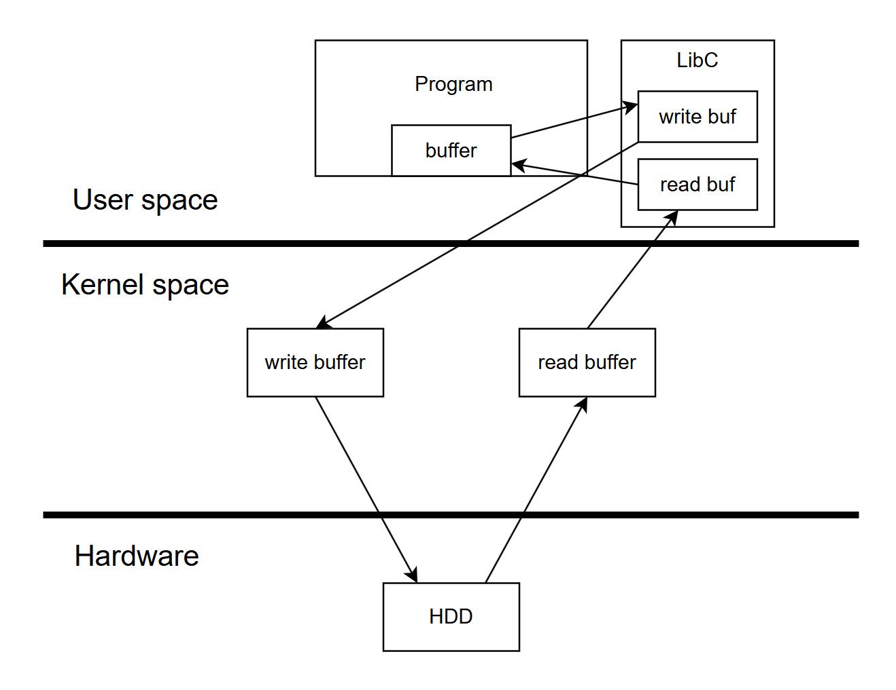

# Команды в терминале  
-----------
mkdir my_dir # Создать каталог   my_dir
ls           # Просмотреть список файлов в текущем каталоге  
pwd          # Вывести имя текущей директории  
cd my_dir    # Перейти в каталог my_dir  
cd ..        # Подняться на каталог "выше" (вернуться назад)  
nano hello.c # открыть файл в текст. редакторе nano  
rm file_name # удалить файл с именем file_name  
# Команды в текст. редакторе nano   
CTRL+O (^O) # save program  
CTRL+X (^X) # exit program  
# Компиляция и запуск  
gcc hello.c -o hello  
./hello  

    

      

     

               

# C-Programming
Лекции и практические примеры по Программированию для 1 курса СибГУТИ
  
Pointer  
  
       			  _______________________________________________
			         |	            				 |  
			         |                                               V  
		    -----------|---------------|-------------------------------|---------------|-----  
		      ..|  |   | p |   |   |   |   |   |   |   |   |   |   |   | n |   |   |   |..  
		    -----------|---------------|-------------------------------|---------------|-----
	     		      100 101 102 103 104			      112 113 114 115 116  

			     
	int n = 5;   
	int *p;   // sizeof(p) = sizeof(int *) = 4 or 8 byte (x86_32 or x86_64)    
	p = &n;   // p = addr of n  
	*p = 123; // dereference pointer p   

  
Pointer to pointer  
  
    /*  
               ________________________________________________________________  
	         _|_____________________________________________                   |
		| |	                                        |                  |
		| V                                             V                  |
	------|---------------|-------------------------------|---------------|--|---------------|--
	..|   | p |   |   |   |   |   |   |   |   |   |   |   | a |   |   |   |..| s |   |   |   |..
	------|---------------|-------------------------------|---------------|--|---------------|--
	     100 101 102 103 104		             112 113 114 115 116 128 129 130 131 132
	    
        int a = 5;
        int *p = &a;
        int **s = &p;
        **s = 2;

		int* ----> [1, 2, 3]

    int arr[3][3]; 
    0 1 2
    3 4 5
    6 7 8
        int** -----------> int* -> [0, 1, 2]
                           int* -> [3, 4, 5]
        +2*sizeof(int**)-> int* -> [6, 7, 8]
    */
