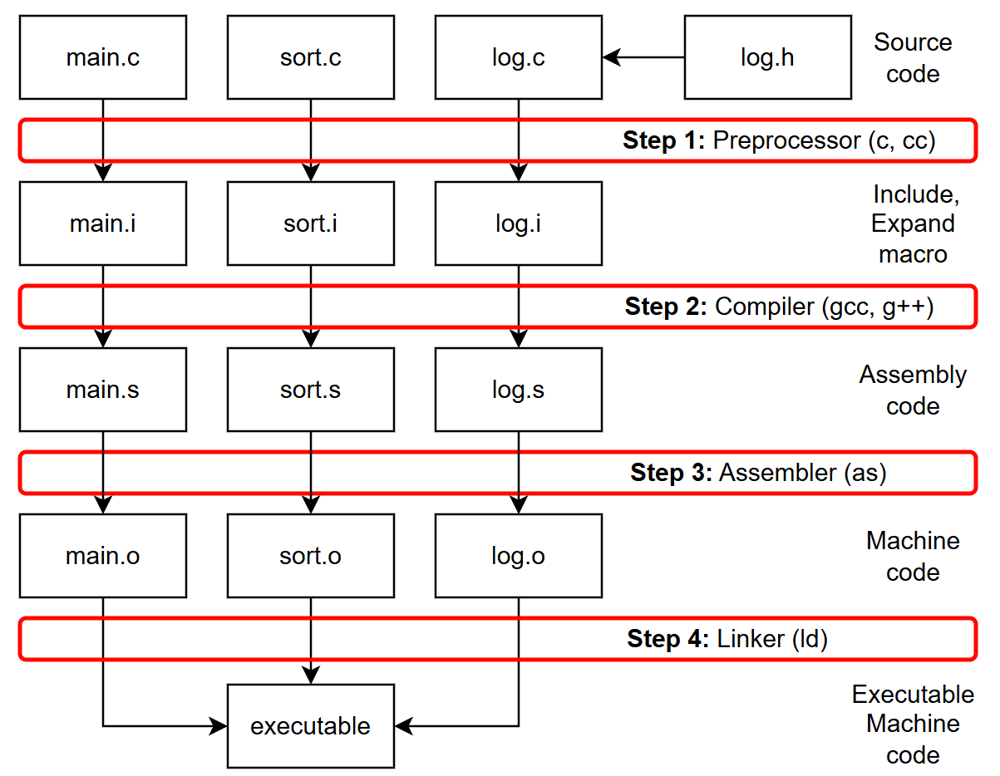

# 💻 Programming
Лекции и практические примеры по Программированию для 1 курса СибГУТИ (2025-2026 гг)    

```
+------------------------------------------------------------------------------------+
|   ___       __      ___    ______               ___       __      ___      ____    |
| /'___`\   /'__`\  /'___`\ /\  ___\            /'___`\   /'__`\  /'___`\   /'___\   |
|/\_\ /\ \ /\ \/\ \/\_\ /\ \\ \ \__/           /\_\ /\ \ /\ \/\ \/\_\ /\ \ /\ \__/   |
|\/_/// /__\ \ \ \ \/_/// /__\ \___``\  _______\/_/// /__\ \ \ \ \/_/// /__\ \  _``\ |
|   // /_\ \\ \ \_\ \ // /_\ \\/\ \L\ \/\______\  // /_\ \\ \ \_\ \ // /_\ \\ \ \L\ \|
|  /\______/ \ \____//\______/ \ \____/\/______/ /\______/ \ \____//\______/ \ \____/|
|  \/_____/   \/___/ \/_____/   \/___/           \/_____/   \/___/ \/_____/   \/___/ |
+------------------------------------------------------------------------------------+            
```

## 📖 Лекции

[How to VSCode](https://github.com/kruffka/C-Programming/blob/2025-2026/vscode/README.md)                    

[0_hello_world. Вводная лекция. Компиляция. Переменные и константы](https://github.com/kruffka/C-Programming/blob/2025-2026/0_hello_world/README.md)              

[1_conditions. Ввод с клавиатуры и условия](https://github.com/kruffka/C-Programming/blob/2025-2026/1_conditions/README.md)                  

[2_loops. Циклы](https://github.com/kruffka/C-Programming/blob/2025-2026/2_loops/README.md)                      

[3_functions_p1. Функции ч.1](https://github.com/kruffka/C-Programming/blob/2025-2026/3_functions_p1/README.md)                       

[4_bitwise_ops. Битовые операии](https://github.com/kruffka/C-Programming/blob/2025-2026/4_bitwise_ops/README.md)            

[5_arrays. Массивы. Матрицы. Строки](https://github.com/kruffka/C-Programming/blob/2025-2026/5_arrays/README.md)          

[6_pointers. Указатели. Динамические массивы. Модель памяти Языка Си. Виртуальная память](https://github.com/kruffka/C-Programming/blob/2025-2026/6_pointers/README.md)                          

[7_functions_p2. Функции ч.2](https://github.com/kruffka/C-Programming/blob/2025-2026/7_functions_p2/README.md)                    

[8_preprocessor. Препроцессорные директивы](https://github.com/kruffka/C-Programming/blob/2025-2026/8_preprocessor/README.md)             

[9_git. Система контроля версий Git](https://github.com/kruffka/C-Programming/blob/2025-2026/9_git/README.md)            

[10_struct_union. Структуры и объединения](https://github.com/kruffka/C-Programming/blob/2025-2026/10_struct_union/README.md)            

[11_debug. Отладка программ: GDB, valgrind, ASan](https://github.com/kruffka/C-Programming/blob/2025-2026/11_debug/README.md)             

[12_libraries. Многофайловый проект. Статические и динамические библиотеки](https://github.com/kruffka/C-Programming/blob/2025-2026/12_libraries/README.md)            

[13_make_cmake. Системы сборки Make и CMake](https://github.com/kruffka/C-Programming/blob/2025-2026/13_make_cmake/README.md)             

[14_linked_lists. Big O. Связанные списки (Linked List)](https://github.com/kruffka/C-Programming/blob/2025-2026/14_linked_lists/README.md)           

[15_files. Файлы](https://github.com/kruffka/C-Programming/blob/2025-2026/15_files/README.md)              


## 📚 О курсе
Изучать будем с самого нуля, т.е. те кто впервые вообще слышит о программировании – **не страшно**.    
Первым делом нам нужен **Язык Программирования**      
- Язык Си – самая классика, во многих вузах мира с него начинают путь и не просто так:
  - Довольно прост
  - На нем написано множество других языков программирования (в т.ч. ваш любимый Python), следовательно поняв Си, будет попроще перепрыгнуть на другие
  - Поможет вам пройти универ на хорошую концовку
  - Хоть с каждым годом популярность ниже, но без него никуда, он везде.. Операционные Системы, драйвера, embedded и прочее системное ПО
  - Позволяет чуть лучше понять работу компьютера (Системное программирование - fast and small)
  - Even Beethoven wrote his Symphony in [C](https://www.youtube.com/watch?v=cdX8r3ZSzN4&list=RDcdX8r3ZSzN4)    
     
### **🎯 Что еще?**
- Подтянем технический Английский и Русский язык 
- Познаем Code Style
- Узнаем как работать в консольке linux
- Система контроля версий (Git)
- Системы сборки кода
- Архитектура ПК и ПО
- Отладка программ (всякая разная)
- Базовые алгоритмы и чуть про их сложность (подробнее узнаете на САОДе)
- Жизненный цикл ПО и основы тестирования
- Основы многопоточных программ
- Насколько успеем основы C++
- Обсудим ИИ вместе с ИИ
- Что-нибудь еще, что щас не вспомню
- Ну и немного мемов, профессия разработчика нервная.. смех полезен

                      


```
+----------------------+  0xffffffff
|         Stack        |  |
|          |           |  |  Рост стека
|          v           |  |
+----------------------+  |
|          ^           |  |
|          |           |  |  Рост кучи
|         Heap         |  |
+----------------------+  |
|         BSS          |  |
+----------------------+  |
|         Data         |  |
+----------------------+  |
|         Text         |  |
|                      |  |
+----------------------+  0x000000000
```

            

