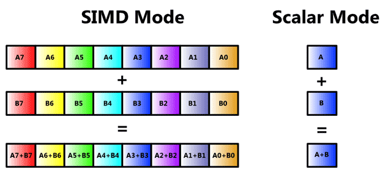
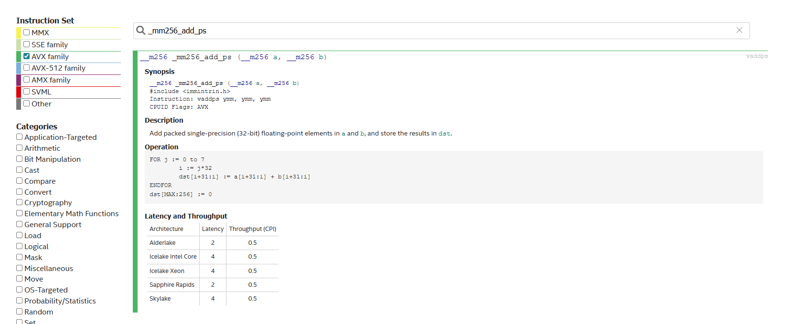

<!-- vscode-markdown-toc -->
* 1. [SISD vs SIMD. Векторные инструкции](#1)
* 2. [intrinsic](#2)
	* 2.1. [Сколько чисел можно за раз обработать?](#2.1)
	* 2.2. [Зачем load и store. Учимся читать доку из Intel](#2.2)
	* 2.3. [Размер массива не степень двойки? Обработка хвоста](#2.3)
* 3. [Когда использовать векторные инструкции?](#3)
	* 3.1. [Плюсы и минусы векторных инструкций](#3.1)
* 4. [Заголовочные файлы](#4)
	* 4.1. [SIMDe](#4.1)
* 5. [Практические примеры](#5)
	* 5.1. [Арифметические операции](#5.1)
	* 5.2. [Целые числа](#5.2)
	* 5.3. [Сравнение и маскирование](#5.3)
	* 5.4. [Операции с памятью](#5.4)
	* 5.5. [Побитовые и логические](#5.5)
	* 5.6. [Математические функции](#5.6)
	* 5.7. [Операции перестановки и перемешивания](#5.7)
	* 5.8. [Горизонтальные операции](#5.8)

<!-- vscode-markdown-toc-config
	numbering=true
	autoSave=true
	/vscode-markdown-toc-config -->
<!-- /vscode-markdown-toc -->

# SIMD

##  1. <a name='1'></a>SISD vs SIMD. Векторные инструкции

Традиционно мы используем скалярные инструкции (Single Instruction Single Data), например:
```c
for (int i = 0; i < 4; i++) {
    c[i] = a[i] + b[i];
}
```
Здесь мы складываем по одному элементу за раз в цикле, понятное дело компилятор может оптимизировать подобные циклы (loop unroll и т.д.), но **очень грубо говоря** процессору, без оптимизаций этого кода, понадобится 4 такта.                  

Так вот если копнуть глубже в архитектуру процессора, то мы увидим, что у процессоров уже очень давно есть специальные порты, которые поддерживают параллельные инструкции, называется это SIMD (Single Instruction Multiple Data) или **векторные инструкции**. Что это значит? Это значит, что за один такт процессора (за одну инструкцию) мы можем обработать много данных.            

           

Исторически SIMD развитие выглядит примерно так (для x86):
- MMX (1997) - 64-битные регистры для целых чисел
- SSE (1999) - 128-битные регистры, поддержка float
- SSE2-SSE4 (2000-2006) - улучшения и новые инструкции
- AVX (2011) - 256-битные регистры
- AVX2 (2013) - улучшенные операции для целых чисел
- AVX-512 (2015) - 512-битные регистры
- и т.д..

Для ARM процессоров семейство этих инструкций называется NEON (где-то с 2007 года)               

Эти непонятные SSE, AVX вы могли видеть при покупке процессора, т.к. эти аббревиатуры обычно указываются в характеристиках проца.                  

Узнать какие поддерживает SIMD инструкции ваш процессор можно, например так (linux):
```bash
cat /proc/cpuinfo | grep avx
```

Обычно векторные инструкции можно встретить при обработке видео/фото, аудио в научных вычислениях, криптографии в машинном обучении.. да и еще много где в современном мире.. Однако для такой обработки иногда лучше использовать графические ускорители (GPU и т.д..), которые предназначены для работы с векторами на огромной куче ядер и потоков..          

Но не всегда есть такая роскошь, взять например телефон, которому постоянно и по многу необходимо из воздуха ловить сигнал (массив комплексных чисел) и проводить над ним кучу разных действий - от преобразования Фурье до перемежения бит и декодирования их каким-нибудь полярным декодером            

##  2. <a name='2'></a>intrinsic

**intrinsic** - это такая встроенная функция, которую мы будем использовать. Для разных архитектур инстринсики тоже разные. Это что-то типа обертки ассемблерного кода, который мы будем использовать вместо написания кода на голом ассемблере (оставим это компилятору)                               

Как обычно: нет лучше документации чем от самих разработчиков, полезные доки с интринсиками (**нужен VPN**):         
- Для x86
    https://www.intel.com/content/www/us/en/docs/intrinsics-guide/index.html
- Для ARM
    https://developer.arm.com/intrinsics


Мы рассмотрим примеры для x86 архитектуры, для ARM смысл останется тот же, поменяются лишь названия в инструкциях..                  

По классике добавление 1 к массиву выглядит так:
```c
for (int i = 0; i < size; i++) {
    array[i] += 1.0f;
}
```
Если размер массива достаточно большой или выполнять это необходимо очень-очень часто, то векторные инструкции сэкономят нам процессорное время. Рассмотрим версию с AVX:    
```c
#include <immintrin.h>  // Для AVX
```
Для AVX используем immintrin.h               

```c
    float array[SIZE] __attribute__((aligned(32))); // 32-байтное выравнивание для AVX
    // ..

    // Создаем вектор из восьми единиц (один раз перед циклом)
    const __m256 ones = _mm256_set1_ps(1.0f);
    
    // Обрабатываем по 8 элементов за раз
    // Исправляем условие: i < SIZE вместо i <= SIZE
    for (int i = 0; i < SIZE; i += 8) {
        // Используем выровненную загрузку вместо невыровненной
        __m256 chunk = _mm256_load_ps(&array[i]);
            
        // Прибавляем 1 ко всем 8 элементам одновременно
        __m256 result = _mm256_add_ps(chunk, ones);
            
        // Используем выровненное сохранение
        _mm256_store_ps(&array[i], result);
    }
```
Выглядит это более страшно, но будет быстрее скалярного варианта грубо говоря в 8 раз.          
- __m256 - вектор из 256 бит
- _mm256_set1_ps - установить в 1.0f наши float в 256 бит (8 float), ps - single precision (float, для double будет double precision)        
- _mm256_load_ps - загружаем массив float в вектор (передаем адрес начала)    
- _mm256_add_ps - сложение двух векторов с размерами 256 бит
- _mm256_store_ps - результат сложения из result кладем в array

**Важно:** 
- При компиляции добавляем флаг `-mavx`      
- Многим инстринсикам нужно выравнивать данные в памяти иначе можно получить segfault или более медленное выполнение кода. Для невыровненных данных есть отдельные интринсики с буковкой u (unaligned, например _mm256_loadu_ps / _mm256_storeu_ps) - они чутка медленнее                         
  - Выравнивать статическую память так:
    ```c
    float array[SIZE] __attribute__((aligned(32)));
    ``` 
  - Динамическую:
    ```c
    float *array = aligned_alloc(32, SIZE * sizeof(float));
    ```
где 32 - выравнивание под 32 байта (256 бит инструкции в AVX)                            

Если будете писать свою либу и не уверены пользователь даст выровненные данные или нет, то легко проверить так:
```c
#include <stdint.h> // для uintptr_t

__m256 my_mm256_load_ps(const float* ptr) {
    if ((uintptr_t)ptr % 32 == 0) {
        return _mm256_load_ps(ptr);   // Быстрая выровненная загрузка
    } else {
        return _mm256_loadu_ps(ptr);  // Безопасная невыровненная загрузка
    }
}
```
###  2.1. <a name='2.1'></a>Сколько чисел можно за раз обработать?

Возьмем размер float = 4 байта (для большинства архитектур это так), для AVX инструкции 256 бит, следовательно float чисел за один раз проц обработает = 256/(8*sizeof(float)) = 256/32 = 8.               

Для double уже за одну инструкцию мы сможем обработать лишь 4 числа (для AVX), т.к. размер double в два раза больше float.                       

###  2.2. <a name='2.2'></a>Зачем load и store. Учимся читать доку из Intel

Можно же без них, ведь вектор из 8 float чисел, можно же использовать явное преобразование и адреса. Ответить на этот вопрос поможет [дока из Intel](https://www.intel.com/content/www/us/en/docs/intrinsics-guide/index.html#techs=AVX_ALL&text=_mm256_add_ps&ig_expand=4016,140):

                      

Для всех интринсиков в этой доке есть подробное описание того, что выполняет эта векторная инструкция.           
```c
FOR j := 0 to 7
	i := j*32
	dst[i+31:i] := a[i+31:i] + b[i+31:i]
ENDFOR
dst[MAX:256] := 0
```
1. `FOR j := 0 to 7`          
Цикл выполняется 8 раз (j = 0, 1, 2, ..., 7)          
Каждая итерация обрабатывает один из 8 float элементов в 256-битном регистре          
2. `i := j*32`          
Вычисляет смещение в битах для текущего элемента          
Поскольку каждый float = 32 бита:          
```
j=0 → i=0*32=0 (первый элемент)          
j=1 → i=1*32=32 (второй элемент)          
j=2 → i=2*32=64 (третий элемент)          
...          
j=7 → i=7*32=224 (восьмой элемент)          
```          
3. `dst[i+31:i] := a[i+31:i] + b[i+31:i]`          
[i+31:i] означает диапазон битов с i по i+31 (32 бита = один float)                    
Берет 32-битный float из регистра a и 32-битный float из регистра b                               
Складывает их и сохраняет результат в регистр dst                       

4. `dst[MAX:256] := 0`          
Обнуляет биты выше 256-го (старшие разряды)           
Гарантирует, что остальная часть регистра (если он больше 256 бит - avx512 например) будет нулевой         
```c
256-битный регистр (8 float по 32 бита каждый):
╔═══════════╦═══════════╦═══════════╦═══════════╦═══════════╦═══════════╦═══════════╦═══════════╗
║  float 7  ║  float 6  ║  float 5  ║  float 4  ║  float 3  ║  float 2  ║  float 1  ║  float 0  ║
║ 255..224  ║ 223..192  ║ 191..160  ║ 159..128  ║ 127..96   ║  95..64   ║  63..32   ║  31..0    ║
╚═══════════╩═══════════╩═══════════╩═══════════╩═══════════╩═══════════╩═══════════╩═══════════╝
Операция: dst = a + b
```

Отсюда возникает ответ на вопрос зачем load и store - числа в векторе должны лежать в определенном порядке по байтам и битам пригодном для выполнения векторной инструкции.                    

###  2.3. <a name='2.3'></a>Размер массива не степень двойки? Обработка хвоста

Например число элементов 18 и это float, следовательно мы можем за раз обработать 8 float чисел за одну инструкцию . В таком случае 16 элементов с самого начала мы можем обработать параллельно через интринсики, а оставшиеся 2 элемента уже скалярно, примерно так:     

```c
    // Основной цикл с векторизацией
    for (int i = 0; i <= n - 8; i += 8) {
        __m256 vec = _mm256_load_ps(data + i);
        __m256 result = _mm256_mul_ps(vec, _mm256_set1_ps(2.0f));
        _mm256_store_ps(data + i, result);
    }
    
    // Обработка оставшихся элементов (хвост)
    for (; i < n; i++) {
        data[i] *= 2.0f;
    }
```

##  3. <a name='3'></a>Когда использовать векторные инструкции?

Точно не стоит использовать когда есть зависимость от предыдущих вычислений типа:

```c
// каждый элемент зависит от предыдущего
void prefix_sum(float* data, int n) {
    for (int i = 1; i < n; i++) {
        data[i] += data[i-1];  // Последовательная зависимость
    }
}
```
В случае когда мы загрузили вектор, а далее используем кучу подряд интринсиков - это ок.                     

###  3.1. <a name='3.1'></a>Плюсы и минусы векторных инструкций
Однозначно плюсы
1. Ускорение в разы
2. Меньше инструкций = меньше потребляемой энергии. Важно для мобильных и встраиваемых систем

Минусы:
1. Аааа cложна
2. Почти не переносимо. Зависит от архитетуры проца           

##  4. <a name='4'></a>Заголовочные файлы

```c
// Пример кросс-платформенного подхода
#ifdef _MSC_VER
    #include <intrin.h>
#elif defined(__GNUC__) || defined(__clang__)
    #if defined(__x86_64__) || defined(__i386__)
        #include <x86intrin.h>
    #elif defined(__ARM_NEON) || defined(__aarch64__)
        #include <arm_neon.h>
    #endif
#endif

// Или более детальный подход
#if defined(__SSE__)
    #include <xmmintrin.h>
#endif
#if defined(__SSE2__)
    #include <emmintrin.h>
#endif
#if defined(__SSE3__)
    #include <pmmintrin.h>
#endif
#if defined(__SSSE3__)
    #include <tmmintrin.h>
#endif
#if defined(__SSE4_1__)
    #include <smmintrin.h>
#endif
#if defined(__SSE4_2__)
    #include <nmmintrin.h>
#endif
#if defined(__AVX__)
    #include <immintrin.h>
#endif
#if defined(__ARM_NEON)
    #include <arm_neon.h>
#endif
```


###  4.1. <a name='4.1'></a>SIMDe
Один из современных способов упрощений для компиляции под разные архитектуры - использовать SIMDe:                              

Оказывается есть библиотека, состоящая из заголовочных файлов, которую можно использовать для компиляции под разные архитектуры. Т.е. вы написали одну инструкцию в своем коде и подключили simde.h, а дальше это дело соберется под любую доступную архитектуру. Местами в теории это может быть медленнее чем при написании под конкретную архитектуру, т.к. в заголовочном файле ваш интринсик для некоторой архитектуры будет не так хорош, однако для простых программ очень даже крутая штука:                                       
https://github.com/simd-everywhere/simde                   


##  5. <a name='5'></a>Практические примеры

Полный пример тут [simd.c](https://github.com/kruffka/C-Programming/blob/2024-2025/threads/simd.c). Для компиляции можно не указывать все флаги avx и т.д., а прописать флаг -march=native и тогда компилятор сам все сделает.            

###  5.1. <a name='5.1'></a>Арифметические операции
```c
#include <immintrin.h>
#include <stdio.h>

void arithmetic_operations() {
    printf("=== АРИФМЕТИЧЕСКИЕ ОПЕРАЦИИ ===\n\n");
    
    // Создание векторов
    __m256 a = _mm256_set_ps(8.0f, 7.0f, 6.0f, 5.0f, 4.0f, 3.0f, 2.0f, 1.0f);
    __m256 b = _mm256_set_ps(1.0f, 2.0f, 3.0f, 4.0f, 5.0f, 6.0f, 7.0f, 8.0f);
    
    // СЛОЖЕНИЕ: a + b
    __m256 add_result = _mm256_add_ps(a, b);
    // Эквивалент: [8+1, 7+2, 6+3, 5+4, 4+5, 3+6, 2+7, 1+8] = [9,9,9,9,9,9,9,9]
    
    // ВЫЧИТАНИЕ: a - b  
    __m256 sub_result = _mm256_sub_ps(a, b);
    // Эквивалент: [8-1, 7-2, 6-3, 5-4, 4-5, 3-6, 2-7, 1-8] = [7,5,3,1,-1,-3,-5,-7]
    
    // УМНОЖЕНИЕ: a * b
    __m256 mul_result = _mm256_mul_ps(a, b);
    // Эквивалент: [8*1, 7*2, 6*3, 5*4, 4*5, 3*6, 2*7, 1*8] = [8,14,18,20,20,18,14,8]
    
    // ДЕЛЕНИЕ: a / b
    __m256 div_result = _mm256_div_ps(a, b);
    // Эквивалент: [8/1, 7/2, 6/3, 5/4, 4/5, 3/6, 2/7, 1/8] = [8,3.5,2,1.25,0.8,0.5,~0.285,0.125]
    
    // FUSED MULTIPLY-ADD: a * b + c (одна инструкция!)
    __m256 c = _mm256_set1_ps(10.0f);
    __m256 fma_result = _mm256_fmadd_ps(a, b, c);
    // Эквивалент: [8*1+10, 7*2+10, 6*3+10, ...] = [18,24,28,30,30,28,24,18]
    
    printf("Арифметические операции выполнены!\n");
}
```
###  5.2. <a name='5.2'></a>Целые числа
```c
void integer_operations() {
    printf("\n=== ОПЕРАЦИИ С ЦЕЛЫМИ ЧИСЛАМИ ===\n\n");
    
    // Создание векторов с целыми числами
    __m256i int_a = _mm256_set_epi32(100, 200, 300, 400, 500, 600, 700, 800);
    __m256i int_b = _mm256_set_epi32(1, 2, 3, 4, 5, 6, 7, 8);
    
    // СЛОЖЕНИЕ 32-битных целых
    __m256i add_epi32 = _mm256_add_epi32(int_a, int_b);
    // Эквивалент: [100+1, 200+2, 300+3, ...] = [101,202,303,404,505,606,707,808]
    
    // УМНОЖЕНИЕ 16-битных целых (с отбрасыванием старших битов)
    __m256i short_a = _mm256_set_epi16(10, 20, 30, 40, 50, 60, 70, 80, 90, 100, 110, 120, 130, 140, 150, 160);
    __m256i short_b = _mm256_set_epi16(2, 2, 2, 2, 2, 2, 2, 2, 2, 2, 2, 2, 2, 2, 2, 2);
    __m256i mullo_epi16 = _mm256_mullo_epi16(short_a, short_b);
    // 16 элементов умножаются попарно: [10*2, 20*2, 30*2, ...]
    
    // СРАВНЕНИЕ на равенство (возвращает маску)
    __m256i cmp_eq = _mm256_cmpeq_epi32(int_a, int_b);
    // Возвращает 0xFFFFFFFF для равных элементов, 0 для неравных
    
    // АБСОЛЮТНОЕ ЗНАЧЕНИЕ
    __m256i negative_vals = _mm256_set_epi32(-1, -2, -3, -4, -5, -6, -7, -8);
    __m256i abs_vals = _mm256_abs_epi32(negative_vals);
    // Эквивалент: [1,2,3,4,5,6,7,8]
    
    printf("Целочисленные операции выполнены!\n");
}
```
###  5.3. <a name='5.3'></a>Сравнение и маскирование
```c
void comparison_operations() {
    printf("\n=== ОПЕРАЦИИ СРАВНЕНИЯ ===\n\n");
    
    __m256 a = _mm256_set_ps(5.0f, 4.0f, 3.0f, 2.0f, 1.0f, 0.0f, -1.0f, -2.0f);
    __m256 b = _mm256_set1_ps(2.0f);  // Все элементы = 2.0f
    
    // СРАВНЕНИЕ на равенство
    __m256 cmp_eq = _mm256_cmp_ps(a, b, _CMP_EQ_OQ);
    // Возвращает маску: NaN для равных, 0 для неравных
    
    // СРАВНЕНИЕ "больше чем"
    __m256 cmp_gt = _mm256_cmp_ps(a, b, _CMP_GT_OQ);
    // Маска для элементов где a > b
    
    // СРАВНЕНИЕ "меньше чем"  
    __m256 cmp_lt = _mm256_cmp_ps(a, b, _CMP_LT_OQ);
    // Маска для элементов где a < b
    
    // БИТОВОЕ И с маской
    __m256 data = _mm256_set1_ps(10.0f);
    __m256 masked = _mm256_and_ps(data, cmp_gt);
    // Сохраняет только элементы где a > b, остальные обнуляет
    
    // BLEND - условное объединение векторов
    __m256 true_val = _mm256_set1_ps(100.0f);
    __m256 false_val = _mm256_set1_ps(200.0f);
    __m256 blended = _mm256_blendv_ps(false_val, true_val, cmp_gt);
    // Для элементов где cmp_gt=true берет true_val, иначе false_val
    
    printf("Операции сравнения выполнены!\n");
}
```
###  5.4. <a name='5.4'></a>Операции с памятью
```c
void memory_operations() {
    printf("\n=== ОПЕРАЦИИ С ПАМЯТЬЮ ===\n\n");
    
    __attribute__((aligned(32))) float src_array[8] = {1.0f, 2.0f, 3.0f, 4.0f, 5.0f, 6.0f, 7.0f, 8.0f};
    __attribute__((aligned(32))) float dst_array[8];
    
    // ВЫРОВНЕННАЯ ЗАГРУЗКА (быстрее, но требует выравнивания 32 байта)
    __m256 loaded = _mm256_load_ps(src_array);
    
    // НЕВЫРОВНЕННАЯ ЗАГРУЗКА (медленнее, но безопаснее)
    __m256 loaded_unaligned = _mm256_loadu_ps(src_array);
    
    // ВЫРОВНЕННОЕ СОХРАНЕНИЕ
    __m256 result = _mm256_add_ps(loaded, _mm256_set1_ps(10.0f));
    _mm256_store_ps(dst_array, result);
    
    // SET1 - заполнение вектора одним значением
    __m256 all_fives = _mm256_set1_ps(5.0f);
    // Создает вектор [5,5,5,5,5,5,5,5]
    
    // SET - установка конкретных значений
    __m256 specific = _mm256_set_ps(8.0f, 7.0f, 6.0f, 5.0f, 4.0f, 3.0f, 2.0f, 1.0f);
    // Обратите внимание: порядок от старшего к младшему!
    
    // BROADCAST - загрузка одного значения во все элементы
    float single_value = 3.14f;
    __m256 broadcasted = _mm256_broadcast_ss(&single_value);
    // Эквивалент set1_ps, но загружает из памяти
    
    printf("Операции с памятью выполнены!\n");
}
```
###  5.5. <a name='5.5'></a>Побитовые и логические
```c
void bitwise_operations() {
    printf("\n=== ПОБИТОВЫЕ ОПЕРАЦИИ ===\n\n");
    
    __m256 a = _mm256_set_ps(1.0f, 2.0f, 3.0f, 4.0f, 5.0f, 6.0f, 7.0f, 8.0f);
    __m256 b = _mm256_set_ps(8.0f, 7.0f, 6.0f, 5.0f, 4.0f, 3.0f, 2.0f, 1.0f);
    
    // ПОБИТОВОЕ И
    __m256 and_result = _mm256_and_ps(a, b);
    // Выполняет AND между соответствующими битами
    
    // ПОБИТОВОЕ ИЛИ
    __m256 or_result = _mm256_or_ps(a, b);
    // Выполняет OR между соответствующими битами
    
    // ПОБИТОВОЕ ИСКЛЮЧАЮЩЕЕ ИЛИ (XOR)
    __m256 xor_result = _mm256_xor_ps(a, b);
    // Выполняет XOR между соответствующими битами
    
    // ПОБИТОВОЕ НЕ (AND NOT)
    __m256 andnot_result = _mm256_andnot_ps(a, b);
    // Эквивалент: (~a) & b
    
    printf("Побитовые операции выполнены!\n");
}
```
###  5.6. <a name='5.6'></a>Математические функции

```c
void math_operations() {
    printf("\n=== МАТЕМАТИЧЕСКИЕ ФУНКЦИИ ===\n\n");
    
    __m256 values = _mm256_set_ps(1.0f, 4.0f, 9.0f, 16.0f, 25.0f, 36.0f, 49.0f, 64.0f);
    
    // КВАДРАТНЫЙ КОРЕНЬ
    __m256 sqrt_result = _mm256_sqrt_ps(values);
    // Эквивалент: [√1, √4, √9, √16, √25, √36, √49, √64] = [1,2,3,4,5,6,7,8]
    
    // ОБРАТНЫЙ КВАДРАТНЫЙ КОРЕНЬ (1/√x) - быстрее чем деление
    __m256 rsqrt_result = _mm256_rsqrt_ps(values);
    // Приближенное вычисление, быстрее чем 1/sqrt(x)
    
    // ОБРАТНАЯ ВЕЛИЧИНА (1/x)
    __m256 reciprocal_result = _mm256_rcp_ps(values);
    // Приближенное вычисление 1/x
    
    // МАКСИМУМ из двух векторов
    __m256 max_result = _mm256_max_ps(values, _mm256_set1_ps(10.0f));
    // Для каждого элемента: max(value, 10)
    
    // МИНИМУМ из двух векторов  
    __m256 min_result = _mm256_min_ps(values, _mm256_set1_ps(20.0f));
    // Для каждого элемента: min(value, 20)
    
    // ОКРУГЛЕНИЕ
    __m256 fractions = _mm256_set_ps(1.1f, 2.7f, 3.5f, 4.9f, 5.2f, 6.8f, 7.4f, 8.6f);
    __m256 rounded = _mm256_round_ps(fractions, _MM_FROUND_TO_NEAREST_INT | _MM_FROUND_NO_EXC);
    // Округляет к ближайшему целому
    
    printf("Математические операции выполнены!\n");
}
```

###  5.7. <a name='5.7'></a>Операции перестановки и перемешивания
```c
void shuffle_operations() {
    printf("\n=== ОПЕРАЦИИ ПЕРЕМЕШИВАНИЯ ===\n\n");
    
    __m256 a = _mm256_set_ps(8.0f, 7.0f, 6.0f, 5.0f, 4.0f, 3.0f, 2.0f, 1.0f);
    
    // PERMUTE - перестановка элементов в пределах 128-битных половин
    __m256 permuted = _mm256_permute_ps(a, 0b00011011);
    // Переставляет элементы в каждой 128-битной половине отдельно
    
    // SHUFFLE - перемешивание между двумя векторами
    __m256 b = _mm256_set_ps(16.0f, 15.0f, 14.0f, 13.0f, 12.0f, 11.0f, 10.0f, 9.0f);
    __m256 shuffled = _mm256_shuffle_ps(a, b, _MM_SHUFFLE(3, 2, 1, 0));
    // Создает новый вектор из элементов a и b
    
    // BLEND - объединение двух векторов по маске
    __m256 blend_mask = _mm256_set_ps(0, -1, 0, -1, 0, -1, 0, -1); // Чередование
    __m256 blended = _mm256_blendv_ps(a, b, blend_mask);
    // Где mask=-1 берет из b, где mask=0 берет из a
    
    // EXTRACT - извлечение 128-битной половины
    __m128 lower = _mm256_extractf128_ps(a, 0); // Младшие 4 элемента
    __m128 upper = _mm256_extractf128_ps(a, 1); // Старшие 4 элемента
    
    // INSERT - вставка 128-битного вектора
    __m128 new_lower = _mm_set_ps(100.0f, 200.0f, 300.0f, 400.0f);
    __m256 inserted = _mm256_insertf128_ps(a, new_lower, 0);
    // Заменяет младшую половину
    
    printf("Операции перемешивания выполнены!\n");
}
```

###  5.8. <a name='5.8'></a>Горизонтальные операции

```c
void horizontal_operations() {
    printf("\n=== ГОРИЗОНТАЛЬНЫЕ ОПЕРАЦИИ ===\n\n");
    
    __m256 a = _mm256_set_ps(1.0f, 2.0f, 3.0f, 4.0f, 5.0f, 6.0f, 7.0f, 8.0f);
    
    // HADD - горизонтальное сложение (сложение соседних элементов)
    __m256 hadd_result = _mm256_hadd_ps(a, a);
    // Результат: [1+2, 3+4, 5+6, 7+8, 1+2, 3+4, 5+6, 7+8] = [3,7,11,15,3,7,11,15]
    
    // DOT PRODUCT эмуляция (скалярное произведение)
    __m256 b = _mm256_set_ps(2.0f, 2.0f, 2.0f, 2.0f, 2.0f, 2.0f, 2.0f, 2.0f);
    __m256 mul = _mm256_mul_ps(a, b);           // Поэлементное умножение
    __m256 sum1 = _mm256_hadd_ps(mul, mul);     // Горизонтальное сложение
    __m256 sum2 = _mm256_hadd_ps(sum1, sum1);   // Еще одно горизонтальное сложение
    // В sum2[0] и sum2[4] будет сумма всех элементов
    
    printf("Горизонтальные операции выполнены!\n");
}
```