# VSCode
https://code.visualstudio.com/              

                    

**Visual Studio Code (VSCode)** - это такой современный **текстовый редактор**, он довольно простой, быстрый и самое главное **бесплатный**. В него уже встроена работа с **Git** (он щас везде нужен), некоторые кнопочки по отладке программ, подключение к удаленным серверам, ну и его фишка - **расширения**. В библиотеке с расширениями содержится тонна полезных инструментов для любых Языков Программирования

Здесь я кратко опишу что именно нам понадобится, но все тоже самое можно отыскать в официальных доках:             
- https://code.visualstudio.com/docs          

Данный "мануал" будет со временем пополняться по мере прохождения новых тем (Git, отладка, системы сборки)                 
 
## Установка

Заходим на официальный сайт и качаем установщик:                 
https://code.visualstudio.com/

**Примечание:** Если работаете под **windows** c **WSL** - VSCode устанавливаете именно для Windows                 

Устанавливаем куда хотим, открываем **VSCode** и первый раз увидим что-то подобное:              
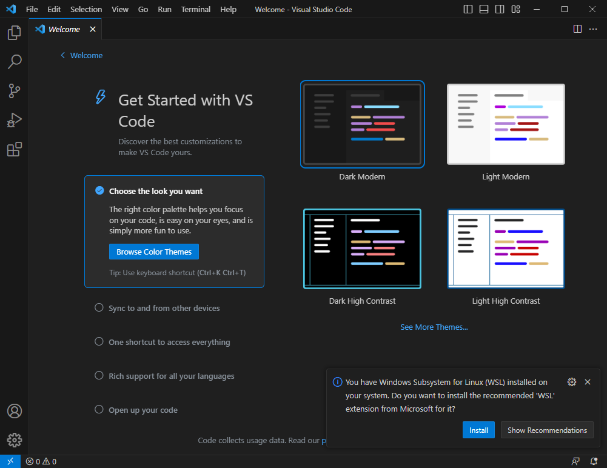       

Здесь необходимо выбрать тему и немного настроить под себя этот редактор                       

## Welcome
После того как вы настроили тему VSCode увидим что-то подобное:                   
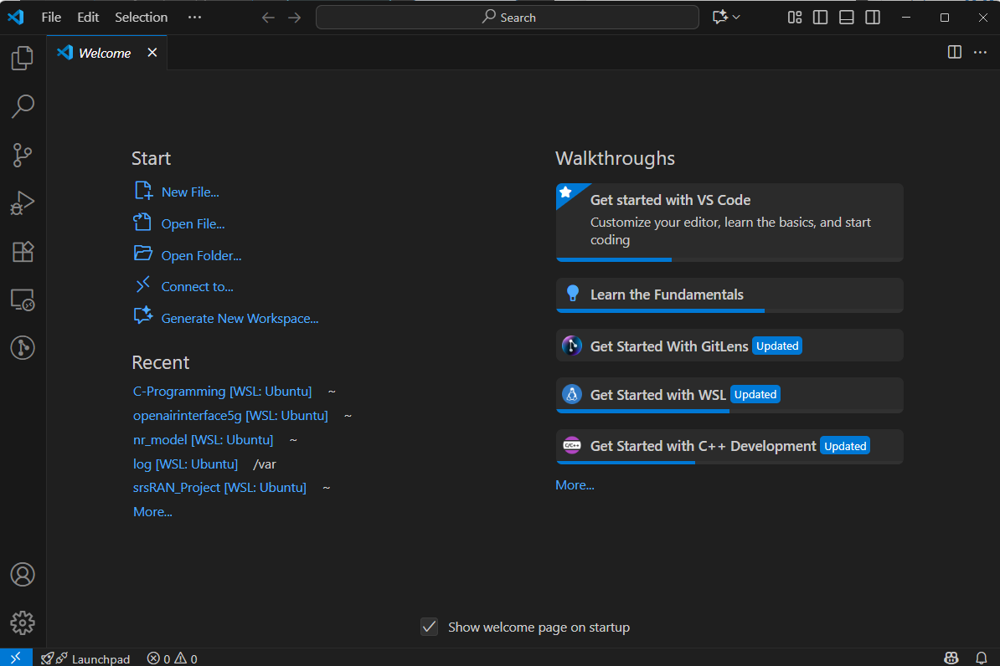                        

Это welcome окно, находим панель Start                       

### Для пользователей WSL

Нажимаем "Connect to..." и сверху VSCode выбираем WSL                     
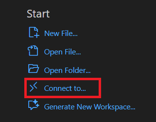                                

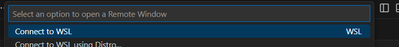                 

После подключения снизу слева увидим что-то типа:                 
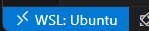                 

Это значит, что вы подключились к Linux системе из под VSCode             

### Создаем свой каталог

Открываем терминал в VSCode (сверху слева находим либо горячими клавишами "Ctrl+`")                                       
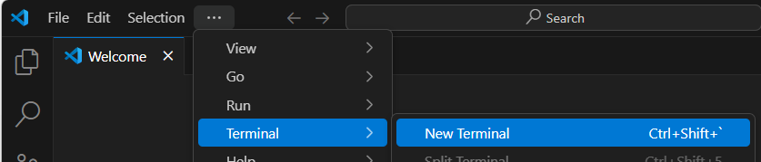                                  

Это то самое черное окошечко - командная строка Linux. Создаем в ней каталог, например с именем "programming"
```bash
mkdir programming
```

Теперь в самом VSCode через FILE->Open Folder либо там где панель Start находим Open Folder.. и открываем созданный нами каталог programming                    

Если увидите при открытии такое окно, то жмем yes - мы себе доверяем.                    
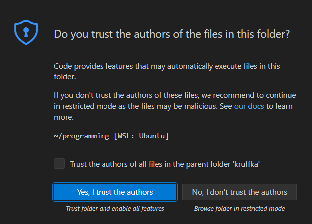                     

Итого увидим что-то подобное:                   
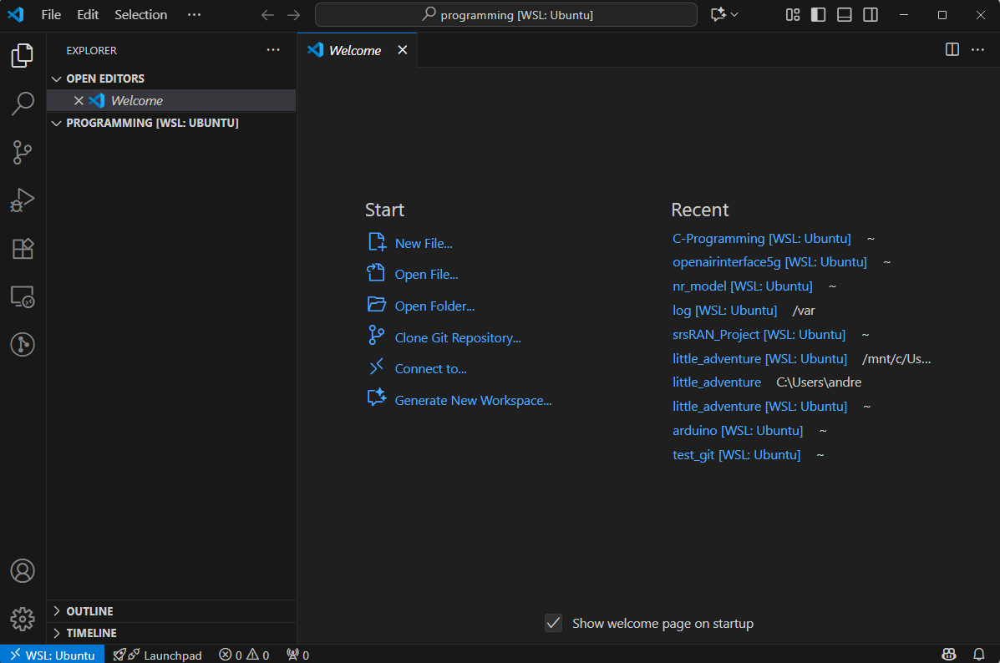                        

## Первая программа

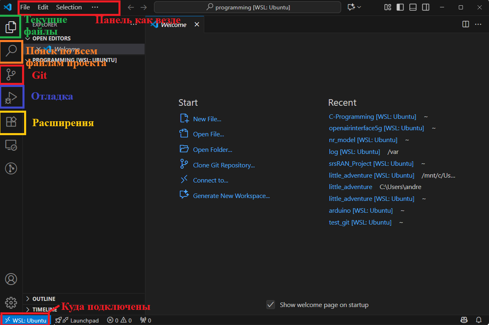                 

Создадим файл через FILE->New file или в панели Start "New file.."       

Что-нибудь туда напишем на Языке Си            
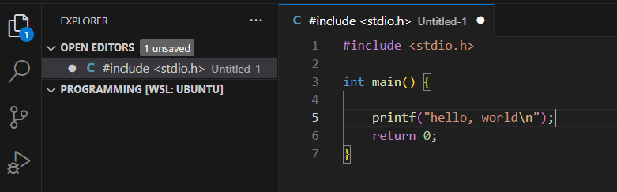
 
И попробуем сохранить "Ctrl+S" или FILE->Save             

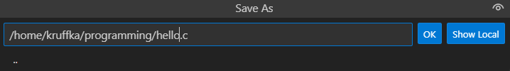        

Увидим, что во вкладке с файлами появился наш файл                            

**Важно:** Если вы не сохранили файл, то во вкладке с файлом вы будете видеть белый кружочек. Не забываем сохраняться                                       
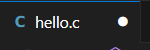                 

Откроем терминал (сверху слева находим Terminal либо горячими клавишами "Ctrl+`")            

Компилируем и запускаем                   

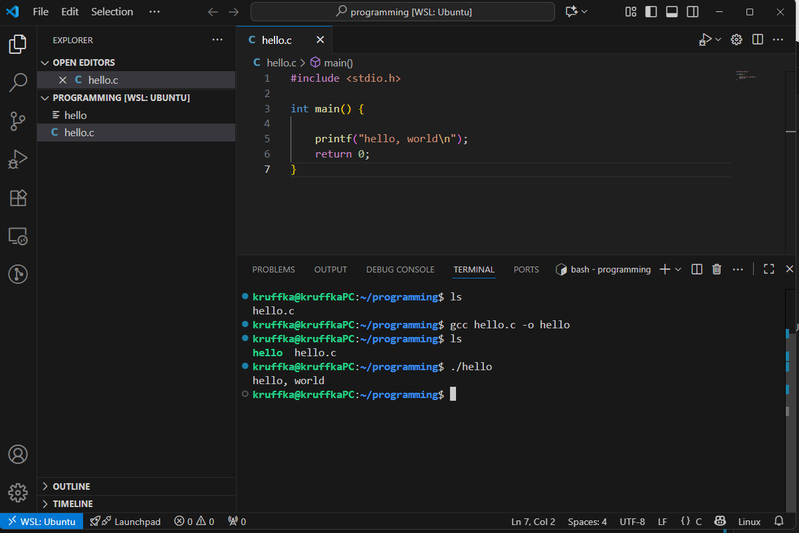                    

Примерно в таком режиме мы и будем работать - снизу терминал для компиляции запуска и т.д., а сверху наши файлы с исходным кодом. Это довольно удобно иметь все сразу в одном окошке текстового редактора - видишь и код и ошибки компиляции..                              

## С/C++

Одно из полезных расширений, которое можно установить уже сейчас - C/C++                   
 
Открываем вкладку с расширениями, вбиваем в поиске C/C++ и жмем install                  
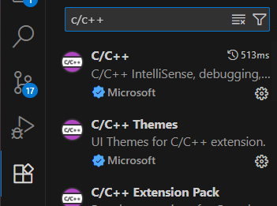                   

C/C++ IntelliSense, debugging, and code browsing.               
Данное расширение подсвечивает синтаксис, ошибки, позволяет удобно перемещаться между файлами программы, а также позже понадобится для отладки.           

## Git

(Скоро появится)

### Gitlens

(Ждем)

## Отладка

(Скоро появится)


## Сборка

(TODO)